# Create an Azure Functions HTTP trigger with an Azure Cosmos DB input binding

Azure Cosmos DB is a globally distributed, multi-model database that is both schemaless and serverless. Azure Function is a serverless compute service that enables you to run code on-demand. Pair up these two Azure services and you have the foundation for a serverless architecture that enables you to focus on building great apps and not worry about provisioning and maintaining servers for your compute and database needs.

This tutorial builds on the code created in the [Graph API Quickstart for .NET](create-graph-dotnet.md). This tutorial adds an Azure Function that contains an [HTTP trigger](https://github.com/MicrosoftDocs/azure-docs-pr/azure-functions/functions-bindings-http-webhook.md#http-trigger). The HTTP trigger uses an Azure Cosmos DB [input binding](https://github.com/MicrosoftDocs/azure-docs-pr/azure-functions/functions-triggers-bindings.md) to retrieve data from the graph database created in the quickstart. This particular HTTP trigger queries Azure Cosmos DB for data, but input bindings from Azure Cosmos DB can be used to retrieve data input values for whatever your function requires.

This tutorial covers the following tasks:

> [!div class="checklist"]
> * Create an Azure Function project 
> * Create an HTTP trigger
> * Publish the Azure Function
> * Connect the Azure Function to the Azure Cosmos DB database

## Prerequisites

- [Visual Studio 2017 version 15.3](https://www.visualstudio.com/vs/preview/), including the **Azure development** workload.

    
    
    >[!NOTE]  
    >After you install or upgrade to Visual Studio 2017 version 15.3, you must manually update the Visual Studio 2017 tools for Azure Functions. You can update the tools from the **Tools** menu under **Extensions and Updates...** > **Updates** > **Visual Studio Marketplace** > **Azure Functions and Web Jobs Tools** > **Update**. 

- Complete the [Build a .NET application using the Graph API](tutorial-develop-graph-dotnet.md) tutorial, or get the example code from the [azure-cosmos-db-graph-dotnet-getting-started](https://github.com/Azure-Samples/azure-cosmos-db-graph-dotnet-getting-started) GitHub repo and build the project.
 
## Build a Function in Visual Studio

1. Add an **Azure Functions** project to your solution by right-clicking on the project node in **Solution Explorer**, the choose **Add** > **New Item**. Choose **Azure Functions** from the dialog box, and name it **PeopleDataFunctions**.

   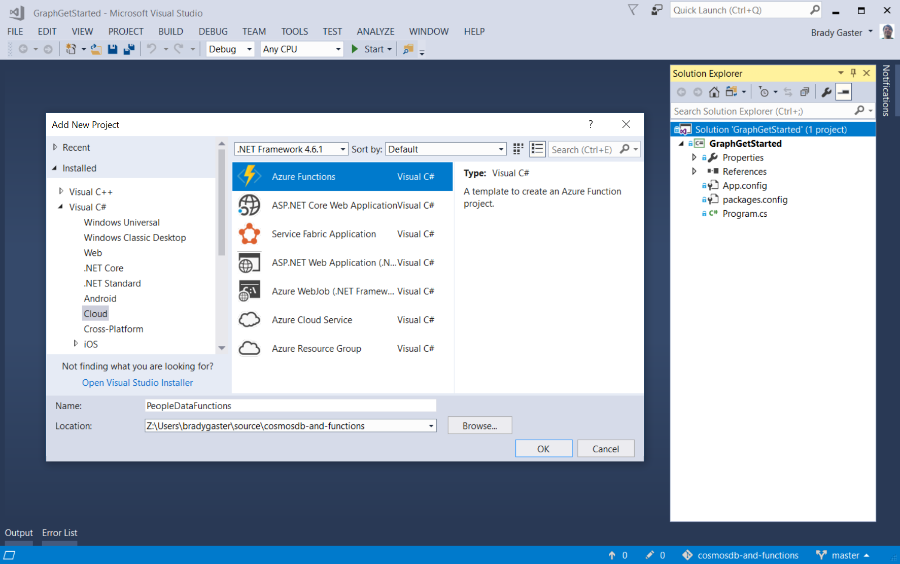

2. After you create the Azure Functions project, there are a few NuGet related updates and installs to perform. 

    a. To make sure you have the latest Functions SDK, use the NuGet Manager to update the **Microsoft.NET.Sdk.Functions** package. In **Solution Explorer**, right-click the project, and select **Manage NuGet Packages**. In the **Installed** tab, select Microsoft.NET.Sdk.Functions, then click **Update**.

   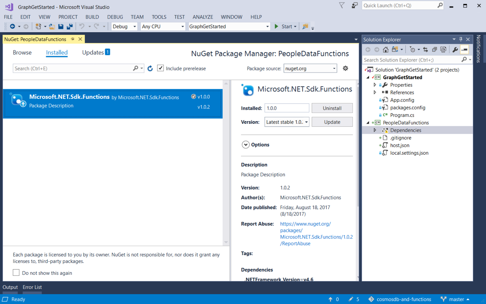

    b. In the **Browse** tab, enter **azure.graphs** to find the **Microsoft.Azure.Graphs** package, and then  click **Install**. This package contains the Graph API .NET Client SDK.

   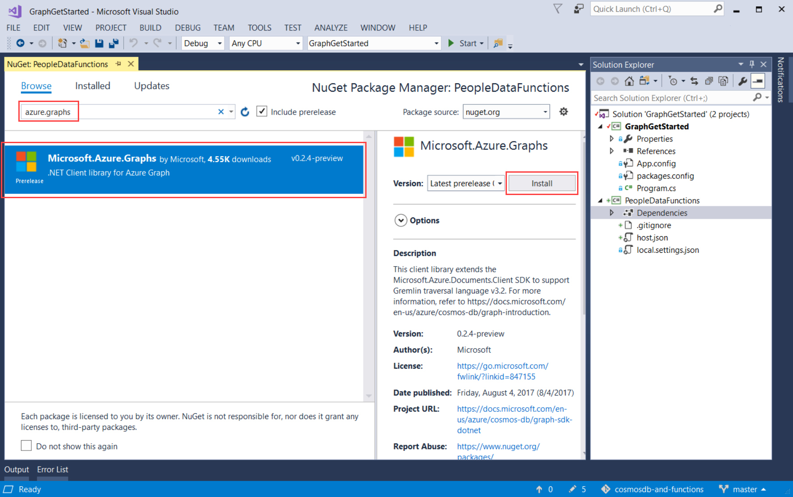

    c. In the **Browse** tab, enter **mono.csharp** to find the **Mono.CSharp** package, and then click **Install**.

   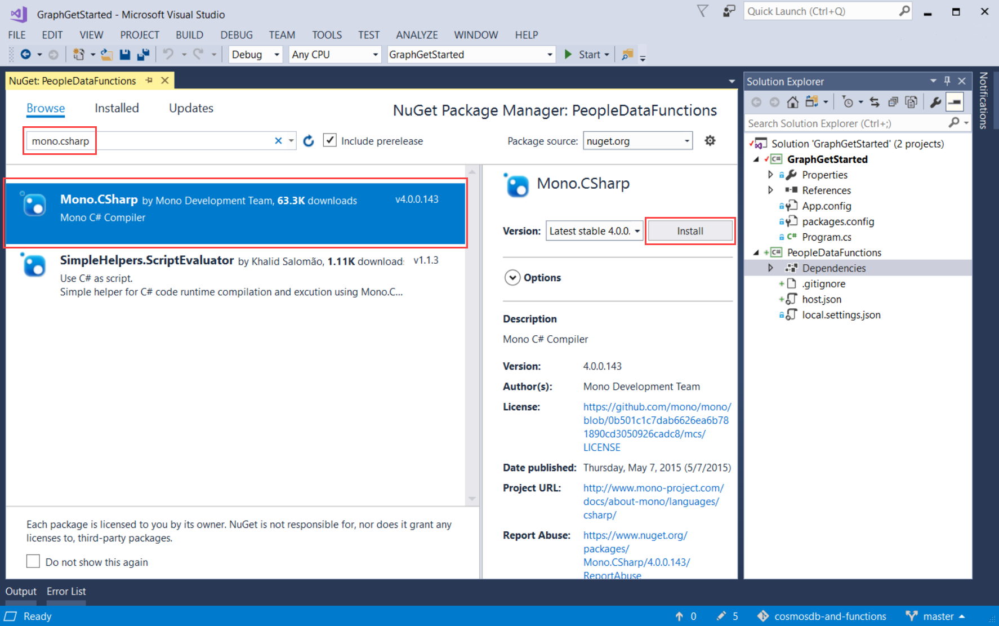

3. Your Solution Explorer should now include the packages you installed, as shown here. 
   
   Next, we need to write some code, so we'll add a new **Azure Function** item to the project. 

    a. Right mouse click on the project node in **Solution Explorer**, then choose **Add** > **New Item**.   
    b. In the **Add New Item** dialog, select **Visual C#**, select **Azure Function**, type **Search** as the name for your project, and click **OK**.  
 
   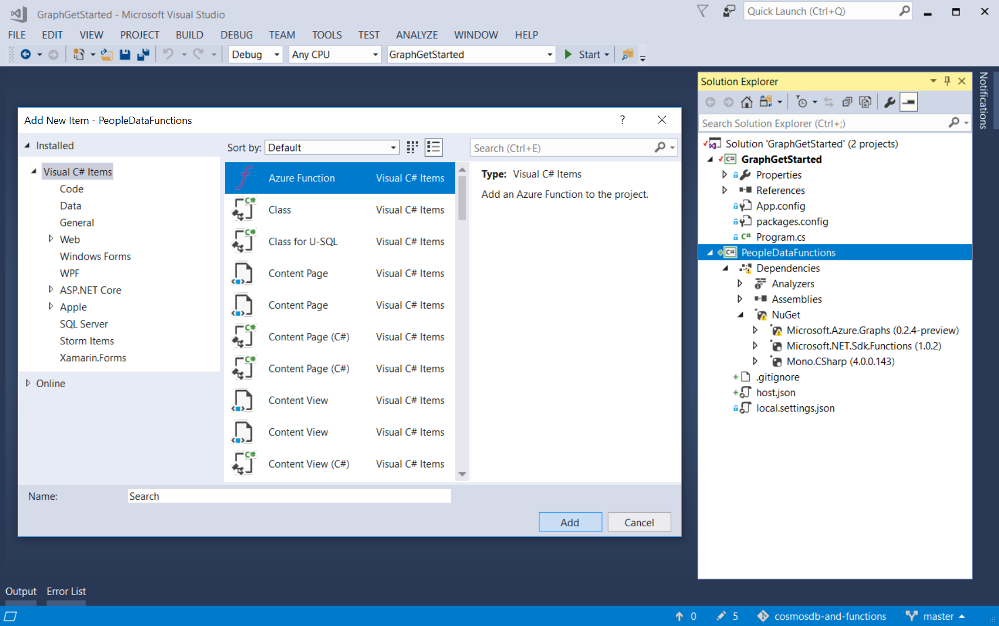

4. The Azure Function will respond to HTTP requests, so the Http trigger template is appropriate here.
   
   In the **New Azure Function** box, select **Http trigger**,  We want this Azure Function to be "wide open," too, so we set the **Access rights** to **Anonymous**, which lets everyone through. Click **OK**.

   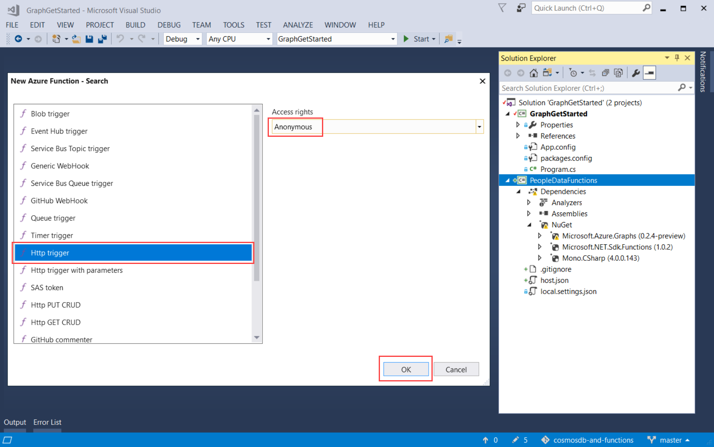

5. After you add Search.cs to the Azure Function project, add these **using** statements to the top of the file:

   ```csharp
   using Microsoft.Azure.Documents;
   using Microsoft.Azure.Documents.Client;
   using Microsoft.Azure.Documents.Linq;
   using Microsoft.Azure.Graphs;
   using Microsoft.Azure.WebJobs;
   using Microsoft.Azure.WebJobs.Extensions.Http;
   using Microsoft.Azure.WebJobs.Host;
   using System;
   using System.Collections.Generic;
   using System.Configuration;
   using System.Linq;
   using System.Net;
   using System.Net.Http;
   using System.Threading.Tasks;
   ```

6. Next, replace the Azure Function's class code with the code below. The code searches the Azure Cosmos DB database using the Graph API for either all the people, or for the specific person identified by the `name` query string parameter.

   ```csharp
   public static class Search
   {
       static string endpoint = ConfigurationManager.AppSettings["Endpoint"];
       static string authKey = ConfigurationManager.AppSettings["AuthKey"];

       [FunctionName("Search")]
       public static async Task<HttpResponseMessage> Run(
           [HttpTrigger(AuthorizationLevel.Anonymous, "get", "post", Route = null)]HttpRequestMessage req,
           TraceWriter log)
       {
           log.Info("C# HTTP trigger function processed a request.");

           // the person objects are free-form in structure
           List<dynamic> results = new List<dynamic>();

           // open the client's connection
           using (DocumentClient client = new DocumentClient(
               new Uri(endpoint),
               authKey,
               new ConnectionPolicy
               {
                   ConnectionMode = ConnectionMode.Direct,
                   ConnectionProtocol = Protocol.Tcp
               }))
           {
               // get a reference to the database the console app created
               Database database = await client.CreateDatabaseIfNotExistsAsync(
                   new Database
                   {
                       Id = "graphdb"
                   });

               // get an instance of the database's graph
               DocumentCollection graph = await client.CreateDocumentCollectionIfNotExistsAsync(
                   UriFactory.CreateDatabaseUri("graphdb"),
                   new DocumentCollection { Id = "graphcollz" },
                   new RequestOptions { OfferThroughput = 1000 });

               // build a gremlin query based on the existence of a name parameter
               string name = req.GetQueryNameValuePairs()
                   .FirstOrDefault(q => string.Compare(q.Key, "name", true) == 0)
                   .Value;

               IDocumentQuery<dynamic> query = (!String.IsNullOrEmpty(name))
                   ? client.CreateGremlinQuery<dynamic>(graph, string.Format("g.V('{0}')", name))
                   : client.CreateGremlinQuery<dynamic>(graph, "g.V()");

               // iterate over all the results and add them to the list
               while (query.HasMoreResults)
                   foreach (dynamic result in await query.ExecuteNextAsync())
                       results.Add(result);
           }

           // return the list with an OK response
           return req.CreateResponse<List<dynamic>>(HttpStatusCode.OK, results);
       }
   }
   ```

   The code is basically the same connection logic as in the original console application that seeded the database, with a simple query to retrieve the matching records.

## Debug the Azure Function Locally

Now that the code is complete, you can use the Azure Function's local debugging tools and emulator to run the code locally to test it.

1. Before the code runs properly, you must configure it for local execution with your Azure Cosmos DB connection information. You can use the local.settings.json file to configure the Azure Function for local execution much in the same way you would use the App.config file to configure the original console application for execution.

   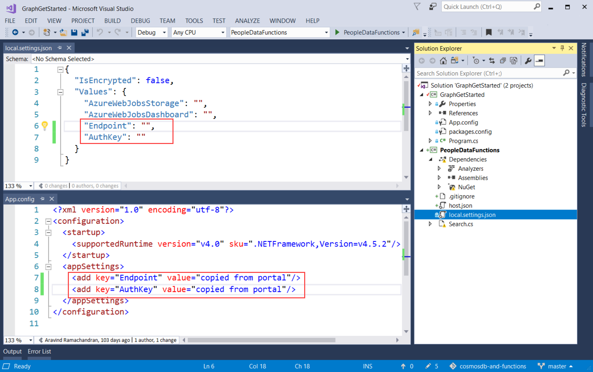

2. After you configure the Azure Function app with your Azure Cosmos DB endpoint and authorization key so that it knows how to find your Azure Cosmos DB database, press F5 to launch the local debugging tool, func.exe, with the Azure Function code hosted and ready for use.

   At the end of the initial output from func.exe, we see that Azure Function is being hosted at localhost:7071. This is helpful to test it in a client.

   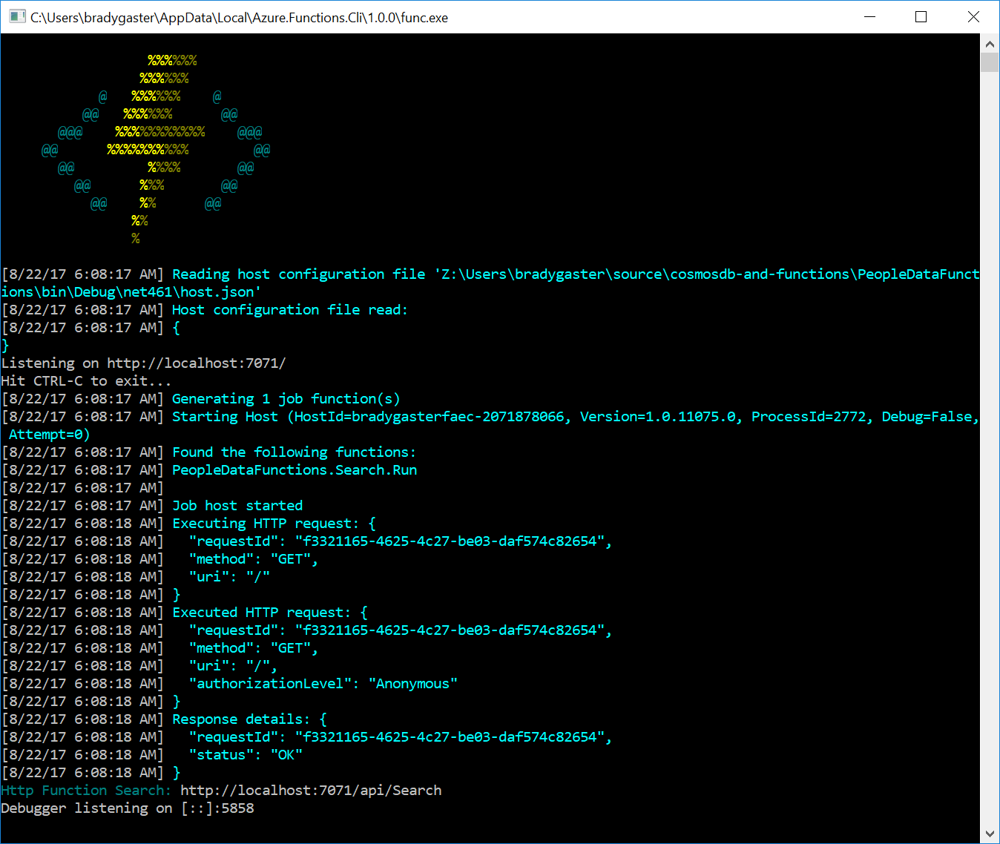

3. To test the Azure Function, use [Visual Studio Code](http://code.visualstudio.com/) with Huachao Mao's extension, [REST Client](https://marketplace.visualstudio.com/items?itemName=humao.rest-client). REST Client offers local or remote HTTP request capability in a single right-click. We'll add the URL of our person search function and execute the HTTP request. Right-click the first URL, then select **Send Request**.

   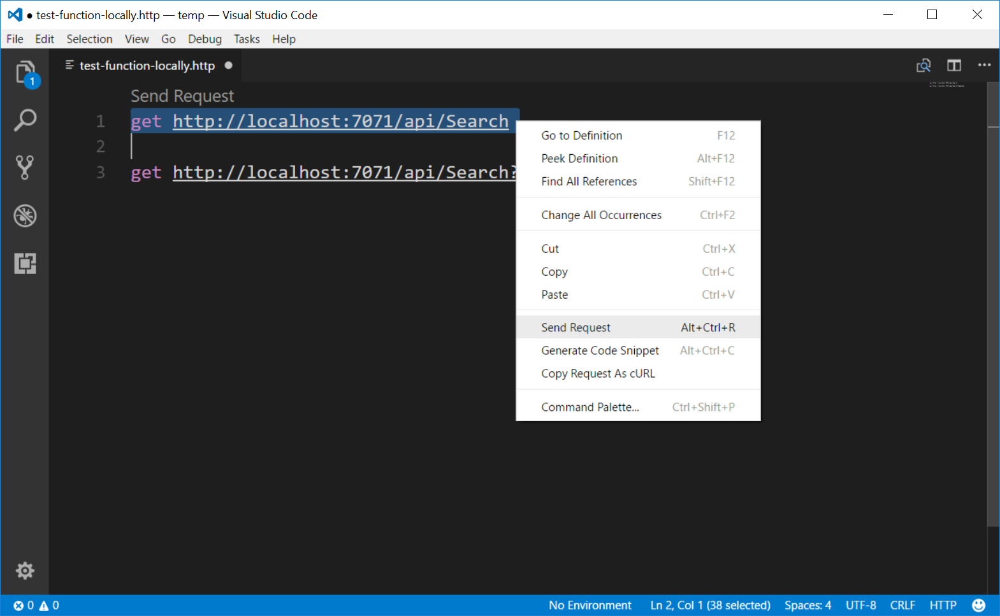

   You are presented with the raw HTTP response from the locally-running Azure Function headers, JSON body content, everything.

   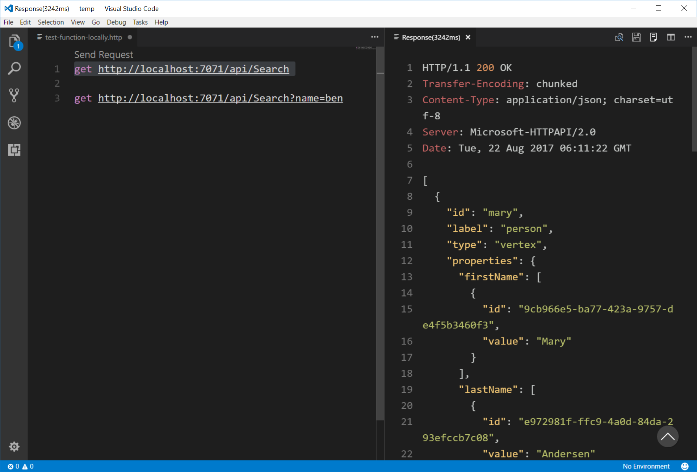

4. By adding the `name` query string parameter with a value known to be in the database, we can filter the results the Azure Function returns.

   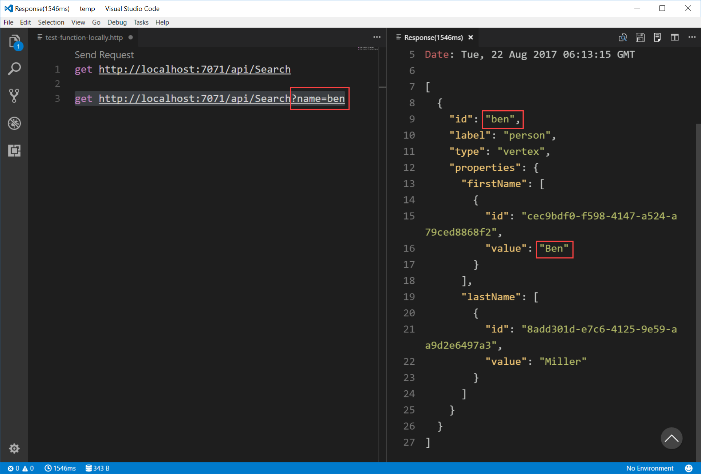

After the Azure Function is validated and seems to be working properly, the last step is to publish it to Azure App Service and configure it to run in the cloud.

## Publish the Azure Function

1. In **Solution Explorer**, right-click the project, then select **Publish**.

   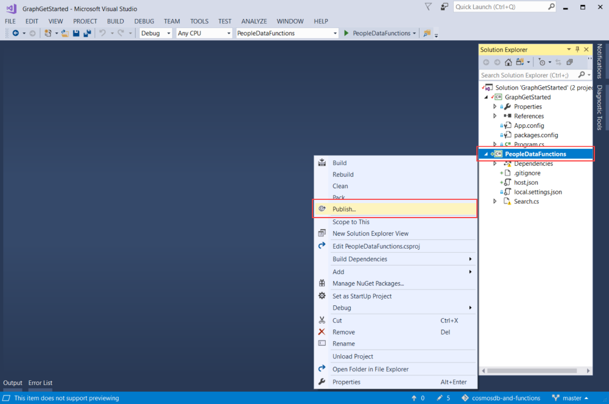

2. We're ready to publish this to the cloud to test it in a publicly available scenario. In the **Publish** tab, select **Azure Function App**, select **Create New** to create an Azure Function in your Azure subscription, then click **Publish**.

   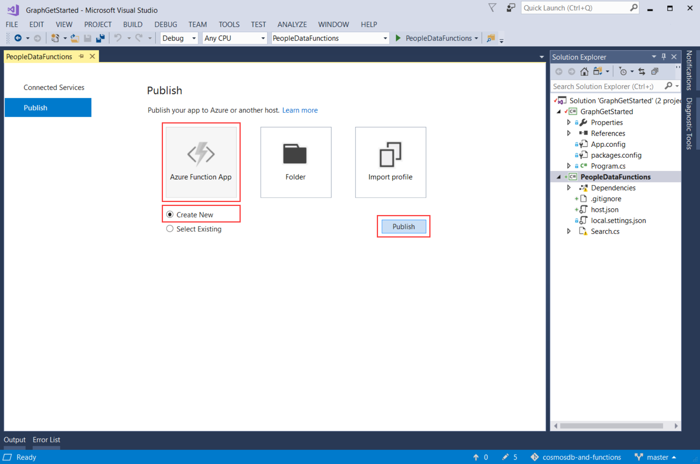

   The **Publish** panel opens next, allowing you to name your Azure Function. We'll opt for creating a new Consumption-based App Service Plan because we intend to use the pay-per-use billing method for the serverless Azure Function. 

   In addition, we'll create a new Storage Account to use with the Azure Function in case we ever need support for Blobs, Tables, or Queues to trigger execution of other functionality.

3. Click the **Create** button in the dialog to create all the resources in your Azure subscription. Then, Visual Studio will download a publish profile (a simple XML file) that it will use the next time you publish your Azure Function code.

   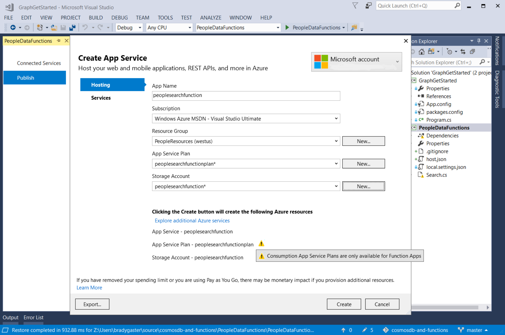

4. After the Azure Function is published, you can go to the Azure portal blade for your Azure Function. There, you can see a link to the Azure Function's **Application settings**. You'll need to go here, as this is where you'll configure the live Azure Function for connectivity to the Azure Cosmos DB database with your Person data.

   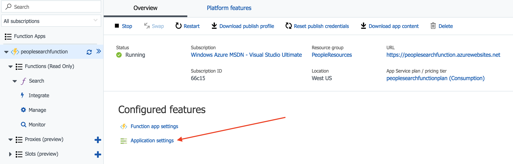

5. Just as you did earlier in the console application's App.config file and in the Azure Function app's local.settings.json file, you'll need to configure the published Azure Function with the Endpoint and AuthKey values appropriate for your Azure Cosmos DB database. This way, you never have to check in configuration code that contains your keys - you can configure them in the portal and be sure they're not stored in source control.

   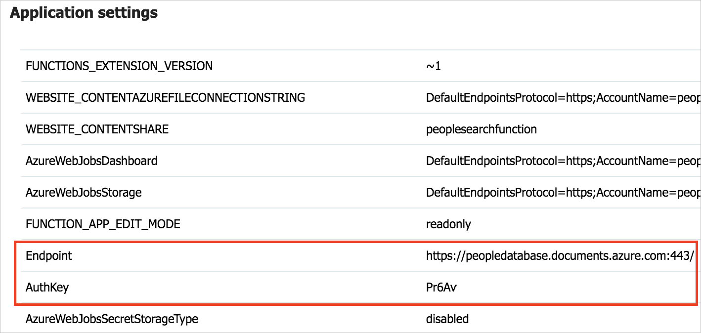

6. Once the Azure Function is configured properly in your Azure subscription, you can again use the Visual Studio Code REST Client extension to query the publicly available Azure Function URL.

  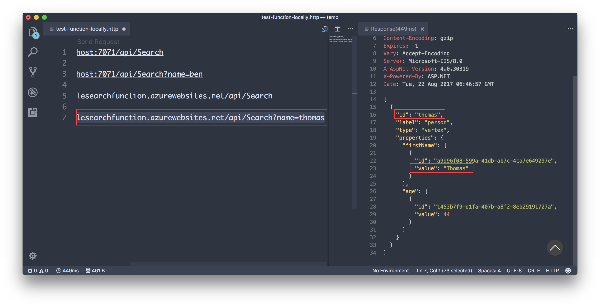


## Next steps

In this tutorial, you've done the following:

> [!div class="checklist"]
> * Created an Azure Function project 
> * Created an HTTP trigger
> * Published the Azure Function
> * Connected the Function to the Azure Cosmos DB database

You can now proceed to the Concepts section for more information about Cosmos DB.

> [!div class="nextstepaction"]
> [Global distribution](distribute-data-globally.md) 

This article is based on a blog from [Brady Gaster's Schemaless & Serverless](http://www.bradygaster.com/category/%20Serverless%20&%20Schemaless) blog series. Visit his blog for additional posts in the series.
