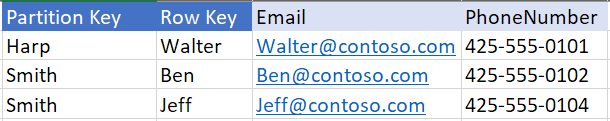
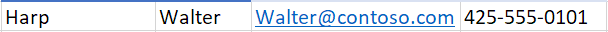
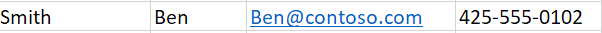
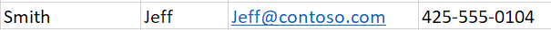

# Azure Cosmos DB: How to query with the Table API?

The Azure Cosmos DB [Table API](table-introduction.md) (preview) supports OData and [LINQ](https://docs.microsoft.com/rest/api/storageservices/fileservices/writing-linq-queries-against-the-table-service) queries against key/value (table) data. This article provides sample documents and queries to get you started. 

For more information about queries using the Table API (preview), see [Querying Tables and Entities](https://docs.microsoft.com/rest/api/storageservices/fileservices/querying-tables-and-entities). 

## Sample table

The queries in this article use the following sample table:



## Prerequisites

For these queries to work, you must have an Azure Cosmos DB account and have entity data in the collection. Don't have any of those? Complete the [5-minute quickstart](https://aka.ms/acdbtnetqs) or the [developer tutorial](https://aka.ms/acdbtabletut) to create an account and populate your database.

## Example query 1
Given the sample family table above, the following OData query returns the documents, where RowKey matches Walter and PartitionKey matches Harp.
 
**Query**

```csharp
CloudTableClient tableClient = account.CreateCloudTableClient();
CloudTable table = tableClient.GetTableReference("people");
TableQuery<CustomerEntity> query = new TableQuery<CustomerEntity>().Where(TableQuery.CombineFilters(TableQuery.GenerateFilterCondition(PartitionKey, QueryComparisons.Equal, "Harp"),
TableOperators.And,
TableQuery.GenerateFilterCondition(RowKey, QueryComparisons.Equal,"Walter")));
await table.ExecuteQuerySegmentedAsync<CustomerEntity>(query, null);
```
**Results**



## Example query 2
Given the sample data  above, the following OData query returns the entities, where email matches Ben@contoso.com and PartitionKey matches Smith. In this example, you are querying based on PartitionKey and other property. Since, Azure Cosmos DB indexes all the property, below query does not require the whole table to be scanned. Azure Table does not have secondary indexes. So, query on other properties is faster with Azure Cosmos DB Table API.

**Query**

```csharp
CloudTableClient tableClient = account.CreateCloudTableClient();
CloudTable table = tableClient.GetTableReference("people");
TableQuery<CustomerEntity> query = new TableQuery<CustomerEntity>().Where(TableQuery.CombineFilters(TableQuery.GenerateFilterCondition(PartitionKey, QueryComparisons.Equal, "Smith"),
TableOperators.And,
TableQuery.GenerateFilterCondition(Email, QueryComparisons.Equal,"Ben@contoso.com")));
await table.ExecuteQuerySegmentedAsync<CustomerEntity>(query, null);
```

**Results**



## Example query 3
Given the sample family table above, the following LINQ query returns the documents, where RowKey matches Jeff and PartitionKey matches Smith.

**Query**
```charp
CloudTableClient tableClient = account.CreateCloudTableClient();
CloudTable table = tableClient.GetTableReference("people");
var query = from customer in customers.CreateQuery<CustomerEntity>()
                        where customer.PartitionKey == "Smith" && customer.RowKey == "Jeff"
                        select customer;
await table.ExecuteQuerySegmentedAsync<CustomerEntity>(query.AsTableQuery(), null);
```
**Results**



## Next steps

In this tutorial, you've learned how to query graph data using the Table API. You can now distribute data globally using the portal or install the Local emulator for local development.  

[Distribute your data globally](../documentdb/documentdb-portal-global-replication.md)

[Develop locally](../documentdb/documentdb-nosql-local-emulator.md)
