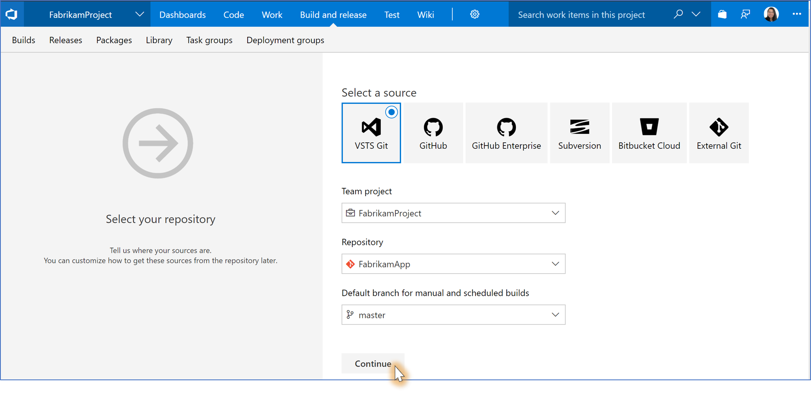
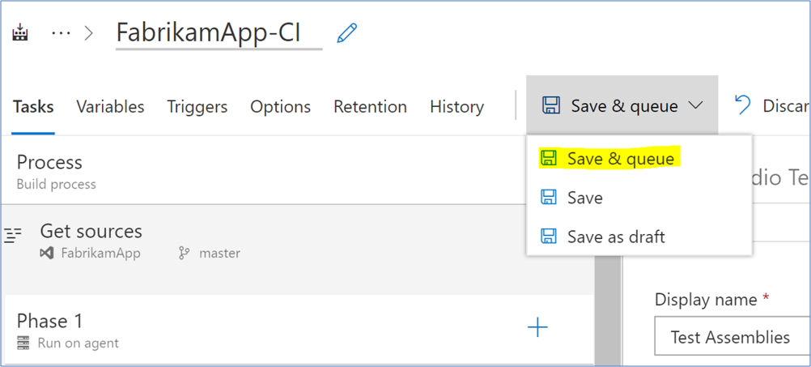
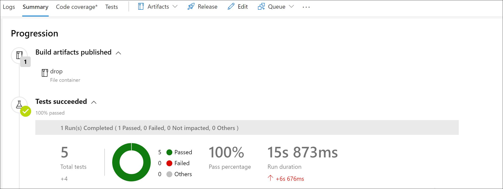

# Set up a CI/CD pipeline with the Azure Cosmos DB emulator build task in Azure DevOps

The Azure Cosmos DB emulator provides a local environment that emulates the Azure Cosmos DB service for development purposes. The emulator allows you to develop and test your application locally, without creating an Azure subscription or incurring any costs. 

The Azure Cosmos DB emulator build task for Azure DevOps allows you to do the same in a CI environment. With the build task, you can run tests against the emulator as part of your build and release workflows. The task spins up a Docker container with the emulator already running and provides an endpoint that can be used by the rest of the build definition. You can create and start as many instances of the emulator as you need, each running in a separate container. 

This article demonstrates how to set up a CI pipeline in Azure DevOps for an ASP.NET application that uses the Cosmos DB emulator build task to run tests. You can use a similar approach to set up a CI pipeline for a Node.js or a Python application. 

## Install the emulator build task

To use the build task, we first need to install it onto our Azure DevOps organization. Find the extension **Azure Cosmos DB Emulator** in the [Marketplace](https://marketplace.visualstudio.com/items?itemName=azure-cosmosdb.emulator-public-preview) and click **Get it free.**


Next, choose the organization in which to install the extension. 

> [!NOTE]
> To install an extension to an Azure DevOps organization, you must be an account owner or project collection administrator. If you do not have permissions, but you are an account member, you can request extensions instead. [Learn more.](https://docs.microsoft.com/azure/devops/marketplace/faq-extensions?view=vsts#install-request-assign-and-access-extensions)


## Create a build definition

Now that the extension is installed, sign in to your Azure DevOps account and find your project from the projects dashboard. You can add a [build pipeline](https://docs.microsoft.com/azure/devops/pipelines/get-started-designer?view=vsts&tabs=new-nav) to your project or modify an existing build pipeline. If you already have a build pipeline, you can skip ahead to [Add the Emulator build task to a build definition](#addEmulatorBuildTaskToBuildDefinition).

1. To create a new build definition, navigate to the **Builds** tab in Azure DevOps. Select **+New.** \> **New build pipeline**

   

2. Select the desired **source**, **Team project**, **Repository**, and the **Default branch for manual and scheduled builds**. After choosing the required options, select **Continue**

   

3. Finally, select the desired template for the build pipeline. We'll select the **ASP.NET** template in this tutorial. 

> [!NOTE]
> The agent pool to be selected for this CI should have Docker for Windows installed unless the installation is done manually in a prior task as a part of the CI. See [Microsoft hosted agents](https://docs.microsoft.com/azure/devops/pipelines/agents/hosted?view=azure-devops&tabs=yaml) article for a selection of agent pools; we recommend to start with `Hosted VS2017` or `Hosted VS2019`. 

Now we have a build pipeline that we can set up to use the Azure Cosmos DB emulator build task. 

## <a name="addEmulatorBuildTaskToBuildDefinition"></a>Add the task to a build pipeline

1. Before adding a task to the build pipeline, you should add an agent job. Navigate to your build pipeline, select the **...** and choose **Add an agent job**.

1. Next select the **+** symbol next to the agent job to add the emulator build task. Search for **cosmos** in the search box, select **Azure Cosmos DB Emulator** and add it to the agent job. The build task will start up a container with an instance of the Cosmos DB emulator already running on it. The Azure Cosmos DB Emulator task should be placed before any other tasks that expect the emulator to be in running state.

   

In this tutorial, you'll add the task to the beginning to ensure the emulator is available before our tests execute.

## Configure tests to use the emulator

Now, we'll configure our tests to use the emulator. The emulator build task exports an environment variable – ‘CosmosDbEmulator.Endpoint’ – that any tasks further in the build pipeline can issue requests against. 

In this tutorial, we'll use the [Visual Studio Test task](https://github.com/Microsoft/azure-pipelines-tasks/blob/master/Tasks/VsTestV2/README.md) to run unit tests configured via a **.runsettings** file. To learn more about unit test setup, visit the [documentation](https://docs.microsoft.com/visualstudio/test/configure-unit-tests-by-using-a-dot-runsettings-file?view=vs-2017). The complete Todo application code sample that you use in this document is available on [Github](https://github.com/Azure-Samples/documentdb-dotnet-todo-app)

Below is an example of a **.runsettings** file that defines parameters to be passed into an application's unit tests. Note the `authKey` variable used is the [well-known key](https://docs.microsoft.com/azure/cosmos-db/local-emulator#authenticating-requests) for the emulator. This `authKey` is the key expected by the emulator build task and should be defined in your **.runsettings** file.

```csharp
<RunSettings>
    <TestRunParameters>
    <Parameter name="endpoint" value="https://localhost:8081" />
    <Parameter name="authKey" value="C2y6yDjf5/R+ob0N8A7Cgv30VRDJIWEHLM+4QDU5DE2nQ9nDuVTqobD4b8mGGyPMbIZnqyMsEcaGQy67XIw/Jw==" />
    <Parameter name="database" value="ToDoListTest" />
    <Parameter name="collection" value="ItemsTest" />
  </TestRunParameters>
</RunSettings>
```

If you are setting up a CI/CD pipeline for an application that uses the Azure Cosmos DB's API for MongoDB, the connection string by default includes the port number 10255. However, this port is not currently open, as an alternate, you should use port 10250 to establish the connection. The Azure Cosmos DB's API for MongoDB connection string remains the same except the supported port number is 10250 instead of 10255.

These parameters `TestRunParameters` are referenced via a `TestContext` property in the application's test project. Here is an example of a test that runs against Cosmos DB.

```csharp
namespace todo.Tests
{
    [TestClass]
    public class TodoUnitTests
    {
        public TestContext TestContext { get; set; }

        [TestInitialize()]
        public void Initialize()
        {
            string endpoint = TestContext.Properties["endpoint"].ToString();
            string authKey = TestContext.Properties["authKey"].ToString();
            Console.WriteLine("Using endpoint: ", endpoint);
            DocumentDBRepository<Item>.Initialize(endpoint, authKey);
        }
        [TestMethod]
        public async Task TestCreateItemsAsync()
        {
            var item = new Item
            {
                Id = "1",
                Name = "testName",
                Description = "testDescription",
                Completed = false,
                Category = "testCategory"
            };

            // Create the item
            await DocumentDBRepository<Item>.CreateItemAsync(item);
            // Query for the item
            var returnedItem = await DocumentDBRepository<Item>.GetItemAsync(item.Id, item.Category);
            // Verify the item returned is correct.
            Assert.AreEqual(item.Id, returnedItem.Id);
            Assert.AreEqual(item.Category, returnedItem.Category);
        }

        [TestCleanup()]
        public void Cleanup()
        {
            DocumentDBRepository<Item>.Teardown();
        }
    }
}
```

Navigate to the Execution Options in the Visual Studio Test task. In the **Settings file** option,  specify that the tests are configured using the **.runsettings** file. In the **Override test run parameters** option, add in `-endpoint $(CosmosDbEmulator.Endpoint)`. Doing so will configure the Test task to refer to the endpoint of the emulator build task, instead of the one defined in the **.runsettings** file.  


## Run the build

Now, **Save and queue** the build. 



Once the build has started, observe the Cosmos DB emulator task has begun pulling down the Docker image with the emulator installed. 


After the build completes, observe that your tests pass, all running against the Cosmos DB emulator from the build task!



## Next steps

To learn more about using the emulator for local development and testing, see [Use the Azure Cosmos DB Emulator for local development and testing](https://docs.microsoft.com/azure/cosmos-db/local-emulator).

To export emulator SSL certificates, see [Export the Azure Cosmos DB Emulator certificates for use with Java, Python, and Node.js](https://docs.microsoft.com/azure/cosmos-db/local-emulator-export-ssl-certificates)
