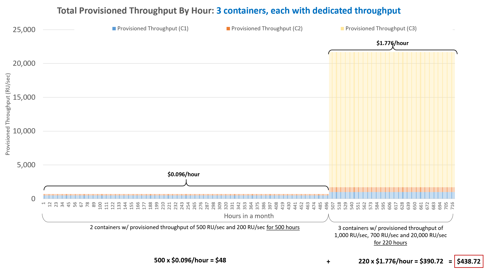
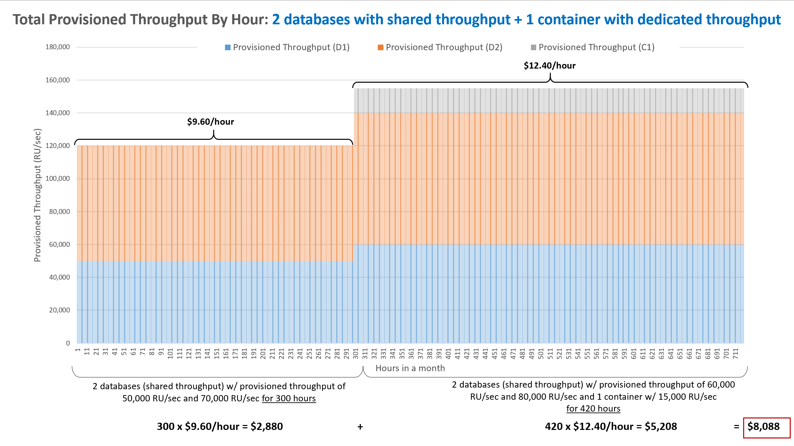
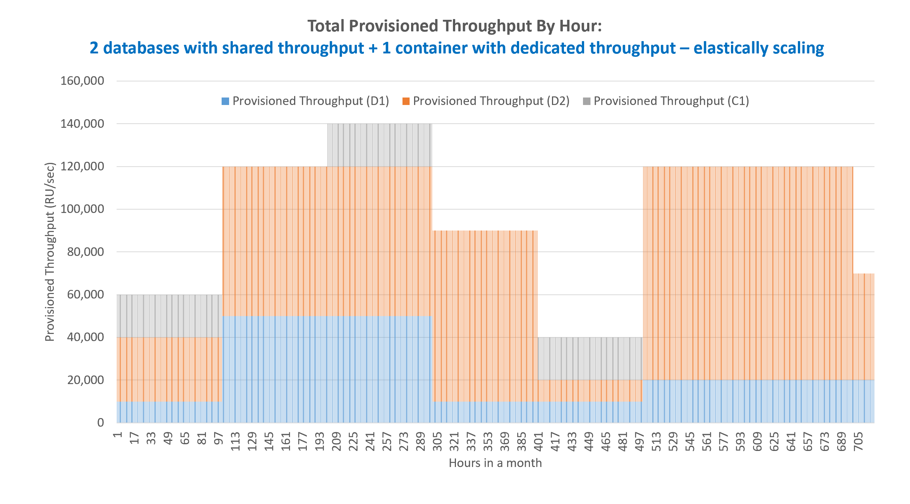

# Understand your Azure Cosmos DB bill

As a fully managed cloud-native database service, Azure Cosmos DB simplifies billing by charging only for provisioned throughput and consumed storage. There are no additional license fees, hardware, utility costs, or facility costs compared to on-premises or IaaS-hosted alternatives. When you consider the multi region capabilities of Azure Cosmos DB, the database service provides a substantial reduction in costs compared to existing on-premises or IaaS solutions.

With Azure Cosmos DB, you are billed hourly based on the provisioned throughput and the consumed storage. For the provisioned throughput, the unit for billing is 100 RU/sec per hour, charged at $0.008 per hour, assuming standard public pricing, see the [Pricing page](https://azure.microsoft.com/pricing/details/cosmos-db/). For the consumed storage, you are billed $0.25 per 1 GB of storage per month, see the [Pricing page](https://azure.microsoft.com/pricing/details/cosmos-db/). 

This article uses some examples to help you understand the details you see on the monthly bill. The numbers shown in the examples may be different if your Azure Cosmos containers have a different amount of throughput provisioned, if they span across multiple regions or run for a different for a period over a month.

> [!NOTE]
> Billing is for any portion of a wall-clock hour, not a 60 minute duration.

## Billing examples

### Billing example - throughput on a container (full month)

* Let's assume you configure a throughput of 1,000 RU/sec on a container, and it exists for 24 hours * 30 days for the month = 720 hours total.  

* 1,000 RU/sec is 10 units of 100 RU/sec per hour for each hour the containers exists (that is, 1,000/100 = 10). 

* Multiplying 10 units per hour by the cost of $0.008 (per 100 RU/sec per hour) = $0.08 per hour. 

* Multiplying the $0.08 per hour by the number of hours in the month equals $0.08 * 24 hours * 30 days = $57.60 for the month.  

* The total monthly bill will show 7,200 units (of 100 RUs), which will cost $57.60.

### Billing example - throughput on a container (partial month)

* Let’s assume we create a container with provisioned throughput of 2,500 RU/sec. The container lives for 24 hours over the month (for example, we delete it 24 hours after we create it).  

* Then we'll see 600 units on the bill (2,500 RU/sec / 100 RU/sec/unit * 24 hours). The cost will be $4.80 (600 units * $0.008/unit).

* Total bill for the month will be $4.80.

### Billing rate if storage size changes

Storage capacity is billed in units of the maximum hourly amount of data stored, in GB, over a monthly period. For example, if you utilized 100 GB of storage for half of the month and 50 GB for the second half of the month, you would be billed for an equivalent of 75 GB of storage during that month.

### Billing rate when container or a set of containers are active for less than an hour

You're billed the flat rate for each hour the container or database exists, no matter the usage or if the container or database is active for less than an hour. For example, if you create a container or database and delete it 5 minutes later, your bill will include one hour.

### Billing rate when throughput on a container or database scales up/down

If you increase provisioned throughput at 9:30 AM from 400 RU/sec to 1,000 RU/sec and then lower provisioned throughput at 10:45 AM back to 400 RU/sec, you will be charged for two hours of 1,000 RU/sec. 

If you increase provisioned throughput for a container or a set of containers at 9:30 AM from 100-K RU/sec to 200-K RU/sec and then lower provisioned throughput at 10:45 AM back to 100-K RU/sec, you'll be charged for two hours of 200 K RU/sec.

### Billing example: multiple containers, each with dedicated provisioned throughput mode

* If you create an Azure Cosmos account in East US 2 with two containers with provisioned throughput of 500 RU/sec and 700 RU/sec, respectively, you would have a total provisioned throughput of 1,200 RU/sec.  

* You would be charged 1,200/100 * $0.008 = $0.096/hour. 

* If your throughput needs changed, and you’ve increased each container’s capacity by 500 RU/sec while also creating a new unlimited container with 20,000 RU/sec, your overall provisioned capacity would be 22,200 RU/sec (1,000 RU/sec + 1,200 RU/sec + 20,000RU/sec).  

* Your bill would then change to: $0.008 x 222 = $1.776/hour. 

* In a month of 720 hours (24 hours * 30 days), if for 500 hours provisioned throughput was 1,200 RU/sec and for the remaining 220 hours provisioned throughput was 22,200 RU/sec, your monthly bill shows: 500 x $0.096/hour + 220 x $1.776/hour = $438.72/month.

### Billing example: containers with shared throughput mode

* If you create an Azure Cosmos account in East US 2 with two Azure Cosmos databases (with a set of containers sharing the throughput at the database level) with the provisioned throughput of 50-K RU/sec and 70-K RU/sec, respectively, you would have a total provisioned throughput of 120 K RU/sec.  

* You would be charged 1200 x $0.008 = $9.60/hour. 

* If your throughput needs changed and you increased each database’s provisioned throughput by 10K RU/sec for each database, and you add a new container to the first database with dedicated throughput mode of 15-K RU/sec to your shared throughput database, your overall provisioned capacity would be 155-K RU/sec (60 K RU/sec + 80 K RU/sec + 15 K RU/sec).  

* Your bill would then change to: 1,550 * $0.008 = $12.40/hour.  

* In a month of 720 hours, if for 300 hours provisioned throughput was 120-K RU/sec and for the remaining 420 hours provisioned throughput was 155-K RU/sec, your monthly bill will show: 300 x $9.60/hour + 420 x $12.40/hour = $2,880 + $5,208 = $8,088/month. 

## Billing examples with geo-replication and multi-master  

You can add/remove Azure regions anywhere in the world to your Azure Cosmos database account at any time. The throughput that you have configured for various Azure Cosmos databases and containers will be reserved in each of the Azure regions associated with your Azure Cosmos database account. If the sum of provisioned throughput (RU/sec) configured across all the databases and containers within your Azure Cosmos database account (provisioned per hour) is T and the number of Azure regions associated with your database account is N, then the total provisioned throughput for a given hour, for your Azure Cosmos database account, (a) configured with a single write region is equal to T x N RU/sec and (b) configured with all regions capable of processing writes is equal to T x (N+1) RU/sec, respectively. Provisioned throughput (single write region) costs $0.008/hour per 100 RU/sec and provisioned throughput with multiple writable regions (multi-master config) costs $0.016/per hour per 100 RU/sec (see the [Pricing page](https://azure.microsoft.com/pricing/details/cosmos-db/)). Whether its single write region, or multiple write regions, Azure Cosmos DB allows you to read data from any region.

### Billing example: multi-region Azure Cosmos account, single region writes

Let’s assume you have an Azure Cosmos container in West US. The container is created with throughput 10K RU/sec and you store 1 TB of data this month. Let’s assume you add three regions (East US, North Europe, and East Asia) to your Azure Cosmos account, each with the same storage and throughput. Your total monthly bill will be (assuming 30 days in a month). Your bill would be as follows: 

|**Item** |**Usage (month)** |**Rate** |**Monthly Cost** |
|---------|---------|---------|-------|
|Throughput bill for container in West US      | 10K RU/sec * 24 * 30    |$0.008 per 100 RU/sec per hour   |$576|
|Throughput bill for 3 additional regions - East US, North Europe, and East Asia       | 3 * 10K RU/sec * 24 * 30    |$0.008 per 100 RU/sec per hour  |$1,728|
|Storage bill for container in West US      | 250 GB    |$0.25/GB  |$62.50|
|Storage bill for 3 additional regions - East US, North Europe, and East Asia      | 3 * 250 GB    |$0.25/GB  |$187.50|
|**Total**     |     |  |**$2,554**|

*Let’s also assume that you egress 100 GB of data every month from the container in West US to replicate data into East US, North Europe, and East Asia. You're billed for egress as per data transfer rates.*

### Billing example: multi-region Azure Cosmos account, multi region writes

Let’s assume you create an Azure Cosmos container in West US. The container is created with throughput 10K RU/sec and you store 1 TB of data this month. Let’s assume you add three regions (East US, North Europe, and East Asia), each with the same storage and throughput and you want the ability to write to the containers in all regions associated with your Azure Cosmos account. Your total monthly bill will be (assuming 30 days in a month) as follows:

|**Item** |**Usage (month)**|**Rate** |**Monthly Cost** |
|---------|---------|---------|-------|
|Throughput bill for container in West US (all regions are writable)       | 10K RU/sec * 24 * 30    |$0.016 per 100 RU/sec per hour    |$1,152 |
|Throughput bill for 3 additional regions - East US, North Europe, and East Asia (all regions are writable)        | (3 + 1) * 10K RU/sec * 24 * 30    |$0.016 per 100 RU/sec per hour   |$4,608 |
|Storage bill for container in West US      | 250 GB    |$0.25/GB  |$62.50|
|Storage bill for 3 additional regions - East US, North Europe, and East Asia      | 3 * 250 GB    |$0.25/GB  |$187.50|
|**Total**     |     |  |**$6,010**|

*Let’s also assume that you egress 100 GB of data every month from the container in West US to replicate data into East US, North Europe, and East Asia. You're billed for egress as per data transfer rates.*

### Billing example: Azure Cosmos account with multi-master, database-level throughput including dedicated throughput mode for some containers

Let’s consider the following example, where we have a multi-region Azure Cosmos account where all regions are writable (multi-master config). For simplicity, we will assume storage size stays constant and doesn’t change and omit it here to keep the example simpler. The provisioned throughput during the month varied as follows (assuming 30 days or 720 hours): 

[0-100 hours]:  

* We created a three region Azure Cosmos account (West US, East US, North Europe), where all regions are writable 

* We created a database (D1) with shared throughput 10K RU/sec 

* We created a database (D2) with shared throughput 30-K RU/sec and  

* We created a container (C1) with dedicated throughput 20 K RU/sec 

[101-200 hours]:  

* We scaled up database (D1) to 50 K RU/sec 

* We scaled up database (D2) to 70 K RU/sec  

* We deleted container (C1)  

[201-300 hours]:  

* We created container (C1) again with dedicated throughput 20 K RU/sec 

[301-400 hours]:  

* We removed one of the regions from Azure Cosmos account (# of writable regions is now 2) 

* We scaled down database (D1) to 10K RU/sec 

* We scaled up database (D2) to 80 K RU/sec  

* We deleted container (C1) again 

[401-500 hours]:  

* We scaled down database (D2) to 10K RU/sec  

* We created container (C1) again with dedicated throughput 20 K RU/sec 

[501-700 hours]:  

* We scaled up database (D1) to 20 K RU/sec  

* We scaled up database (D2) to 100 K RU/sec  

* We deleted container (C1) again  

[701-720 hours]:  

* We scaled down database (D2) to 50 K RU/sec  

Visually the changes in total provisioned throughput during 720 hours for the month are shown in the figure below: 

The total monthly bill will be (assuming 30 days/720 hours in a month) will be computed as follows:

|**Hours**  |**RU/s** |**Item** |**Usage (hourly)** |**Cost** |
|---------|---------|---------|-------|-------|
|[0-100] |D1:10K  D2:30K  C1:20K |Throughput bill for container in West US (all regions are writable)  | `D1: 10K RU/sec/100 * $0.016 * 100 hours = $160`  `D2: 30 K RU/sec/100 * $0.016 * 100 hours = $480`  `C1: 20 K RU/sec/100 *$0.016 * 100 hours = $320` |$960  |
| | |Throughput bill for 2 additional regions: East US, North Europe (all regions are writable)  |`(2 + 1) * (60 K RU/sec /100 * $0.016) * 100 hours = $2,880`  |$2,880  |
|[101-200] |D1:50K  D2:70K  C1: -- |Throughput bill for container in West US (all regions are writable)  |`D1: 50 K RU/sec/100 * $0.016 * 100 hours = $800`  `D2: 70 K RU/sec/100 * $0.016 * 100 hours = $1,120` |$1920  |
| | |Throughput bill for 2 additional regions: East US, North Europe (all regions are writable)  |`(2 + 1) * (120 K RU/sec /100 * $0.016) * 100 hours = $5,760`  |$5,760  |
|[201-300]  |D1:50K  D2:70K  C1:20K |Throughput bill for container in West US (all regions are writable)  |`D1: 50 K RU/sec/100 * $0.016 * 100 hours = $800`  `D2: 70 K RU/sec/100 * $0.016 * 100 hours = $1,120`  `C1: 20 K RU/sec/100 *$0.016 * 100 hours = $320` |$2,240  |
| | |Throughput bill for 2 additional regions: East US, North Europe (all regions are writable)  |`(2 + 1) * (140 K RU/sec /100 * $0.016-) * 100 hours = $6,720` |$6,720 |
|[301-400] |D1:10K  D2:80K  C1: -- |Throughput bill for container in West US (all regions are writable)  |`D1: 10K RU/sec/100 * $0.016 * 100 hours = $160`  `D2: 80 K RU/sec/100 * $0.016 * 100 hours = $1,280`  |$1,440   |
| | |Throughput bill for 2 additional regions: East US, North Europe (all regions are writable)  |`(1 + 1) * (90 K RU/sec /100 * $0.016) * 100 hours = $2,880`  |$2,880  |
|[401-500] |D1:10K  D2:10K  C1:20K |Throughput bill for container in West US (all regions are writable)  |`D1: 10K RU/sec/100 * $0.016 * 100 hours = $160`  `D2: 10K RU/sec/100 * $0.016 * 100 hours = $160`  `C1: 20 K RU/sec/100 *$0.016 * 100 hours = $320` |$640  |
| | |Throughput bill for 2 additional regions: East US, North Europe (all regions are writable)  |`(1 + 1) * (40 K RU/sec /100 * $0.016) * 100 hours = $1,280`  |$1,280  |
|[501-700] |D1:20K  D2:100K  C1: -- |Throughput bill for container in West US (all regions are writable)  |`D1: 20 K RU/sec/100 * $0.016 * 200 hours = $640`  `D2: 100 K RU/sec/100 * $0.016 * 200 hours = $3,200` |$3,840  |
| | |Throughput bill for 2 additional regions: East US, North Europe (all regions are writable)  |`(1 + 1) * (120 K RU/sec /100 * $0.016) * 200 hours = $1,280`  |$7,680  |
|[701-720] |D1:20K  D2:50K  C1: -- |Throughput bill for container in West US (all regions are writable)  |`D1: 20 K RU/sec/100 *$0.016 * 20 hours = $64`  `D2: 50 K RU/sec/100 *$0.016 * 20 hours = $160` |$224  |
| | |Throughput bill for 2 additional regions: East US, North Europe (all regions are writable)  |`(1 + 1) * (70 K RU/sec /100 * $0.016) * 20 hours = $448`  |$224  |
|| |**Total Monthly Cost**  | |**$38,688**   |

## Proactively estimating your monthly bill  

Let’s consider another example, where you want to proactively estimate your bill before the month’s end. You can estimate your bill as follows:

|**Storage Cost** | |
|----|----|
|Avg Record Size (KB) |1 |
|Number of Records  |100,000,000  |
|Total Storage (GB)  |100 |
|Monthly cost per GB  |$0.25  |
|Expected Monthly Cost for Storage   |$25.00  |

 

|**Throughput Cost** | | | |
|----|----|----|----|
|Operation Type| Requests/sec| Avg. RU/request| RUs needed|
|Write| 100 | 5 | 500|
|Read| 400| 1| 400|

Total RU/sec: 500 + 400 = 900
Hourly cost: 900/100 * $0.008 = $0.072
Expected Monthly Cost for Throughput (assuming 31 days): $0.072 * 24 * 31 = $53.57

**Total Monthly Cost**

Total Monthly Cost = Monthly Cost for Storage + Monthly Cost for Throughput 
Total Monthly Cost = $25.00 + $53.57 = $78.57

*Pricing may vary by region. For up-to-date pricing, see the [Pricing page](https://azure.microsoft.com/pricing/details/cosmos-db/).*

## Billing with Azure Cosmos DB reserved capacity

Azure Cosmos DB reserved capacity enables you to purchase provisioned throughput in advance (a reserved capacity or a reservation) that can be applied to all Azure Cosmos databases and containers (for any API or data model) across all Azure regions. Because provisioned throughput price varies per region, it helps to think of reserved capacity as a monetary credit that you’ve purchased at a discount, that can be drawn from for the provisioned throughput at the respective price in each region. For example, let’s say you have an Azure Cosmos account with a single container provisioned with 50-K RU/sec and globally replicated two regions -  East US and Japan East. If you choose the pay-as-you-go option, you would pay:  

* in East US: for 50-K RU/sec at the rate of $0.008 per 100 RU/sec in that region 

* in Japan East: for 50-K RU/sec at the rate of $0.009 per 100 RU/sec in that region

Your total bill (without reserved capacity) would be (assuming 30 days or 720 hours): 

|**Region**| **Hourly price per 100 RU/s**|**Units (RU/s)**|**Billed Amount (hourly)**| **Billed Amount (monthly)**|
|----|----|----|----|----|
|East US|$0.008 |50 K|$4|$2,880 |
|Japan East|$0.009 |50 K| $4.50 |$3,240 |
|Total|||$8.50|$6,120 |

Let’s consider that you’ve bought reserved capacity instead. You can buy reserved capacity for 100-K RU/sec at the price of $56,064 for one year (at 20% discount), or $6.40 per hour. See reserved capacity pricing on the [Pricing page](https://azure.microsoft.com/pricing/details/cosmos-db/)).  

* Cost of throughput (pay-as-you-go): 100,000 RU/sec/100 * $0.008/hour * 8760 hours in a year = $70,080 

* Cost of throughput (with reserved capacity) $70,080 discounted at 20% = $56,064 

What you’ve effectively purchased is a credit of $8 per hour, for 100 K RU/sec using the list price in East US, at the price of $6.40 per hour. You can then draw down from this pre-paid  throughput reservation on an hourly basis for the provisioned throughput capacity in any global Azure region at the respective regional list prices set for your subscription. In this example, where you provision 50 K RU/sec each in East US, and Japan East, you will be able to draw $8.00 worth of provisioned throughput per hour, and will be billed the overage of $0.50 per hour (or $360/month). 

|**Region**| **Hourly price per 100 RU/s**|**Units (RU/s)**| **Billed Amount (hourly)**| **Billed Amount (monthly)**|
|----|----|----|----|----|
|East US|$0.008 |50 K|$4|$2,880 |
|Japan East|$0.009 |50 K| $4.50 |$3,240 |
|||Pay-as-you-go|$8.50|$6120|
|Reserved Capacity Purchased|$0.0064 (20% discount) |100 RU/sec or $8 capacity pre-purchased |-$8|-$5,760 |
|Net Bill|||$0.50 |$360 |

## Next Steps

Next you can proceed to learn about cost optimization in Azure Cosmos DB with the following articles:

* Learn more about [How Cosmos DB pricing model is cost-effective for customers](total-cost-ownership.md)
* Learn more about [Optimizing for development and testing](optimize-dev-test.md)
* Learn more about [Optimizing throughput cost](optimize-cost-throughput.md)
* Learn more about [Optimizing storage cost](optimize-cost-storage.md)
* Learn more about [Optimizing the cost of reads and writes](optimize-cost-reads-writes.md)
* Learn more about [Optimizing the cost of queries](optimize-cost-queries.md)
* Learn more about [Optimizing the cost of multi-region Azure Cosmos accounts](optimize-cost-regions.md)
