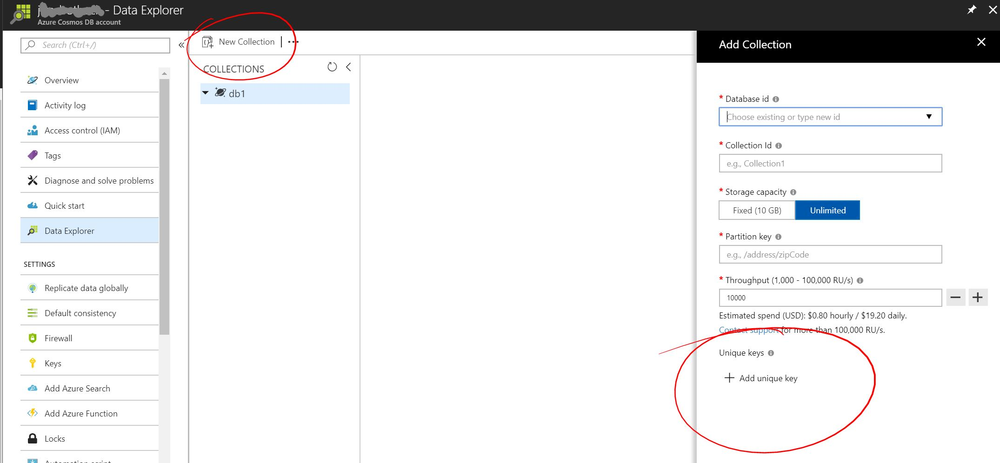

# Unique keys in Azure Cosmos DB

Unique keys provide developers with the ability to add a layer of data integrity to their database. By creating a unique key policy when a container is created, you ensure the uniqueness of one or more values per [partition key](partition-data.md). Once a container has been created with a unique key policy, it prevents the creation of any new or updated items with values that duplicate values specified by the unique key constraint.   

> [!NOTE]
> Unique keys are supported by the latest versions of the [.NET](sql-api-sdk-dotnet.md) and [.NET Core](sql-api-sdk-dotnet-core.md) SQL SDKs, and the [MongoDB API](mongodb-feature-support.md#unique-indexes). The Table API and Gremlin API do not support unique keys at this time. 
> 
>

## Use case

As an example, let's look at how a user database associated with a [social application](use-cases.md#web-and-mobile-applications) could benefit from having a unique key policy on email addresses. By making the user's email address a unique key, you ensure each record has a unique email address, and no new records can be created with duplicate email addresses. 

If you did want users to be able to create multiple records with the same email address, but not the same first name, last name, and email address, you could add other paths to the unique key policy. So instead of creating a unique key based on an email address, you can create a unique key that's a combination of the first name, last name, and email. In this case, each unique combination of the three paths is allowed, so the database could contain items that have the following path values. Each of these records would pass the unique key policy.  

**Allowed values for unique key of firstName, lastName, and email**

|First name|Last name|Email address|
|---|---|---|
|Gaby|Duperre|gaby@contoso.com |
|Gaby|Duperre|gaby@fabrikam.com|
|Ivan|Duperre|gaby@fabrikam.com|
|    |Duperre|gaby@fabrikam.com|
|    |       |gaby@fabraikam.com|

If you attempted to insert another record with any of the combinations listed in the table above, you would receive an error indicating that the unique key constraint was not met. The error Azure Cosmos DB returned is "Resource with specified id or name already exists." or "Resource with specified id, name, or unique index already exists." 

## Using unique keys

Unique keys must be defined when the container is created, and the unique key is scoped to the partition key. To build on the earlier example, if you partition based on zip code, you could have the records from the table duplicated in each partition.

You cannot update existing container to use unique keys.

Once a container is created with a unique key policy, the policy cannot be changed unless you recreate the container. If you have existing data that you'd like to implement unique keys on, create the new container, and then use the appropriate data migration tool to move the data to the new container. For SQL containers, use the [Data Migration Tool](import-data.md). For MongoDB containers, use [mongoimport.exe or mongorestore.exe](mongodb-migrate.md).

A maximum of 16 path values (for example /firstName, /lastName, /address/zipCode, etc.) can be included in each unique key. 

Each unique key policy can have a maximum of 10 unique key constraints or combinations and the combined paths for all unique index properties should not exceed 60 characters. So the earlier example that uses first name, last name, and email address is just one constraint, and it uses three of the 16 possible paths available. 

Request unit charges for creating, updating, and deleting an item are slightly higher when there is a unique key policy on the container. 

Sparse unique keys are not supported. If values for some unique paths are missing, they are treated as a special null value, which takes part in the uniqueness constraint.

## SQL API sample

The following code sample shows how to create a new SQL container with two unique key constraints. The first constraint is the firstName, lastName, email constraint described in the earlier example. The second constraint is the users address/zipCode. A sample JSON file that uses the paths in this unique key policy follows the code example. 

```csharp
// Create a collection with two separate UniqueKeys, one compound key for /firstName, /lastName,
// and /email, and another for /address/zipCode.
private static async Task CreateCollectionIfNotExistsAsync(string dataBase, string collection)
{
    try
    {
        await client.ReadDocumentCollectionAsync(UriFactory.CreateDocumentCollectionUri(dataBase, collection));
    }
    catch (DocumentClientException e)
    {
        if (e.StatusCode == System.Net.HttpStatusCode.NotFound)
        {
            DocumentCollection myCollection = new DocumentCollection();
            myCollection.Id = collection;
            myCollection.PartitionKey.Paths.Add("/pk");
            myCollection.UniqueKeyPolicy = new UniqueKeyPolicy
            {
                UniqueKeys =
                new Collection<UniqueKey>
                {
                    new UniqueKey { Paths = new Collection<string> { "/firstName" , "/lastName" , "/email" }}
                    new UniqueKey { Paths = new Collection<string> { "/address/zipcode" } },
          }
            };
            await client.CreateDocumentCollectionAsync(
                UriFactory.CreateDatabaseUri(dataBase),
                myCollection,
                new RequestOptions { OfferThroughput = 2500 });
        }
        else
        {
            throw;
        }
    }
```

Sample JSON document.

```json
{
    "id": "1",
    "pk": "1234",
    "firstName": "Gaby",
    "lastName": "Duperre",
    "email": "gaby@contoso.com",
    "address": 
        {            
            "line1": "100 Some Street",
            "line2": "Unit 1",
            "city": "Seattle",
            "state": "WA",
            "zipcode": 98012
        }
    
}
```
> [!NOTE]
> Please note unique key name is case sensitive. As shown in above example, unique name is set for /address/zipcode. If your data will have ZipCode, then it will insert "null" in  unique key as zipcode is not equal to ZipCode. And because of this case sensitivity all other records with ZipCode will not be able to be inserted as duplicate "null" will violate unique key constraint.

## MongoDB API sample

The following command sample shows how to create a unique index on the firstName, lastName, and email fields of the users collection for the MongoDB API. This ensures the uniqueness for a combination of all three fields across all documents in the collection. For MongoDB API collections, the unique index is created after the collection is created, but before populating the collection.

> [!NOTE]
> The unique key format for MongoDB API accounts is different from that of SQL API accounts, where you don’t have to specify the backslash (/) character before the field name. 

```
db.users.createIndex( { firstName: 1, lastName: 1, email: 1 }, { unique: true } )
```
## Configure unique keys by using Azure Portal

In the sections above you'll find code samples that will show how you can define unique key constraints when a collection is created using the SQL API or MongoDB API. But it's also possible to define unique keys when you create a collection via the web UI in the Azure portal. 

- Navigate to the **Data Explorer** in your Cosmos DB account
- Click **New Collection**
- In the section Unique keys,** you can add the desired unique key constraints by clicking **Add unique key**



- If you'd like to create a unique key constraint on the lastName path, you add `/lastName`.
- If you'd like to create a unique key constraint for the lastName firstName combination, you add `/lastName,/firstName`

When done click **OK** to create the collection.

## Next steps

In this article, you learned how to create unique keys for items in a database. If you are creating a container for the first time, review [Partitioning data in Azure Cosmos DB](partition-data.md) as unique keys and partition keys rely on each other. 


