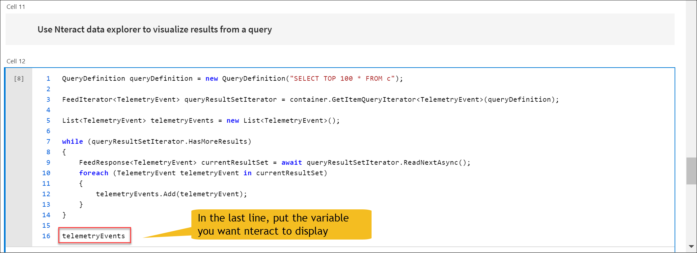
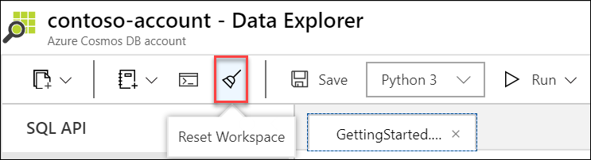

# Use built-in notebook commands and features in Azure Cosmos DB C# notebooks (preview)

Built-in Jupyter notebooks in Azure Cosmos DB enable you to analyze and visualize your data from the Azure portal. This article describes how to use built-in notebook commands and features to do common operations in C# notebooks.

## Install a new NuGet package
After you enable notebook support for your Azure Cosmos accounts, you can open a new notebook and install a package.

In a new code cell, insert and run the following code, replacing ``PackageToBeInstalled`` with the desired NuGet package, and ``optionalVersion`` with a specific version of the package if desired. 

```csharp
#r "nuget: PackageToBeInstalled, optionalVersion"
```

You can install multiple NuGet packages in the same cell. Packages will be available to use from any notebook in the Azure Cosmos account workspace. 

Currently, the C# notebooks workspace does not support recursive resolution of NuGet packages. If a NuGet package has dependencies on other NuGet packages that are not currently installed, you have to explicitly reference them along with the parent package.

> [!TIP]
> If your notebook requires a custom package, we recommend that you add a cell to your notebook to install the package and make it the first cell. This reduces the chance of conflicts with other packages that Azure Cosmos DB loads by default. It is also easy to re-install the packages if you [reset the workspace](#reset-notebooks-workspace), which removes all packages. 

## Use the built-in Azure Cosmos DB .NET SDK
Version 3 of the [Azure Cosmos DB .NET SDK for SQL API](https://github.com/Azure/azure-cosmos-dotnet-v3) is installed and included in the notebook environment for the Azure Cosmos account.

Create an instance of ``CosmosClient`` to run any SDK operation. 

For example:

```csharp
// Include usings
using System;
using Microsoft.Azure.Cosmos; //namespace for Azure Cosmos DB .NET V3 SDK
using System.Collections;

// Initialize a new instance of CosmosClient using the built-in account endpoint and key parameters
CosmosClient cosmosClient = new CosmosClient(Cosmos.Endpoint, Cosmos.Key);

// Create a new database and container with 400 RU/s
Database database = await cosmosClient.CreateDatabaseIfNotExistsAsync("DatabaseName");
Container container = await database.CreateContainerIfNotExistsAsync("ContainerName", "/partitionKey", 400);
```
To learn more, see the [.NET V3 SDK samples](https://github.com/Azure/azure-cosmos-dotnet-v3/tree/master/Microsoft.Azure.Cosmos.Samples/Usage). 

> [!IMPORTANT]
> The built-in Azure Cosmos DB .NET SDK is only supported for SQL (Core) API accounts. For other APIs, you will need to [install the relevant .NET driver](#install-a-new-nuget-package) that corresponds to the API. 

## Set custom options using ``CosmosClientOptions``
For more flexibility, you can set the custom ``CosmosClientOptions`` property and pass it in your ``CosmosClient`` instance. You can use this property to:

- Set an application name in the user-agent suffix to include it in every request.
- Set the preferred region to be used when running operations against the service.
- Set a custom retry policy to handle rate-limited requests.

See the [CosmosClientOptions API reference](/dotnet/api/microsoft.azure.cosmos.cosmosclientoptions) article for all the supported settings. The following is an example that shows how to set `cosmosClientOptions` property:

```csharp
using Microsoft.Azure.Cosmos;

// Configure CosmosClientOptions
var cosmosClientOptions = new CosmosClientOptions
{
    ApplicationName = "ContosoNotebookAppName",
    ApplicationRegion = Regions.RegionName, // By default, this is the region you first created your account in
    MaxRetryAttemptsOnRateLimitedRequests = 9, // By default, this value is 9
};

var client = new CosmosClient(Cosmos.Endpoint, Cosmos.Key, cosmosClientOptions);
```

## Access the account endpoint and primary key variables
You can access the built-in endpoint and key of the Azure Cosmos account where your notebook exists.

```csharp
var key = Cosmos.Key;
var endpoint = Cosmos.Endpoint;
```

> [!IMPORTANT]
> The ``Cosmos.Key`` and ``Cosmos.Endpoint`` variables are only applicable for SQL API. For other APIs, find the endpoint and key in the **Connection Strings** or **Keys** blade in your Azure Cosmos account.  

## Print console output in C# code
In your C# code, you can use the Display.AsMarkdown() syntax with [string interpolation](/dotnet/csharp/language-reference/tokens/interpolated) to print console output that will appear when you run the cell. 

For example: 

```csharp
// Print text in the output
Display.AsMarkdown($"Hello world!");

// Print a variable in the output
for (int i = 0; i < 5; i++) {
    Display.AsMarkdown($"Printing out variable: {i}");
}
```
> [!IMPORTANT]
> Console.WriteLine() syntax is not currently supported in C# notebooks. Use Display.AsMarkdown to print console output from your program. 

## Use built-in nteract data explorer
You can use the built-in [nteract data explorer](https://blog.nteract.io/designing-the-nteract-data-explorer-f4476d53f897) to filter and visualize a collection of items. In a cell, put the variable you want to visualize in the last line, which is automatically displayed in nteract when you run the cell.

For example, in the *GetingStarted_Csharp.ipynb* example, we can print out the variable with our result, the ``telemetryEvents``. See the [GettingStarted_Csharp.ipynb notebook](https://github.com/Azure-Samples/cosmos-notebooks/blob/master/CSharp_quickstarts/GettingStarted_CSharp.ipynb) for the entire sample. 




## Use built-in dictionary viewer
You can use the built-in dictionary viewer to view a variable. In a cell, put the variable you want to visualize in the last line, which will be automatically displayed when the cell is run.


## Upload JSON items to a container
You can use the ``%%upload`` magic command to upload data from a JSON file to a specified Azure Cosmos container. Use the following command to upload the items:

```csharp
%%upload --databaseName {database_id} --containerName {container_id} --url {url_location_of_file}
```

- Replace ``{database_id}`` and ``{container_id}`` with the name of the database and container in your Azure Cosmos account. 
- Replace ``{url_location_of_file}`` with the location of your JSON file. The file must be an array of valid JSON objects and it should be accessible over the public Internet.

For example:

```csharp
%%upload --database databaseName --container containerName --url 
https://contoso.com/path/to/data.json
```
```
Documents successfully uploaded to ContainerName
Total number of documents imported : 2654
Total time taken : 00:00:38.1228087 hours
Total RUs consumed : 25022.58
```

With the output statistics, you can calculate the effective RU/s used to upload the items. For example, if 25,000 RUs were consumed over 38 seconds, the effective RU/s is 25,000 RUs / 38 seconds = 658 RU/s.

## Run another notebook in current notebook 
You can use the ``%%run`` magic command to run another notebook in your workspace from your current notebook. Use the syntax:

```csharp
%%run ./path/to/{notebookName}.ipynb
```
Replace ``{notebookName}`` with the name of the notebook you want to run. The notebook must be in your current 'My Notebooks' workspace. 

## Reset notebooks workspace
To reset the notebooks workspace to the default settings, select **Reset Workspace** on the command bar. This will remove any custom installed packages and restart the Jupyter server. Your notebooks, files, and Azure Cosmos resources will not be affected.  



## Next steps

- Learn about the benefits of [Azure Cosmos DB Jupyter notebooks](cosmosdb-jupyter-notebooks.md)
- Learn about the [Azure Cosmos DB .NET SDK for SQL API](https://github.com/Azure/azure-cosmos-dotnet-v3)
