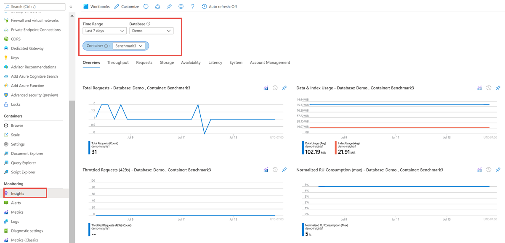

# Monitor and debug with metrics in Azure Cosmos DB

Azure Cosmos DB provides metrics for throughput, storage, consistency, availability, and latency. The Azure portal provides an aggregated view of these metrics. You can also view Azure Cosmos DB metrics from Azure Monitor API. To learn about how to view metrics from Azure monitor, see the [Get metrics from Azure Monitor](cosmos-db-azure-monitor-metrics.md) article. 

This article walks through common use cases and how Azure Cosmos DB metrics can be used to analyze and debug these issues. Metrics are collected every five minutes and are kept for seven days.

## View metrics from Azure portal

1. Sign into [Azure portal](https://portal.azure.com/)

1. Open the **Metrics** pane. By default, the metrics pane shows the storage, index, request units metrics for all the databases in your Azure Cosmos account. You can filter these metrics per database, container, or a region. You can also filter the metrics at a specific time granularity. More details on the throughput, storage, availability, latency, and consistency metrics are provided on separate tabs. 

   

The following metrics are available from the **Metrics** pane: 

* **Throughput metrics** - This metric shows the number of requests consumed or failed (429 response code) because the throughput or storage capacity provisioned for the container has exceeded.

* **Storage metrics** - This metric shows the size of data and index usage.

* **Availability metrics** - This metric shows the percentage of successful requests over the total requests per hour. The success rate is defined by the Azure Cosmos DB SLAs.

* **Latency metrics** - This metric shows the read and write latency observed by Azure Cosmos DB in the region where your account is operating. You can visualize latency across regions for a geo-replicated account. This metric doesn't represent the end-to-end request latency.

* **Consistency metrics** - This metric shows how eventual is the consistency for the consistency model you choose. For multi-region accounts, this metric also shows the replication latency between the regions you have selected.

* **System metrics** - This metric shows how many metadata requests are served by the master partition. It also helps to identify the throttled requests.

The following sections explain common scenarios where you can use Azure Cosmos DB metrics. 

## Understand how many requests are succeeding or causing errors

To get started, head to the [Azure portal](https://portal.azure.com) and navigate to the **Metrics** blade. In the blade, find the **Number of requests exceeded capacity per 1-minute chart. This chart shows a minute by minute total requests segmented by the status code. For more information about HTTP status codes, see [HTTP status codes for Azure Cosmos DB](https://docs.microsoft.com/rest/api/cosmos-db/http-status-codes-for-cosmosdb).

The most common error status code is 429 (rate limiting/throttling). This error means that requests to Azure Cosmos DB are more than the provisioned throughput. The most common solution to this problem is to [scale up the RUs](./set-throughput.md) for the given collection.


## Determine the throughput distribution across partitions

Having a good cardinality of your partition keys is essential for any scalable application. To determine the throughput distribution of any partitioned container broken down by partitions, navigate to the **Metrics blade** in the [Azure portal](https://portal.azure.com). In the **Throughput** tab, the storage breakdown is shown in the **Max consumed RU/second by each physical partition** chart. The following graphic illustrates an example of a poor distribution of data as shown by the skewed partition on the far left.


An uneven throughput distribution may cause *hot* partitions, which can result in throttled requests and may require repartitioning. For more information about partitioning in Azure Cosmos DB, see [Partition and scale in Azure Cosmos DB](./partition-data.md).

## Determine the storage distribution across partitions

Having a good cardinality of your partition is essential for any scalable application. To determine the storage distribution of any partitioned container broken down by partitions, head to the Metrics blade in the [Azure portal](https://portal.azure.com). In the Storage tab, the storage breakdown is shown in the Data + Index storage consumed by top partition keys chart. The following graphic illustrates a poor distribution of data storage as shown by the skewed partition on the far left.


You can root cause which partition key is skewing the distribution by clicking on the partition in the chart.


After identifying which partition key is causing the skew in distribution, you may have to repartition your container with a more distributed partition key. For more information about partitioning in Azure Cosmos DB, see [Partition and scale in Azure Cosmos DB](./partition-data.md).

## Compare data size against index size

In Azure Cosmos DB, the total consumed storage is the combination of both the Data size and Index size. Typically, the index size is a fraction of the data size. In the Metrics blade in the [Azure portal](https://portal.azure.com), the Storage tab showcases the breakdown of storage consumption based on data and index.

```csharp
// Measure the document size usage (which includes the index size)  
ResourceResponse<DocumentCollection> collectionInfo = await client.ReadDocumentCollectionAsync(UriFactory.CreateDocumentCollectionUri("db", "coll"));
 Console.WriteLine("Document size quota: {0}, usage: {1}", collectionInfo.DocumentQuota, collectionInfo.DocumentUsage);
```

If you would like to conserve index space, you can adjust the [indexing policy](index-policy.md).

## Debug why queries are running slow

In the SQL API SDKs, Azure Cosmos DB provides query execution statistics.

```csharp
IDocumentQuery<dynamic> query = client.CreateDocumentQuery(
 UriFactory.CreateDocumentCollectionUri(DatabaseName, CollectionName),
 "SELECT * FROM c WHERE c.city = 'Seattle'",
 new FeedOptions
 {
 PopulateQueryMetrics = true,
 MaxItemCount = -1,
 MaxDegreeOfParallelism = -1,
 EnableCrossPartitionQuery = true
 }).AsDocumentQuery();
FeedResponse<dynamic> result = await query.ExecuteNextAsync();

// Returns metrics by partition key range Id
IReadOnlyDictionary<string, QueryMetrics> metrics = result.QueryMetrics;
```

*QueryMetrics* provides details on how long each component of the query took to execution. The most common root cause for long running queries is scans, meaning the query was unable to leverage the indexes. This problem can be resolved with a better filter condition.

## Next steps

You've now learned how to monitor and debug issues using the metrics provided in the Azure portal. You may want to learn more about improving database performance by reading the following articles:

* To learn about how to view metrics from Azure monitor, see the [Get metrics from Azure Monitor](cosmos-db-azure-monitor-metrics.md) article. 
* [Performance and scale testing with Azure Cosmos DB](performance-testing.md)
* [Performance tips for Azure Cosmos DB](performance-tips.md)
