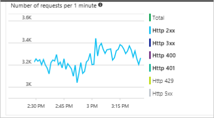
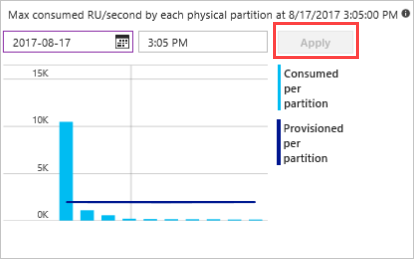
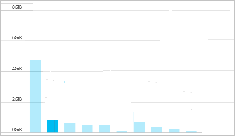
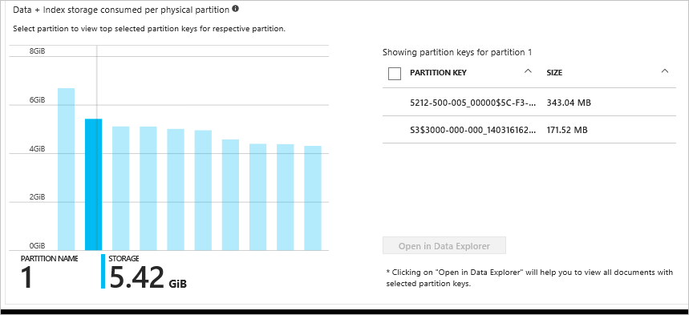

# Monitoring and debugging with metrics in Azure Cosmos DB

Azure Cosmos DB provides metrics for throughput, storage, consistency, availability, and latency. The [Azure portal](https://portal.azure.com) provides an aggregated view of these metrics; for more granular metrics, both the client SDK and the [diagnostic logs](./logging.md) are available.

This article walks through common use cases and how Azure Cosmos DB metrics can be used to analyze and debug these issues. Metrics are collected every five minutes and are retained for seven days.

## Understanding how many requests are succeeding or causing errors

To get started, head to the [Azure portal](https://portal.azure.com) and navigate to the **Metrics** blade. In the blade, find the **Number of requests exceeded capacity per 1 minute** chart. This chart shows a minute by minute total requests segmented by the status code. For more information about HTTP status codes, see [HTTP Status Codes for Azure Cosmos DB](https://docs.microsoft.com/rest/api/cosmos-db/http-status-codes-for-cosmosdb).

The most common error status code is 429 (rate limiting/throttling), which means that requests to Azure Cosmos DB are exceeding the provisioned throughput. The most common solution to this is to [scale up the RUs](./set-throughput.md) for the given collection.



## Determining the throughput distribution across partitions

Having a good cardinality of your partition keys is essential for any scalable application. To determine the throughput distribution of any partitioned container broken down by partitions, navigate to the **Metrics blade** in the [Azure portal](https://portal.azure.com). In the **Throughput** tab, the storage breakdown is shown in the **Max consumed RU/second by each physical partition** chart. The following graphic illustrates an example of a poor distribution of data as evidenced by the skewed partition on the far left. 



An uneven throughput distribution may cause *hot* partitions, which can result in throttled requests and may require repartitioning. For more information about partitioning in Azure Cosmos DB, see [Partition and scale in Azure Cosmos DB](./partition-data.md).

## Determining the storage distribution across partitions

Having a good cardinality of your partition is essential for any scalable application. To determine the throughput distribution of any partitioned container broken down by partitions, head to the Metrics blade in the [Azure portal](https://portal.azure.com). In the Throughput tab, the storage breakdown is shown in the Max consumed RU/second by each physical partition chart. The following graphic illustrates a poor distribution of data as evidenced by the skewed partition on the far left. 



You can root cause which partition key is skewing the distribution by clicking on the partition in the chart. 



After identifying which partition key is causing the skew in distribution, you may have to repartition your container with a more distributed partition key. For more information about partitioning in Azure Cosmos DB, see [Partition and scale in Azure Cosmos DB](./partition-data.md).

## Comparing data size against index size

In Azure Cosmos DB, the total consumed storage is the combination of both the Data size and Index size. Typically, the index size is a fraction of the data size. In the Metrics blade in the [Azure portal](https://portal.azure.com), the Storage tab showcases the breakdown of storage consumption based on data and index. 
Image (maybe)
Alternatively, from the SDK, you can find the current storage usage through a collection read.
```csharp
// Measure the document size usage (which includes the index size)  
ResourceResponse<DocumentCollection> collectionInfo = await client.ReadDocumentCollectionAsync(UriFactory.CreateDocumentCollectionUri("db", "coll")); 
 Console.WriteLine("Document size quota: {0}, usage: {1}", collectionInfo.DocumentQuota, collectionInfo.DocumentUsage);
``` 
If you would like to conserve index space, you can adjust the [indexing policy](./indexing-policies.md).

## Debugging why queries are running slow

In the SQL API SDKs, Azure Cosmos DB provides query execution statistics. 

```csharp
IDocumentQuery<dynamic> query = client.CreateDocumentQuery(
 UriFactory.CreateDocumentCollectionUri(DatabaseName, CollectionName), 
 "SELECT * FROM c WHERE c.city = 'Seattle'", 
 new FeedOptions 
 { 
 PopulateQueryMetrics = true, 
 MaxItemCount = -1, 
 MaxDegreeOfParallelism = -1, 
 EnableCrossPartitionQuery = true 
 }).AsDocumentQuery();
FeedResponse<dynamic> result = await query.ExecuteNextAsync();

// Returns metrics by partition key range Id 
IReadOnlyDictionary<string, QueryMetrics> metrics = result.QueryMetrics;
```

*QueryMetrics* provides details on how long each component of the query took to execution. The most common root cause for long running queries are scans (the query was unable to leverage the indexes), which can be resolved with a better filter condition.

## Next steps

Now that you've learned how to monitor and debug issues using the metrics provided in the Azure portal, you may want to learn more about improving database performance by reading the following articles:

* [Performance and scale testing with Azure Cosmos DB](performance-testing.md)
* [Performance tips for Azure Cosmos DB](performance-tips.md)
