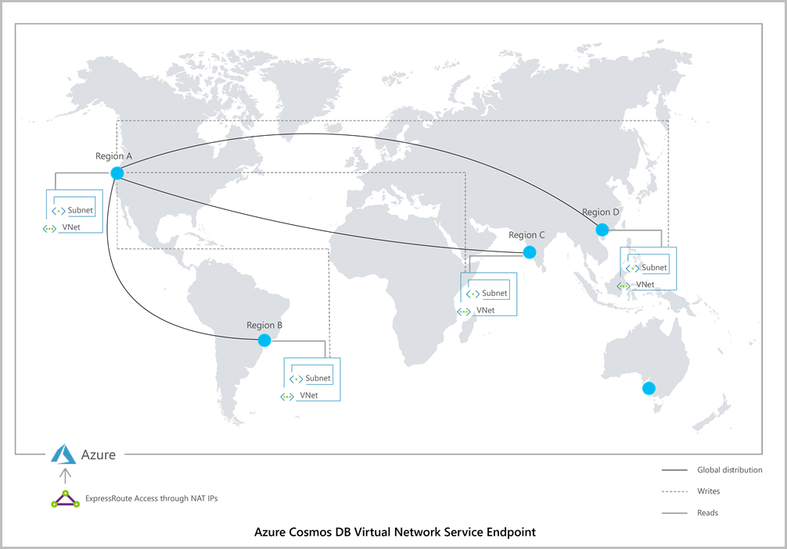
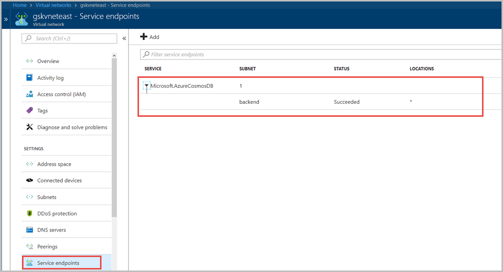
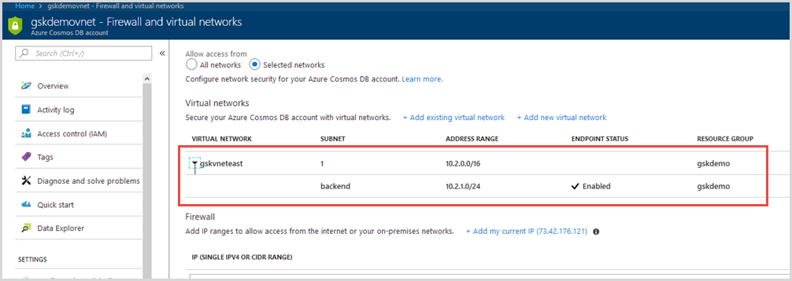
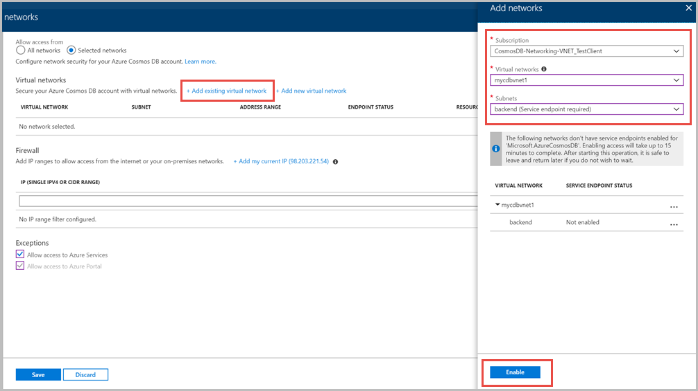
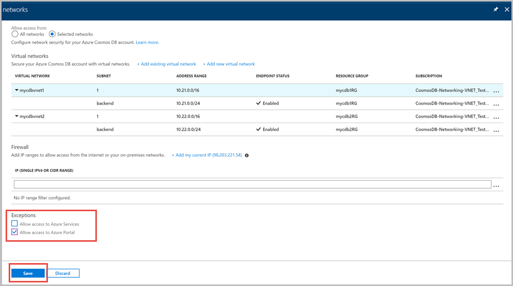

# Secure access to an Azure Cosmos DB account by using Azure Virtual Network service endpoint

Azure CosmosDB accounts can be configured to allow access only from specific subnet of Azure Virtual Network. By enabling a [Service Endpoint](../virtual-network/virtual-network-service-endpoints-overview.md) for Azure CosmosDB from a Virtual Network and its subnet, traffic is ensured an optimal and secure route to the Azure Cosmos DB.  

Azure Cosmos DB is a globally distributed, multi-model database service. You can replicate the data present in Azure Cosmos DB account to multiple regions. When Azure Cosmos DB is configured with a virtual network service endpoint, each virtual network allows access from IPs that belong to specicifc subnet. The following image shows an illustration of an Azure Cosmos DB that has virtual network service endpoint enabled:



Once an Azure Cosmos DB account is configured with a virtual network service endpoint, it can be accessed only from the specified subnet, all public/internet access is removed. To learn in detailed about service endpoints, refer to the Azure [Virtual network service endpoints overview](../virtual-network/virtual-network-service-endpoints-overview.md) article.

## Configure service endpoint by using Azure portal
### Configure service endpoint for an existing Azure virtual network and subnet

1. From **All resources** blade, find the virtual network you want to configure service endpoint for Azure Cosmos DB. Navigate to the **Service endpoints** blade and make sure that the subnet of the virtual network has been enabled for the "Azure.CosmosDB" service endpoint.  

   

2. From **All resources** blade, find the Azure Cosmos DB account you want to secure.  

3. Before enabling virtual network service endpoint, copy the IP firewall information associated with your Azure Cosmos DB account for future usage. You can re-enable IP firewall after configuring service endpoint.  

4. Select **Firewalls and virtual networks** from settings menu and choose allow access from **Selected networks**.  

3. To grant access to an existing virtual network's subnet, under Virtual networks, select **Add existing Azure virtual network**.  

4. Select the **Subscription** from which you want to add Azure virtual network. Select the Azure **Virtual networks** and **Subnets** that you wish to provide access to your Azure Cosmos DB account. Next select **Enable** to enable selected networks with service endpoints for "Microsoft.AzureCosmosDB". When it’s complete, select **Add**.  

   

   > [!NOTE]
   > If service endpoint for Azure Cosmos DB isn’t previously configured for the selected Azure virtual networks and subnets, it can be configured as a part of this operation. Enabling access will take up to 15 minutes to complete. It is very important to disable the IP firewall after noting down the contents of the firewall ACL for renabling them later. 

   

Now your Azure Cosmos DB account will only allow traffic from this chosen subnet. If you had previously enabled  IP firewall, please re-enable them by using earlier information.

### Configure service endpoint for a new Azure virtual network and subnet

1. From **All resources** blade, find the Azure Cosmos DB account you want to secure.  

> [!NOTE]
> If you have an existing IP firewall configured for your Azure Cosmos DB account, please note the firewall configuration, remove the IP firewall and then enable the Service endpoint. If you enable the Service endpoint without disbling the firewall, the traffic from that ip range will loose the virtual IP identity and it's dropped with an IP filter error message. So to prevent this error you should always disable the firewall rules, copy them, enable service endpoint from the subnet and finally ACL the subnet from Cosmos DB. After you configure service endpoint and add the ACL you can re-enable the IP firewall again if needed.

2. Before enabling virtual network service endpoint, copy the IP firewall information associated with your Azure Cosmos DB account for future usage. You can re-enable IP firewall after configuring service endpoint.  

3. Select **Firewalls and Azure virtual networks** from settings menu and choose allow access from **Selected networks**.  

4. To grant access to a new Azure virtual network, under Virtual networks, select **Add new virtual network**.  

5. Provide the details required to create a new virtual network, and then select Create. The subnet will be created with a service endpoint for "Microsoft.AzureCosmosDB" enabled.

   

## Allow access from Azure portal

After Azure Virtual Network service endpoints are enabled for your Azure Cosmos DB database account, access from portal or other Azure services is disabled by default. Access to your Azure Cosmos DB database account from machines outside the configured subnet are blocked including access from portal.



If your Azure Cosmos DB account is used by other Azure services like Azure Search, or accessed from Stream analytics or Power BI, you allow access by checking **Allow access to Azure Services**.

To ensure you have access to Azure Cosmos DB metrics from the portal, you need to enable **Allow access to Azure portal** options. To learn more about these options, see [connections from Azure portal](firewall-support.md#connections-from-the-azure-portal) and [connections from Azure PaaS services](firewall-support.md#connections-from-global-azure-datacenters-or-azure-paas-services) sections. After selecting access, select **Save** to save the settings.

## Remove a virtual network or subnet 

1. From **All resources** blade, find the Azure Cosmos DB account for which you assigned service endpoints.  

2. Select **Firewalls and virtual networks** from settings menu.  

3. To remove a virtual network or subnet rule, select "..." next to the virtual network or subnet and select **Remove**.

   

4.	Click **Save** to apply your changes.

## Configure Service endpoint by using Azure PowerShell 

Use the following steps to configure Service endpoint to an Azure Cosmos DB account by using Azure PowerShell:  

1. Install the latest [Azure PowerShell](https://docs.microsoft.com/powershell/azure/install-azurerm-ps) and [Login](https://docs.microsoft.com/powershell/azure/authenticate-azureps).  Ensure you note the IP firewall settings and delete the IP firewall completely before enabling Service endpoint for the account.


> [!NOTE]
> If you have an existing IP firewall configured for your Azure Cosmos DB account, please note the firewall configuration, remove the IP firewall and then enable the Service endpoint. If you enable the Service endpoint without disbling the firewall, the traffic from that ip range will loose the virtual IP identity and it's dropped with an IP filter error message. So to prevent this error you should always disable the firewall rules, copy them, enable service endpoint from the subnet and finally ACL the subnet from Cosmos DB. After you configure service endpoint and add the ACL you can re-enable the IP firewall again if needed.

2. Before enabling virtual network service endpoint, copy the IP firewall information associated with your Azure Cosmos DB account for future usage. You will re-enable IP firewall after configuring service endpoint.  

3. Enable the service endpoint for an existing subnet of a virtual network.  

   ```powershell
   $rgname= "<Resource group name>"
   $vnName = "<virtual network name>"
   $sname = "<Subnet name>"
   $subnetPrefix = "<Subnet address range>"

   Get-AzureRmVirtualNetwork `
    -ResourceGroupName $rgname `
    -Name $vnName | Set-AzureRmVirtualNetworkSubnetConfig `
    -Name $sname  `
    -AddressPrefix $subnetPrefix `
    -ServiceEndpoint "Microsoft.AzureCosmosDB" | Set-AzureRmVirtualNetwork
   ```

4. Get ready for the enablement of ACL on the CosmosDB Account by making sure that the virtual network and subnet have service endpoint enabled for Azure Cosmos DB.

   ```powershell
   $vnProp = Get-AzureRmVirtualNetwork `
     -Name $vnName  -ResourceGroupName $rgName
   ```

5. Get properties of Azure Cosmos DB account by running the following cmdlet:  

   ```powershell
   $apiVersion = "2015-04-08"
   $acctName = "<Azure Cosmos DB account name>"

   $cosmosDBConfiguration = Get-AzureRmResource -ResourceType "Microsoft.DocumentDb/databaseAccounts" `
     -ApiVersion $apiVersion `
     -ResourceGroupName $rgName `
     -Name $acctName
   ```

6. Initialize the variables for use later. Set up all the variables from the existing account definition, if you have multiple locations, you need to add them as part of the array. In this step, you also configure virtual network service endpoint by setting the "accountVNETFilterEnabled" variable to "True". This value is later assigned to the "isVirtualNetworkFilterEnabled" parameter.  

   ```powershell
   $locations = @(@{})

   <# If you have read regions in addition to a write region, use the following code to set the $locations variable instead.

   $locations = @(@{"locationName"="<Write location>"; 
                 "failoverPriority"=0}, 
               @{"locationName"="<Read location>"; 
                  "failoverPriority"=1}) #>

   $consistencyPolicy = @{}
   $cosmosDBProperties = @{}

   $locations[0]['failoverPriority'] = $cosmosDBConfiguration.Properties.failoverPolicies.failoverPriority
   $locations[0]['locationName'] = $cosmosDBConfiguration.Properties.failoverPolicies.locationName

   $consistencyPolicy = $cosmosDBConfiguration.Properties.consistencyPolicy

   $accountVNETFilterEnabled = $True
   $subnetID = $vnProp.Id+"/subnets/" + $sname  
   $virtualNetworkRules = @(@{"id"=$subnetID})
   $databaseAccountOfferType = $cosmosDBConfiguration.Properties.databaseAccountOfferType
   ```

7. Update Azure Cosmos DB account properties with the new configuration by running the following cmdlets: 

   ```powershell
   $cosmosDBProperties['databaseAccountOfferType'] = $databaseAccountOfferType
   $cosmosDBProperties['locations'] = $locations
   $cosmosDBProperties['consistencyPolicy'] = $consistencyPolicy
   $cosmosDBProperties['virtualNetworkRules'] = $virtualNetworkRules
   $cosmosDBProperties['isVirtualNetworkFilterEnabled'] = $accountVNETFilterEnabled

   Set-AzureRmResource `
     -ResourceType "Microsoft.DocumentDb/databaseAccounts" `
     -ApiVersion $apiVersion `
     -ResourceGroupName $rgName `
     -Name $acctName -Properties $CosmosDBProperties
   ```

8. Run the following command to verify that your Azure Cosmos DB account is updated with the virtual network service endpoint that you configured in the previous step:

   ```powershell
   $UpdatedcosmosDBConfiguration = Get-AzureRmResource `
     -ResourceType "Microsoft.DocumentDb/databaseAccounts" `
     -ApiVersion $apiVersion `
     -ResourceGroupName $rgName `
     -Name $acctName

   $UpdatedcosmosDBConfiguration.Properties
   ```

## Add virtual network service endpoint for an Azure Cosmos DB account that has IP Firewall enabled

1. First disable the IP firewall access to Azure Cosmos DB account.  

2. Enable virtual network endpoint to the Azure Cosmos DB account by using one of the methods described in the previous sections.  

3. Re-enable the IP firewall access. 

## Test the access

To check if service endpoints for Azure Cosmos DB are configured as expected, use the following steps:

* Set up two subnets in a virtual network as frontend and backend, enable Cosmos DB service endpoint for the backend subnet.  

* Enable access in the Cosmos DB account for the backend subnet.  

* Create two virtual machines- one in backend subnet and another in the frontend subnet.  

* Try accessing the Azure Cosmos DB account from both virtual machines. You should be able to connect from virtual machine created in backend subnet but not from the one created in frontend subnet. The request will error out with 404 when you try connecting from the frontend subnet that confirms that the access to Azure Cosmos DB is secured by using the virtual network service endpoint. The machine in the backend subnet will be able to work fine.

## Frequently asked questions

### What happens when you access an Azure Cosmos DB account that has virtual network Access Control List (ACL) enabled?  

HTTP 404 error is returned.  

### Are subnets of a virtual network created in different regions allowed to access an Azure Cosmos DB account in another region? For example, if Azure Cosmos DB account is in West US or East US and virtual network’s are in multiple regions, can the virtual network access Azure Cosmos DB?  

Yes, virtual networks created in different regions can access by the new capability. 

### Can an Azure Cosmos DB account have both virtual network Service endpoint and a firewall?  

Yes, Virtual Network Service endpoint and a firewall can co-exist. In general, you should ensure that access to portal is always enabled before configuring a virtual network service endpoint to enable you to view the metrics associated with the container.

### Can I "allow access to other Azure services from a given Azure region" when service endpoint access is enabled for Azure Cosmos DB?  

This is required only when you want your Azure Cosmos DB account to be accessed by other Azure first party services like Azure Data factory, Azure Search or any service that is deployed in given Azure region.

### How many virtual network service endpoints are allowed for Azure Cosmos DB?  

64 virtual network service endpoints are allowed for an Azure Cosmos DB account.

### What is the relationship between Service Endpoint and Network Security Group (NSG) rules?  

NSG rules in Azure Cosmos DB allow you to restrict access to specific Azure Cosmos DB IP address range. If you want to allow access to an Azure Cosmos DB instance that is present in a specific [region](https://azure.microsoft.com/global-infrastructure/regions/), you can specify the region in the following format: 

    AzureCosmosDB.<region name>

To learn more about NSG tags see [virtual network service tags](../virtual-network/security-overview.md#service-tags) article. 
  
### What is relationship between an IP firewall and Virtual Network service endpoint capability?  

These two features complement each other to ensure isolation of Azure Cosmos DB assets and secure them. Using IP firewall ensures that static IPs can access Azure Cosmos DB account.  

### Can an on-premises device’s IP address that is connected through Azure Virtual Network gateway(VPN) or Express route gateway access Azure Cosmos DB account?  

The on-premises device’s IP address or IP address range should be added to the list of static IPs’ in order to access the Azure Cosmos DB account.  

### What happens if you delete a virtual network that has service endpoint setup for Azure Cosmos DB?  

When a virtual network is deleted, the ACL information associated with that Azure Cosmos DB is deleted and it removes the interaction between virtual network and the Azure Cosmos DB account. 

### What happens if an Azure Cosmos DB account that has virtual network service endpoint enabled is deleted?

The metadata associated with the specific Azure Cosmos DB account is deleted from the subnet. And it’s the end user’s responsibility to delete the subnet and virtual network used.

### Can I use a peered virtual network to create service endpoint for Azure Cosmos DB?  

No, only direct virtual network and their subnets can create Azure Cosmos DB service endpoints.

### What happens to the source IP address of resource like virtual machine in the subnet that has Azure Cosmos DB service endpoint enabled?

When virtual network service endpoints are enabled, the source IP addresses of resources in your virtual network's subnet will switch from using public IPV4 addresses to Azure Virtual Network's private addresses for traffic to Azure Cosmos DB.

### Does Azure Cosmos DB reside in the Azure virtual network  provided by the customer?  

Azure Cosmos DB is a multi-tenant service with a public IP address. When you restrict access to a subnet of an Azure Virtual network by using the service endpoint feature, access is restricted for your Azure Cosmos DB account through the given Azure Virtual Network and its subnet.  Azure Cosmos DB account does not reside in that Azure Virtual Network. 

### What if anything will be logged in Log Analytics/OMS if it is enabled?  

Azure Cosmos DB will push logs with IP address (without the last octet) with status 403 for request blocked by ACL.  

## Next steps
To configure a firewall for Azure Cosmos DB see [firewall support](firewall-support.md) article.

