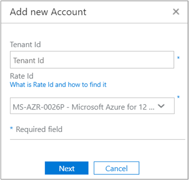
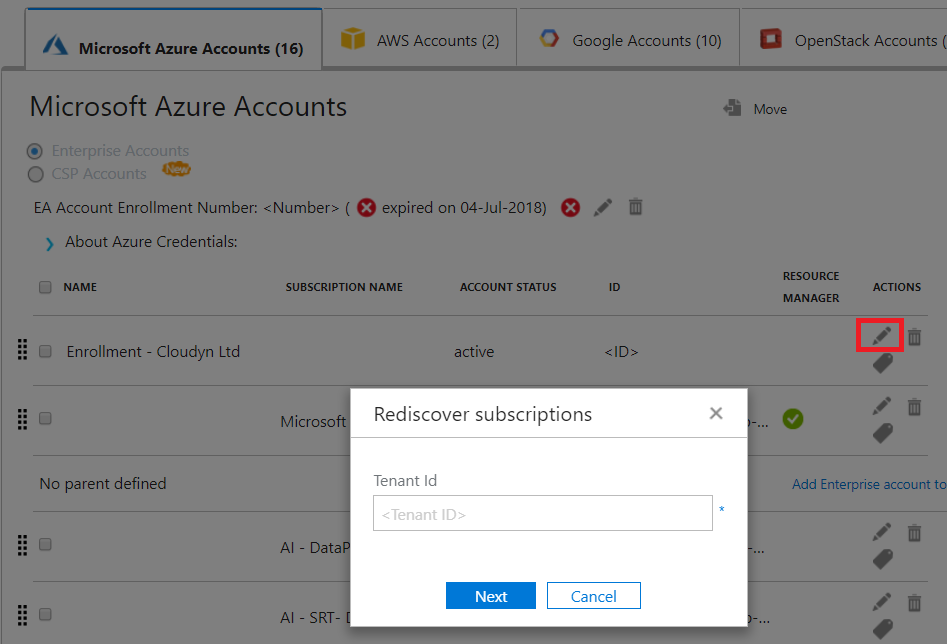

# Activate Azure subscriptions and accounts with Cloudyn

Adding or updating your Azure Resource Manager credentials allows Cloudyn to discover all the accounts and subscriptions within your Azure Tenant. If you also have Azure Diagnostics extension enabled on your virtual machines, then Cloudyn can collect extended metrics like CPU and memory. This article describes how to enable access using Azure Resource Manager APIs for new and existing accounts. It also describes how to resolve common account problems.

Cloudyn cannot access most of your Azure subscription data when the subscription is _unactivated_. You must edit _unactivated_ accounts so that Cloudyn can access them.

[!INCLUDE [cloudyn-note](../../../includes/cloudyn-note.md)]

## Required Azure permissions

Specific permissions are needed to complete the procedures in this article. Either you or your tenant administrator must have both of the following permissions:

- Permission to register the CloudynCollector application with your Azure AD tenant.
- The ability to assign the application to a role in your Azure subscriptions.

In your Azure subscriptions, your accounts must have `Microsoft.Authorization/*/Write` access to assign the CloudynCollector application. This action is granted through the [Owner](../../role-based-access-control/built-in-roles.md#owner) role or [User Access Administrator](../../role-based-access-control/built-in-roles.md#user-access-administrator) role.

If your account is assigned the **Contributor** role, you do not have adequate permission to assign the application. You receive an error when attempting to assign the CloudynCollector application to your Azure subscription.

### Check Azure Active Directory permissions

1. Sign in into the [Azure portal](https://portal.azure.com).
2. In the Azure portal, select **Azure Active Directory**.
3. In Azure Active Directory, select **User settings**.
4. Check the **App registrations** option.
    - If it is set to **Yes**, then non-administrator users can register AD apps. This setting means any user in the Azure AD tenant can register an app.  
    
    - If the **App registrations** option is set to **No**, then only tenant administrative users can register Azure Active Directory apps. Your tenant administrator must register the CloudynCollector application.


## Add an account or update a subscription

When you add an account update a subscription, you grant Cloudyn access to your Azure data.

### Add a new account (subscription)

1. In the Cloudyn portal, click the gear symbol in the upper-right and select **Cloud Accounts**.
2. Click **Add new account** and the **Add new account** box appears. Enter the required information.  
    

### Update a subscription

1. If you want to update an _unactivated_ subscription that already exists in Cloudyn in Accounts Management, click the edit pencil symbol to the right of the parent _tenant GUID_. Subscriptions are grouped under a parent tenant, so avoid activating subscriptions individually.
    
2. If necessary, enter the Tenant ID. If you don't know your Tenant ID, use the following steps to find it:
    1. Sign in to the [Azure portal](https://portal.azure.com).
    2. In the Azure portal, select **Azure Active Directory**.
    3. To get the tenant ID, select **Properties** for your Azure AD tenant.
    4. Copy the Directory ID GUID. This value is your tenant ID.
    For more information, see [Get tenant ID](../../active-directory/develop/howto-create-service-principal-portal.md#get-tenant-and-app-id-values-for-signing-in).
3. If necessary, select your Rate ID. If you don't know your rate ID, use the following steps to find it.
    1. In the upper-right of the Azure portal, click your user information and then click **View my bill**.
    2. Under **Billing Account**, click **Subscriptions**.
    3. Under **My subscriptions**, select the subscription.
    4. Your rate ID is shown under **Offer ID**. Copy the Offer ID for the subscription.
4. In the Add new account (or Edit Subscription) box, click **Save** (or **Next**). You're redirected to the Azure portal.
5. Sign in to the portal. Click **Accept** to authorize Cloudyn Collector access your Azure account.

    You're redirected to the Cloudyn Accounts management page and your subscription is updated with **active** Account Status. It should display a green check mark symbol under the Resource Manager column.

    If you don't see a green checkmark symbol for one or more of the subscriptions, it means that you do not have permissions to create the reader app (the CloudynCollector) for the subscription. A user with higher permissions for the subscription needs to repeat this process.

Watch the [Connecting to Azure Resource Manager with Cloudyn](https://youtu.be/oCIwvfBB6kk) video that walks through the process.

>[!VIDEO https://www.youtube.com/embed/oCIwvfBB6kk?ecver=1]

## Resolve common indirect enterprise set-up problems

When you first use the Cloudyn portal, you might see the following messages if you are an Enterprise Agreement or Cloud Solution Provider (CSP) user:

- *The specified API key is not a top level enrollment key* displayed in the  **Set Up Cloudyn**  wizard.
- *Direct Enrollment – No* displayed in the Enterprise Agreement portal.
- *No usage data was found for the last 30 days. Please contact your distributor to make sure markup was enabled for your Azure account* displayed in the Cloudyn portal.

The preceding messages indicate that you purchased an Azure Enterprise Agreement through a reseller or CSP. Your reseller or CSP needs to enable _markup_ for your Azure account so that you can view your data in Cloudyn.

Here's how to fix the problems:

1. Your reseller needs to enable _markup_ for your account. For instructions, see the [Indirect Customer Onboarding Guide](https://ea.azure.com/api/v3Help/v2IndirectCustomerOnboardingGuide).
2. You generate the Azure Enterprise Agreement key for use with Cloudyn. For instructions, see [Register an Azure Enterprise Agreement and view cost data](https://docs.microsoft.com/azure/cost-management/quick-register-ea).

Before you can generate the Azure Enterprise Agreement API key to set up Cloudyn, you must enable the Azure Billing API by following the instructions at:

- [Overview of Reporting APIs for Enterprise customers](../manage/enterprise-api.md)
- [Microsoft Azure enterprise portal Reporting API](https://ea.azure.com/helpdocs/reportingAPI) under **Enabling data access to the API**

You also might need to give department administrators, account owners, and enterprise administrators permissions to _view charges_ with the Billing API.

Only an Azure service administrator can enable Cloudyn. Co-administrator permissions are insufficient. However, you can work around the administrator requirement. You can request that your Azure Active Directory administrator grant permission to authorize the **CloudynAzureCollector** with a PowerShell script. The following script grants permission to register the Azure Active Directory Service Principal **CloudynAzureCollector**.


```powershell
#THE SOFTWARE IS PROVIDED "AS IS", WITHOUT WARRANTY OF ANY KIND, EXPRESS OR IMPLIED, INCLUDING BUT NOT LIMITED TO THE WARRANTIES OF MERCHANTABILITY, FITNESS FOR A PARTICULAR PURPOSE AND NONINFRINGEMENT. IN NO EVENT SHALL THE AUTHORS OR COPYRIGHT HOLDERS BE LIABLE FOR ANY CLAIM, DAMAGES OR OTHER LIABILITY, WHETHER IN AN ACTION OF CONTRACT, TORT OR OTHERWISE, ARISING FROM, OUT OF OR IN CONNECTION WITH THE SOFTWARE OR THE USE OR OTHER DEALINGS IN THE SOFTWARE.

#Tenant - enter your tenant ID or Name
$tenant = "<ReplaceWithYourTenantID>"

#Cloudyn Collector application ID
$appId = "83e638ef-7885-479f-bbe8-9150acccdb3d"

#URL to activate the consent screen
$url = "https://login.windows.net/"+$tenant+"/oauth2/authorize?api-version=1&response_type=code&client_id="+$appId+"&redirect_uri=http%3A%2F%2Flocalhost%3A8080%2FCloudynJava&prompt=consent"

#Choose your browser, the default is Internet Explorer

#Chrome
#[System.Diagnostics.Process]::Start("chrome.exe", "--incognito $url")

#Firefox
#[System.Diagnostics.Process]::Start("firefox.exe","-private-window $url" )

#IExplorer
[System.Diagnostics.Process]::Start("iexplore.exe","$url -private" )

```

## Next steps

- If you haven't already completed the first tutorial for Cloudyn, read it at [Review usage and costs](tutorial-review-usage.md).
