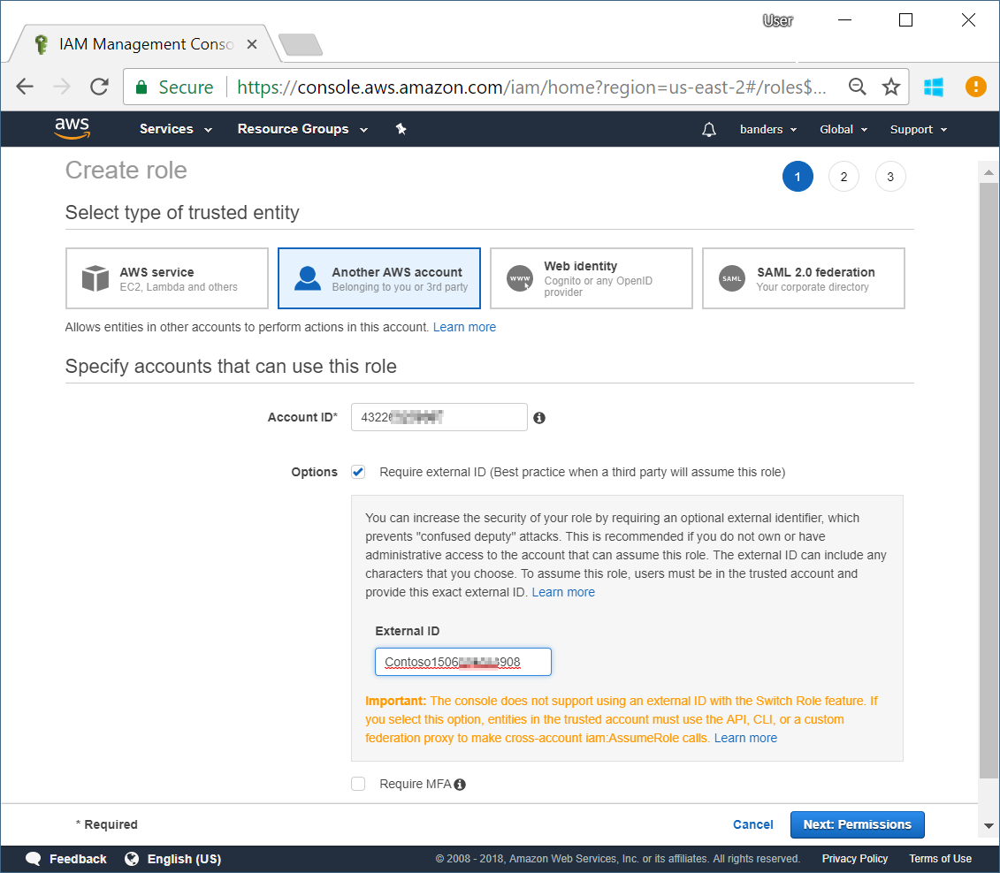
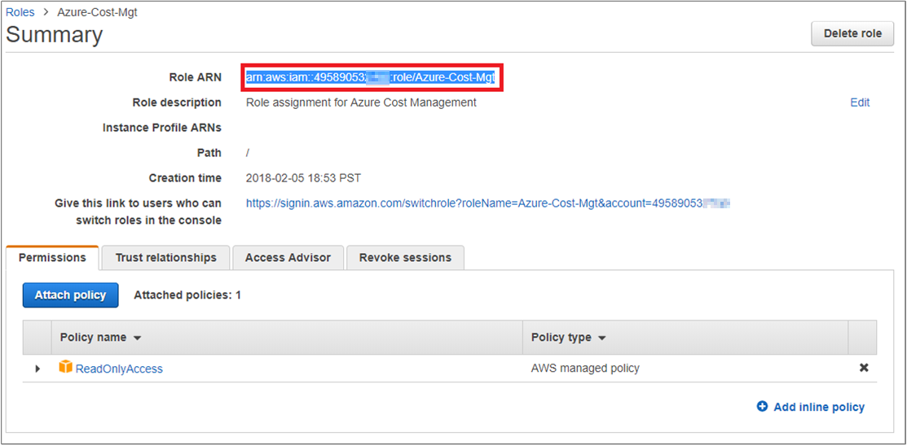
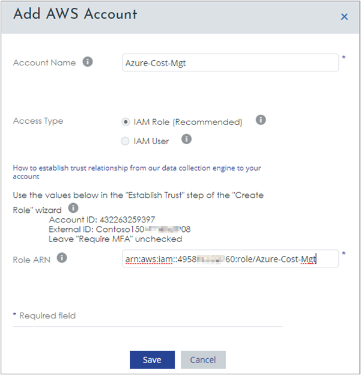
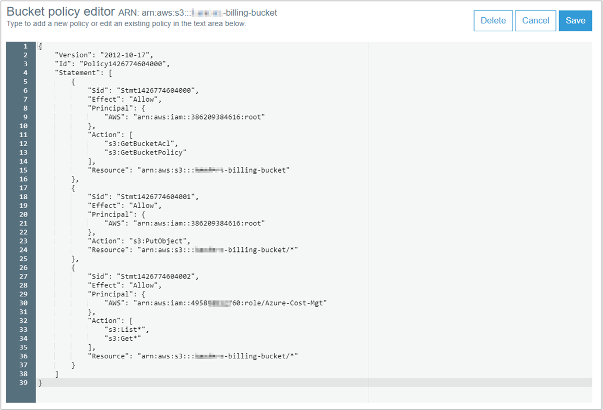
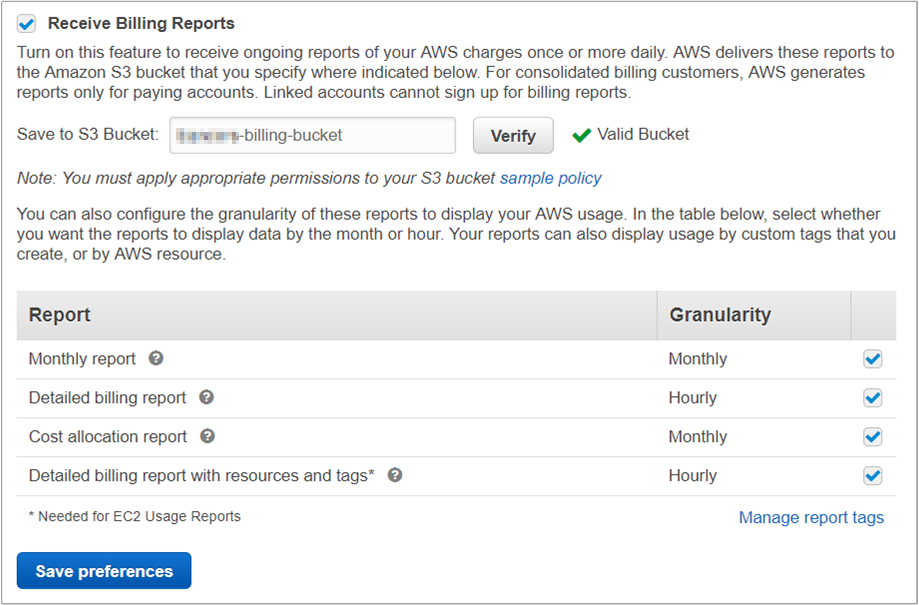

# Connect an Amazon Web Services account

You have two options to connect your Amazon Web Services (AWS) account to Cloudyn. You can connect with an IAM role or with a read-only IAM user account. The IAM role is recommended because it allows you to delegate access with defined permissions to trusted entities. The IAM role doesn't require you to share long-term access keys. After you connect an AWS account to Cloudyn, cost and usage data is available in Cloudyn reports. This document guides you through both options.

For more information about AWS IAM identities, see [Identities (Users, Groups, and Roles)](https://docs.aws.amazon.com/IAM/latest/UserGuide/id.html).

Also, you enable AWS detailed billing reports and store the information in an AWS simple storage service (S3) bucket. Detailed billing reports include billing charges with tag and resource information on an hourly basis. Storing the reports allows Cloudyn to retrieve them from your bucket and display the information in its reports.


## AWS role-based access

The following sections walk you through creating a read-only IAM role to provide access to Cloudyn.

### Get your Cloudyn account external ID

The first step is to get the unique connection passphrase from the Cloudyn portal. It is used in AWS as the **External ID**.

1. Open the Cloudyn portal from the Azure portal or navigate to  [https://azure.cloudyn.com](https://azure.cloudyn.com) and sign in.
2. Click the cog symbol and then select **Cloud Accounts**.
3. In Accounts Management, select the **AWS Accounts** tab and then click **Add new +**.
4. In the **Add AWS Account** dialog, copy the **External ID** and save the value for AWS Role creation steps in the next section. The External ID is unique to your account. In the following image, the example External ID is _Contoso_ followed by a number. Your ID differs.  
    

### Add AWS read-only role-based access

1. Sign in to the AWS console at https://console.aws.amazon.com/iam/home and select **Roles**.
2. Click **Create Role** and then select **Another AWS account**.
3. In the **Account ID** box, paste `432263259397`. This Account ID is the Cloudyn data collector account assigned by AWS to the Cloudyn service. Use the exact Account ID shown.
4. Next to **Options**, select **Require external ID**. Paste your unique value that copied previously from the **External ID** field in Cloudyn. Then click **Next: Permissions**.  
    
5. Under **Attach permissions policies**, in the **Policy type** filter box search, type `ReadOnlyAccess`, select **ReadOnlyAccess**, then click **Next: Review**.  
    
6. On the Review page, ensure your selections are correct and type a **Role name**. For example, *Azure-Cost-Mgt*. Enter a **Role description**. For example, _Role assignment for Cloudyn_, then click **Create role**.
7. In the **Roles** list, click the role you created and copy the **Role ARN** value from the Summary page. Use the Role ARN (Amazon Resource Name) value later when you register your configuration in Cloudyn.  
    

### Configure AWS IAM role access in Cloudyn

1. Open the Cloudyn portal from the Azure portal or navigate to  https://azure.cloudyn.com/ and sign in.
2. Click the cog symbol and then select **Cloud Accounts**.
3. In Accounts Management, select the **AWS Accounts** tab and then click **Add new +**.
4. In **Account Name**, type a name for the account.
5. Next to **Access Type**, select **IAM Role**.
6. In the **Role ARN** field, paste the value you previously copied and then click **Save**.  
    


Your AWS account appears in the list of accounts. The **Owner ID** listed matches your Role ARN value. Your **Account Status** should have a green check mark symbol indicating that Cloudyn can access your AWS account. Until you enable detailed AWS billing, your consolidation status appears as **Standalone**.


Cloudyn starts collecting the data and populating reports. Next, [enable detailed AWS billing](#enable-detailed-aws-billing).


## AWS user-based access

The following sections walk you through creating a read-only user to provide access to Cloudyn.

### Add AWS read-only user-based access

1. Sign in to the AWS console at https://console.aws.amazon.com/iam/home and select **Users**.
2. Click **Add User**.
3. In the **User name** field, type a user name.
4. For **Access type**, select **Programmatic access** and click **Next: Permissions**.  
    
5. For permissions, select **Attach existing policies directly**.
6. Under **Attach permissions policies**, in the **Policy type** filter box search, type `ReadOnlyAccess`, select **ReadOnlyAccess**, and then click **Next: Review**.  
    
7. On the Review page, ensure your selections are correct then click **Create user**.
8. On the Complete page, your Access key ID and Secret access key are shown. You use this information to configure registration in Cloudyn.
9. Click **Download .csv** and save the credentials.csv file to a secure location.  
    

### Configure AWS IAM user-based access in Cloudyn

1. Open the Cloudyn portal from the Azure portal or navigate to https://azure.cloudyn.com/ and sign in.
2. Click the cog symbol and then select **Cloud Accounts**.
3. In Accounts Management, select the **AWS Accounts** tab and then click **Add new +**.
4. For **Account Name**, type an account name.
5. Next to **Access Type**, select **IAM User**.
6. In **Access Key**, paste the **Access key ID** value from the credentials.csv file.
7. In **Secret Key**, paste the **Secret access key** value from the credentials.csv file and then click **Save**.  

Your AWS account appears in the list of accounts. Your **Account Status** should have a green check mark symbol.

Cloudyn starts collecting the data and populating reports. Next, [enable detailed AWS billing](#enable-detailed-aws-billing).

## Enable detailed AWS billing

Use the following steps to get your AWS Role ARN. You use the Role ARN to grant read permissions to a billing bucket.

1. Sign in to the AWS console at https://console.aws.amazon.com and select **Services**.
2. In the Service Search box type *IAM*, and select that option.
3. Select **Roles** from the left-hand menu.
4. In the list of Roles, select the role that you created for Cloudyn access.
5. On the Roles Summary page, click to copy the **Role ARN**. Keep the Role ARN handy for later steps.

### Create an S3 bucket

You create an S3 bucket to store detailed billing information.

1. Sign in to the AWS console at https://console.aws.amazon.com and select **Services**.
2. In the Service Search box type *S3*, and select **S3**.
3. On the Amazon S3 page, click **Create bucket**.
4. In the Create bucket wizard, choose a Bucket name and Region and then click **Next**.  
    
5. On the **Set properties** page, keep the default values, and then click **Next**.
6. On the Review page, click **Create bucket**. Your bucket list is displayed.
7. Click the bucket that you created and select the **Permissions** tab and then select **Bucket Policy**. The Bucket policy editor opens.
8. Copy the following JSON example and paste it in the Bucket policy editor.
   - Replace `<BillingBucketName>` with the name of your S3 bucket.
   - Replace `<ReadOnlyUserOrRole>` with the Role or User ARN that you had previously copied.

   ```json
   {
  	"Version": "2012-10-17",
  	"Id": "Policy1426774604000",
  	"Statement": [
  		{
  			"Sid": "Stmt1426774604000",
  			"Effect": "Allow",
  			"Principal": {
  				"AWS": "arn:aws:iam::386209384616:root"
  			},
  			"Action": [
  				"s3:GetBucketAcl",
  				"s3:GetBucketPolicy"
  			],
  			"Resource": "arn:aws:s3:::<BillingBucketName>"
  		},
  		{
  			"Sid": "Stmt1426774604001",
  			"Effect": "Allow",
  			"Principal": {
  				"AWS": "arn:aws:iam::386209384616:root"
  			},
  			"Action": "s3:PutObject",
  			"Resource": "arn:aws:s3:::<BillingBucketName>/*"
  		},
  		{
  			"Sid": "Stmt1426774604002",
  			"Effect": "Allow",
  			"Principal": {
  				"AWS": "<ReadOnlyUserOrRole>"
  			},
  			"Action": [
  				"s3:List*",
  				"s3:Get*"
  			],
  			"Resource": "arn:aws:s3:::<BillingBucketName>/*"
  		}
  	]
   }
   ```

9. Click **Save**.  
    


### Enable AWS billing reports

After you create and configure the S3 bucket, navigate to [Billing Preferences](https://console.aws.amazon.com/billing/home?#/preference) in the AWS console.

1. On the Preferences page, select **Receive Billing Reports**.
2. Under **Receive Billing Reports**, enter the name of the bucket that you created and then click **Verify**.  
3. Select all four report granularity options and then click **Save preferences**.  
    

Cloudyn retrieves detailed billing information from your S3 bucket and populates reports after detailed billing is enabled. It can take up to 24 hours until detailed billing data appears in the Cloudyn console. When detailed billing data is available, your account consolidation status appears as **Consolidated**. Account status appears as **Completed**.


Some of the optimization reports may require a few days of data to get an adequate data sample size for accurate recommendations.

## Next steps

- To learn more about Cloudyn, continue to the [Review usage and costs](tutorial-review-usage.md) tutorial for Cloudyn.
