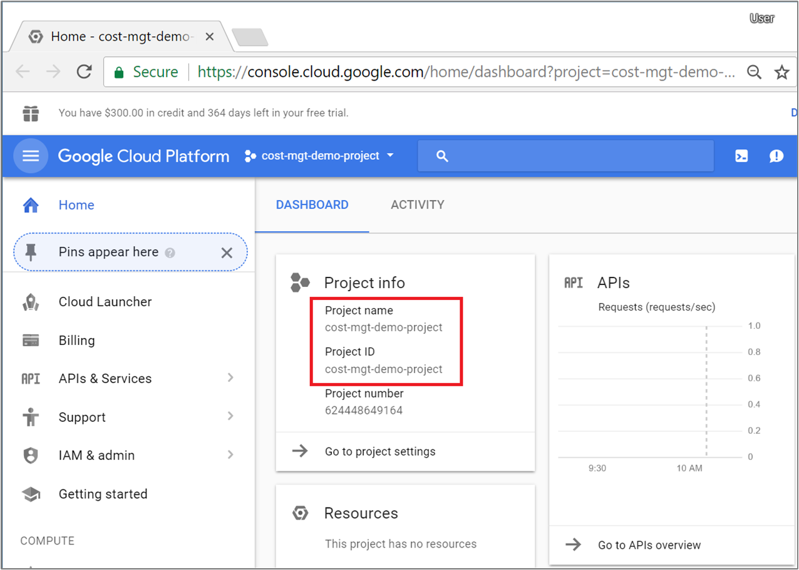
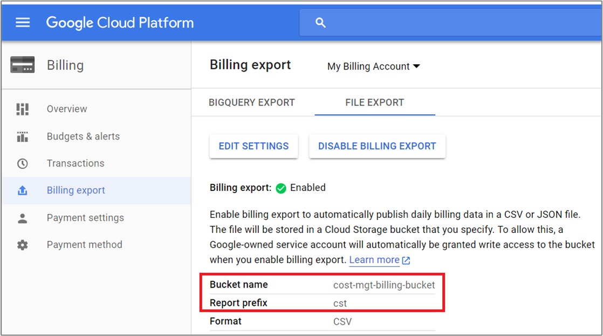
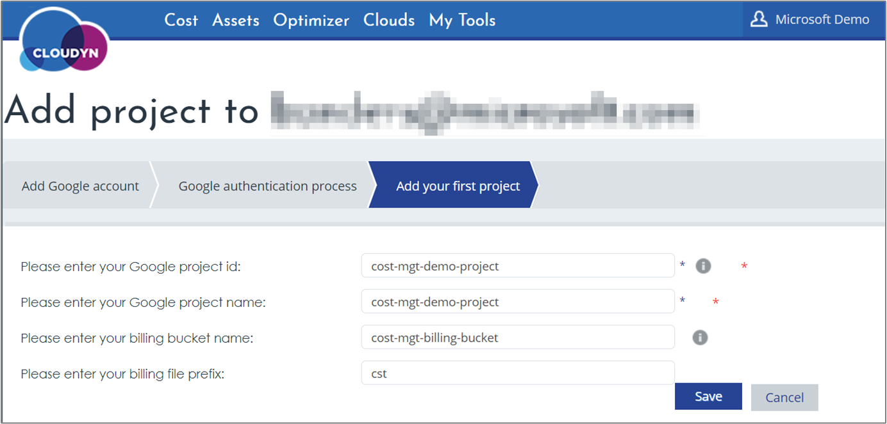

# Connect a Google Cloud Platform account

You can connect your existing Google Cloud Platform account to Cloudyn. After you connect your account to Cloudyn, cost and usage data is available in Cloudyn reports. This article helps you to configure and connect your Google account with Cloudyn.

[!INCLUDE [cloudyn-note](../../../includes/cloudyn-note.md)]

## Collect project information

You start by gathering information about your project.

1. Sign in to the Google Cloud Platform console at [https://console.cloud.google.com](https://console.cloud.google.com).
2. Review the project information that you want to onboard to Cloudyn and note the **Project name** and the **Project ID**. Keep the information handy for later steps.  
    
3. If billing is not enabled and linked to your project, create a billing account. For more information, see [Create a new billing account](https://cloud.google.com/billing/docs/how-to/manage-billing-account#create/_a/_new/_billing/_account).

## Enable storage bucket billing export

Cloudyn retrieves your Google billing data from a storage bucket. Keep the **Bucket name** and **Report prefix** information handy for later use during Cloudyn registration.

Using Google Cloud Storage to store usage reports incurs minimal fees. For more information, see [Cloud Storage Pricing](https://cloud.google.com/storage/pricing).

1. If you have not enabled billing export to a file, follow the instructions at [How to enable billing export to a file](https://cloud.google.com/billing/docs/how-to/export-data-file#how_to_enable_billing_export_to_a_file). You can use either JSON or CSV billing export format.
2. Otherwise, in the Google Cloud Platform console, navigate to **Billing** > **Billing export**. Note your billing **Bucket name** and **Report prefix**.  
    

## Enable Google Cloud Platform APIs

To collect usage and asset information, Cloudyn needs the following Google Cloud Platform APIs enabled:

- BigQuery API
- Google Cloud SQL
- Google Cloud Datastore API
- Google Cloud Storage
- Google Cloud Storage JSON API
- Google Compute Engine API

### Enable or verify APIs

1. In the Google Cloud Platform console, select the project that you want to register with Cloudyn.
2. Navigate to **APIs & Services** > **Library**.
3. Use search to find each previously listed API.
4. For each API, verify that **API enabled** is shown. Otherwise, click **ENABLE**.

## Add a Google Cloud account to Cloudyn

1. Open the Cloudyn portal from the Azure portal or navigate to [https://azure.cloudyn.com](https://azure.cloudyn.com/) and sign in.
2. Click **Settings** (cog symbol) and then select **Cloud Accounts**.
3. In **Accounts Management**, select the **Google Accounts** tab and then click **Add new +**.
4. In **Google Account Name**, enter the email address for the billing account then click **Next**.
5. In the Google authentication dialog, select or enter a Google account and then **ALLOW** cloudyn.com access to your account.
6. Add the request project information that you had previous noted. They include **Project ID**, **Project** name, **billing** bucket name, and **billing file** Report prefix then click **Save**.  
    

Your Google account appears in the list of accounts and it should say **Authenticated**. Under it, your Google project name and ID should appear and have a green check mark symbol. Account Status should say **Completed**.

Within a few hours, Cloudyn reports show Google cost and usage information.

## Next steps

- To learn more about Cloudyn, continue to the [Review usage and costs](tutorial-review-usage.md) tutorial for Cloudyn.
