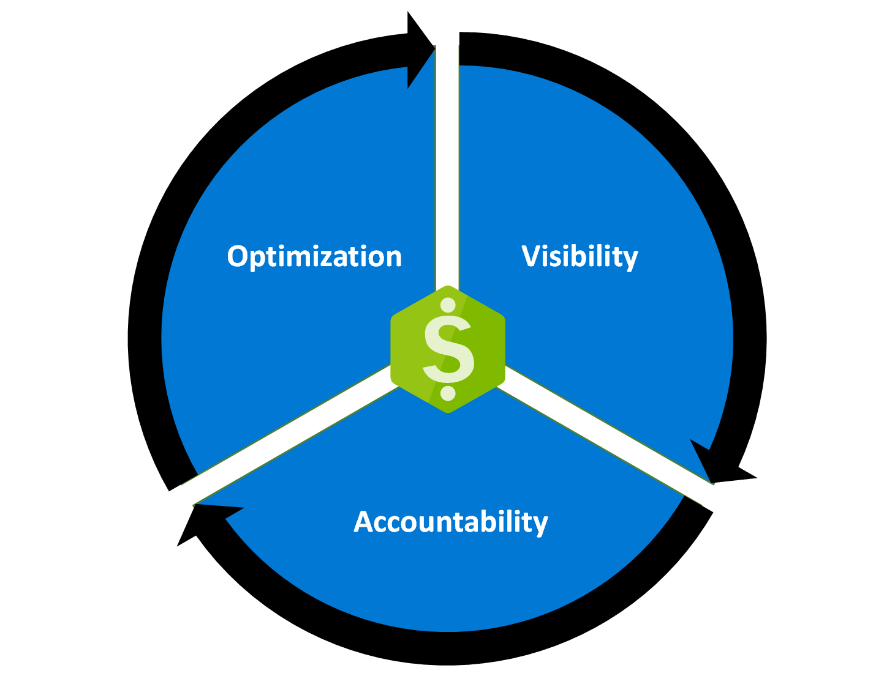

# What is Cost Management + Billing?

By using the Microsoft cloud, you can significantly improve the technical performance of your business workloads. It can also reduce your costs and the overhead required to manage organizational assets. However, the business opportunity creates a risk because of the potential for waste and inefficiencies that are introduced into your cloud deployments. Cost Management + Billing is a suite of tools provided by Microsoft that help you analyze, manage, and optimize the costs of your workloads. Using the suite helps ensure that your organization is taking advantage of the benefits provided by the cloud.

You can think of your Azure workloads like the lights in your home. When you leave to go out for the day, are you leaving the lights on? Could you use different bulbs that are more efficient to help reduce your monthly energy bill? Do you have more lights in one room than are needed? You can use Cost Management + Billing to apply a similar thought process to the workloads used by your organization.

With Azure products and services, you only pay for what you use. As you create and use Azure resources, you’re charged for the resources. Because of the deployment ease for new resources, the costs of your workloads can jump significantly without proper analysis and monitoring. You use Cost Management + Billing features to:

- Conduct billing administrative tasks such as paying your bill
- Manage billing access to costs
- Download cost and usage data that was used to generate your monthly invoice
- Proactively apply data analysis to your costs
- Set spending thresholds
- Identify opportunities for workload changes that can optimize your spending

To learn more about how to approach cost management as an organization, take a look at the [Cost Management best practices](./costs/cost-mgt-best-practices.md) article.

## Understand Azure Billing

Azure Billing features are used to review your invoiced costs and manage access to billing information. In larger organizations, procurement and finance teams usually conduct billing tasks.

A billing account is created when you sign up to use Azure. You use your billing account to manage your invoices, payments, and track costs. You can have access to multiple billing accounts. For example, you might have signed up for Azure for your personal projects. So, you might have an individual Azure subscription with a billing account. You could also have access through your organization's Enterprise Agreement or Microsoft Customer Agreement. For each scenario, you would have a separate billing account.

### Billing accounts

The Azure portal currently supports the following types of billing accounts:

- **Microsoft Online Services Program**: An individual billing account for a Microsoft Online Services Program is created when you sign up for Azure through the Azure website. For example, when you sign up for an [Azure Free Account](./manage/create-free-services.md), account with pay-as-you-go rates or as a Visual studio subscriber.

- **Enterprise Agreement**: A billing account for an Enterprise Agreement is created when your organization signs an Enterprise Agreement (EA) to use Azure.

- **Microsoft Customer Agreement**: A billing account for a Microsoft Customer Agreement is created when your organization works with a Microsoft representative to sign a Microsoft Customer Agreement. Some customers in select regions, who sign up through the Azure website for an account with pay-as-you-go rates or upgrade their [Azure Free Account](./manage/create-free-services.md) may have a billing account for a Microsoft Customer Agreement as well.

## Understand Cost Management

Although related, billing differs from cost management. Billing is the process of invoicing customers for goods or services and managing the commercial relationship.

Cost Management shows organizational cost and usage patterns with advanced analytics. Reports in Cost Management show the usage-based costs consumed by Azure services and third-party Marketplace offerings. Costs are based on negotiated prices and factor in reservation and Azure Hybrid Benefit discounts. Collectively, the reports show your internal and external costs for usage and Azure Marketplace charges. **Other charges, such as support and taxes aren't yet shown in reports**. The reports help you understand your spending and resource use and can help find spending anomalies. Predictive analytics are also available. Cost Management uses Azure management groups, budgets, and recommendations to show clearly how your expenses are organized and how you might reduce costs.

You can use the Azure portal or various APIs for export automation to integrate cost data with external systems and processes. Automated billing data export and scheduled reports are also available.

Watch the Cost Management overview video for a quick overview about how Cost Management can help you save money in Azure. To watch other videos, visit the [Cost Management YouTube channel](https://www.youtube.com/c/AzureCostManagement).

>[!VIDEO https://www.youtube.com/embed/el4yN5cHsJ0]

### Plan and control expenses

The ways that Cost Management help you plan for and control your costs include: Cost analysis, budgets, recommendations, and exporting cost management data.

You use cost analysis to explore and analyze your organizational costs. You can view aggregated costs by organization to understand where costs are accrued and to identify spending trends. And you can see accumulated costs over time to estimate monthly, quarterly, or even yearly cost trends against a budget.

Budgets help you plan for and meet financial accountability in your organization. They help prevent cost thresholds or limits from being surpassed. Budgets can also help you inform others about their spending to proactively manage costs. And with them, you can see how spending progresses over time.

Recommendations show how you can optimize and improve efficiency by identifying idle and underutilized resources. Or, they can show less expensive resource options. When you act on the recommendations, you change the way you use your resources to save money. To act, you first view cost optimization recommendations to view potential usage inefficiencies. Next, you act on a recommendation to modify your Azure resource use to a more cost-effective option. Then you verify the action to make sure that the change you make is successful.

If you use external systems to access or review cost management data, you can easily export the data from Azure. And you can set a daily scheduled export in CSV format and store the data files in Azure storage. Then, you can access the data from your external system.

### Additional Azure tools

Azure has other tools that aren't a part of the Cost Management + Billing feature set. However, they play an important role in the cost management process. To learn more about these tools, see the following links.

- [Azure Pricing Calculator](https://azure.microsoft.com/pricing/calculator/) - Use this tool to estimate your up-front cloud costs.
- [Azure Migrate](../migrate/migrate-services-overview.md) - Assess your current datacenter workload for insights about what's needed from an Azure replacement solution.
- [Azure Advisor](../advisor/advisor-overview.md) - Identify unused VMs and receive recommendations about Azure reserved instance purchases.
- [Azure Hybrid Benefit](https://azure.microsoft.com/pricing/hybrid-benefit/) - Use your current on-premises Windows Server or SQL Server licenses for VMs in Azure to save.

## Next steps

Now that you're familiar with Cost Management + Billing, the next step is to start using the service.

- Start using Cost Management to [analyze costs](./costs/quick-acm-cost-analysis.md).
- You can also read more about [Cost Management best practices](./costs/cost-mgt-best-practices.md).