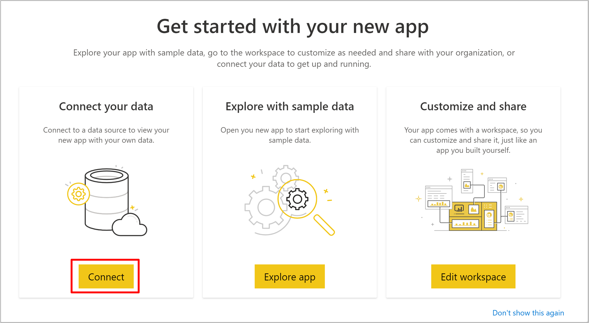
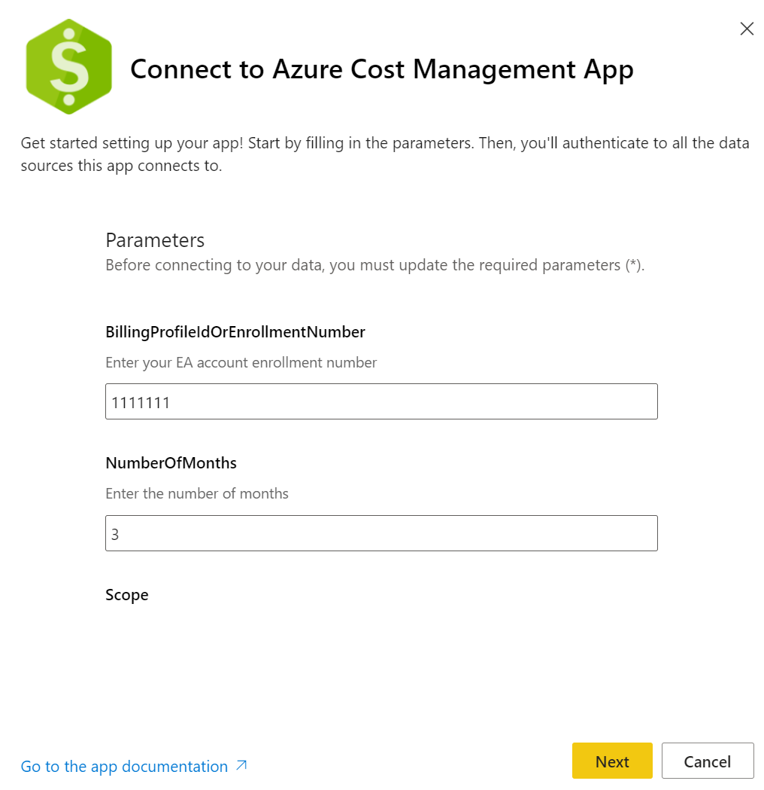
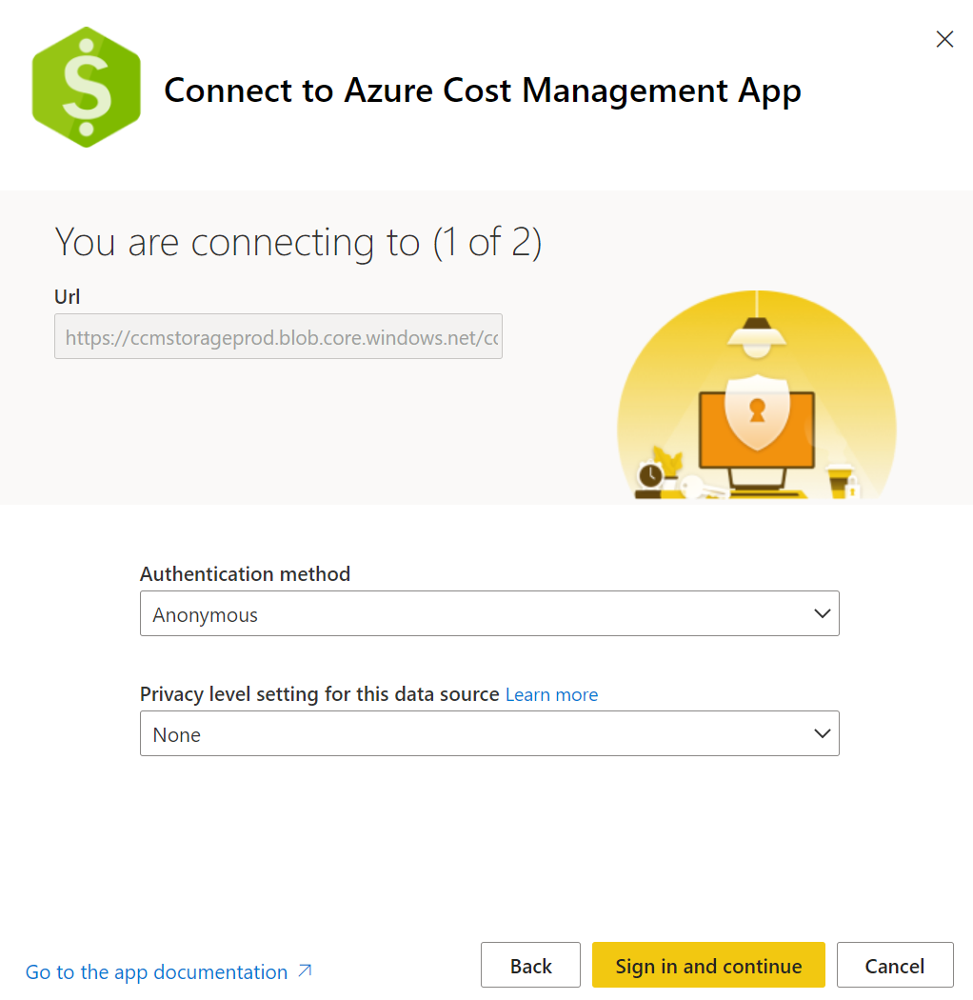
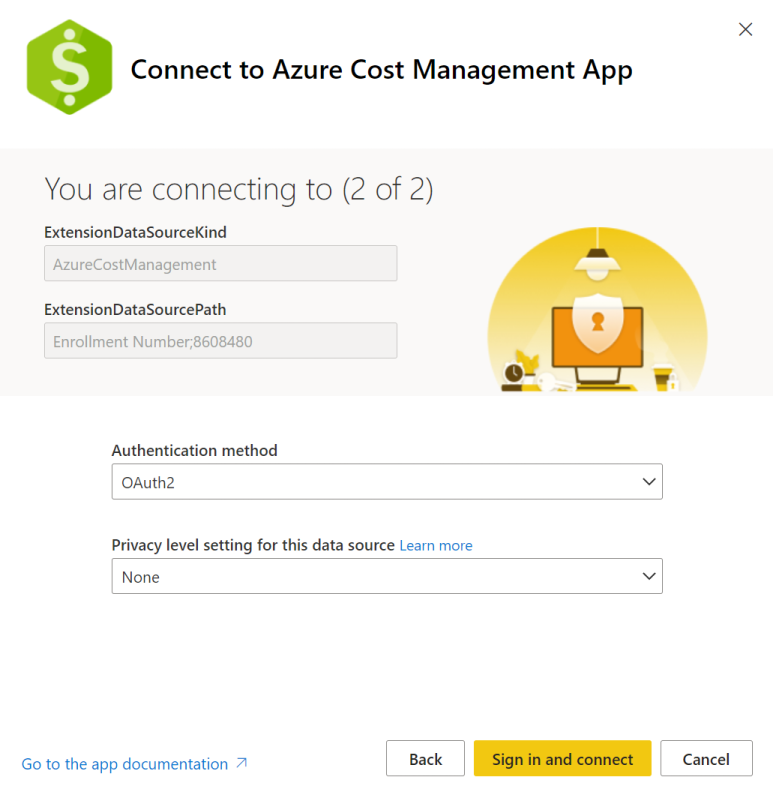
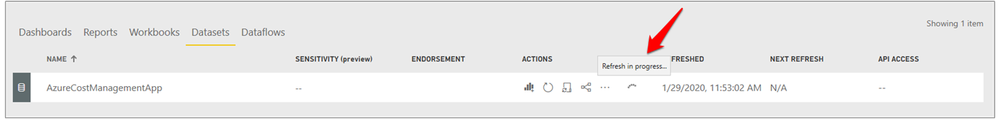
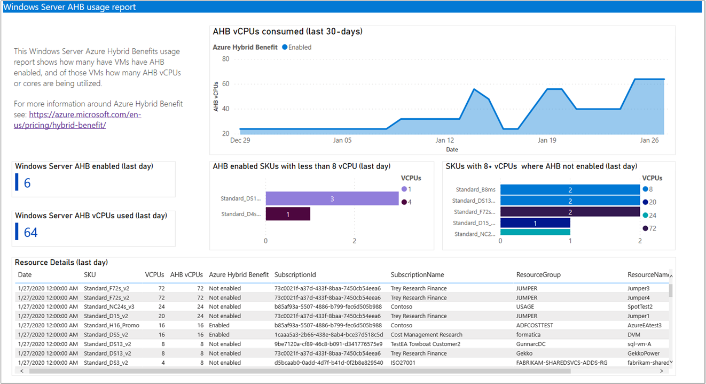
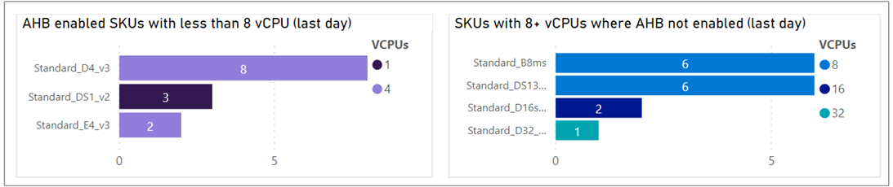
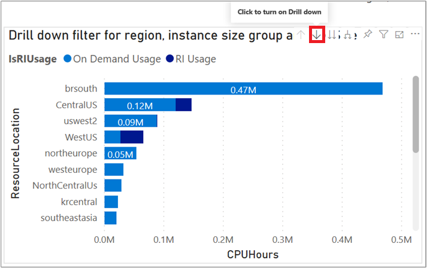
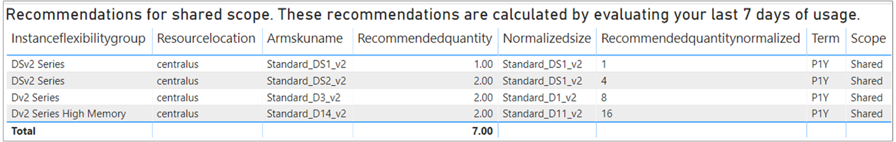
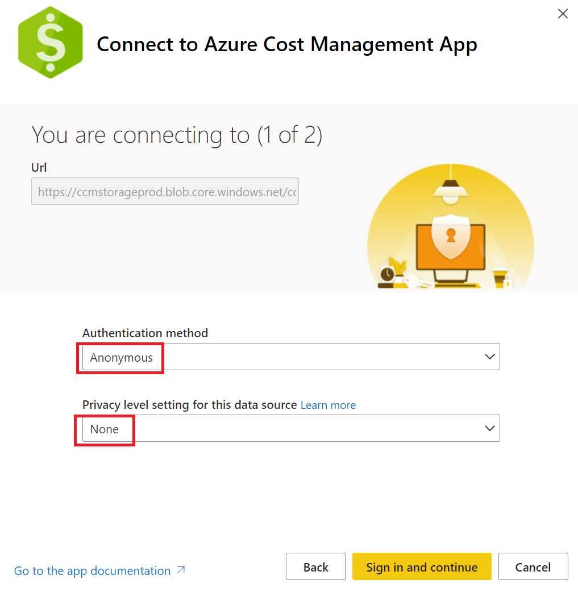

# Analyze cost with the Azure Cost Management Power BI App for Enterprise Agreements (EA)

This article explains how to install and use the Azure Cost Management Power BI app. The app helps you analyze and manage your Azure costs in Power BI. You can use the app to monitor costs, usage trends, and identify cost optimization options to reduce your expenditures.

You download the app into Power BI Desktop. You can use the app as-is, or you can modify it to extend the default filters, views, and visualizations to customize for your needs. Then, use it to join additional data to create customized reports to get holistic views of your overall business cost.

The Azure Cost Management Power BI App currently supports only customers with an [Enterprise Agreement](https://azure.microsoft.com/pricing/enterprise-agreement/).

## Prerequisites

- A [Power BI Pro license](/power-bi/service-self-service-signup-for-power-bi) to install and use the app
- To connect to data, you must use an [Enterprise Administrator](../manage/understand-ea-roles.md) account

## Installation steps

To install the app:

1. Open [Azure Cost Management Power BI App](https://aka.ms/costmgmt/ACMApp).
2. On the Power BI AppSource page, select **Get it now**.
3. Select **Continue** to agree to the terms of use and privacy policy.
4. In the **Install this Power BI app** box, select **Install**.
5. If needed, create a workspace and select **Continue**.
6. When installation completes, notification appears saying that your new app is ready.
7. Select **Go to app**.
8. In **Get started with your new app**, under **Connect your data**, select **Connect**.  
  
9. In the dialog that appears, enter your EA enrollment number for **BillingProfileIdOrEnrollmentNumber**. Specify the number of months of data to get. Leave the default **Scope** value of **Enrollment Number**, then select **Next**.  
    
10. The next dialog connects to Azure and gets data required for reserved instance recommendations. *Leave the default values as configured* and select **Sign in**.  
    
11. The final installation step connects to your EA enrollment and requires an [Enterprise Administrator](../manage/understand-ea-roles.md) account. Select **Sign in** to authenticate with your EA enrollment. This step also starts a data refresh action in Power BI.  
    
    > [!NOTE]
    > The data refresh process might take quite a while to complete. The length depends on the number of months specified and the amount of data needed to sync.
12. To check the data refresh status, select the **Datasets** tab in the workspace. Look next to the Refreshed timestamp. If it's still updating, you'll see an indicator showing that the refresh is in progress.  
  

After the data refresh is complete, select the Azure Cost Management App to view the pre-created reports.

## Reports available with the app

The following reports are available in the app.

**Getting Started** - Provides useful links to documentation and links to provide feedback.

**Account overview** - The report shows a monthly summary of information, including:

- Charges against credits
- New purchases
- Azure Marketplace charges
- Overages and total charges

**Usage by Subscriptions and Resource Groups** - Provides a cost over time view and charts showing cost by subscription and resource group.

**Usage by Services** - Provides a view over time of usage by MeterCategory. You can track your usage data and drill into any anomalies to understand usage spikes or dips.

**Top 5 Usage drivers** - The report shows a filtered cost summarization by the top 5 MeterCategory and corresponding MeterName.

**Windows Server AHB Usage** - The report shows the number virtual machines that have Azure Hybrid Benefit enabled. It also shows a count of cores/vCPUs used by the virtual machines.



The report also identifies Windows VMs where Hybrid Benefit is **enabled** but there are _less than_ 8 vCPUs. It also shows where Hybrid Benefit is **not enabled** that have 8 _or more_ vCPUs. This information helps you fully use your Hybrid Benefit. Apply the benefit to your most expensive virtual machines to maximize your potential savings.



**RI Chargeback** - The report helps you understand where and how much of a reserved instance (RI) benefit is applied per region, subscription, resource group, or resource. The report uses amortized usage data to show the view.

You can apply a filter on _chargetype_ to view RI underutilization data.

For more information about amortized data, see [Get Enterprise Agreement reservation costs and usage](/azure/cost-management-billing/reservations/understand-reserved-instance-usage-ea).

**RI Savings** - The report shows the savings accrued by reservations for subscription, resource group, and the resource level. It displays:

- Cost with reservation
- Estimated on-demand cost if the reservation didn't apply to the usage
- Cost savings accrued from the reservation

 The report subtracts any under-utilized reservation waste cost from the total savings. The waste wouldn't occur without a reservation.

You can use the amortized usage data to build on the data.

<a name="shared-recommendation"></a>
**VM RI Coverage (shared recommendation)** - The report is split between on-demand VM usage and RI VM usage over the selected period. It provides recommendations for VM RI purchases at a shared scope.

To use the report, select the drill-down filter.



Select the region that you want to analyze. Then select the instance size flexibility group, and so on.

For each drill-down level, the following filters are applied to the report:

- The coverage data on the right is the filter showing how much usage is charged using the on-demand rate vs. how much is covered by the reservation.
- Recommendations are also filtered.

The recommendations table provides recommendations for the reservation purchase, based on the VM sizes used.

The _Normalized Size_ and _Recommended Quantity Normalized_ values help you normalize the purchase to the smallest size for an instance size flexibility group. The information is helpful if you plan to purchase just one reservation for all sizes in the instance size flexibility group.



**VM RI Coverage (single recommendation)** - The report is split between on-demand VM usage and RI VM usage over the selected time period. It provides recommendations for VM RI purchases at a subscription scope.

For details about how to use the report, see the [VM RI Coverage (shared recommendation)](#shared-recommendation) section.

**RI purchases** - The report shows RI purchases over the specified period.

**Price sheet** - The report shows a detailed list of prices specific to a Billing account or EA enrollment.

## Troubleshoot problems

If you're having issues with the Power BI app, the following troubleshooting information might help.

### BudgetAmount error

You might get an error stating:

```
Something went wrong
There was an error when processing the data in the dataset.
Please try again later or contact support. If you contact support, please provide these details.
Data source error: The 'budgetAmount' column does not exist in the rowset. Table: Budgets.
```

#### Cause

This error occurs because of a bug with the underlying metadata. The issue happens because there's no budget available under **Cost Management > Budget** in the Azure portal. The bug fix is in the process of getting deployed to the Power BI Desktop and Power BI service. 

#### Solution

- Until the bug is fixed, you can work around the problem by adding a test budget in the Azure portal at the billing account/EA enrollment level. The test budget unblocks connecting with Power BI. For more information about creating a budget, see [Tutorial: Create and manage Azure budgets](tutorial-acm-create-budgets.md).


### Invalid credentials for AzureBlob error

You might get an error stating:

```
Failed to update data source credentials: The credentials provided for the AzureBlobs source are invalid.
```

#### Cause

This error occurs if you change the authentication method for the AutoFitComboMeter blob connection.

#### Solution

1. Connect to your data.
1. After you enter your EA enrollment and number of months, make sure that you leave the default value of **Anonymous** for Authentication method and **None** for the Privacy level setting.  
    
1. On the next page, set **OAuth2** for the Authentication method and **None** set for Privacy level. Then, sign in to authenticate with your enrollment. This step also starts a Power BI data refresh.


## Data reference

The following information summarizes the data available through the app. There's also links to APIs that give in-depth details for data fields and values.

| **Table reference** | **Description** |
| --- | --- |
| **AutoFitComboMeter** | Data included in the app to normalize the RI recommendation and usage to the smallest size in the instance family group. |
| [**Balance summary**](/rest/api/billing/enterprise/billing-enterprise-api-balance-summary#response) | Summary of the balance for Enterprise Agreements. |
| [**Budgets**](/rest/api/consumption/budgets/get#definitions) | Budget details to view actual costs or usage against existing budget targets. |
| [**Pricesheets**](/rest/api/billing/enterprise/billing-enterprise-api-pricesheet#see-also) | Applicable meter rates for the provided billing profile or EA enrollment. |
| [**RI charges**](/rest/api/billing/enterprise/billing-enterprise-api-reserved-instance-charges#response) | Charges associated to your reserved instances over the last 24 months. |
| [**RI recommendations (shared)**](/rest/api/billing/enterprise/billing-enterprise-api-reserved-instance-recommendation#response) | Reserved instance purchase recommendations based on all your subscription usage trends for the last 7, 30, or 60 days. |
| [**RI recommendations (single)**](/rest/api/billing/enterprise/billing-enterprise-api-reserved-instance-recommendation#response-1) | Reserved instance purchase recommendations based on your single subscription usage trends for the last 7, 30, or 60 days. |
| [**RI usage details**](/rest/api/billing/enterprise/billing-enterprise-api-reserved-instance-usage#response) | Consumption details for your existing reserved instances over the last month. |
| [**RI usage summary**](/rest/api/consumption/reservationssummaries/list) | Daily Azure reservation usage percentage. |
| [**Usage details**](/rest/api/billing/enterprise/billing-enterprise-api-usage-detail#usage-details-field-definitions) | A breakdown of consumed quantities and estimated charges for the given billing profile in the EA enrollment. |
| [**Usage details amortized**](/rest/api/billing/enterprise/billing-enterprise-api-usage-detail#usage-details-field-definitions) | A breakdown of consumed quantities and estimated amortized charges for the given billing profile in the EA enrollment. |

## Next steps

For more information about configuring data, refresh, sharing reports, and additional report customization see the following articles:

- [Configure scheduled refresh](/power-bi/refresh-scheduled-refresh)
- [Share Power BI dashboards and reports with coworkers and others](/power-bi/service-share-dashboards)
- [Subscribe yourself and others to reports and dashboards in the Power BI service](/power-bi/service-report-subscribe)
- [Download a report from the Power BI service to Power BI Desktop](/power-bi/service-export-to-pbix)
- [Save a report in Power BI service and Power BI Desktop](/power-bi/service-report-save)
- [Create a report in the Power BI service by importing a dataset](/power-bi/service-report-create-new)
