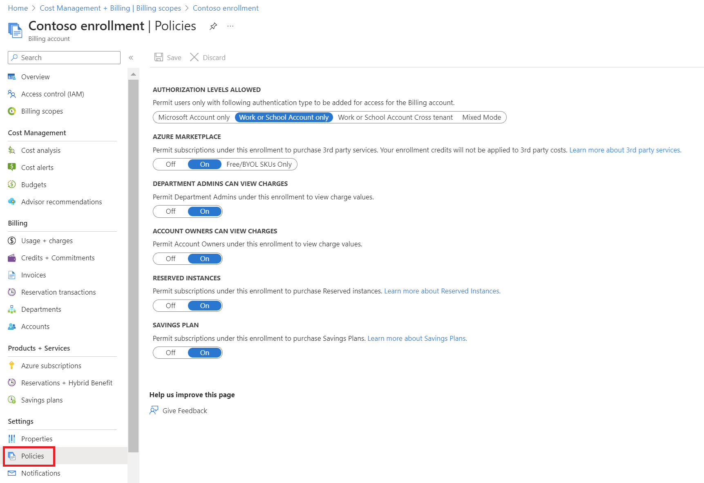
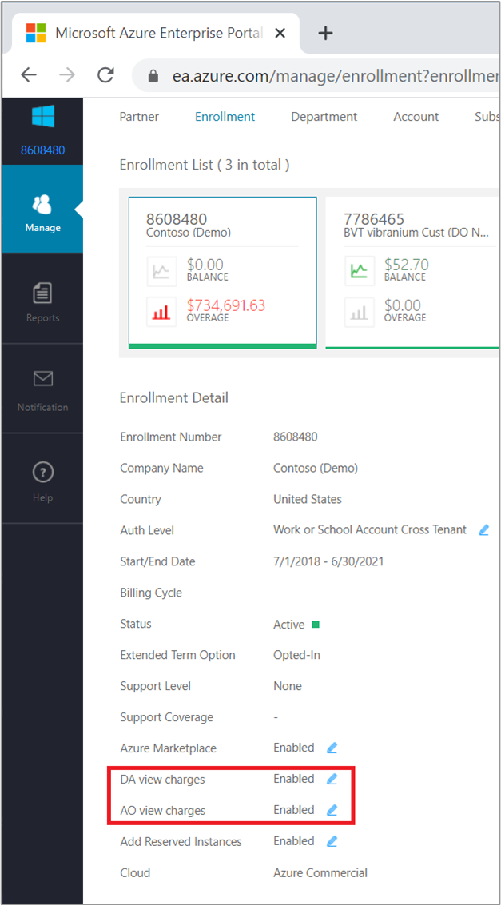
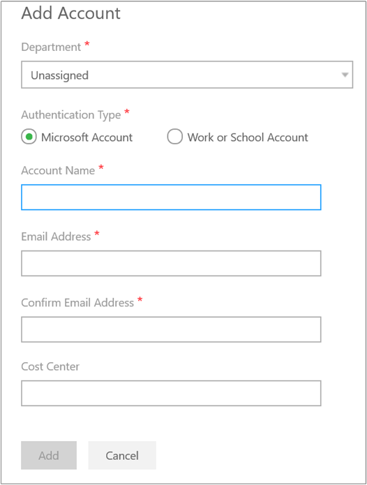

# Assign access to Cost Management data

For users with Azure Enterprise agreements, a combination of permissions granted in the Azure portal and the Enterprise (EA) portal define a user's level of access to Cost Management data. For users with other Azure account types, defining a user's level of access to Cost Management data is simpler by using Azure role-based access control (Azure RBAC). This article walks you through assigning access to Cost Management data. After the combination of permissions is assigned, the user views data in Cost Management based on their access scope and on the scope that they select in the Azure portal.

The scope that a user selects is used throughout Cost Management to provide data consolidation and to control access to cost information. When using scopes, users don't multi-select them. Instead, they select a larger scope that child scopes roll up to and then they filter-down to what they want to view. Data consolidation is important to understand because some people shouldn't access a parent scope that child scopes roll up to.

Watch the [Cost Management controlling access](https://www.youtube.com/watch?v=_uQzQ9puPyM) video to learn about assigning access to view costs and charges with Azure role-based access control (Azure RBAC). To watch other videos, visit the [Cost Management YouTube channel](https://www.youtube.com/c/AzureCostManagement).

>[!VIDEO https://www.youtube.com/embed/_uQzQ9puPyM]

## Cost Management scopes

Cost management supports a variety of Azure account types. To view the full list of supported account types, see [Understand Cost Management data](understand-cost-mgt-data.md). The type of account determines available scopes.

### Azure EA subscription scopes

To view cost data for Azure EA subscriptions, a user must have at least read access to one or more of the following scopes.

| **Scope** | **Defined at** | **Required access to view data** | **Prerequisite EA setting** | **Consolidates data to** |
| --- | --- | --- | --- | --- |
| Billing account¹ | [https://ea.azure.com](https://ea.azure.com/) | • Enterprise Admin  • Enrollment reader (Enterprise admin read-only) | None | All subscriptions from the enterprise agreement |
| Department | [https://ea.azure.com](https://ea.azure.com/) | Department Admin | **DA view charges** enabled | All subscriptions belonging to an enrollment account that is linked to the department |
| Enrollment account² | [https://ea.azure.com](https://ea.azure.com/) | Account Owner | **AO view charges** enabled | All subscriptions from the enrollment account |
| Management group | [https://portal.azure.com](https://portal.azure.com/) | Cost Management Reader (or Contributor) | **AO view charges** enabled | All subscriptions below the management group |
| Subscription | [https://portal.azure.com](https://portal.azure.com/) | Cost Management Reader (or Contributor) | **AO view charges** enabled | All resources/resource groups in the subscription |
| Resource group | [https://portal.azure.com](https://portal.azure.com/) | Cost Management Reader (or Contributor) | **AO view charges** enabled | All resources in the resource group |

¹ The billing account is also referred to as the Enterprise Agreement or Enrollment.

² The enrollment account is also referred to as the account owner.

Direct enterprise administrators can assign the billing account, department, and enrollment account scope the in the [Azure portal](https://portal.azure.com/). For more information, see [Azure portal administration for direct Enterprise Agreements](../manage/direct-ea-administration.md).

## Other Azure account scopes

To view cost data for other Azure subscriptions, a user must have at least read access to one or more of the following scopes:

- Management group
- Subscription
- Resource group

Various scopes are available after partners onboard customers to a Microsoft Customer Agreement. CSP customers can then use Cost Management features when enabled by their CSP partner. For more information, see [Get started with Cost Management for partners](get-started-partners.md).

## Enable access to costs in the Azure portal

The department scope requires the **Department admins can view charges** (DA view charges) option set to **On**. Configure the option in either the Azure portal or the EA portal. All other scopes require the **Account owners can view charges** (AO view charges) option set to **On**.

To enable an option in the Azure portal:

1. Sign in to the [Azure portal](https://portal.azure.com) with an enterprise administrator account.
1. Select the **Cost Management + Billing** menu item.
1. Select **Billing scopes** to view a list of available billing scopes and billing accounts.
1. Select your **Billing Account** from the list of available billing accounts.
1. Under **Settings**, select the **Policies** menu item and then configure the setting.  
    

After the view charge options are enabled, most scopes also require Azure role-based access control (Azure RBAC) permission configuration in the Azure portal.

## Enable access to costs in the EA portal

> [!NOTE]
> The information in the section applies only to users that have an Enterprise Agreement with a Microsoft partner (indirect EA).

The department scope requires the **DA view charges** option **Enabled** in the EA portal. Configure the option in either the Azure portal or the EA portal. All other scopes require the **AO view charges** option **Enabled** in the EA portal.

To enable an option in the EA portal:

1. Sign in to the EA portal at [https://ea.azure.com](https://ea.azure.com) with an enterprise administrator account.
2. Select **Manage** in the left pane.
3. For the cost management scopes that you want to provide access to, enable the charge option to **DA view charges** and/or **AO view charges**.  
    

After the view charge options are enabled, most scopes also require Azure role-based access control (Azure RBAC) permission configuration in the Azure portal.

## Enterprise administrator role

By default, an enterprise administrator can access the billing account (Enterprise Agreement/enrollment) and all other scopes, which are child scopes. The enterprise administrator assigns access to scopes for other users. As a best practice for business continuity, you should always have two users with enterprise administrator access. The following sections are walk-through examples of the enterprise administrator assigning access to scopes for other users.

## Assign billing account scope access

Access to the billing account scope requires enterprise administrator permission in the EA portal. The enterprise administrator can view costs across the entire EA enrollment or multiple enrollments. No action is required in the Azure portal for the billing account scope.

1. Sign in to the EA portal at [https://ea.azure.com](https://ea.azure.com) with an enterprise administrator account.
2. Select **Manage** in the left pane.
3. On the **Enrollment** tab, select the enrollment that you want to manage.  
    
4. Select **+ Add Administrator**.
5. In the Add Administrator box, select the authentication type and type the user's email address.
6. If the user should have read-only access to cost and usage data, under **Read-only**, select **Yes**.  Otherwise, select **No**.
7. Select **Add** to create the account.  
    

It may take up to 30 minutes before the new user can access data in Cost Management.

### Assign department scope access

Access to the department scope requires department administrator (DA view charges) access in the EA portal. The department administrator can view costs and usage data associated with a department or to multiple departments. Data for the department includes all subscriptions belonging to an enrollment account that are linked to the department. No action is required in the Azure portal.

1. Sign in to the EA portal at [https://ea.azure.com](https://ea.azure.com) with an enterprise administrator account.
2. Select **Manage** in the left pane.
3. On the **Enrollment** tab, select the enrollment that you want to manage.
4. Select the **Department** tab and then select **Add Administrator**.
5. In the Add Department Administrator box, select the authentication type and then type the user's email address.
6. If the user should have read-only access to cost and usage data, under **Read-only**, select **Yes**.  Otherwise, select **No**.
7. Select the departments that you want to grant department administrative permission to.
8. Select **Add** to create the account.  
    
    
Direct enterprise administrators can assign department administrator access in the Azure portal. For more information, see [Add a department administrator in the Azure portal](../manage/direct-ea-administration.md#add-a-department-administrator).

## Assign enrollment account scope access

Access to the enrollment account scope requires account owner (AO view charges) access in the EA portal. The account owner can view costs and usage data associated with the subscriptions created from that enrollment account. No action is required in the Azure portal.

1. Sign in to the EA portal at [https://ea.azure.com](https://ea.azure.com) with an enterprise administrator account.
2. Select **Manage** in the left pane.
3. On the **Enrollment** tab, select the enrollment that you want to manage.
4. Select the **Account** tab and then select **Add Account**.
5. In the Add Account box, select the **Department** to associate the account to, or leave it as unassigned.
6. Select the authentication type and type the account name.
7. Type the user's email address and then optionally type the cost center.
8. Select on **Add** to create the account.  
    

After completing the steps above, the user account becomes an enrollment account in the Enterprise portal and can create subscriptions. The user can access cost and usage data for subscriptions that they create.

Direct enterprise administrators can assign account owner access in the Azure portal. For more information, see [Add an account owner in the Azure portal](../manage/direct-ea-administration.md#add-an-account-and-account-owner).

## Assign management group scope access

Access to view the management group scope requires at least the Cost Management Reader (or Reader) permission. You can configure permissions for a management group in the Azure portal. You must have at least the User Access Administrator (or Owner) permission for the management group to enable access for others. And for Azure EA accounts, you must also have enabled the **AO view charges** setting in the EA portal.

- Assign the Cost Management Reader (or reader) role to a user at the management group scope.  
     For detailed steps, see [Assign Azure roles using the Azure portal](../../role-based-access-control/role-assignments-portal.md).

## Assign subscription scope access

Access to a subscription requires at least the Cost Management Reader (or Reader) permission. You can configure permissions to a subscription in the Azure portal. You must have at least the User Access Administrator (or Owner) permission for the subscription to enable access for others. And for Azure EA accounts, you must also have enabled the **AO view charges** setting in the EA portal.

- Assign the Cost Management Reader (or reader) role to a user at the subscription scope.  
     For detailed steps, see [Assign Azure roles using the Azure portal](../../role-based-access-control/role-assignments-portal.md).

## Assign resource group scope access

Access to a resource group requires at least the Cost Management Reader (or Reader) permission. You can configure permissions to a resource group in the Azure portal. You must have at least the User Access Administrator (or Owner) permission for the resource group to enable access for others. And for Azure EA accounts, you must also have enabled the **AO view charges** setting in the EA portal.

- Assign the Cost Management Reader (or reader) role to a user at the resource group scope.  
     For detailed steps, see [Assign Azure roles using the Azure portal](../../role-based-access-control/role-assignments-portal.md).

## Cross-tenant authentication issues

Currently, Cost Management has limited support for cross-tenant authentication. In some circumstances when you try to authenticate across tenants, you may receive an **Access denied** error in cost analysis. This issue might occur if you configure Azure role-based access control (Azure RBAC) to another tenant's subscription and then try to view cost data.

*To work around the problem*: After you configure cross-tenant Azure RBAC, wait an hour. Then, try to view costs in cost analysis or grant Cost Management access to users in both tenants.  

## Next steps

- If you haven't already completed the first quickstart for Cost Management, read it at [Start analyzing costs](quick-acm-cost-analysis.md).
