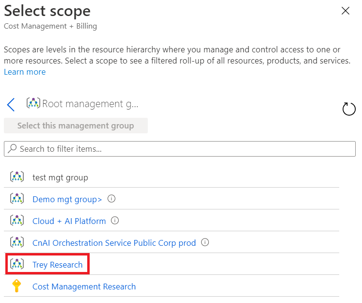
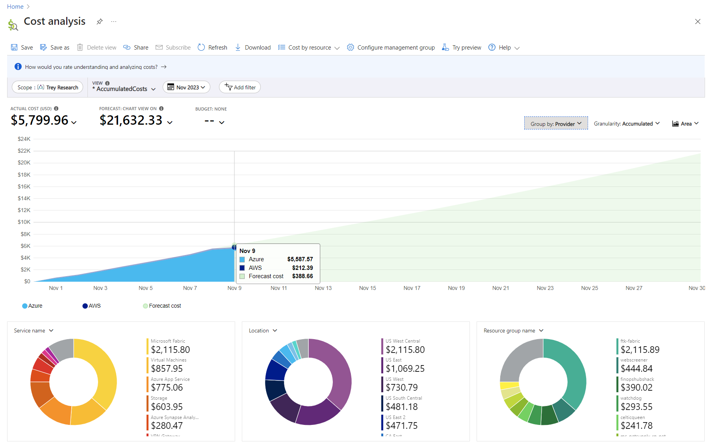
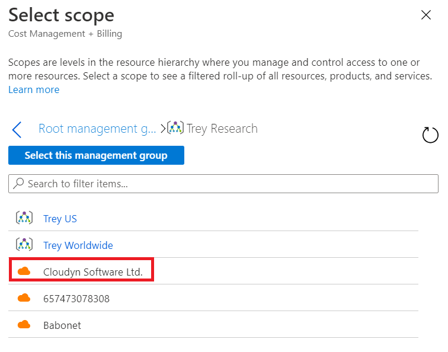
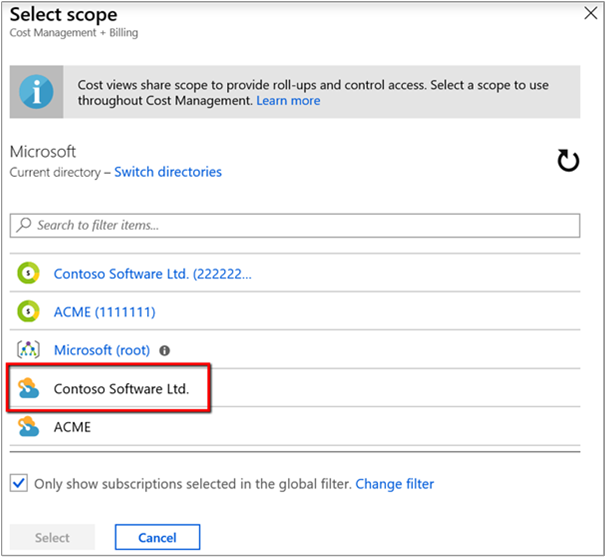
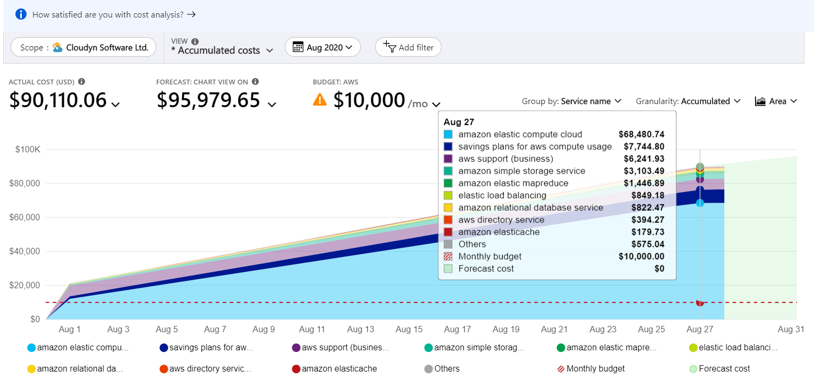
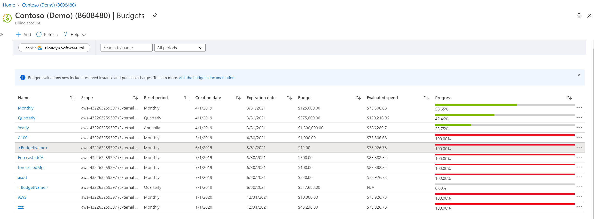

# Manage AWS costs and usage in Azure

After you've set up and configured AWS Cost and Usage report integration for Azure Cost Management, you're ready to start managing your AWS costs and usage. This article helps you understand how to use cost analysis and budgets in Cost Management to manage your AWS costs and usage.

If you haven't already configured the integration, see [Set up and configure AWS Usage report integration](aws-integration-set-up-configure.md).

_Before you begin_: If you're unfamiliar with cost analysis, see the [Explore and analyze costs with Cost analysis](quick-acm-cost-analysis.md) quickstart. And, if you're unfamiliar with budgets in Azure, see the [Create and manage Azure budgets](tutorial-acm-create-budgets.md) tutorial.

## View AWS costs in cost analysis

AWS costs are available in Cost Analysis in the following scopes:

- AWS linked accounts under a management group
- AWS linked account costs
- AWS consolidated account costs

The next sections describe how to use the scopes so that you see cost and usage data for each one.

### View AWS linked accounts under a management group

Viewing costs by using the management group scope is the only way to see aggregated costs coming from different subscriptions and linked accounts. Using a management group provides a cross-cloud view.

In cost analysis, open the scope picker and select the management group that holds your AWS linked accounts. Here's an example image in the Azure portal:

Here's an example showing the management group cost in cost analysis, grouped by Provider (Azure and AWS).

### View AWS linked account costs

To view AWS link account costs, open the scope picker and select the AWS linked account. Note that linked accounts are associated to a management group, as defined in the AWS connector.

Here's an example that shows selecting an AWS linked account scope.

### View AWS consolidated account costs

To view AWS consolidated account costs, open the scope picker and select the AWS consolidated account. Here's an example that shows selecting an AWS consolidated account scope.

This scope provides an aggregated view of all AWS linked accounts associated with the AWS consolidated account. Here's an example showing costs for an AWS consolidated account, grouped by service name.

### Dimensions available for filtering and grouping

The following table describes dimensions available to group and filter by in cost analysis.

| Dimension | Amazon CUR header | Scopes | Comments |
| --- | --- | --- | --- |
| Availability zone | lineitem/AvailabilityZone | All |   |
| Location | product/Region | All |   |
| Meter |   | All |   |
| Meter category | lineItem/ProductCode | All |   |
| Meter subcategory | lineitem/UsageType | All |   |
| Operation | lineItem/Operation | All |   |
| Resource | lineItem/ResourceId | All |   |
| Resource type | product/instanceType | All | If product/instanceType is null, lineItem/UsageType is used. |
| ResourceGuid | N/A | All | Azure meter GUID. |
| Service name | product/ProductName | All | If product/ProductName is null, lineItem/ProductCode is used. |
| Service tier |   |   |   |
| Subscription ID | lineItem/UsageAccountId | Consolidated account and management group |   |
| Subscription name | N/A | Consolidated account and management group | Account names are collected using the AWS Organization API. |
| Tag | resourceTags/\* | All | The _user:_ prefix is removed from user-defined tags to allow cross-cloud tags. The _aws:_ prefix is left intact. |
| Billing account ID | bill/PayerAccountId | Management group |   |
| Billing account name | N/A | Management group | Account names are collected using the AWS Organization API. |
| Provider | N/A | Management group | Either AWS or Azure. |

## Set budgets on AWS scopes

Use budgets to proactively manage costs and drive accountability in your organization. Budgets are set on the AWS consolidated account and AWS linked account scopes. Here's an example of budgets for an AWS consolidated account shown in Cost Management:

## AWS data collection process

After setting up the AWS connector, data collection and discovery processes start. It might take few hours to collect all usage data. The duration depends on:

- The time needed to process the CUR files that are in the AWS S3 bucket.
- The time needed to create the AWS Consolidated account and AWS Linked account scopes.
- The time and frequency of AWS are writing the Cost and Usage Report files in the S3 bucket

## AWS integration pricing

Each AWS connector gets 90 free trial days. During Public Preview, there is no charge.

The list price is 1% of your AWS monthly costs. Each month you are charged based on your invoiced costs from the previous month.

Accessing AWS APIs may incur additional costs.

## AWS integration limitations

- Cost Management doesn't support cost reports that contain multiple currency types. An error message is shown if you select a scope that has multiple currencies.
- Cloud connectors don't support AWS GovCloud (US), AWS Gov, or AWS China.
- Cost Management shows AWS _usage costs_ only. Tax, support, refunds, RI, credits or any other charge types aren't supported yet.

## Troubleshooting AWS integration

Use the following troubleshooting information to resolve common problems.

### No permission to AWS Linked accounts

**Error code:** _Unauthorized_

There are two ways to get permissions to access AWS linked accounts costs:

- Get access to the management group that has the AWS Linked accounts.
- Have someone give you permission to the AWS linked account.

By default, the AWS connector creator is the owner of all the objects that the connector created. Including, the AWS consolidated account and the AWS linked account.

In order to be able to Verify the connector settings you will need at least a contributor role, reader can not Verify connector settings

### Collection failed with AssumeRole

**Error code:** _FailedToAssumeRole_

This error means that Cost Management is unable to call the AWS AssumeRole API. This problem can happen because of an issue with the role definition. Verify that the following conditions are true:

- The external ID is the same as the one in the role definition and the connector definition.
- The role type is set to **Another AWS account Belonging to you or 3rd party.**
- The **Require MFA** choice is cleared.
- The trusted AWS account in the AWS Role is _432263259397_.

### Collection failed with Access Denied - CUR report definitions

**Error code:** _AccessDeniedReportDefinitions_

This error means that Cost Management is unable to see the Cost and Usage report definitions. This permission is used to validate that the CUR is defined as expected by Azure Cost Management. See [Create a Cost and Usage report in AWS](aws-integration-set-up-configure.md#create-a-cost-and-usage-report-in-aws).

### Collection failed with Access Denied - List reports

**Error code:** _AccessDeniedListReports_

This error means that Cost Management is unable to list the object in the S3 bucket where the CUR is located. AWS IAM policy requires a permission on the bucket and on the objects in the bucket. See [Create a role and policy in AWS](aws-integration-set-up-configure.md#create-a-role-and-policy-in-aws).

### Collection failed with Access Denied - Download report

**Error code:** _AccessDeniedDownloadReport_

This error means that Cost Management is unable to access and download the CUR files stored in the Amazon S3 bucket. Make sure that the AWS JSON policy attached to the role resembles the example shown at the bottom of the [Create a role and policy in AWS](aws-integration-set-up-configure.md#create-a-role-and-policy-in-aws) section.

### Collection failed since we did not find the Cost and Usage Report

**Error code:** _FailedToFindReport_

This error means that Cost Management can't find the Cost and Usage report that was defined in the connector. Make sure it isn't deleted and that the AWS JSON policy attached to the role resembles the example shown at the bottom of the [Create a role and policy in AWS](aws-integration-set-up-configure.md#create-a-role-and-policy-in-aws) section.

### Unable to create or verify connector due to Cost and Usage Report definitions mismatch

**Error code:** _ReportIsNotValid_

This error relates to the definition of AWS Cost and Usage Report, we require specific settings for this report, see the requirements in [Create a Cost and Usage report in AWS](aws-integration-set-up-configure.md#create-a-cost-and-usage-report-in-aws)

## Next steps

- If you haven't already configured your Azure environment with management groups, see [Initial setup of management groups](../../governance/management-groups/overview.md#initial-setup-of-management-groups).
