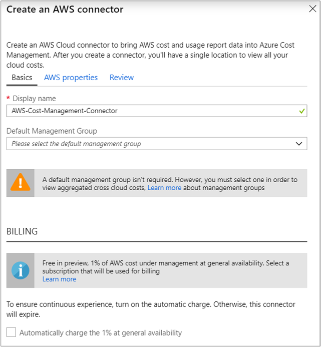
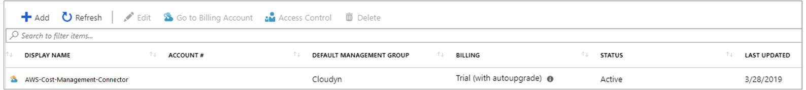
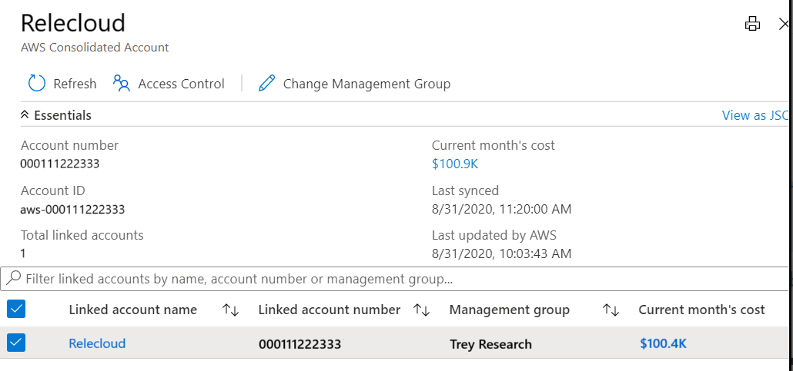
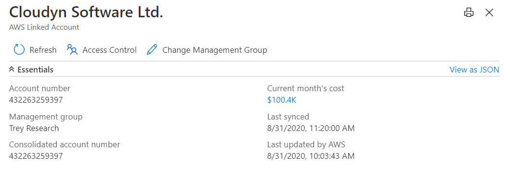

# Set up and configure AWS Cost and Usage report integration

With Amazon Web Services (AWS) Cost and Usage report (CUR) integration, you monitor and control your AWS spending in Azure Cost Management. The integration allows a single location in the Azure portal where you monitor and control spending for both Azure and AWS. This article explains how to set up the integration and configure it so that you can use Azure Cost Management features to analyze costs and review budgets.

Cost Management processes the AWS Cost and Usage report stored in an S3 bucket by using your AWS access credentials to get report definitions and download report GZIP CSV files.

Watch the video [How to set up Connectors for AWS in Cost Management](https://www.youtube.com/watch?v=Jg5KC1cx5cA) to learn more about how to set up AWS report integration. To watch other videos, visit the [Cost Management YouTube channel](https://www.youtube.com/c/AzureCostManagement).

>[!VIDEO https://www.youtube.com/embed/Jg5KC1cx5cA]

## Create a Cost and Usage report in AWS

Using a Cost and Usage report is the AWS-recommended way to collect and process AWS costs. For more information, see the [AWS Cost and Usage Report](https://docs.aws.amazon.com/awsaccountbilling/latest/aboutv2/billing-reports-costusage.html) documentation.

Use the **Cost & Usage Reports** page of the Billing and Cost Management console in AWS to create a Cost and Usage report with the following steps:

1. Sign in to the AWS Management Console and open the [Billing and Cost Management console](https://console.aws.amazon.com/billing).
2. In the navigation pane, select **Cost & Usage Reports**.
3. Select **Create report**.
4. For **Report name**, enter a name for your report.
5. Under **Additional report details**, select **Include resource IDs**.
6. For **Data refresh settings**, select whether you want the AWS Cost and Usage report to refresh if AWS applies refunds, credits, or support fees to your account after finalizing your bill. When a report refreshes, a new report is uploaded to Amazon S3. We recommend that you leave the setting selected.
7. Select **Next**.
8. For **S3 bucket**, choose **Configure**.
9. In the Configure S3 Bucket dialog box, do one of the following tasks:
    1. Select an existing bucket from the drop-down list and choose **Next**.
    2. Enter a bucket name and the Region where you want to create a new bucket and choose **Next**.
10.    Select **I have confirmed that this policy is correct**, then click **Save**.
11.    (Optional) For Report path prefix, enter the report path prefix that you want prepended to the name of your report.
If you don't specify a prefix, the default prefix is the name that you specified for the report. The date range has the `/report-name/date-range/` format.
12. For **Time unit**, choose  **Hourly**.
13.    For **Report versioning**, choose whether you want each version of the report to overwrite the previous version, or if you want additional new reports.
14. For **Enable data integration for**, no selection is required.
15. For **Compression**, select **GZIP**.
16. Select **Next**.
17. After you've reviewed the settings for your report, select **Review and Complete**.

    Note the report name. You'll use it in later steps.

It can take up to 24 hours for AWS to start delivering reports to your Amazon S3 bucket. After delivery starts, AWS updates the AWS Cost and Usage report files at least once a day. You can continue configuring your AWS environment without waiting for delivery to start.

## Create a role and policy in AWS

Azure Cost Management accesses the S3 bucket where the Cost and Usage report is located several times a day. The service needs access to credentials to check for new data. You create a role and policy in AWS to allow Cost Management to access it.

To enable role-based access to an AWS account in Cost Management, the role is created in the AWS console. You need to have the _role ARN_ and _external ID_ from the AWS console. Later, you use them on the **Create an AWS connector** page in Cost Management.

Use the Create a New Role wizard:

1. Sign in to your AWS console and select **Services**.
2. In the list of services, select **IAM**.
3. Select **Roles** and then select **Create Role**.
4. On the next page, select **Another AWS account**.
5. In **Account ID**, enter **432263259397**.
6. In **Options**, select **Require external ID (Best practice when a third party will assume this role)**.
7. In **External ID**, enter the external ID which is a shared passcode between the AWS role and Azure Cost Management. The same external ID is also used on the **New Connector** page in Cost Management. Microsoft recommends that you use a strong passcode policy when entering the external ID.

    > [!NOTE]
    > Don't change the selection for **Require MFA**. It should remain cleared.
8. Select **Next: Permissions**.
9. Select **Create policy**. A new browser tab opens. That's where you create a policy.
10. Select **Choose a service**.

Configure permission for the Cost and Usage report:

1. Enter **Cost and Usage Report**.
2. Select **Access level** > **Read** > **DescribeReportDefinitions**. This step allows Cost Management to read what CUR reports are defined and determine if they match the report definition prerequisite.
3. Select **Add additional permissions**.

Configure permission for your S3 bucket and objects:

1. Select **Choose a service**.
2. Enter **S3**.
3. Select **Access level** > **List** > **ListBucket**. This action gets the list of objects in the S3 Bucket.
4. Select **Access level** > **Read** > **GetObject**. This action allows the download of billing files.
5. Select **Resources**.
6. Select **bucket – Add ARN**.
7. In **Bucket name**, enter the bucket used to store the CUR files.
8. Select **object – Add ARN**.
9. In **Bucket name**, enter the bucket used to store the CUR files.
10. In **Object name**, select **Any**.
11. Select **Add additional permissions**.

Configure permission for Cost Explorer:

1. Select **Choose a service**.
2. Enter **Cost Explorer Service**.
3. Select **All Cost Explorer Service actions (ce:\*)**. This action validates that the collection is correct.
4. Select **Add additional permissions**.

Add permission for AWS Organizations:

1. Enter **Organizations**.
2. Select **Access level** > **List** > **ListAccounts**. This action gets the names of the accounts.
3. In **Review Policy**, enter a name for the new policy. Check that you entered the correct information, and then select **Create Policy**.
4. Go back to the previous tab and refresh your browser's webpage. On the search bar, search for your new policy.
5. Select **Next: Review**.
6. Enter a name for the new role. Check that you entered the correct information, and then select **Create Role**.

    Note the role ARN and the external ID used in the preceding steps when you created the role. You'll use them later when you set up the Azure Cost Management connector.

The policy JSON should resemble the following example. Replace _bucketname_ with the name of your S3 bucket.

```JSON
{
    "Version": "2012-10-17",
    "Statement": [
        {
            "Sid": "VisualEditor0",
            "Effect": "Allow",
            "Action": [
"organizations:ListAccounts",
             "ce:*",
             "cur:DescribeReportDefinitions"
            ],
            "Resource": "*"
        },
        {
            "Sid": "VisualEditor1",
            "Effect": "Allow",
            "Action": [
                "s3:GetObject",
                "s3:ListBucket"
            ],
            "Resource": [
                "arn:aws:s3:::bucketname",
                "arn:aws:s3:::bucketname/*"
            ]
        }
    ]
}
```

## Set up a new AWS connector in Azure

Use the following information to create an AWS connector and start monitoring your AWS costs:

1. Sign in to the [Azure portal](https://portal.azure.com).
2. Go to **Cost Management + Billing** > **Cost Management**.
3. Under **Settings**, select **Cloud connectors (Preview)**.  
    .
4. Select **+Add** at the top of the page to create a connector.
5. On the **Create an AWS connector** page, in **Display name**, enter a name for your connector.  
    
6. Optionally, select the default management group. It will store all discovered linked accounts. You can set it up later.
7. In the **Billing** section, select **Automatically charge the 1% at general availability** if you want to ensure continuous operation when the preview expires. If you select the automatic option, you must select a billing subscription.
8. For **Role ARN**, enter the value that you used when you set up the role in AWS.
9. For **External ID**, enter the value that you used when you set up the role in AWS.
10. For **Report Name**, enter the name that you created in AWS.
11. Select **Next** and then select **Create**.

It might take a few hours for the new AWS scopes, AWS consolidated account, AWS linked accounts, and their cost data to appear.

After you create the connector, we recommend that you assign access control to it. Users are assigned permissions to the newly discovered scopes: AWS consolidated account and AWS linked accounts. The user who creates the connector is the owner of the connector, the consolidated account, and all linked accounts.

Assigning connector permissions to users after discovery occurs doesn't assign permissions to the existing AWS scopes. Instead, only new linked accounts are assigned permissions.

## Take additional steps

- [Set up management groups](../../governance/management-groups/overview.md#initial-setup-of-management-groups), if you haven't already.
- Check that new scopes are added to your scope picker. Select **Refresh** to view the latest data.
- On the **Cloud connectors** page, select your connector and select **Go to billing account** to assign the linked account to management groups.

## Manage cloud connectors

When you select a connector on the **Cloud connectors** page, you can:

- Select **Go to Billing Account** to view information for the AWS consolidated account.
- Select **Access Control** to manage the role assignment for the connector.
- Select **Edit** to update the connector. You can't change the AWS account number, because it appears in the role ARN. But you can create a new connector.
- Select **Verify** to rerun the verification test to make sure that Cost Management can collect data by using the connector settings.



## Set up Azure management groups

Place your Azure subscriptions and AWS linked accounts in the same management group to create a single location where you can  see cross-cloud provider information. If you haven't already configured your Azure environment with management groups, see [Initial setup of management groups](../../governance/management-groups/overview.md#initial-setup-of-management-groups).

If you want to separate costs, you can create a management group that holds just AWS linked accounts.

## Set up an AWS consolidated account

The AWS consolidated account combines billing and payment for multiple AWS accounts. It also acts as an AWS linked account.



From the page, you can:

- Select **Update** to bulk update the association of AWS linked accounts with a management group.
- Select **Access Control** to set the role assignment for the scope.

### Permissions for an AWS consolidated account

By default, permissions for an AWS consolidated account are set upon the account's creation, based on the AWS connector permissions. The connector creator is the owner.

You manage the access level by using the **Access Level** page of the AWS consolidated account. However, AWS linked accounts don't inherit permissions to the AWS consolidated account.

## Set up an AWS linked account

The AWS linked account is where AWS resources are created and managed. A linked account also acts as a security boundary.

From this page, you can:

- Select **Update** to update the association of an AWS linked account with a management group.
- Select **Access Control** to set a role assignment for the scope.



### Permissions for an AWS linked account

By default, permissions for an AWS linked account are set upon creation, based on the AWS connector permissions. The connector creator is the owner. You manage the access level by using the **Access Level** page of the AWS linked account. AWS linked accounts don't inherit permissions from an AWS consolidated account.

AWS linked accounts always inherit permissions from the management group that they belong to.

## Next steps

- Now that you've set up and configured AWS Cost and Usage report integration, continue to [Manage AWS costs and usage](aws-integration-manage.md).
- If you're unfamiliar with cost analysis, see [Explore and analyze costs with cost analysis](quick-acm-cost-analysis.md) quickstart.
- If you're unfamiliar with budgets in Azure, see [Create and manage Azure budgets](tutorial-acm-create-budgets.md).
