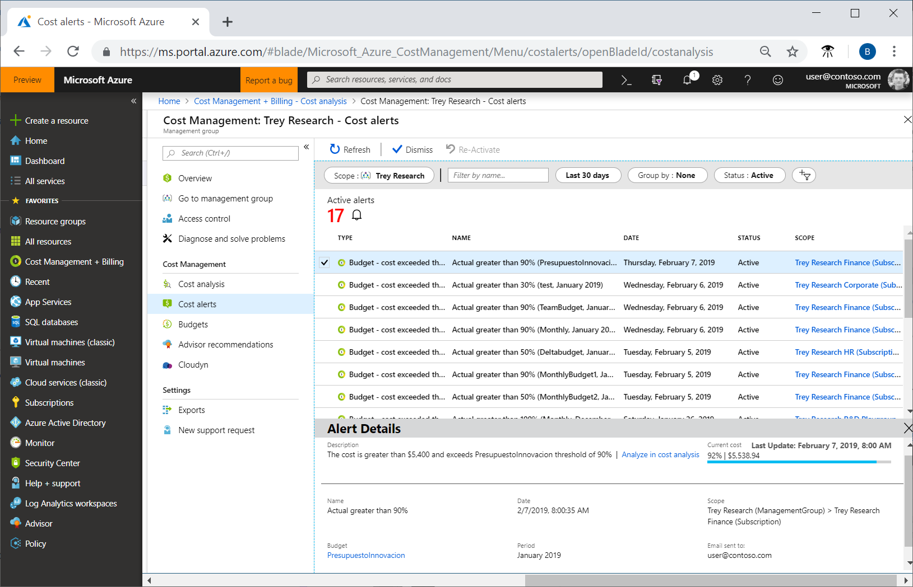
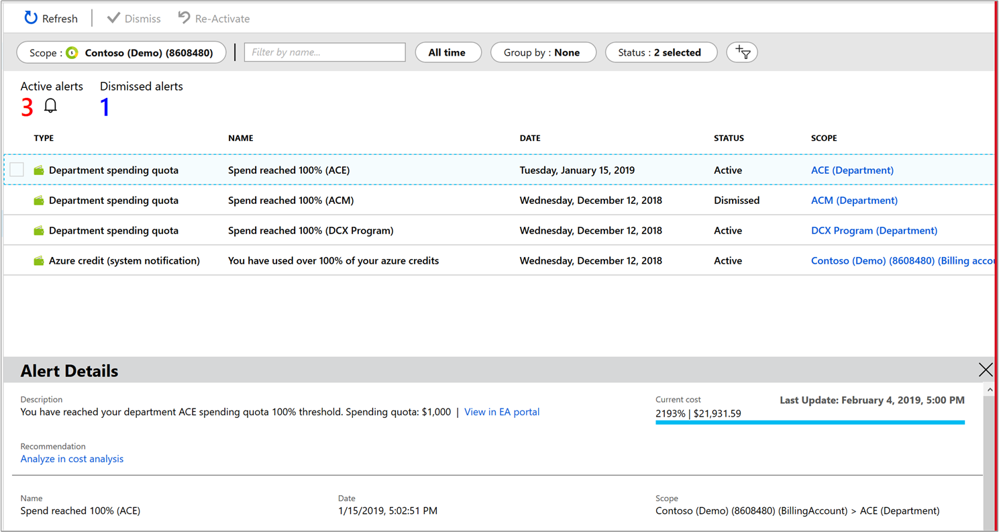

# Use cost alerts to monitor usage and spending

This article helps you understand and use Cost Management alerts to monitor your Azure usage and spending. Cost alerts are automatically generated based when Azure resources are consumed. Alerts show all active cost management and billing alerts together in one place. When your consumption reaches a given threshold, alerts are generated by Cost Management. There are three types of cost alerts: budget alerts, credit alerts, and department spending quota alerts.

## Budget alerts

Budget alerts notify you when spending, based on usage or cost, reaches or exceeds the amount defined in the [alert condition of the budget](tutorial-acm-create-budgets.md). Cost Management budgets are created using the Azure portal or the [Azure Consumption](https://docs.microsoft.com/rest/api/consumption) API.

In the Azure portal, budgets are defined by cost. Using the Azure Consumption API, budgets are defined by cost or by consumption usage. Budget alerts support both cost-based and usage-based budgets. Budget alerts are generated automatically whenever the budget alert conditions are met. You can view all cost alerts in the Azure portal. Whenever an alert is generated, it's shown in cost alerts. An alert email is also sent to the people in the alert recipients list of the budget.

## Credit alerts

Credit alerts notify you when your Azure credit monetary commitments are consumed. Monetary commitments are for organizations with Enterprise Agreements. Credit alerts are generated automatically at 90% and at 100% of your Azure credit balance. Whenever an alert is generated, it's reflected in cost alerts and in the email sent to the account owners.

## Department spending quota alerts

Department spending quota alerts notify you when department spending reaches a fixed threshold of the quota. Spending quotas are configured in the EA portal. Whenever a threshold is met it generates an email to department owners and is shown in cost alerts. For example, 50% or 75% of the quota.

## Supported alert features by offer categories

Support for alert types depends on the type of Azure account that you have (Microsoft offer). The following table shows the alert features that are supported by various Microsoft offers. You can view the full list of Microsoft offers at [Understand Cost Management data](understand-cost-mgt-data.md).

| Alert type | Enterprise Agreement | Microsoft Customer Agreement | Web direct/Pay-As-You-Go |
|---|---|---|---|
| Budget | ✔ | ✔ | ✔ |
| Credit | ✔ |✘ | ✘ |
| Department spending quota | ✔ | ✘ | ✘ |

## View cost alerts

To view cost alerts, open the desired scope in the Azure portal and select **Budgets** in the menu. Use the **Scope** pill to switch to a different scope. Select **Cost alerts** in the menu. For more information about scopes, see [Understand and work with scopes](understand-work-scopes.md).

The total number of active and dismissed alerts appears on the cost alerts page.

All alerts show the alert type. A budget alert shows the reason why it was generated and the name of the budget it applies to. Each alert  shows the date it was generated, its status, and the scope (subscription or management group) that the alert applies to.

Possible status includes **active** and **dismissed**. Active status indicates that the alert is still relevant. Dismissed status indicates that someone has marked the alert to set it as no longer relevant.

Select an alert from the list to view its details. Alert details show more information about the alert. Budget alerts include a link to the budget. If a recommendation is available for a budget alert, then a link to the recommendation is also shown. Budget, credit, and department spending quota alerts have a link to analyze in cost analysis where you can explore costs for the alert's scope. The following example shows spending for a department with alert details.

When you view the details of a dismissed alert, you can reactivate it if manual action is needed. The following image shows an example.

## See also

- If you haven't already created a budget or set alert conditions for a budget, complete the [Create and manage budgets](tutorial-acm-create-budgets.md) tutorial.
