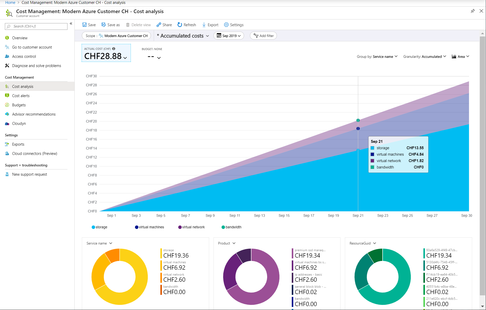
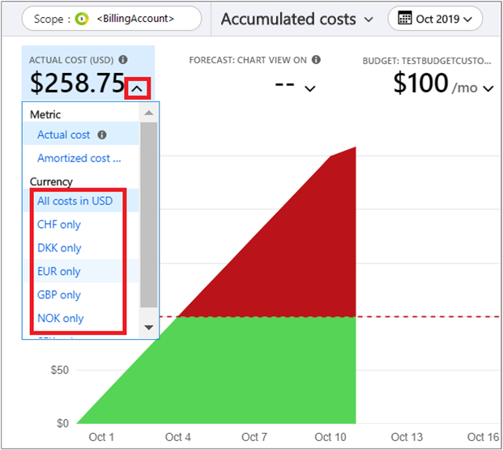
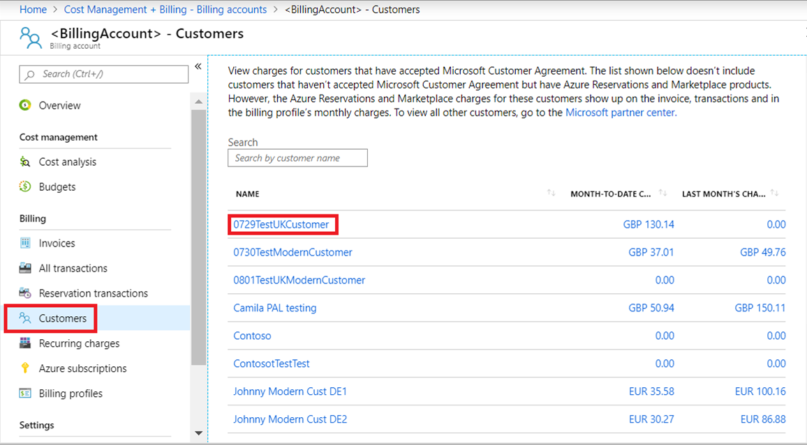
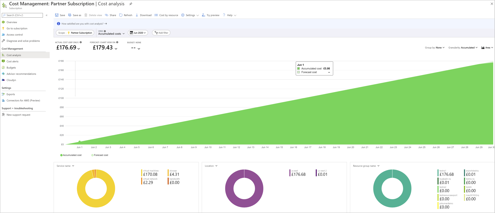
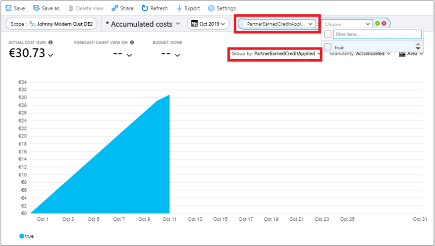
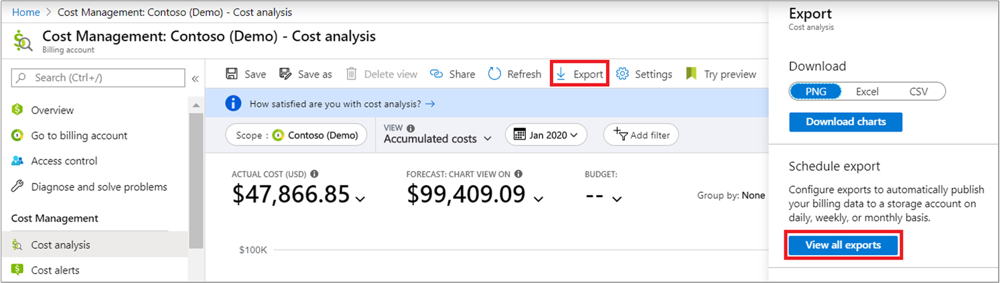
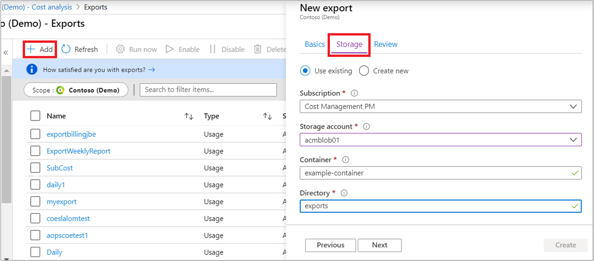
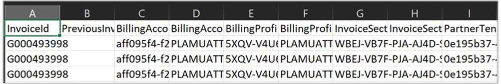

# Get started with Cost Management for partners

Cost Management is natively available for direct partners who have onboarded their customers to a Microsoft Customer Agreement and have [purchased an Azure Plan](/partner-center/purchase-azure-plan). This article explains how partners use [Cost Management](../index.yml) features to view costs for subscriptions in the Azure Plan. It also describes how partners enable Cost Management access at retail rates for their customers.

For direct partners and indirect providers, the global admin and admin agents, can access Cost Management in the partner tenant and manage costs at invoiced prices.

Resellers and customers can access Cost Management in the customer tenant and view consumption costs for each individual subscription, where costs are computed and shown at retail rates. However, they must have Azure RBAC access to the subscription in the customer tenant to view costs. The cost visibility policy must be enabled by the provider for the customer tenant.

Customers can use Cost Management features when enabled by their CSP partner.

CSP partners use Cost Management to:

- Understand invoiced costs and associate the costs to the customer, subscriptions, resource groups, and services.
- Get an intuitive view of Azure costs in [cost analysis](quick-acm-cost-analysis.md) with capabilities to analyze costs by customer, subscription, resource group, resource, meter, service, and many other dimensions.
- View resource costs that have Partner Earned Credit (PEC) applied in Cost Analysis.
- Set up notifications and automation using programmatic [budgets](tutorial-acm-create-budgets.md) and alerts when costs exceed budgets.
- Enable the Azure Resource Manager policy that provides customer access to Cost Management data. Customers can then view consumption cost data for their subscriptions using [pay-as-you-go rates](https://azure.microsoft.com/pricing/calculator/).
- Export their cost and usage data to a storage blob with a pay-as-you-go subscription.

Here's an example showing costs for all customers.

Here's an example showing costs for a single customer.

All functionality available in Cost Management is also available with REST APIs. Use the APIs to automate cost management tasks.

## Prerequisites

As a partner, Cost Management is natively available only for subscriptions that are on the Azure plan.

To enable Cost Management in the Azure portal, you must have confirmed customer acceptance of the Microsoft Customer Agreement (on behalf of the customer) and transitioned the customer to the Azure Plan. Only the costs for subscriptions that are transitioned to the Azure plan are available in Cost Management.

Cost Management requires read access to your billing account or subscription.

For more information about enabling and assigning access to Cost Management for a billing account, see [Assign users roles and permissions](/partner-center/permissions-overview). The **Global admin** and **Admin agent** roles can manage costs for a billing account.

To access Cost Management at the subscription scope, any user with Azure RBAC access to a subscription can view costs at retail (pay-as-you-go) rates. However the [cost visibility policy for the customer tenant](#enable-the-policy-to-view-azure-usage-charges) must be enabled. To view a full list of supported account types, see [Understand Cost Management data](understand-cost-mgt-data.md).

When transferring existing billing agreements to a new partner, cost management capabilities are only available for the current billing relationship with the partner. Historical costs before the transfer to the new partner don't move to the new billing account. However, the cost history does remain with the original associated billing account.

## How Cost Management uses scopes

Scopes are where you manage billing data, have roles specific to payments, view invoices, and conduct general account management. Billing and account roles are managed separately from scopes used for resource management, which use Azure RBAC. To clearly distinguish the intent of the separate scopes, including the access control differences, they are referred to as billing scopes and Azure RBAC scopes, respectively.

To understand billing scopes and Azure RBAC scopes and how cost management works with scopes, see [Understand and work with scopes](understand-work-scopes.md).

## Manage costs with partner tenant billing scopes

After you've onboarded your customers to a Microsoft Customer Agreement, the following _billing scopes_ are available in your tenant. Use the scopes to manage costs in Cost Management.

### Billing account scope

Use the billing account scope to view pre-tax costs across all your customers and billing profiles. Invoice costs are only shown for customer's consumption-based products on the Microsoft Customer Agreement. However, invoice costs are shown for purchased-based products for customers on both the Microsoft Customer Agreement and the CSP offer. Currently, the default currency to view costs in the scope is US dollars. Budgets set for the scope are also in USD.

Regardless of different billed currencies, partners use Billing account scope to set budgets and manage costs in USD across their customers, subscriptions, resources, and resource groups.

Partners also filter costs in a specific billing currency across customers in the cost analysis view. Select the **Actual cost** list to view costs in supported billing currencies.

Use the [amortized cost view](customize-cost-analysis-views.md#switch-between-actual-and-amortized-cost) in billing scopes to view reserved instance amortized costs across a reservation term.

### Billing profile scope

Use the billing profile scope to view pre-tax costs in the billing currency across all your customers for all products and subscriptions included in an invoice. You can filter costs in a billing profile for a specific invoice using the **InvoiceID** filter. The filter shows the consumption and product purchase costs for a specific invoice. You can also filter the costs for a specific customer on the invoice to see pre-tax costs.

After you onboard customers to a Microsoft Customer Agreement, you receive an invoice that includes all charges for all products (consumption, purchases, and entitlements) for these customers on the Microsoft Customer Agreement. When billed in the same currency, these invoices also include the charges for entitlement and purchased products such as SaaS, Azure Marketplace, and reservations for customers who are still in the classic CSP offer no on the Azure plan.

To help reconcile charges against the customer invoice, the billing profile scope enables you to see all costs that accrue for an invoice for your customers. Like the invoice, the scope shows costs for every customer in the new Microsoft Customer Agreement. The scope also shows every charge for customer entitlement products still in the current CSP offer.

The billing profile and billing account scopes are the only applicable scopes that show charges for entitlement and purchase-based products like Azure Marketplace and reservation purchases.

Billing profiles define the subscriptions that are included in an invoice. Billing profiles are the functional equivalent of an enterprise agreement enrollment. A billing profile is the scope where invoices are generated.

Currently, the billing currency is the default currency when viewing costs in the billing profile scope. Budgets set at the billing profile scope are in the billing currency.

Partners can use the scope to reconcile to invoices. And, they use the scope to set budgets in the billing currency for the following items:

- Specific filtered invoice
- Customer
- Subscription
- Resource group
- Resource
- Azure service
- Meter
- ResellerMPNID

### Customer scope

Partners use the scope to manage costs associated to customers that are onboarded to the Microsoft Customer Agreement. The scope allows partners to view pre-tax costs for a specific customer in a billing currency. You can also filter the pre-tax costs for a specific subscription, resource group, or resource.

The customer scope doesn't include customers who are on the current CSP offer. The scope only includes customers who have a Microsoft Customer Agreement.

Entitlement costs, not Azure usage, for current CSP offer customers are available at the billing account and billing profile scopes when you apply the customer filter. The budgets set at this scope are in the billing currency.

To view costs at the customer scope, in the partner tenant navigate to Cost analysis, select the scope picker and then select the specific customer in the list of scopes. Here's an example for the *Contoso Services* customer.

:::image type="content" source="./media/get-started-partners/customer-scope.png" alt-text="Screenshot showing selecting a customer scope." lightbox="./media/get-started-partners/customer-scope.png" :::

## Partner access to billing scopes in Cost Management

Only the users with **Global admin** and **Admin agent** roles can manage and view costs for billing accounts, billing profiles, and customers directly in the partner's Azure tenant. For more information about partner center roles, see [Assign users roles and permissions](/partner-center/permissions-overview).

## Enable Cost Management for customer tenant subscriptions

Partners may enable access to Cost Management after customers are onboarded to a Microsoft Customer Agreement. Then partners can then enable a policy allowing customers to view their costs for Azure consumed services computed at pay-as-you-go retail rates. Costs are shown in the customer's billing currency for their consumed usage at Azure RBAC subscription and resource groups scopes.

When the policy for cost visibility is enabled by the partner, any user with Azure Resource Manager access to the subscription can manage and analyze costs at pay-as-you-go rates. Effectively, resellers and customers that have the appropriate Azure RBAC access to the Azure subscriptions can view cost.

Regardless of the policy, global admins and admin agents of the provider can view subscription costs if they have access to the subscription and resource group.

### Enable the policy to view Azure usage charges

You need to be a member of the **admin agent** group to view and update the policy. Use the following information to enable the policy allowing customers to view Azure usage charges.

In the Azure portal, sign in to the *partner tenant* and select **Cost Management + Billing**. Select the relevant billing scope in the Billing Scope area, and then select **Customers**. The list of customers is associated with the billing account. *If you mistakenly sign in to the customer tenant, you won't see the **Customers** list.*

In the list of customers, select the customer that you want to allow to view costs.

Under **Settings**, select **Policies**.

The current cost visibility policy is shown for **Azure Usage** charges associated to the subscriptions for the selected customer.

When the policy is set to **No**, Cost Management isn't available for subscription users associated to the customer. Unless enabled by a partner, the cost visibility policy is disabled by default for all subscription users.

When the cost policy is set to **Yes**, subscription users associated to the customer tenant can see usage charges at pay-as-you go rates.

When the cost visibility policy is enabled, all services that have subscription usage show costs at pay-as-you-go rates. Reservation usage appears with zero charges for actual and amortized costs. Purchases and entitlements are not associated to a specific subscription. So, purchases aren't displayed at the subscription scope. The global admin/admin agent of a direct partner or an indirect provider can also use the [Update Customer API](/rest/api/billing/2019-10-01-preview/policies/updatecustomer) to set each customer's cost visibility policy at scale.

### View subscription costs in the customer tenant

To view costs for a subscription, open **Cost Management** in the customer's Azure tenant. Select **Cost analysis** and then the required subscription to start reviewing costs. You can view consumption costs for each subscription individually in the customer tenant.

Cost analysis, budgets, and alerts are available for the subscription and resource group Azure RBAC scopes at pay-as-you-go rate-based costs.

Amortized views and actual costs for reserved instances in the Azure RBAC scopes show zero charges. Purchase costs for entitlements such as Reserved instances, Saving Plan purchases, and Marketplace fees are only shown in billing scopes in the partner's tenant where the purchases were made.

The retail rates used to compute costs shown in the view are the same prices shown in the Azure Pricing Calculator for all customers. Costs shown don't include any discounts or credits that the partner may have like Partner Earned Credits, Tier Discounts, and Global Service discounts.

## Analyze costs in cost analysis

Partners with access to billing scopes in the partner tenant can explore and analyze invoiced costs in cost analysis across customers for a specific customer or for an invoice. In cost analysis, you can also save views.

Azure RBAC users with access to the subscription in the customer tenant can also analyze retail costs for subscriptions in the customer tenant, save views, and export data to CSV and PNG files.

You can use filter and group by features in cost analysis to analyze costs by multiple fields. Partner-specific fields are shown in the next section.

## Data fields

The following data fields are found in usage detail files and Cost Management APIs. Where available, Partner Center equivalent information is shown. For the following bold fields, partners can use filter and group by features in cost analysis to analyze costs by multiple fields. Bold fields apply only to Microsoft Customer Agreements supported by partners.

| **Field name** | **Description** | **Partner Center equivalent** |
| --- | --- | --- |
| invoiceId | Invoice ID shown on the invoice for the specific transaction. | Invoice number where the transaction is shown. |
| previousInvoiceID | Reference to an original invoice there is a refund (negative cost). Populated only when there is a refund. | N/A |
| billingAccountName | Name of the billing account representing the partner. It accrues all costs across the customers who have onboarded to a Microsoft customer agreement and the CSP customers that have made entitlement purchases like SaaS, Azure Marketplace, and reservations. | N/A |
| billingAccountID | Identifier for the billing account representing the partner. | MCAPI Partner Commerce Root ID. Used in a request, but not included in a response.|
| billingProfileID | Identifier for the billing profile that groups costs across invoices in a single billing currency across the customers who have onboarded to a Microsoft customer agreement and the CSP customers that have made entitlement purchases like SaaS, Azure Marketplace, and reservations. | MCAPI Partner Billing Group ID. Used in a request, but not included in a response. |
| billingProfileName | Name of the billing profile that groups costs across invoices in a single billing currency across the customers who have onboarded to a Microsoft customer agreement and the CSP customers that have made entitlement purchases like SaaS, Azure Marketplace, and reservations. | N/A |
| invoiceSectionName | Name of the project that is being charged in the invoice. Not applicable for Microsoft Customer Agreements onboarded by partners. | N/A |
| invoiceSectionID | Identifier of the project that is being charged in the invoice. Not applicable for Microsoft Customer Agreements onboarded by partners. | N/A |
| **CustomerTenantID** | Identifier of the Azure Active Directory tenant of the customer's subscription. | Customer's organizational ID - the customer's Azure Active Directory TenantID. |
| **CustomerName** | Name of the Azure Active Directory tenant for the customer's subscription. | Customer's organization name, as shown in the Partner Center. Important for reconciling the invoice with your system information. |
| **CustomerTenantDomainName** | Domain name for the Azure Active Directory tenant of the customer's subscription. | Customer Azure Active Directory tenant domain. |
| **PartnerTenantID** | Identifier for the partner's Azure Active Directory tenant. | Partner Azure Active Directory Tenant ID called as Partner ID, in GUID format. |
| **PartnerName** | Name of the partner Azure Active Directory tenant. | Partner name. |
| **ResellerMPNID** | ID for the reseller associated with the subscription. | ID of the reseller on record for the subscription. Not available for current activity. |
| costCenter | Cost center associated to the subscription. | N/A |
| billingPeriodStartDate | Billing period start date, as shown on the invoice. | N/A |
| billingPeriodEndDate | Billing period end date, as shown on the invoice. | N/A |
| servicePeriodStartDate | Start date for the rating period when the service usage was rated for charges. The prices for Azure services are determined for the rating period. | ChargeStartDate in Partner Center. Billing cycle start date, except when presenting dates of previously uncharged latent usage data from a previous billing cycle. The time is always the beginning of the day, 0:00. |
| servicePeriodEndDate | End date for the period when the service usage was rated for charges. The prices for Azure services are determined based on the rating period. | N/A |
| date | For Azure consumption data, it shows date of usage as rated. For reserved instance, it shows the purchased date. For recurring charges and one-time charges such as Marketplace and support, it shows the purchase date. | N/A |
| productID | Identifier for the product that has accrued charges by consumption or purchase. It is the concatenated key of productID and SKuID, as shown in the Partner Center. | The ID of the product. |
| product | Name of the product that has accrued charges by consumption or purchase, as shown on the invoice. | The product name in the catalog. |
| serviceFamily | Shows the service family for the product purchased or charged. For example, Storage or Compute. | N/A |
| productOrderID | The identifier of the asset or Azure plan name that the subscription belongs to. For example, Azure Plan. | CommerceSubscriptionID |
| productOrderName | The name of the Azure plan that the subscription belongs to. For example, Azure Plan. | N/A|
| consumedService | Consumed service (legacy taxonomy) as used in legacy EA usage details. | Service shown in the Partner Center. For example, Microsoft.Storage, Microsoft.Compute, and microsoft.operationalinsights. |
| meterID | Metered identifier for measured consumption. | The ID of the used meter. |
| meterName | Identifies the name of the meter for measured consumption. | The name of the consumed meter. |
| meterCategory | Identifies the top-level service for usage. | The top-level service for the usage. |
| meterSubCategory | Defines the type or subcategory of Azure service that can affect the rate. | The type of Azure service that can affect the rate.|
| meterRegion | Identifies the location of the datacenter for certain services that are priced based on datacenter location. | The regional location of a data center for services, where applicable and populated. |
| subscription ID | Unique Microsoft generated identifier for the Azure subscription. | EntitlementID |
| subscriptionName | Name of the Azure subscription. | N/A |
| Term | Displays the term for the validity of the offer. For example, reserved instances show 12 months of a yearly term of the reserved instance. For one-time purchases or recurring purchases, the term displays one month for SaaS, Azure Marketplace, and support. Not applicable for Azure consumption. | N/A |
| provider | Identifier for product and line of business. Break down costs by the provider type: Azure, Microsoft 365, Dynamics 365, AWS, and so on.  | N/A |
| publisherType (firstParty, thirdPartyReseller, thirdPartyAgency) | Type of publisher that identifies the publisher as first party, third-party reseller, or third-party agency. | N/A |
| partNumber | Part number for the unused reserved instance and Azure Marketplace services. | N/A |
| publisherName | Name of the publisher of the service including Microsoft or third-party publishers. | The name of the product's publisher.|
| reservationId | Identifier for the reserved instance purchase. | N/A |
| reservationName | Name of the reserved instance. | N/A |
| reservationOrderId | OrderID for the reserved instance. | N/A |
| frequency | Payment frequency for a reserved instance. | N/A |
| resourceGroup | Name of the Azure resource group used for lifecycle resource management. | Name of the resource group. |
| instanceID (or) ResourceID | Identifier of the resource instance. | Shown as a ResourceURI that includes complete resource properties. |
| resourceLocation | Name of the resource location. | The location of the resource. |
| Location | Normalized location of the resource. | N/A |
| effectivePrice | The effective unit price of the service, in pricing currency. Unique for a product, service family, meter, and offer. Used with pricing in the price sheet for the billing account. When there is tiered pricing or an included quantity, it shows the blended price for consumption. | The unit price after adjustments are made. |
| Quantity | Measured quantity purchased or consumed. The amount of the meter used during the billing period. | Number of units. Ensure it matches the information in your billing system during reconciliation. |
| unitOfMeasure | Identifies the unit that the service is charged in. For example, GB and hours. | Identifies the unit that the service is charged in. For example, GB, hours, and 10,000 s. |
| pricingCurrency | The currency defining the unit price. | The currency in the price list.|
| billingCurrency | The currency defining the billed cost. | The currency defined as the billed currency on the invoice. |
| chargeType | Defines the type of charge that the cost represents in Cost Management like purchase and refund. | The type of charge or adjustment. Not available for current activity. |
| costinBillingCurrency | ExtendedCost or blended cost before tax in the billed currency. | N/A |
| costinPricingCurrency | ExtendedCost or blended cost before tax in pricing currency to correlate with prices. | N/A |
| **costinUSD** | Estimated ExtendedCost or blended cost before tax in USD. | N/A |
| **paygCostInBillingCurrency** | Shows costs if pricing is in retail prices. Shows pay-as-you-go prices in the billing currency. Available only at Azure RBAC scopes. | N/A |
| **paygCostInUSD** | Shows costs if pricing is in retail prices. Shows pay-as-you-go prices in USD. Available only at Azure RBAC scopes. | N/A |
| exchangeRate | Exchange rate used to convert from the pricing currency to the billing currency. | Referred to as PCToBCExchangeRate in the Partner Center. The pricing currency to billing currency exchange rate.|
| exchangeRateDate | The date for the exchange rate that's used to convert from the pricing currency to the billing currency. | Referred to as PCToBCExchangeRateDat in the Partner Center. The pricing currency to billing currency exchange rate date.|
| isAzureCreditEligible | Indicates whether the cost is eligible for payment by Azure credits. | N/A |
| serviceInfo1 | Legacy field that captures optional service-specific metadata. | Internal Azure service metadata. |
| serviceInfo2 | Legacy field that captures optional service-specific metadata. | Service information. For example, an image type for a virtual machine and ISP name for ExpressRoute.|
| additionalInfo | Service-specific metadata. For example, an image type for a virtual machine. | Any additional information not covered in other columns. The service-specific metadata. For example, an image type for a virtual machine.|
| tags | Tag that you assign to the meter. Use tags to group billing records. For example, you can use tags to distribute costs by the department that uses the meter. | Tags added by the customer.|
| **partnerEarnedCreditRate** | Rate of discount applied if there is a partner earned credit (PEC) based on partner admin link access. | The rate of partner earned credit (PEC). For example, 0% or 15%. |
| **partnerEarnedCreditApplied** | Indicates whether the partner earned credit has been applied. | N/A |

## View Partner Earned Credit (PEC) resource costs

In Cost Management, partners can use cost analysis to view costs that received the PEC benefits.

In the Azure portal, sign in to the partner tenant and select **Cost Management + Billing**. Under **Cost Management**, select **Cost analysis**.

The Cost analysis view shows costs of the billing account for the partner. Select the **Scope** as needed for the partner, a specific customer, or a billing profile to reconcile invoices.

In a donut chart, select the drop-down list and select **PartnerEarnedCreditApplied** to drill into PEC costs.

When the **PartnerEarnedCreditApplied** property is _True_, the associated cost has the benefit of the partner earned admin access.

When the **PartnerEarnedCreditApplied** property is _False_, the associated cost hasn't met the required eligibility for the credit. Or, the service purchased isn't eligible for partner earned credit.

Service usage data normally takes 8-24 hours to appear in Cost Management. For more information, see [Cost and usage data updates and retention](understand-cost-mgt-data.md#cost-and-usage-data-updates-and-retention). PEC credits appear within 48 hours from time of access in Cost Management.

You can also group and filter by the **PartnerEarnedCreditApplied** property using the **Group by** options. Use the options to examine costs that do and don't have PEC.

## Export cost data to Azure Storage

Partners with access to billing scopes in a partner tenant can export their cost and usage data to an Azure Storage blob. The blob must be on a subscription in the partner tenant that's not a [shared service subscription](/partner-center/shared-services) or a customer’s subscription. To enable cost data export, we recommended that you set up an independent pay-as-you-go subscription in the partner tenant to host the exported cost data. The export storage account is created on the Azure Storage blob hosted in the pay-as-you-go subscription. Based on the scope where the partner creates the export, the associated data is exported to the storage account automatically on a recurring basis.

Users with Azure RBAC access to the subscription can also export the cost data to an Azure storage blob hosted in any subscription in the customer tenant.

### Create an export in a partner tenant or customer tenant

In the Azure portal, sign in to the partner tenant or customer tenant and select **Cost Management + Billing**. Select an appropriate scope, for example a Microsoft Partner Agreement billing account, and then select **Cost Analysis**. When the page loads, select **Export**. Select **View all exports** under Schedule Export.

Next, select  **Add** and type the name and select an export type. Select the **Storage** tab and enter required information.

When you create an export in the partner tenant, select the pay-as-you-go subscription in the partner tenant. Create an Azure Storage account using that subscription.

For Azure RBAC users in the customer tenant, select a subscription in the customer tenant. Create an Azure Storage account using the subscription.

Review the content and then select **Create** to schedule an export.

To verify data in the export list, select the storage account name. On the storage account page, select **Containers** and then select the container. Navigate to the corresponding folder and select the CSV file. Select **Download** to get the CSV file and open it. The exported data exported resembles cost data similar to usage details from the Azure portal.

## Cost Management REST APIs

Partners and their customers can use Cost Management APIs for common tasks. For more information, see [Automation for partners](../automate/partner-automation.md).

## Next steps

- [Start analyzing costs](quick-acm-cost-analysis.md) in Cost Management
- [Create and manage budgets](tutorial-acm-create-budgets.md) in Cost Management
