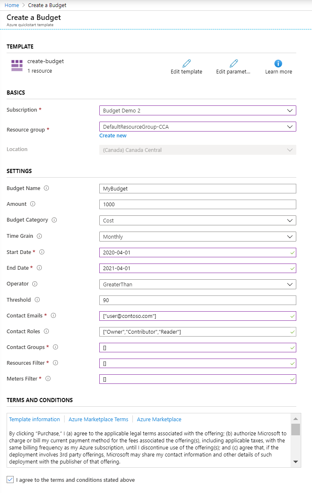

# Quickstart: Create a budget with an Azure Resource Manager template

Budgets in Cost Management help you plan for and drive organizational accountability. With budgets, you can account for the Azure services you consume or subscribe to during a specific period. They help you inform others about their spending to proactively manage costs, and to monitor how spending progresses over time. When the budget thresholds you've created are exceeded, notifications are triggered. None of your resources are affected and your consumption isn't stopped. You can use budgets to compare and track spending as you analyze costs. This quickstart shows you how to create a budget using a Resource Manager template.

[!INCLUDE [About Azure Resource Manager](../../../includes/resource-manager-quickstart-introduction.md)]

## Prerequisites

The Azure Resource Manager template only supports Azure subscriptions for Enterprise Agreements (EA). Other subscription types aren't supported by the template.

To create and manage budgets, you must have contributor permission. You can create individual budgets for EA subscriptions and resource groups. However, you can't create budgets for EA billing accounts. For Azure EA subscriptions, you must have read access to view budgets.

After a budget is created, you need at least read access for your Azure account to view budgets.

If you have a new subscription, you can't immediately create a budget or use other Cost Management features. It might take up to 48 hours before you can use all Cost Management features.

The following Azure permissions, or scopes, are supported per subscription for budgets by user and group. For more information about scopes, see [Understand and work with scopes](understand-work-scopes.md).

- Owner – Can create, modify, or delete budgets for a subscription.
- Contributor and Cost Management contributor – Can create, modify, or delete their own budgets. Can modify the budget amount for budgets created by others.
- Reader and Cost Management reader – Can view budgets that they have permission to.

For more information about assigning permission to Cost Management data, see [Assign access to Cost Management data](assign-access-acm-data.md).

## Create a budget

### Review the template

The template used in this quickstart is from [Azure Quickstart templates](https://azure.microsoft.com/resources/templates/create-budget).

:::code language="json" source="~/quickstart-templates/create-budget/azuredeploy.json" range="1-146" highlight="110-139":::

One Azure resource is defined in the template:

* [Microsoft.Consumption/budgets](/azure/templates/microsoft.consumption/budgets): Create an Azure budget.

### Deploy the template

1. Select the following image to sign in to Azure and open a template. The template creates a budget.

   [](https://portal.azure.com/#create/Microsoft.Template/uri/https%3A%2F%2Fraw.githubusercontent.com%2FAzure%2Fazure-quickstart-templates%2Fmaster%2Fcreate-budget%2Fazuredeploy.json)

2. Select or enter the following values.

   [](./media/quick-create-budget-template/create-budget-using-template-portal.png#lightbox)

    * **Subscription**: select an Azure subscription.
    * **Resource group**: select **Create new** and enter a unique name for the resource group and then click **OK**, or select an existing resource group.
    * **Location**: select a location. For example, **Central US**.
    * **Budget Name**: enter a name for the budget. It should be unique within a resource group. Only alphanumeric, underscore, and hyphen characters are allowed.
    * **Amount**: enter the total amount of cost or usage to track with the budget.
    * **Budget Category**: select the category of the budget, whether the budget tracks **Cost** or **Usage**.
    * **Time Grain**: enter the time covered by a budget. Allowed values are Monthly, Quarterly, or Annually. The budget resets at the end of the time grain.
    * **Start Date**: enter the start date with the first day of the month in YYYY-MM-DD format. A future start date shouldn't be more than three months from today. You can specify a past start date with the Time Grain period.
    * **End Date**: enter the end date for the budget in YYYY-MM-DD format. If not provided, the default is set to 10 years from the start date.
    * **Operator**: select a comparison operator. Possible values are EqualTo, GreaterThan, or GreaterThanOrEqualTo.
    * **Threshold**: enter a threshold value for the notification. A notification is sent when the cost exceeds the threshold. It's always percent and has to be between 0 and 1000.
    * **Contact Emails** enter a list of email addresses to send the budget notification to when the threshold is exceeded. Expected format is `["user1@domain.com","user2@domain.com"]`.
    * **Contact Roles** enter the list of contact roles to send the budget notification to when the threshold is exceeded. Default values are Owner, Contributor, and Reader. Expected format is `["Owner","Contributor","Reader"]`.
    * **Contact Groups** enter a list of action group resource IDs, as a full resource URIs, to send the budget notification to when the threshold is exceeded. It accepts array of strings. Expected format is `["action group resource ID1","action group resource ID2"]`. If don't want to use action groups, enter `[]`.
    * **Resources Filter** enter a list of filters for resources. Expected format is `["Resource Filter Name1","Resource Filter Name2"]`. If you don't want to apply a filter, enter `[]`. If you enter a resources filter, you must also enter **meters filters** values.
    * **Meters Filter** enter a list of filters on meters, mandatory for budgets with the **Usage** budget category. Expected format is `["Meter Filter Name1","Meter Filter Name2"]`. If you didn't enter a **resources filter**, enter `[]`.
    * **I agree to the terms and conditions state above**: Select.

3. Select **Purchase**. After the budget is successfully deployed, you get a notification:

   

The Azure portal is used to deploy the template. In addition to the Azure portal, you can also use Azure PowerShell, Azure CLI, and REST API. To learn about other deployment templates, see [Deploy templates](../../azure-resource-manager/templates/deploy-powershell.md).

## Validate the deployment

You can use the Azure portal to verify that the budget is created by navigating to **Cost Management + Billing** > select a scope > **Budgets**. Or, use the following Azure CLI or Azure PowerShell scripts to view the budget.

# [CLI](#tab/CLI)

```azurecli-interactive
az consumption budget list
```

# [PowerShell](#tab/PowerShell)

```azurepowershell-interactive
Get-AzConsumptionBudget
```

---

## Clean up resources

When you no longer need a budget, delete it by using one the following methods:

### Azure portal

Navigate to **Cost Management + Billing** > select a billing scope > **Budgets** > select a budget > then select **Delete budget**.

### Command line

You can remove the budget using Azure CLI or Azure PowerShell.

# [CLI](#tab/CLI)

```azurecli-interactive
echo "Enter the budget name:" &&
read budgetName &&
az consumption budget delete --budget-name $budgetName &&
echo "Press [ENTER] to continue ..."
```

# [PowerShell](#tab/PowerShell)

```azurepowershell-interactive
$budgetName = Read-Host -Prompt "Enter the budget name"
Remove-AzConsumptionBudget -Name $budgetName
Write-Host "Press [ENTER] to continue..."
```

---

## Next steps

In this quickstart, you created an Azure budget the deployment. To learn more about Azure Cost Management and Billing and Azure Resource Manager, continue on to the articles below.

- Read the [Cost Management and Billing](../cost-management-billing-overview.md) overview
- [Create budgets](tutorial-acm-create-budgets.md) in the Azure portal
- Learn more about [Azure Resource Manager](../../azure-resource-manager/management/overview.md)
