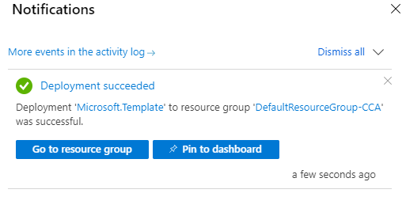

# Quickstart: Create a budget with an ARM template

Budgets in Cost Management help you plan for and drive organizational accountability. With budgets, you can account for the Azure services you consume or subscribe to during a specific period. They help you inform others about their spending to proactively manage costs, and to monitor how spending progresses over time. When the budget thresholds you've created are exceeded, notifications are triggered. None of your resources are affected and your consumption isn't stopped. You can use budgets to compare and track spending as you analyze costs. This quickstart shows you how to create a budget using three different Azure Resource Manager templates (ARM template).

[!INCLUDE [About Azure Resource Manager](../../../includes/resource-manager-quickstart-introduction.md)]

If your environment meets the prerequisites and you're familiar with using ARM templates, select the **Deploy to Azure** button for one of the following templates. The template will open in the Azure portal.

| Template | Deployment button |
| --- | --- |
| No filter | [](https://portal.azure.com/#create/Microsoft.Template/uri/https%3A%2F%2Fraw.githubusercontent.com%2FAzure%2Fazure-quickstart-templates%2Fmaster%2Fquickstarts%2Fmicrosoft.consumption%2Fcreate-budget-simple%2Fazuredeploy.json) |
| One filter | [](https://portal.azure.com/#create/Microsoft.Template/uri/https%3A%2F%2Fraw.githubusercontent.com%2FAzure%2Fazure-quickstart-templates%2Fmaster%2Fquickstarts%2Fmicrosoft.consumption%2Fcreate-budget-onefilter%2Fazuredeploy.json)  |
| Two or more filters | [](https://portal.azure.com/#create/Microsoft.Template/uri/https%3A%2F%2Fraw.githubusercontent.com%2FAzure%2Fazure-quickstart-templates%2Fmaster%2Fquickstarts%2Fmicrosoft.consumption%2Fcreate-budget%2Fazuredeploy.json) |

## Prerequisites

If you don't have an Azure subscription, create a [free account](https://azure.microsoft.com/free/?WT.mc_id=A261C142F) before you begin.

If you have a new subscription, you can't immediately create a budget or use other Cost Management features. It might take up to 48 hours before you can use all Cost Management features.

Budgets are supported for the following types of Azure account types and scopes:

- Azure role-based access control (Azure RBAC) scopes
    - Management groups
    - Subscription
- Enterprise Agreement scopes
    - Billing account
    - Department
    - Enrollment account
- Individual agreements
    - Billing account
- Microsoft Customer Agreement scopes
    - Billing account
    - Billing profile
    - Invoice section
    - Customer
- AWS scopes
    - External account
    - External subscription

To view budgets, you need at least read access for your Azure account.

For Azure EA subscriptions, you must have read access to view budgets. To create and manage budgets, you must have contributor permission.

The following Azure permissions, or scopes, are supported per subscription for budgets by user and group. For more information about scopes, see [Understand and work with scopes](understand-work-scopes.md).

- Owner – Can create, modify, or delete budgets for a subscription.
- Contributor and Cost Management contributor – Can create, modify, or delete their own budgets. Can modify the budget amount for budgets created by others.
- Reader and Cost Management reader – Can view budgets that they have permission to.

For more information about assigning permission to Cost Management data, see [Assign access to Cost Management data](assign-access-acm-data.md).

Use one of the following templates, based on your needs.

| Template | Description |
| --- | --- |
| No filter | The ARM template doesn't have any filters. |
| One filter | The ARM template has a filter for resource groups. |
| Two or more filters | The ARM template has a filter for resource groups and a filter for meter categories. |

## Review and deploy the template

## [No filter](#tab/no-filter)

### Review the template

The template used in this quickstart is from [Azure Quickstart Templates](https://azure.microsoft.com/resources/templates/create-budget-simple).

:::code language="json" source="~/quickstart-templates/quickstarts/microsoft.consumption/create-budget-simple/azuredeploy.json" :::

One Azure resource is defined in the template:

* [Microsoft.Consumption/budgets](/azure/templates/microsoft.consumption/budgets): Create a budget.

### Deploy the template

1. Select the following image to sign in to Azure and open a template. The template creates a budget without any filters.

   [](https://portal.azure.com/#create/Microsoft.Template/uri/https%3A%2F%2Fraw.githubusercontent.com%2FAzure%2Fazure-quickstart-templates%2Fmaster%2Fquickstarts%2Fmicrosoft.consumption%2Fcreate-budget-simple%2Fazuredeploy.json)

2. Select or enter the following values.

   :::image type="content" source="./media/quick-create-budget-template/create-budget-simple-image.png" alt-text="Resource Manager template, Create budget without a filter, deploy portal." lightbox="./media/quick-create-budget-template/create-budget-simple-image.png" :::
   
    * **Subscription**: select an Azure subscription.
    * **Resource group**: if required, select an existing resource group, or **Create new**.
    * **Region**: select an Azure region. For example, **Central US**.
    * **Budget Name**: enter a name for the budget. It should be unique within a resource group. Only alphanumeric, underscore, and hyphen characters are allowed.
    * **Amount**: enter the total amount of cost to track with the budget.
    * **Time Grain**: enter the time covered by a budget. Allowed values are Monthly, Quarterly, or Annually. The budget resets at the end of the time grain.
    * **Start Date**: enter the start date with the first day of the month in YYYY-MM-DD format. A future start date shouldn't be more than three months from today. You can specify a past start date with the Time Grain period.
    * **End Date**: enter the end date for the budget in YYYY-MM-DD format. 
    * **First Threshold**: enter a threshold value for the first notification. A notification is sent when the cost exceeds the threshold. It's always percent and has to be between 0.01 and 1000.
    * **Second Threshold**: enter a threshold value for the second notification. A notification is sent when the cost exceeds the threshold. It's always percent and has to be between 0.01 and 1000.
    * **Contact Emails** enter a list of email addresses to send the budget notification to when a threshold is exceeded. It accepts an array of strings. Expected format is `["user1@domain.com","user2@domain.com"]`.
   
3. Depending on your Azure subscription type, do one of the following actions:
   - Select **Review + create**.
   - Review the terms and conditions, select **I agree to the terms and conditions stated above**, and then select **Purchase**.

4. If you selected **Review + create**, your template is validated. Select **Create**.  

   

The Azure portal is used to deploy the template. In addition to the Azure portal, you can also use Azure PowerShell, Azure CLI, and REST API. To learn about other deployment templates, see [Deploy templates](../../azure-resource-manager/templates/deploy-powershell.md).

### [One filter](#tab/one-filter)

### Review the template

The template used in this quickstart is from [Azure Quickstart Templates](https://azure.microsoft.com/resources/templates/create-budget-onefilter).

:::code language="json" source="~/quickstart-templates/quickstarts/microsoft.consumption/create-budget-onefilter/azuredeploy.json" :::

One Azure resource is defined in the template:

* [Microsoft.Consumption/budgets](/azure/templates/microsoft.consumption/budgets): Create a budget.

### Deploy the template

1. Select the following image to sign in to Azure and open a template. The template creates a budget with a filter for resource groups.

   [](https://portal.azure.com/#create/Microsoft.Template/uri/https%3A%2F%2Fraw.githubusercontent.com%2FAzure%2Fazure-quickstart-templates%2Fmaster%2Fquickstarts%2Fmicrosoft.consumption%2Fcreate-budget-onefilter%2Fazuredeploy.json)

2. Select or enter the following values.

   :::image type="content" source="./media/quick-create-budget-template/create-budget-one-filter-image.png" alt-text="Resource Manager template, Create budget with one filter, deploy portal]" lightbox="./media/quick-create-budget-template/create-budget-one-filter-image.png" :::
   
    * **Subscription**: select an Azure subscription.
    * **Resource group**: if required, select an existing resource group, or **Create new**.
    * **Region**: select an Azure region. For example, **Central US**.
    * **Budget Name**: enter a name for the budget. It should be unique within a resource group. Only alphanumeric, underscore, and hyphen characters are allowed.
    * **Amount**: enter the total amount of cost to track with the budget.
    * **Time Grain**: enter the time covered by a budget. Allowed values are Monthly, Quarterly, or Annually. The budget resets at the end of the time grain.
    * **Start Date**: enter the start date with the first day of the month in YYYY-MM-DD format. A future start date shouldn't be more than three months from today. You can specify a past start date with the Time Grain period.
    * **End Date**: enter the end date for the budget in YYYY-MM-DD format. 
    * **First Threshold**: enter a threshold value for the first notification. A notification is sent when the cost exceeds the threshold. It's always percent and has to be between 0.01 and 1000.
    * **Second Threshold**: enter a threshold value for the second notification. A notification is sent when the cost exceeds the threshold. It's always percent and has to be between 0.01 and 1000.
    * **Contact Emails** enter a list of email addresses to send the budget notification to when a threshold is exceeded. It accepts an array of strings. Expected format is `["user1@domain.com","user2@domain.com"]`.
    * **Resource Group Filter Values** enter a list of resource group names to filter. It accepts an array of strings. Expected format is `["Resource Group Name1","Resource Group Name2"]`. The array can't be empty. 
   
3. Depending on your Azure subscription type, do one of the following actions:
   - Select **Review + create**.
   - Review the terms and conditions, select **I agree to the terms and conditions stated above**, and then select **Purchase**.

4. If you selected **Review + create**, your template is validated. Select **Create**.  

   

The Azure portal is used to deploy the template. In addition to the Azure portal, you can also use Azure PowerShell, Azure CLI, and REST API. To learn about other deployment templates, see [Deploy templates](../../azure-resource-manager/templates/deploy-powershell.md).

### [Two or more filters](#tab/two-filters)

### Review the template

The template used in this quickstart is from [Azure Quickstart Templates](https://azure.microsoft.com/resources/templates/create-budget).

:::code language="json" source="~/quickstart-templates/quickstarts/microsoft.consumption/create-budget/azuredeploy.json" :::

One Azure resource is defined in the template:

* [Microsoft.Consumption/budgets](/azure/templates/microsoft.consumption/budgets): Create a budget.

### Deploy the template

1. Select the following image to sign in to Azure and open a template. The template creates a budget with a filter for resource groups and a filter for meter categories.

   [](https://portal.azure.com/#create/Microsoft.Template/uri/https%3A%2F%2Fraw.githubusercontent.com%2FAzure%2Fazure-quickstart-templates%2Fmaster%2Fquickstarts%2Fmicrosoft.consumption%2Fcreate-budget%2Fazuredeploy.json)

2. Select or enter the following values.

   :::image type="content" source="./media/quick-create-budget-template/create-budget-two-filters-image.png" alt-text="Resource Manager template, Create budget with two filters, deploy portal]" lightbox="./media/quick-create-budget-template/create-budget-two-filters-image.png" :::
   
    * **Subscription**: select an Azure subscription.
    * **Resource group**: if required, select an existing resource group, or **Create new**.
    * **Region**: select an Azure region. For example, **Central US**.
    * **Budget Name**: enter a name for the budget. It should be unique within a resource group. Only alphanumeric, underscore, and hyphen characters are allowed.
    * **Amount**: enter the total amount of cost to track with the budget.
    * **Time Grain**: enter the time covered by a budget. Allowed values are Monthly, Quarterly, or Annually. The budget resets at the end of the time grain.
    * **Start Date**: enter the start date with the first day of the month in YYYY-MM-DD format. A future start date shouldn't be more than three months from today. You can specify a past start date with the Time Grain period.
    * **End Date**: enter the end date for the budget in YYYY-MM-DD format. 
    * **First Threshold**: enter a threshold value for the first notification. A notification is sent when the cost exceeds the threshold. It's always percent and has to be between 0.01 and 1000.
    * **Second Threshold**: enter a threshold value for the second notification. A notification is sent when the cost exceeds the threshold. It's always percent and has to be between 0.01 and 1000.
    * **Contact Roles** enter the list of contact roles to send the budget notification to when the threshold is exceeded. Default values are Owner, Contributor, and Reader. Expected format is `["Owner","Contributor","Reader"]`.
    * **Contact Emails** enter a list of email addresses to send the budget notification to when a threshold is exceeded. It accepts an array of strings. Expected format is `["user1@domain.com","user2@domain.com"]`.
    * **Contact Groups** enter a list of action group resource IDs, as a full resource URIs, to send the budget notification to when the threshold is exceeded. It accepts an array of strings. Expected format is `["action group resource ID1","action group resource ID2"]`. If don't want to use action groups, enter `[]`.
    * **Resource Group Filter Values** enter a list of resource group names to filter. It accepts an array of strings. Expected format is `["Resource Group Name1","Resource Group Name2"]`. The array can't be empty. 
    * **Meter Category Filter Values** enter a list of Azure service meter categories. It accepts an array of strings. Expected format is `["Meter Category1","Meter Category2"]`. The array can't be empty.
   
3. Depending on your Azure subscription type, do one of the following actions:
   - Select **Review + create**.
   - Review the terms and conditions, select **I agree to the terms and conditions stated above**, and then select **Purchase**.

4. If you selected **Review + create**, your template is validated. Select **Create**.  

   

The Azure portal is used to deploy the template. In addition to the Azure portal, you can also use Azure PowerShell, Azure CLI, and REST API. To learn about other deployment templates, see [Deploy templates](../../azure-resource-manager/templates/deploy-powershell.md).

---

## Validate the deployment

Use one of the following ways to verify that the budget is created.

# [Azure portal](#tab/portal)

Navigate to **Cost Management + Billing** > select a scope > **Budgets**.

# [CLI](#tab/CLI)

```azurecli-interactive
az consumption budget list
```

# [PowerShell](#tab/PowerShell)

```azurepowershell-interactive
Get-AzConsumptionBudget
```

---

## Clean up resources

When you no longer need a budget, delete it by using one the following methods:

# [Azure portal](#tab/portal)

Navigate to **Cost Management + Billing** > select a billing scope > **Budgets** > select a budget > then select **Delete budget**.

# [CLI](#tab/CLI)

```azurecli-interactive
echo "Enter the budget name:" &&
read budgetName &&
az consumption budget delete --budget-name $budgetName &&
echo "Press [ENTER] to continue ..."
```

# [PowerShell](#tab/PowerShell)

```azurepowershell-interactive
$budgetName = Read-Host -Prompt "Enter the budget name"
Remove-AzConsumptionBudget -Name $budgetName
Write-Host "Press [ENTER] to continue..."
```

---

## Next steps

In this quickstart, you created a budget and deployed it. To learn more about Cost Management and Billing and Azure Resource Manager, continue on to the articles below.

- Read the [Cost Management and Billing](../cost-management-billing-overview.md) overview
- [Create budgets](tutorial-acm-create-budgets.md) in the Azure portal
- Learn more about [Azure Resource Manager](../../azure-resource-manager/management/overview.md)
