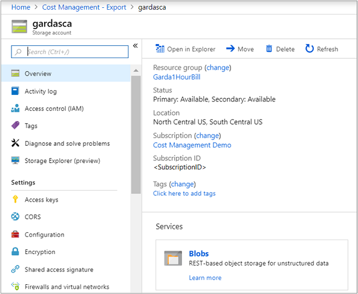
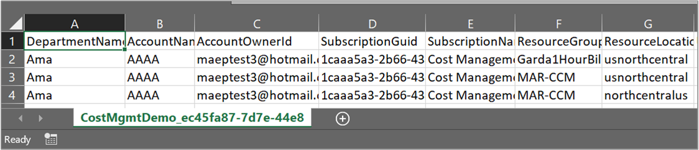
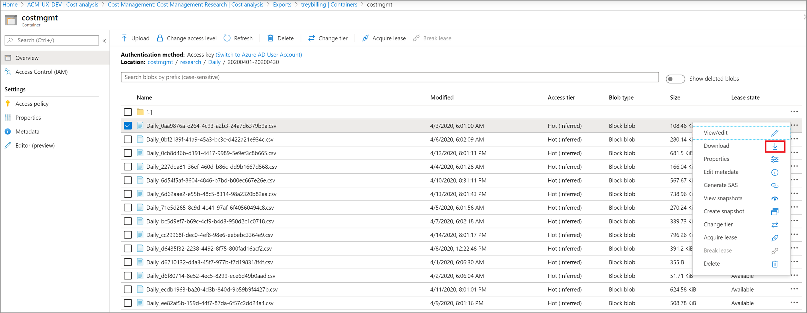

# Tutorial: Create and manage exported data

If you read the Cost Analysis tutorial, then you're familiar with manually downloading your Cost Management data. However, you can create a recurring task that automatically exports your Cost Management data to Azure storage on a daily, weekly, or monthly basis. Exported data is in CSV format and it contains all the information that Cost Management collects. You can then use the exported data in Azure storage with external systems and combine it with your own custom data. And you can use your exported data in an external system like a dashboard or other financial system.

Watch the [How to schedule exports to storage with Cost Management](https://www.youtube.com/watch?v=rWa_xI1aRzo) video about creating a scheduled export of your Azure cost data to Azure Storage. To watch other videos, visit the [Cost Management YouTube channel](https://www.youtube.com/c/AzureCostManagement).

>[!VIDEO https://www.youtube.com/embed/rWa_xI1aRzo]

The examples in this tutorial walk you through exporting your cost management data and then verify that the data was successfully exported.

In this tutorial, you learn how to:

> [!div class="checklist"]
> * Create a daily export
> * Verify that data is collected

## Prerequisites

Data export is available for various Azure account types, including [Enterprise Agreement (EA)](https://azure.microsoft.com/pricing/enterprise-agreement/) and [Microsoft Customer Agreement](get-started-partners.md) customers. To view the full list of supported account types, see [Understand Cost Management data](understand-cost-mgt-data.md). The following Azure permissions, or scopes, are supported per subscription for data export by user and group. For more information about scopes, see [Understand and work with scopes](understand-work-scopes.md).

- Owner - Can create, modify, or delete scheduled exports for a subscription.
- Contributor - Can create, modify, or delete their own scheduled exports. Can modify the name of scheduled exports created by others.
- Reader - Can schedule exports that they have permission to.
    - **For more information about scopes, including access needed to configure exports for Enterprise Agreement and Microsoft Customer agreement scopes, see [Understand and work with scopes](understand-work-scopes.md)**.

For Azure Storage accounts:
- Write permissions are required to change the configured storage account, independent of permissions on the export.
- Your Azure storage account must be configured for blob or file storage.
- To export to storage accounts with configured firewalls, you need other privileges on the storage account. The other privileges are only required during export creation or modification. They are:
  - Owner role on the storage account.  
  Or
  - Any custom role with `Microsoft.Authorization/roleAssignments/write` and `Microsoft.Authorization/permissions/read` permissions.  
  Additionally, ensure that you enable [Allow trusted Azure service access](../../storage/common/storage-network-security.md#grant-access-to-trusted-azure-services) to the storage account when you configure the firewall.
- The storage account configuration must have the **Permitted scope for copy operations (preview)** option set to **From any storage account**.
  >[!NOTE]
  > Export to storage accounts behind firewall is in preview.  

    :::image type="content" source="./media/tutorial-export-acm-data/permitted-scope-copy-operations.png" alt-text="Screenshot showing the From any storage account option set." lightbox="./media/tutorial-export-acm-data/permitted-scope-copy-operations.png" :::

If you have a new subscription, you can't immediately use Cost Management features. It might take up to 48 hours before you can use all Cost Management features.

## Sign in to Azure
Sign in to the Azure portal at [https://portal.azure.com](https://portal.azure.com/).

## Create a daily export

### [Portal](#tab/azure-portal)

To create or view a data export or to schedule an export, choose a scope in the Azure portal and select **Cost analysis** in the menu. For example, navigate to **Subscriptions**, select a subscription from the list, and then select **Cost analysis** in the menu. At the top of the Cost analysis page, select **Settings**, then **Exports**.

> [!NOTE]
> - Besides subscriptions, you can create exports on resource groups, management groups, departments, and enrollments. For more information about scopes, see [Understand and work with scopes](understand-work-scopes.md).
> - When you're signed in as a partner at the billing account scope or on a customer's tenant, you can export data to an Azure Storage account that's linked to your partner storage account. However, you must have an active subscription in your CSP tenant.

1. Select **Add** and type a name for the export.
1. For the **Metric**, make a selection:
    - **Actual cost (Usage and Purchases)** - Select to export standard usage and purchases
    - **Amortized cost (Usage and Purchases)** - Select to export amortized costs for purchases like Azure reservations and Azure savings plan for compute.
1. For **Export type**, make a selection:
    - **Daily export of month-to-date costs** - Provides a new export file daily for your month-to-date costs. The latest data is aggregated from previous daily exports.
    - **Weekly export of cost for the last seven days** - Creates a weekly export of your costs for the past seven days from the selected start date of your export.
    - **Monthly export of last month's costs** - Provides you with an export of your last month's costs compared to the current month that you create the export. Afterward, the schedule runs an export on the fifth day of every new month with your previous months costs.
    - **One-time export** - Allows you to choose a date range for historical data to export to Azure blob storage. You can export a maximum of 90 days of historical costs from the day you choose. This export runs immediately and is available in your storage account within two hours.
        Depending on your export type, either choose a start date, or choose a **From** and **To** date.
1. Specify the subscription for your Azure storage account, then select a resource group or create a new one.
1. Select the storage account name or create a new one.
1. Select the location (Azure region).
1. Specify the storage container and the directory path that you'd like the export file to go to.
    :::image type="content" source="./media/tutorial-export-acm-data/basics_exports.png" alt-text="New export example" lightbox="./media/tutorial-export-acm-data/basics_exports.png":::
1. Review your export details and select **Create**.

Your new export appears in the list of exports. By default, new exports are enabled. If you want to disable or delete a scheduled export, select any item in the list, and then select either **Disable** or **Delete**.

Initially, it can take 12-24 hours before the export runs. However, it can take up longer before data is shown in exported files.

### [Azure CLI](#tab/azure-cli)

When you create an export programmatically, you must manually register the `Microsoft.CostManagementExports` resource provider with the subscription where the storage account resides. Registration happens automatically when you create the export using the Azure portal. For more information about how to register resource providers, see [Register resource provider](../../azure-resource-manager/management/resource-providers-and-types.md#register-resource-provider).

Start by preparing your environment for the Azure CLI:

[!INCLUDE [azure-cli-prepare-your-environment-no-header.md](~/articles/reusable-content/azure-cli/azure-cli-prepare-your-environment-no-header.md)]

1. After you sign in, to see your current exports, use the [az costmanagement export list](/cli/azure/costmanagement/export#az-costmanagement-export-list) command:

   ```azurecli
   az costmanagement export list --scope "subscriptions/00000000-0000-0000-0000-000000000000"
   ```

   >[!NOTE]
   >
   >* Besides subscriptions, you can create exports for resource groups and management groups. For more information about scopes, see [Understand and work with scopes](understand-work-scopes.md).
   >* When you're signed in as a partner at the billing account scope or on a customer's tenant, you can export data to an Azure Storage account that's linked to your partner storage account. However, you must have an active subscription in your CSP tenant.

1. Create a resource group or use an existing resource group. To create a resource group, use the [az group create](/cli/azure/group#az-group-create) command:

   ```azurecli
   az group create --name TreyNetwork --location "East US"
   ```

1. Create a storage account to receive the exports or use an existing storage account. To create a storage account, use the [az storage account create](/cli/azure/storage/account#az-storage-account-create) command:

   ```azurecli
   az storage account create --resource-group TreyNetwork --name cmdemo
   ```

1. Run the [az costmanagement export create](/cli/azure/costmanagement/export#az-costmanagement-export-create) command to create the export:

   ```azurecli
   az costmanagement export create --name DemoExport --type ActualCost \
   --scope "subscriptions/00000000-0000-0000-0000-000000000000" \
   --storage-account-id /subscriptions/00000000-0000-0000-0000-000000000000/resourceGroups/TreyNetwork/providers/Microsoft.Storage/storageAccounts/cmdemo \
   --storage-container democontainer --timeframe MonthToDate --recurrence Daily \
   --recurrence-period from="2020-06-01T00:00:00Z" to="2020-10-31T00:00:00Z" \
   --schedule-status Active --storage-directory demodirectory
   ```

   For the `--type` parameter, you can choose `ActualCost`, `AmortizedCost`, or `Usage`.

   This example uses `MonthToDate`. The export creates an export file daily for your month-to-date costs. The latest data is aggregated from previous daily exports this month.

1. To see the details of your export operation, use the [az costmanagement export show](/cli/azure/costmanagement/export#az-costmanagement-export-show) command:

   ```azurecli
   az costmanagement export show --name DemoExport \
      --scope "subscriptions/00000000-0000-0000-0000-000000000000"
   ```

1. Update an export by using the [az costmanagement export update](/cli/azure/costmanagement/export#az-costmanagement-export-update) command:

   ```azurecli
   az costmanagement export update --name DemoExport
      --scope "subscriptions/00000000-0000-0000-0000-000000000000" --storage-directory demodirectory02
   ```

   This example changes the output directory.

>[!NOTE]
>Initially, it can take 12-24 hours before the export runs. However, it can take longer before data is shown in exported files.

You can delete an export by using the [az costmanagement export delete](/cli/azure/costmanagement/export#az-costmanagement-export-delete) command:

```azurecli
az costmanagement export delete --name DemoExport --scope "subscriptions/00000000-0000-0000-0000-000000000000"
```

### [Azure PowerShell](#tab/azure-powershell)

When you create an export programmatically, you must manually register the `Microsoft.CostManagementExports` resource provider with the subscription where the storage account resides. Registration happens automatically when you create the export using the Azure portal. For more information about how to register resource providers, see [Register resource provider](../../azure-resource-manager/management/resource-providers-and-types.md#register-resource-provider).

Start by preparing your environment for Azure PowerShell:

[!INCLUDE [azure-powershell-requirements-no-header.md](../../../includes/azure-powershell-requirements-no-header.md)]

  > [!IMPORTANT]
  > While the **Az.CostManagement** PowerShell module is in preview, you must install it separately
  > using the `Install-Module` cmdlet. After this PowerShell module becomes generally available, it
  > will be part of future Az PowerShell module releases and available by default from within Azure
  > Cloud Shell.

  ```azurepowershell-interactive
  Install-Module -Name Az.CostManagement
  ```

1. After you sign in, to see your current exports, use the [Get-AzCostManagementExport](/powershell/module/Az.CostManagement/get-azcostmanagementexport) cmdlet:

   ```azurepowershell-interactive
   Get-AzCostManagementExport -Scope 'subscriptions/00000000-0000-0000-0000-000000000000'
   ```

   >[!NOTE]
   >
   >* Besides subscriptions, you can create exports for resource groups and management groups. For more information about scopes, see [Understand and work with scopes](understand-work-scopes.md).
   >* When you're signed in as a partner at the billing account scope or on a customer's tenant, you can export data to an Azure Storage account that's linked to your partner storage account. However, you must have an active subscription in your CSP tenant.

1. Create a resource group or use an existing resource group. To create a resource group, use the [New-AzResourceGroup](/powershell/module/az.resources/new-azresourcegroup) cmdlet:

   ```azurepowershell-interactive
   New-AzResourceGroup -Name TreyNetwork -Location eastus
   ```

1. Create a storage account to receive the exports or use an existing storage account. To create a storage account, use the [New-AzStorageAccount](/powershell/module/az.storage/new-azstorageaccount) cmdlet:

   ```azurepowershell-interactive
   New-AzStorageAccount -ResourceGroupName TreyNetwork -AccountName cmdemo -SkuName Standard_RAGRS -Location eastus
   ```

1. Run the [New-AzCostManagementExport](/powershell/module/Az.CostManagement/new-azcostmanagementexport) cmdlet to create the export:

   ```azurepowershell-interactive
   $Params = @{
     Name = 'DemoExport'
     DefinitionType = 'ActualCost'
     Scope = 'subscriptions/00000000-0000-0000-0000-000000000000'
     DestinationResourceId = '/subscriptions/00000000-0000-0000-0000-000000000000/resourceGroups/treynetwork/providers/Microsoft.Storage/storageAccounts/cmdemo'
     DestinationContainer = 'democontainer'
     DefinitionTimeframe = 'MonthToDate'
     ScheduleRecurrence = 'Daily'
     RecurrencePeriodFrom = '2020-06-01T00:00:00Z'
     RecurrencePeriodTo = '2020-10-31T00:00:00Z'
     ScheduleStatus = 'Active'
     DestinationRootFolderPath = 'demodirectory'
     Format = 'Csv'
   }
   New-AzCostManagementExport @Params
   ```

   For the **DefinitionType** parameter, you can choose `ActualCost`, `AmortizedCost`, or `Usage`.

   This example uses `MonthToDate`. The export creates an export file daily for your month-to-date costs. The latest data is aggregated from previous daily exports this month.

1. To see the details of your export operation, use the `Get-AzCostManagementExport` cmdlet:

   ```azurepowershell-interactive
   Get-AzCostManagementExport -Scope 'subscriptions/00000000-0000-0000-0000-000000000000'
   ```

1. Update an export by using the [Update-AzCostManagementExport](/powershell/module/Az.CostManagement/update-azcostmanagementexport) cmdlet:

   ```azurepowershell-interactive
   Update-AzCostManagementExport -Name DemoExport -Scope 'subscriptions/00000000-0000-0000-0000-000000000000' -DestinationRootFolderPath demodirectory02
   ```

   This example changes the output directory.

>[!NOTE]
>Initially, it can take 12-24 hours before the export runs. However, it can take longer before data is shown in exported files.

You can delete an export by using the [Remove-AzCostManagementExport](/powershell/module/Az.CostManagement/remove-azcostmanagementexport) cmdlet:

```azurepowershell-interactive
Remove-AzCostManagementExport -Name DemoExport -Scope 'subscriptions/00000000-0000-0000-0000-000000000000'
```

---

### Configure exports for storage accounts with a firewall

If you need to export to a storage account behind the firewall for security and compliance requirements, ensure that you have all [prerequisites](#prerequisites) met.

Enable **Allow trusted Azure services access** on the storage account from the Exports page. Here's a screenshot showing the page.

:::image type="content" source="./media/tutorial-export-acm-data/allow-trusted-access.png" alt-text="Screenshot showing the Allow trusted Azure services access option." lightbox="./media/tutorial-export-acm-data/allow-trusted-access.png" :::

A system-assigned managed identity is created for a new job export when it's created or modified. You must have permissions because Cost Management uses the privilege to assign the *StorageBlobDataContributor* role to the managed identity. The permission is restricted to the storage account container scope. After the export job is created or updated, the user doesn't require Owner permissions for regular runtime operations.

> [!NOTE]
> - When a user updates destination details or deletes an export, the *StorageBlobDataContributor* role assigned to the managed identity is automatically removed. To enable the system to remove the role assignment, the user must have `microsoft.Authorization/roleAssignments/delete` permissions. If the permissions aren't available, the user needs to manually remove the role assignment on the managed identity.
> - Currently, firewalls are supported for storage accounts in the same tenant. However, firewalls on storage accounts aren't supported for cross-tenant exports.

Add exports to the list of trusted services. For more information, see [Trusted access based on a managed identity](../../storage/common/storage-network-security.md#trusted-access-based-on-a-managed-identity).

### Export schedule

Scheduled exports are affected by the time and day of week of when you initially create the export. When you create a scheduled export, the export runs at the same frequency for each export that runs later. For example, for a daily export of month-to-date costs export set at a daily frequency, the export runs during once each UTC day. Similarly for a weekly export, the export runs every week on the same UTC day as it is scheduled. Individual export runs can occur at different times throughout the day. So, avoid taking a firm dependency on the exact time of the export runs. Run timing depends on the active load present in Azure during a given UTC day. When an export run begins, your data should be available within 4 hours.

Exports are scheduled using Coordinated Universal Time (UTC). The Exports API always uses and displays UTC.

- When you create an export using the [Exports API](/rest/api/cost-management/exports/create-or-update?tabs=HTTP), specify the `recurrencePeriod` in UTC time. The API doesn’t convert your local time to UTC.
    - Example - A weekly export is scheduled on Friday, August 19 with `recurrencePeriod` set to 2:00 PM. The API receives the input as 2:00 PM UTC, Friday, August 19. The weekly export is scheduled to run every Friday.
- When you create an export in the Azure portal, its start date time is automatically converted to the equivalent UTC time.
    - Example - A weekly export is scheduled on Friday, August 19 with the local time of 2:00 AM IST (UTC+5:30) from the Azure portal. The API receives the input as 8:30 PM, Thursday, August 18. The weekly export is scheduled to run every Thursday.

Each export creates a new file, so older exports aren't overwritten.

#### Create an export for multiple subscriptions

If you have an Enterprise Agreement, then you can use a management group to aggregate subscription cost information in a single container. Then you can export cost management data for the management group. When you create an export in the Azure portal, select the **Actual Costs** option. When you create a management group export using the API, create a *usage export*. Currently, exports at the management group scope only support usage charges. Purchases including reservations and savings plans aren't present in your exports file.

Exports for management groups of other subscription types aren't supported.

1. If you haven't already created a management group, create one group and assign subscriptions to it.
1. In cost analysis, set the scope to your management group and select **Select this management group**.
    :::image type="content" source="./media/tutorial-export-acm-data/management-group-scope.png" alt-text="Example showing the Select this management group option" lightbox="./media/tutorial-export-acm-data/management-group-scope.png":::
1. Create an export at the scope to get cost management data for the subscriptions in the management group.
    :::image type="content" source="./media/tutorial-export-acm-data/new-export-management-group-scope.png" alt-text="Example showing the Create new export option with a management group scope":::

### File partitioning for large datasets

If you have a Microsoft Customer Agreement, Microsoft Partner Agreement, or Enterprise Agreement, you can enable Exports to chunk your file into multiple smaller file partitions to help with data ingestion. When you initially configure your export, set the **File Partitioning** setting to **On**. The setting is **Off** by default.

:::image type="content" source="./media/tutorial-export-acm-data/file-partition.png" alt-text="Screenshot showing File Partitioning option." lightbox="./media/tutorial-export-acm-data/file-partition.png" :::

If you don't have a Microsoft Customer Agreement, Microsoft Partner Agreement, or Enterprise Agreement, then you don't see the **File Partitioning** option.

Partitioning isn't currently supported for resource groups or management group scopes.

#### Update existing exports to use file partitioning

If you have existing exports and you want to set up file partitioning, create a new export. File partitioning is only available with the latest Exports version. There may be minor changes to some of the fields in the usage files that get created.

If you enable file partitioning on an existing export, you may see minor changes to the fields in file output. Any changes are due to updates that were made to Exports after you initially set yours up.

#### Partitioning output

When file partitioning is enabled, you get a file for each partition of data in the export along with a _manifest.json file. The manifest contains a summary of the full dataset and information for each file partition in it. Each file partition has headers and contains only a subset of the full dataset. To handle the full dataset, you must ingest each partition of the export.

Here's a _manifest.json example manifest file.

```json
{
  "manifestVersion": "2021-01-01",
  "dataFormat": "csv",
  "blobCount": 1,
  "byteCount": 160769,
  "dataRowCount": 136,
  "blobs": [
    {
      "blobName": "blobName.csv",
      "byteCount": 160769,
      "dataRowCount": 136,
      "headerRowCount": 1,
      "contentMD5": "md5Hash"
    }
  ]
}
```

### Export versions

When you create a scheduled export in the Azure portal or with the API, it always runs on the exports version used at creation time. Azure keeps your previously created exports on the same version, unless you update it. Doing so prevents changes in the charges and to CSV fields if the export version is changed. As the export functionality changes over time, field names are sometimes changed and new fields are added.

If you want to use the latest data and fields available, we recommend that you create a new export in the Azure portal. To update an existing export to the latest version, update it in the Azure portal or with the latest Export API version. Updating an existing export might cause you to see minor differences in the fields and charges in files that are produced afterward.

## Verify that data is collected

You can easily verify that your Cost Management data is being collected and view the exported CSV file using Azure Storage Explorer.

In the export list, select the storage account name. On the storage account page, select Open in Explorer. If you see a confirmation box, select **Yes** to open the file in Azure Storage Explorer.



In Storage Explorer, navigate to the container that you want to open and select the folder corresponding to the current month. A list of CSV files is shown. Select one and then select **Open**.


The file opens with the program or application that's set to open CSV file extensions. Here's an example in Excel.



### Download an exported CSV data file

You can also download the exported CSV file in the Azure portal. The following steps explain how to find it from cost analysis.

1. In cost analysis, select **Settings**, and then select **Exports**.
1. In the list of exports, select the storage account for an export.
1. In your storage account, select **Containers**.
1. In list of containers, select the container.
1. Navigate through the directories and storage blobs to the date you want.
1. Select the CSV file and then select **Download**.

[](./media/tutorial-export-acm-data/download-export.png#lightbox)

## View export run history

You can view the run history of your scheduled export by selecting an individual export in the exports list page. The exports list page also provides you with quick access to view the run time of your previous exports and the next time and export will run. Here's an example showing the run history.

:::image type="content" source="./media/tutorial-export-acm-data/run-history.png" alt-text="Screenshot shows the Exports pane.":::

Select an export to view the run history.

:::image type="content" source="./media/tutorial-export-acm-data/single-export-run-history.png" alt-text="Screenshot shows the run history of an export.":::

### Export runs twice a day for the first five days of the month

If you've created a daily export, you have two runs per day for the first five days of each month. One run executes and creates a file with the current month’s cost data. It's the run that's available for you to see in the run history. A second run also executes to create a file with all the costs from the prior month. The second run isn't currently visible in the run history. Azure executes the second run to ensure that your latest file for the past month contains all charges exactly as seen on your invoice. It runs because there are cases where latent usage and charges are included in the invoice up to 72 hours after the calendar month has closed. To learn more about Cost Management usage data updates, see [Cost and usage data updates and retention](understand-cost-mgt-data.md#cost-and-usage-data-updates-and-retention). 

## Access exported data from other systems

One of the purposes of exporting your Cost Management data is to access the data from external systems. You might use a dashboard system or other financial system. Such systems vary widely so showing an example wouldn't be practical.  However, you can get started with accessing your data from your applications at [Introduction to Azure Storage](../../storage/common/storage-introduction.md).

## Next steps

In this tutorial, you learned how to:

> [!div class="checklist"]
> * Create a daily export
> * Verify that data is collected

Advance to the next tutorial to optimize and improve efficiency by identifying idle and underutilized resources.

> [!div class="nextstepaction"]
> [Review and act on optimization recommendations](tutorial-acm-opt-recommendations.md)
