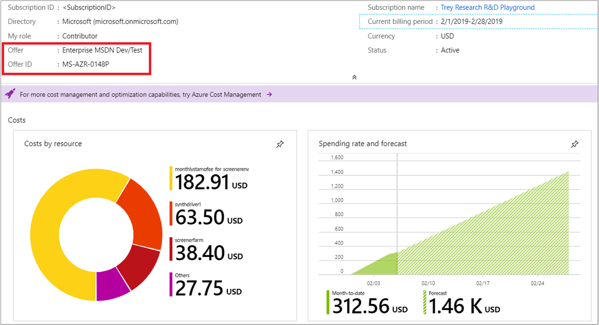

# Understand Cost Management data

This article helps you better understand Azure cost and usage data that's included in Azure Cost Management. It explains how frequently data is processed, collected, shown, and closed. You're billed for Azure usage monthly. Although billing cycles are monthly periods, cycle start and end dates vary by subscription type. How often Cost Management receives usage data varies based on different factors. Such factors include how long it takes to process the data and how frequently Azure services emit usage to the billing system.

Cost Management includes all usage and purchases, including reservations and third-party offerings for Enterprise Agreement (EA) accounts. Microsoft Customer Agreement accounts and individual subscriptions with pay-as-you-go rates  only include usage from Azure and Marketplace services. Support and other costs are not included. Costs are estimated until an invoice is generated and do not factor in credits.

## Supported Microsoft Azure offers

The following information shows the currently supported [Microsoft Azure offers](https://azure.microsoft.com/support/legal/offer-details/) in Azure Cost Management. An Azure offer is the type of the Azure subscription that you have. Data is available in Cost Management starting on the **Data available from** date. If a subscription changes offers, costs before the offer change date will not be available.

| **Category**  | **Offer name** | **Quota ID** | **Offer number** | **Data available from** |
| --- | --- | --- | --- | --- |
| **Azure Government** | Azure Government Enterprise                                                         | EnterpriseAgreement_2014-09-01 | MS-AZR-USGOV-0017P | May 20141 |
| **Enterprise Agreement (EA)** | Enterprise Dev/Test                                                        | MSDNDevTest_2014-09-01 | MS-AZR-0148P | May 20141 |
| **Enterprise Agreement (EA)** | [Microsoft Azure Enterprise](https://azure.microsoft.com/offers/enterprise-agreement-support-upgrade) | EnterpriseAgreement_2014-09-01 | MS-AZR-0017P | May 20141 |
| **Microsoft Customer Agreement** | [Microsoft Azure Plan](https://azure.microsoft.com/offers/ms-azr-0017g) | EnterpriseAgreement_2014-09-01 | N/A | March 20193 |
| **Microsoft Customer Agreement** | [Microsoft Azure Plan for Dev/Test](https://azure.microsoft.com/offers/ms-azr-0148g) | MSDNDevTest_2014-09-01 | N/A | March 20193 |
| **Microsoft Customer Agreement supported by partners** | Microsoft Azure Plan | CSP_2015-05-01, CSP_MG_2017-12-01, and CSPDEVTEST_2018-05-01  The quota ID is reused for Microsoft Customer Agreement and legacy CSP subscriptions. Currently, only Microsoft Customer Agreement subscriptions are supported. | N/A | October 2019 |
| **Microsoft Developer Network (MSDN)** | [MSDN Platforms](https://azure.microsoft.com/offers/ms-azr-0062p)4 | MSDN_2014-09-01 | MS-AZR-0062P | October 2, 20182 |
| **Pay-As-You-Go** | [Pay-As-You-Go](https://azure.microsoft.com/offers/ms-azr-0003p)                  | PayAsYouGo_2014-09-01 | MS-AZR-0003P | October 2, 20182 |
| **Pay-As-You-Go** | [Pay-As-You-Go Dev/Test](https://azure.microsoft.com/offers/ms-azr-0023p)         | MSDNDevTest_2014-09-01 | MS-AZR-0023P | October 2, 20182 |
| **Pay-As-You-Go** | [Microsoft Partner Network](https://azure.microsoft.com/offers/ms-azr-0025p)      | MPN_2014-09-01 | MS-AZR-0025P | October 2, 20182 |
| **Pay-As-You-Go** | [Free Trial](https://azure.microsoft.com/offers/ms-azr-0044p)4         | FreeTrial_2014-09-01 | MS-AZR-0044P | October 2, 20182 |
| **Pay-As-You-Go** | [Azure in Open](https://azure.microsoft.com/offers/ms-azr-0111p)4      | AzureInOpen_2014-09-01 | MS-AZR-0111P | October 2, 20182 |
| **Pay-As-You-Go** | Azure Pass4                                                            | AzurePass_2014-09-01 | MS-AZR-0120P, MS-AZR-0122P - MS-AZR-0125P, MS-AZR-0128P - MS-AZR-0130P | October 2, 20182 |
| **Visual Studio** | [Visual Studio Enterprise – MPN](https://azure.microsoft.com/offers/ms-azr-0029p)4     | MPN_2014-09-01 | MS-AZR-0029P | October 2, 20182 |
| **Visual Studio** | [Visual Studio Professional](https://azure.microsoft.com/offers/ms-azr-0059p)4         | MSDN_2014-09-01 | MS-AZR-0059P | October 2, 20182 |
| **Visual Studio** | [Visual Studio Test Professional](https://azure.microsoft.com/offers/ms-azr-0060p)4    | MSDNDevTest_2014-09-01 | MS-AZR-0060P | October 2, 20182 |
| **Visual Studio** | [Visual Studio Enterprise](https://azure.microsoft.com/offers/ms-azr-0063p)4           | MSDN_2014-09-01 | MS-AZR-0063P | October 2, 20182 |
| **Visual Studio** | [Visual Studio Enterprise: BizSpark](https://azure.microsoft.com/offers/ms-azr-0064p)4 | MSDN_2014-09-01 | MS-AZR-0064P | October 2, 20182 |

_**1** For data before May 2014, visit the [Azure Enterprise portal](https://ea.azure.com)._

_**2** For data before October 2, 2018, visit the [Azure Account Center](https://account.azure.com/subscriptions)._

_**3** Microsoft Customer Agreements started in March 2019 and do not have any historical data before this point._

_**4** Historical data for credit-based and pay-in-advance subscriptions might not match your invoice. See [Historical data may not match invoice](#historical-data-might-not-match-invoice) below._

The following offers are not supported yet:

| Category  | **Offer name** | **Quota ID** | **Offer number** |
| --- | --- | --- | --- |
| **Azure Germany** | [Azure Germany Pay-As-You-Go](https://azure.microsoft.com/offers/ms-azr-de-0003p) | PayAsYouGo_2014-09-01 | MS-AZR-DE-0003P |
| **Azure Government** | Azure Government Pay-As-You-Go | PayAsYouGo_2014-09-01 | MS-AZR-USGOV-0003P |
| **Cloud Solution Provider (CSP)** | Microsoft Azure                                    | CSP_2015-05-01 | MS-AZR-0145P |
| **Cloud Solution Provider (CSP)** | Azure Government CSP                               | CSP_2015-05-01 | MS-AZR-USGOV-0145P |
| **Cloud Solution Provider (CSP)** | Azure Germany in CSP for Microsoft Cloud Germany   | CSP_2015-05-01 | MS-AZR-DE-0145P |
| **Pay-As-You-Go**                 | Azure for Students Starter | DreamSpark_2015-02-01 | MS-AZR-0144P |
| **Pay-As-You-Go** | [Azure for Students](https://azure.microsoft.com/offers/ms-azr-0170p)4 | AzureForStudents_2018-01-01 | MS-AZR-0170P |
| **Pay-As-You-Go**                 | [Microsoft Azure Sponsorship](https://azure.microsoft.com/offers/ms-azr-0036p/) | Sponsored_2016-01-01 | MS-AZR-0036P |
| **Support Plans** | Standard support                    | Default_2014-09-01 | MS-AZR-0041P |
| **Support Plans** | Professional Direct support         | Default_2014-09-01 | MS-AZR-0042P |
| **Support Plans** | Developer support                   | Default_2014-09-01 | MS-AZR-0043P |
| **Support Plans** | Germany support plan                | Default_2014-09-01 | MS-AZR-DE-0043P |
| **Support Plans** | Azure Government Standard Support   | Default_2014-09-01 | MS-AZR-USGOV-0041P |
| **Support Plans** | Azure Government Pro-Direct Support | Default_2014-09-01 | MS-AZR-USGOV-0042P |
| **Support Plans** | Azure Government Developer Support  | Default_2014-09-01 | MS-AZR-USGOV-0043P |

## Determine your offer type
If you don't see data for a subscription and you want to determine if your subscription falls under the supported offers, you can validate that your subscription is supported. To validate that an Azure subscription is supported, sign-in to the [Azure portal](https://portal.azure.com). Then select **All Services** in the left menu pane. In the list of services, select **Subscriptions**. In the subscription list menu, click on the subscription that you want to verify. Your subscription is shown on the Overview tab and you can see the **Offer** and **Offer ID**. The following image shows an example.

## Costs included in Cost Management

The following tables show data that's included or isn't in Cost Management. All costs are estimated until an invoice is generated. Costs shown do not include free and prepaid credits.

**Cost and usage data**

| **Included** | **Not included** |
| --- | --- |
| Azure service usage5        | Support charges - For more information, see [Invoice terms explained](../understand/understand-invoice.md). |
| Marketplace offering usage6 | Taxes - For more information, see [Invoice terms explained](../understand/understand-invoice.md). |
| Marketplace purchases6      | Credits - For more information, see [Invoice terms explained](../understand/understand-invoice.md). |
| Reservation purchases7      |  |
| Amortization of reservation purchases7      |  |

_**5** Azure service usage is based on reservation and negotiated prices._

_**6** Marketplace purchases are not available for Pay-As-You-Go, MSDN, and Visual Studio offers at this time._

_**7** Reservation purchases are only available for Enterprise Agreement (EA) accounts at this time._

**Metadata**

| **Included** | **Not included** |
| --- | --- |
| Resource tags8 | Resource group tags |

_**8** Resource tags are applied as usage is emitted from each service and aren't available retroactively to historical usage._

## Rated usage data refresh schedule

Cost and usage data is available in Cost Management + Billing in the Azure portal and [supporting APIs](../index.yml). Keep the following points in mind as you review costs:

- Estimated charges for the current billing period are updated six times per day.
- Estimated charges for the current billing period can change as you incur more usage.
- Each update is cumulative and includes all the line items and information from the previous update.
- Azure finalizes or _closes_ the current billing period up to 72 hours (three calendar days) after the billing period ends.

The following examples illustrate how billing periods could end.

Enterprise Agreement (EA) subscriptions – If the billing month ends on March 31, estimated charges are updated up to 72 hours later. In this example, by midnight (UTC) April 4.

Pay-as-you-go subscriptions – If the billing month ends on May 15, then the estimated charges might get updated up to 72 hours later. In this example, by midnight (UTC) May 19.

### Rerated data

Whether you use the [Cost Management APIs](../index.yml), Power BI, or the Azure portal to retrieve data, expect the current billing period's charges to get rerated, and consequently change, until the invoice is closed.

## Usage data update frequency varies

The availability of your incurred usage data in Cost Management depends on a couple of factors, including:

- How frequently Azure services (such as Storage, Compute, CDN, and SQL) emit usage.
- The time taken to process the usage data through the rating engine and cost management pipelines.

Some services emit usage more frequently than others. So, you might see data in Cost Management for some services sooner than other services that emit data less frequently. Typically, usage for services takes 8-24 hours to appear in Cost Management. Keep in mind that data for an open month gets refreshed as you incur more usage because updates are cumulative.

## Historical data might not match invoice

Historical data for credit-based and pay-in-advance offers might not match your invoice. Some Azure pay-as-you-go, MSDN, and Visual Studio offers can have Azure credits and advanced payments applied to the invoice. However, the historical data shown in Cost Management is based on your estimated consumption charges only. Cost Management historical data doesn't include payments and credits. As a result, the historical data shown for the following offers may not match exactly with your invoice.

- Azure for Students (MS-AZR-0170P)
- Azure in Open (MS-AZR-0111P)
- Azure Pass (MS-AZR-0120P, MS-AZR-0123P, MS-AZR-0125P, MS-AZR-0128P, MS-AZR-0129P)
- Free Trial (MS-AZR-0044P)
- MSDN (MS-AZR-0062P)
- Visual Studio (MS-AZR-0029P, MS-AZR-0059P, MS-AZR-0060P, MS-AZR-0063P, MS-AZR-0064P)

## See also

- If you haven't already completed the first quickstart for Cost Management, read it at [Start analyzing costs](../../cost-management/quick-acm-cost-analysis.md).
