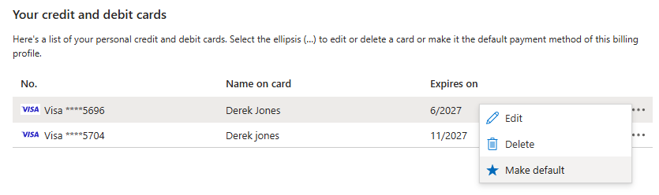

# Account Administrator tasks in the Azure portal

This article explains how to perform the following tasks in the Azure portal:
- Manage your subscription's payment methods
- Remove your subscription's spending limit
- Add credits to your Azure in Open subscription

You must be the Account Administrator to perform any of these tasks.

## Edit your subscription's payment methods

> [!NOTE]
> The Reserve Bank of India has new regulations for storing credit card information that may impact credit card users in India. For more information, see [Reserve Bank of India](../understand/pay-bill.md#reserve-bank-of-india).

1. Sign in to the Azure portal as the Account Administrator.

1. Search for **Cost Management + Billing,** in the top search bar.

1. Inside of **Products + services**, select "All billing subscriptions" or "Azure Subscriptions".  Then select the subscription from the list that you'd like to replace the credit card to.

   
   
   > [!NOTE]
   > If you don't see some of your subscriptions here, it might be because you changed the subscription directory at some point. For these subscriptions, you need to switch the directory to the original directory (the directory in which you initially signed up). Then, repeat step 2. Also, if you have multiple billing scopes, make sure you select the right one that contains the subscription you want to update.
   
1. Select the billing profile name associated to your subscription

   > [!NOTE]
   > A billing profile is the commercial scope that manages how you pay for Microsoft products and services.  Each billing profile is tied to a billing account, and you can have multiple billing profiles associate to a single billing account to manage your billing.
   
1. Select **Manage p****ayment methods** in the shortcuts section.  

1. Here you can add a new credit card, change the default payment method, edit existing credit card details, and delete credit cards.  See the next three sections for details on how to perform these actions.

### Change default payment method for your billing profile

You can change the default payment method on your billing profile by adding a new credit card or choosing one that is already saved. To change the default payment method to a new credit card:

1. Sign in to the Azure portal as the Account Administrator.

1. Search for **Cost Management + Billing,** in the top search bar.

1. Inside of **Billing**, select "Billing profiles".  Then select the billing profile that you want to update.

1. Next, select **payment methods** from the inside of Billing

1. Inside of the list of available credit and debit cards, click the ellipse (...) and select "Make default".

   
   
### Edit credit card details

To edit credit card details such as the expiration date or address: 

1. Select **Edit** from inside of the ellipse (...) drop down next to the credit card that you'd like to edit. A credit card form appears on the right side of the window.

1. Update the credit card details and select **Next**.

### Remove a credit card from the account

> [!NOTE]
> If your credit card is the default payment method for any of your billing profiles, you can't remove it from your Azure account. Change the default payment method for all billing profiles linked to this credit card and try again.  If needed, follow the "Change default payment method for your billing profile" above. 

To delete a credit card from your account: 

1. Select **Delete** from inside of the ellipse (...) drop down next to the credit card that you'd like to remove. A Delete a payment method form appears on the right side of the window.  

1. An eligibility check will be performed to determine if you can safely delete it from your Azure account.  To proceed, select **Delete** at the bottom of the side window. 

### Switch to pay by wire transfer

If you're eligible to pay by wire transfer, you can switch your billing profile to wire transfer in the Azure portal.

1. Sign in to the Azure portal as the Account Administrator.

1. Search for **Cost Management + Billing,** in the top search bar.

1. Inside of **Billing**, select "Billing profiles".  Then select the billing profile that you want to update.

1. Select p

    :::image type="content" border="true" source="./media/account-admin-tasks/subscription-payment-methods-pay-by-invoice.png" alt-text="Screenshot showing the Payment methods page with Pay by invoice selected.":::

1. Enter the address for the invoice payment method.
1. Select **Next**.

If you want to be approved to pay by invoice, see [learn how to pay by invoice](pay-by-invoice.md).

### Edit invoice payment address

To edit the address of your invoice payment method, select **Invoice** in the list of payment methods for your subscription. The address form opens on the right side of the window.

## Remove spending limit

The spending limit in Azure prevents spending over your credit amount. You can remove the spending limit at any time as long as there's a valid payment method associated with your Azure subscription. If you have a subscription type like Visual Studio Enterprise or Visual Studio Professional, which provides credit over several months, you can reactivate the spending limit at the start of your upcoming billing cycle.

The spending limit isn’t available for subscriptions with commitment plans or with pay-as-you-go pricing.

1. Sign in to the Azure portal as the Account Administrator.
1. Search for **Cost Management + Billing**.

    :::image type="content" border="true" source="./media/account-admin-tasks/search-bar.png" alt-text="Screenshot that shows search for Cost Management + Billing.":::

1. In the **My subscriptions** list, select your Visual Studio Enterprise subscription.

   :::image type="content" border="true" source="./media/account-admin-tasks/cost-management-overview-msdn-x.png" alt-text="Screenshot that shows the My subscriptions area where you can select your Visual Studio Enterprise subscription.":::

    > [!NOTE]
    > If you don't see some of your Visual Studio subscriptions here, it might be because you changed a subscription directory at some point. For these subscriptions, you need to switch the directory to the original directory (the directory in which you initially signed up). Then, repeat step 2.

1. In the Subscription overview, select the orange banner to remove the spending limit.

    :::image type="content" border="true" source="./media/account-admin-tasks/msdn-remove-spending-limit-banner-x.png" alt-text="Screenshot that shows the remove spending limit banner.":::

1. Choose whether you want to remove the spending limit indefinitely or for the current billing period only.

   :::image type="content" border="true" source="./media/account-admin-tasks/remove-spending-limit-blade-x.png" alt-text="Screenshot that shows the remove spending limit page and options.":::

1. Select **Select payment method** to choose a payment method for your subscription. It becomes the active payment method for your subscription.

1. Select **Finish**.

## Add credits to Azure in Open subscription

If you have an Azure in Open Licensing subscription, you can add credits to your subscription. In the Azure portal, enter a product key or buy credits directly with a credit card.

1. Sign in to the Azure portal as the Account Administrator.
1. Search for **Cost Management + Billing**.

    :::image type="content" border="true" source="./media/account-admin-tasks/search-bar.png" alt-text="Screenshot that shows search for Cost Management + Billing.":::

1. In the **My subscriptions** list, select your Azure in Open subscription.

    :::image type="content" border="true" source="./media/account-admin-tasks/cost-management-overview-aio-x.png" alt-text="Screenshot shows the My subscriptions area where you can select your Azure in Open subscription.":::

   > [!NOTE]
   > If you don't see your subscription here, it might be because you changed its directory at some point. You need to switch the subscription's directory to the original directory (the directory in which you initially signed up). Then, repeat step 2.

1. Select **Credit history**.

    :::image type="content" border="true" source="./media/account-admin-tasks/aio-credit-history-blade.png" alt-text="Screenshot that shows credit history.":::

1. In the top left corner, select "+" to add more credits.

    :::image type="content" border="true" source="./media/account-admin-tasks/aio-credit-history-plus.png" alt-text="Screenshot that shows add credits button.":::

1. Select a payment method type in the drop-down. You can either add a product key or purchase credits with a credit card.

    :::image type="content" border="true" source="./media/account-admin-tasks/add-credits-select-payment-method.png" alt-text="Screenshot that shows payment method list in add credits window.":::

1. If you chose product key:
    - Enter the product key
    - Select **Validate**

1. If you chose credit card:
    - Select **Select payment method** to add a credit card or select an existing one.
    - Specify the credit amount you want to add.

1. Select **Apply**

## Usage details files comparison

Use the following information to find the mapping between the fields available in the v1 and v2 versions of the files from the Accounts portal. It also has the latest version of the usage details file in the Azure portal.

| V1 | V2 | Azure portal |
| --- | --- | --- |
| Additional Info | Additional Info | AdditionalInfo |
| Currency | Currency | BillingCurrency |
| Billing Period | Billing Period | BillingPeriodEndDate |
| Billing Period | Billing Period | BillingPeriodStartDate |
| Service | Consumed Service | ConsumedService |
| Value | Value | Cost |
| Usage Date | Usage Date | Date |
| Name | Meter Category | MeterCategory |
| ResourceGuid | Meter Id | MeterId |
| Region | Meter Region | MeterRegion |
| Resource | Meter Name | MeterName  |
| Type | Meter Sub-category | MeterSubcategory |
| Consumed | Consumed Quantity | Quantity |
| Component | Resource Group | ResourceGroup |
|   | Instance Id | ResourceId |
| Sub Region | Resource Location | ResourceLocation |
| Service Info 1 | Service Info 1 | ServiceInfo1 |
| Service Info 2 | Service Info 2 | ServiceInfo2 |
| Subscription ID | Subscription ID | SubscriptionId |
| Subscription Name | Subscription Name | SubscriptionName |
|   | Tags | Tags |
| Unit | Unit | UnitOfMeasure |
| | Rate | UnitPrice |

For more information about the fields available in the latest usage details file, see [Understand the terms in your Azure usage and charges file](../understand/understand-usage.md).

The following fields are from v1 and v2 versions of the files from the Accounts portal. They're no longer available in the latest usage details file.

| V1 | V2 |
| --- | --- |
| Order ID | Order ID |
| Description | Description |
| Billing Date(Anniversary Date) | Billing Date(Anniversary Date) |
| Offer Name | Offer Name |
| Service Name | Service Name |
| Subs Status | Subs Status |
| Subs Extra Status | Subs Extra Status |
| Provisioning Status | Provisioning Status |
| SKU | SKU |
| Included | Included Quantity |
| Billable | Overage Quantity |
| Within Commitment | Within Commitment |
| Commitment Rate | Commitment Rate |
| Overage | Overage |
| Component |  |

## Troubleshooting
We don't support virtual or prepaid cards. If you're getting errors when adding or updating a valid credit card, try opening your browser in private mode.

## Next steps

- Learn more about [analyzing unexpected charges](../understand/analyze-unexpected-charges.md)

