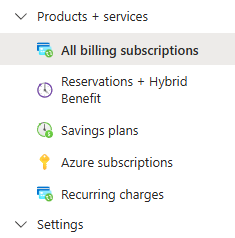
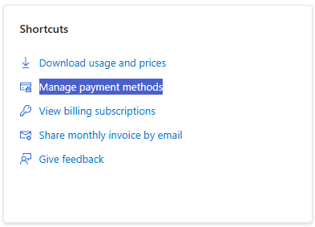
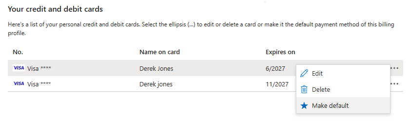
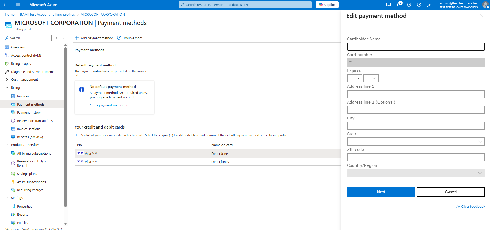
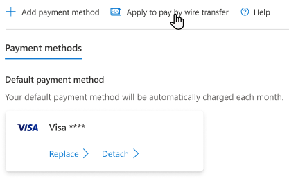
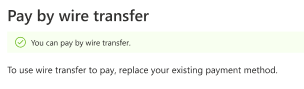
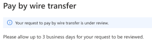

# Payment method tasks in the Azure portal

This article explains how to perform the following payment method tasks in the Azure portal:

- Manage your subscription's payment methods
- Replace the default payment method on your billing profile

- Edit or delete a payment method

- Switch to pay by wire transfer

You must be an owner or contributor on your billing account to perform these tasks.

## Edit your subscription's payment methods

> [!NOTE]
> The Reserve Bank of India has new regulations for storing credit card information that may impact credit card users in India. For more information, see [Reserve Bank of India](../understand/pay-bill.md#reserve-bank-of-india).

1. Sign in to the Azure portal as the Account Administrator.

1. Search for **Cost Management + Billing,** in the top search bar.

1. Inside of **Products + services**, select "All billing subscriptions" or "Azure Subscriptions".  Then select the subscription from the list that you'd like to replace the credit card to.

   
   
   > [!NOTE]
   > If you don't see some of your subscriptions here, it might be because you changed the subscription directory at some point. For these subscriptions, you need to switch the directory to the original directory (the directory in which you initially signed up). Then, repeat step 2. Also, if you have multiple billing scopes, make sure you select the right one that contains the subscription you want to update.
   
1. Select the billing profile name associated to your subscription

   > [!NOTE]
   > A billing profile is the commercial scope that manages how you pay for Microsoft products and services.  Each billing profile is tied to a billing account, and you can have multiple billing profiles associate to a single billing account to manage your billing.
   
1. Select **Manage payment methods** in the shortcuts section.  

1. Here you can add a new credit card, change the default payment method, edit existing credit card details, and delete credit cards.  See the next three sections for details on how to perform these actions.

### Change default payment method for your billing profile

You can change the default payment method on your billing profile by adding a new credit card or choosing one that is already saved. To change the default payment method to a new credit card:

1. Sign in to the Azure portal as the Account Administrator.

1. Search for **Cost Management + Billing,** in the top search bar.

1. Inside of **Billing**, select "Billing profiles".  Then select the billing profile that you want to update.

1. Next, select **payment methods** from the inside of Billing

1. Inside of the list of available credit and debit cards, click the ellipse (...) and select "Make default".

   
### Edit credit card details

To edit credit card details such as the expiration date or address: 

1. Select **Edit** from inside of the ellipse (...) drop down next to the credit card that you'd like to edit. A credit card form appears on the right side of the window.

1. Update the credit card details and select **Next**.

### Remove a credit card from the account

> [!NOTE]
> If your credit card is the default payment method for any of your billing profiles, you can't remove it from your Azure account. Change the default payment method for all billing profiles linked to this credit card and try again.  If needed, follow the "Change default payment method for your billing profile" above. 

To delete a credit card from your account: 

1. Select **Delete** from inside of the ellipse (...) drop down next to the credit card that you'd like to remove. A Delete a payment method form appears on the right side of the window.  

1. An eligibility check will be performed to determine if you can safely delete it from your Azure account.  To proceed, select **Delete** at the bottom of the side window. 

### Switch to pay by wire transfer

If you're eligible to pay by wire transfer, you can switch your billing profile to wire transfer in the Azure portal.

1. Sign in to the Azure portal as the Account Administrator.

1. Search for **Cost Management + Billing,** in the top search bar.

1. Inside of **Billing**, select "Billing profiles".  Then select the billing profile that you want to update.

1. Select **payment methods** from inside of Billing.

1. At the top of the page, select "Apply to pay by wire transfer".

Verification checks are often completed immediately.  If you are approved, you will see the following message in the side window on the left.

If you are required to complete a credit check, you will receive the below message.

**How long does the whole process take?**

The following table describes each step and the typical duration each step takes.

|Step|Duration|
| -------- | -------- |
|Enabling wire transfer payment on your subscription or billing profile|Verification checks are often completed immediately, if a credit check isn’t required.|
|Credit checks (when required)|Typically, credit checks take between three to seven business days, depending on the information required.|
|Wire transfer payment processing (when you make a wire payment)|Can take up to 10 business days to process and post to your account.|

If you want to be approved to pay by invoice, see [learn how to pay by invoice](pay-by-invoice.md).

### Edit your wire transfer billing address

To edit the address of your wire transfer payment method, select **Edit** next to Wire transfer in the list of payment methods for your billing profile. The address form opens on the right side of the window.

## Troubleshooting
We don't support virtual or prepaid cards. If you're getting errors when adding or updating a valid credit card, try opening your browser in private mode.

## Next steps

- Learn more about [analyzing unexpected charges](../understand/analyze-unexpected-charges.md)

