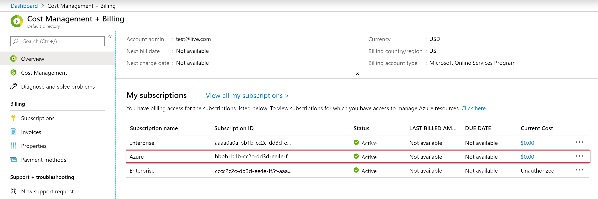

# Account Administrator tasks in the Azure portal

This article explains how to perform the following tasks in the Azure portal:
- Manage your subscription's payment methods
- Remove your subscription's spending limit
- Add credits to your Azure in Open subscription

You must be the Account Administrator to perform any of these tasks.

## Accounts portal is retired

Accounts portal was retired December 31, 2021. The features supported in the Accounts portal were migrated to the Azure portal. This article explains how to perform some of the most common operations in the Azure portal.

## Navigate to your subscription's payment methods

> [!NOTE]
> The Reserve Bank of India has new regulations for storing credit card information that may impact credit card users in India. For more information, see [Reserve Bank of India](../understand/pay-bill.md#reserve-bank-of-india).

1. Sign in to the Azure portal as the Account Administrator.

1. Search for **Cost Management + Billing**.

    

1. In the **My subscriptions** list, select the subscription you'd like to add the credit card to.

   

   > [!NOTE]
   > If you don't see some of your subscriptions here, it might be because you changed the subscription directory at some point. For these subscriptions, you need to switch the directory to the original directory (the directory in which you initially signed up). Then, repeat step 2.

1. Select **Payment methods**.

    

Here you can add a new credit card, change the active payment method, edit credit card details, and delete credit cards.

### Change active payment method

You can change the active payment method by adding a new credit card or choosing one that is already saved. To change the active payment method to a new credit card:

1. In the top-left corner, select “+” to add a credit card.

    

1. Enter credit card details in the form on the right.

    

1. To make this card your active payment method, check the box next to **Make this my active payment method** above the form. This card will become the active payment instrument for all subscriptions using the same card as the selected subscription.

    

1. Select **Next**.

To change the active payment method to a credit card that is already saved:

1. Select the box next to the card you'd like to make the active payment method.

    

1. Select **Set active** in the command bar.

    

### Edit credit card details

To edit credit card details such as the expiration date or address, select the credit card that you'd like to edit. A credit card form will appear on the right.

Update the credit card details and select **Save**.

### Remove a credit card from the account

1. Select the box next to the card you'd like to delete.

    

1. Select **Delete** in the command bar.

    

If your credit card is the active payment method for any of your Microsoft subscriptions, you can't remove it from your Azure account. Change the active payment method for all subscriptions linked to this credit card and try again.

### Switch to invoice payment

If you are eligible to pay by invoice (wire transfer), you can switch your subscription to invoice payment (wire transfer) in the Azure portal.

1. Select **Pay by invoice** in the command bar.

    

1. Enter the address for the invoice payment method.
1. Select **Next**.

If you want to be approved to pay by invoice, see [learn how to pay by invoice](pay-by-invoice.md).

### Edit invoice payment address

To edit the address of your invoice payment method, select **Invoice** in the list of payment methods for your subscription. The address form will open on the right.

## Remove spending limit

The spending limit in Azure prevents spending over your credit amount. You can remove the spending limit at any time as long as there's a valid payment method associated with your Azure subscription. For subscription types that have credit over multiple months such as Visual Studio Enterprise and Visual Studio Professional, you can choose to re-enable the spending limit at the beginning of your next billing period.

The spending limit isn’t available for subscriptions with commitment plans or with pay-as-you-go pricing.

1. Sign in to the Azure portal as the Account Administrator.
1. Search for **Cost Management + Billing**.

    

1. In the **My subscriptions** list, select your Visual Studio Enterprise subscription.

   

    > [!NOTE]
    > If you don't see some of your Visual Studio subscriptions here, it might be because you changed a subscription directory at some point. For these subscriptions, you need to switch the directory to the original directory (the directory in which you initially signed up). Then, repeat step 2.

1. In the Subscription overview, select the orange banner to remove the spending limit.

    

1. Choose whether you want to remove the spending limit indefinitely or for the current billing period only.

   

1. Select **Select payment method** to choose a payment method for your subscription. This will become the active payment method for your subscription.

1. Select **Finish**.

## Add credits to Azure in Open subscription

If you have an Azure in Open Licensing subscription, you can add credits to your subscription in the Azure portal by redeeming a product key or purchasing credits with a credit card.

1. Sign in to the Azure portal as the Account Administrator.
1. Search for **Cost Management + Billing**.

    

1. In the **My subscriptions** list, select your Azure in Open subscription.

    

   > [!NOTE]
   > If you don't see your subscription here, it might be because you changed its directory at some point. You need to switch the subscription's directory to the original directory (the directory in which you initially signed up). Then, repeat step 2.

1. Select **Credit history**.

    

1. In the top left corner, select "+" to add more credits.

    

1. Select a payment method type in the drop-down. You can either add a product key or purchase credits with a credit card.

    

1. If you chose product key:
    - Enter the product key
    - Select **Validate**

1. If you chose credit card:
    - Select **Select payment method** to add a credit card or select an existing one.
    - Specify the amount of credits you want to add.

1. Select **Apply**

## Usage details files comparison

Use the following information to find the mapping between the fields available in the v1 and v2 versions of the files from the Accounts portal and the latest version of the usage details file in the Azure portal.

| V1 | V2 | Azure portal |
| --- | --- | --- |
| Additional Info | Additional Info | AdditionalInfo |
| Currency | Currency | BillingCurrency |
| Billing Period | Billing Period | BillingPeriodEndDate |
| Billing Period | Billing Period | BillingPeriodStartDate |
| Service | Consumed Service | ConsumedService |
| Value | Value | Cost |
| Usage Date | Usage Date | Date |
| Name | Meter Category | MeterCategory |
| ResourceGuid | Meter Id | MeterId |
| Region | Meter Region | MeterRegion |
| Resource | Meter Name | MeterName  |
| Type | Meter Sub-category | MeterSubcategory |
| Consumed | Consumed Quantity | Quantity |
| Component | Resource Group | ResourceGroup |
|   | Instance Id | ResourceId |
| Sub Region | Resource Location | ResourceLocation |
| Service Info 1 | Service Info 1 | ServiceInfo1 |
| Service Info 2 | Service Info 2 | ServiceInfo2 |
| Subscription ID | Subscription ID | SubscriptionId |
| Subscription Name | Subscription Name | SubscriptionName |
|   | Tags | Tags |
| Unit | Unit | UnitOfMeasure |
| | Rate | UnitPrice |

For more information about the fields available in the latest usage details file, see [Understand the terms in your Azure usage and charges file](../understand/understand-usage.md).

The following fields are from v1 and v2 versions of the files from the Accounts portal. They are no longer available in the latest usage details file.

| V1 | V2 |
| --- | --- |
| Order Id | Order Id |
| Description | Description |
| Billing Date(Anniversary Date) | Billing Date(Anniversary Date) |
| Offer Name | Offer Name |
| Service Name | Service Name |
| Subs Status | Subs Status |
| Subs Extra Status | Subs Extra Status |
| Provisioning Status | Provisioning Status |
| SKU | SKU |
| Included | Included Quantity |
| Billable | Overage Quantity |
| Within Commitment | Within Commitment |
| Commitment Rate | Commitment Rate |
| Overage | Overage |
| Component |  |

## Troubleshooting
We do not support virtual or prepaid cards. If you are getting errors when adding or updating a valid credit card, try opening your browser in private mode.

## Next steps
- Learn more about [analyzing unexpected charges](../understand/analyze-unexpected-charges.md)
