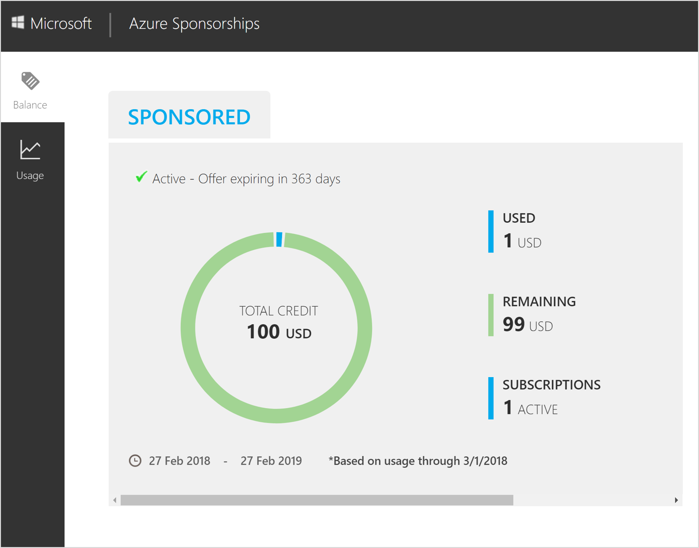
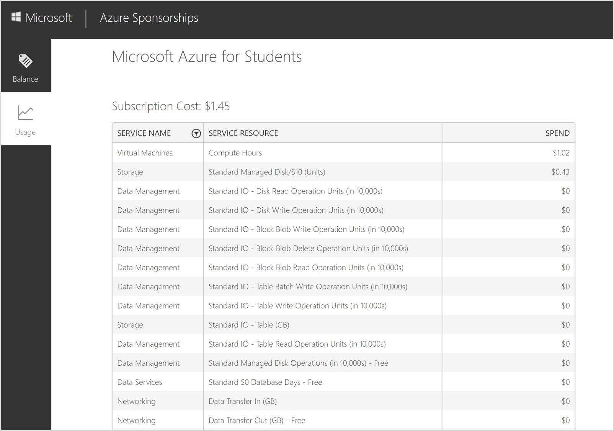

# Why is my Azure for Students subscription disabled and how do I reactivate it?

Your Azure for Students subscription might get disabled because you've used all of your credit, your credit has expired, or you've accidentally canceled your subscription. See what issue applies to you and learn how you can get your subscription reactivated.

## You've used all of your credit

Azure for Students account gives you $100 in credit and a limited quantity of free services for 12 months. Any usage beyond the free services and quantities is deducted from your credit. Once your credit runs out, Azure disables your services and subscription. To continue using Azure services, you must upgrade your subscription to a pay-as-you-go subscription by contacting [Azure support](https://portal.azure.com/?#blade/Microsoft_Azure_Support/HelpAndSupportBlade). After you upgrade, your subscription still has access to free services for 12 months from your sign-up date. You only get charged for usage beyond the free services and quantities.

You can check your remaining credit on the [Microsoft Azure Sponsorships portal](https://www.microsoftazuresponsorships.com/balance)

1. Sign in using your Azure for Students account credentials.
2. The balance page gives information about used and remaining credit. You can find your credit expiration date below the credit chart.  

    

3. To check usage of services that are consuming your Azure credit, select **Usage** from the left navigation then select your Azure for Students subscription.

    

The table contains the following columns:

* **Service Name:** Service that is consuming your Azure credit.
* **Service Resource:** Unit of measurement for the service being consumed.
* **Spend:** Amount of credit in USD($) spent on the service.

## Your credit has expired

Your Azure for Students credit expires at the end of 12 months. Once your credit expires, Azure disables your subscription. To continue using Azure services, you must upgrade your subscription to a Pay-As-You-Go subscription by contacting [Azure support](https://portal.azure.com/?#blade/Microsoft_Azure_Support/HelpAndSupportBlade). After you upgrade, Azure charges you pay-as-you-go rates for any services you're using.

## You've accidentally canceled your subscription

If you've accidentally canceled your Azure for Students subscription, you can reactivate it by contacting [Azure support](https://portal.azure.com/?#blade/Microsoft_Azure_Support/HelpAndSupportBlade). Once you reactivate, you still have access to the remaining credit and free services for 12 months from your sign-up date.

## Need help? Contact us.

If you have questions or need help,  [create a support request](https://go.microsoft.com/fwlink/?linkid=2083458).
