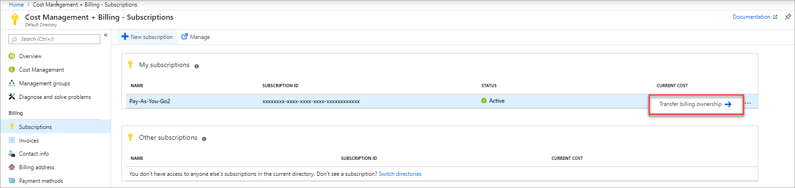
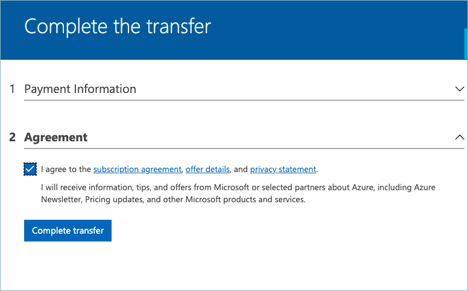
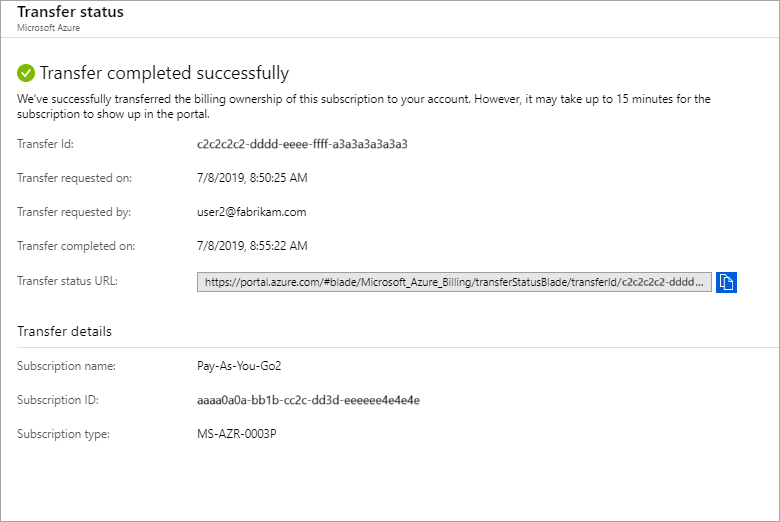

# Transfer billing ownership of an Azure subscription to another account

You might want to transfer billing ownership of your Azure subscription if you are leaving your organization, or you want your subscription to be billed to another account. Transferring billing ownership to another account provides the administrators in the new account permission to perform billing tasks such as change payment method, view charges, and cancel the subscription.

If you want to keep the billing ownership but change the type of your subscription, see [Switch your Azure subscription to another offer](switch-azure-offer.md). If you want to control who can manage resources in the subscription, see [Built-in roles for Azure resources](https://docs.microsoft.com/azure/role-based-access-control/built-in-roles).

If you're an Enterprise Agreement(EA) customer, your enterprise administrators can transfer billing ownership of your subscriptions between accounts. For more information, see [Transfer billing ownership of Enterprise Agreement (EA) subscriptions](#transfer-billing-ownership-of-enterprise-agreement-ea-subscriptions).

## Transfer billing ownership of an Azure subscription

1. Sign in to the [Azure portal](https://portal.azure.com) as an administrator of the billing account that has the subscription that you want to transfer. To find out if you're an administrator, see [Frequently asked questions](#faq).

1. Search on **Cost Management + Billing**.

   

1. Select **Subscriptions** from the left-hand pane. Depending on your access, you may need to select a billing scope and then select **Subscriptions** or **Azure subscriptions**.

1. Select **Transfer billing ownership** for the subscription that you want to transfer.

   

1. Enter the email address of a user who's a billing administrator of the account that will be the new owner for the subscription.

1. If you're transferring your subscription to an account in another Azure AD tenant, select if you want to move the subscription to the new account's tenant. For more information, see [Transferring subscription to an account in another Azure AD tenant](#transferring-subscription-to-an-account-in-another-azure-ad-tenant)

    > [!IMPORTANT]
    >
    > If you choose to move the subscription to the new account's Azure AD tenant, all [role-based access control (RBAC)](../../role-based-access-control/overview.md) assignments to manage resources in the subscription are permanently removed. Only the user in the new account who accepts your transfer request will have access to manage resources in the subscription. For more information, see [Transferring subscription to a user in another Azure AD tenant](../../cognitive-services/acoustics/known-issues.md). Alternatively, you can uncheck the box for Subscription Azure AD tenant to transfer billing ownership without moving the subscription to the new account's tenant. If you do so, existing RBAC permissions to manage Azure resources will be maintained.

    

1. Select **Send transfer request**.

1. The user gets an email with instructions to review your transfer request.

   

1. To approve the transfer request, the user selects the link in the email and follows the instructions. The user would have to select a payment method that will be used to pay for the subscription. Moreover, if the user doesn't have an Azure account, they would have to sign up for a new account.

   

   

   

1. Success! The subscription is now transferred.

## Transferring subscription to an account in another Azure AD tenant

An Azure Active Directory (AD) tenant is created for you when you sign up for Azure. The tenant represents your account. You use the tenant to manage access to your subscriptions and resources.

When you create a new subscription, it is hosted in the Azure AD tenant of your account. If you want to provide others access to your subscription or its resources, you need to invite them to join your tenant. This helps you control access to your subscriptions and resources.

When you transfer billing ownership of your subscription to an account in another Azure AD tenant, you can move the subscription to the new account's tenant. If you do so, all users, groups, or service principals who had [role based access (RBAC)](../../role-based-access-control/role-assignments-portal.md) to manage subscriptions and its resources lose their access. Only the user in the new account who accepts your transfer request will have access to manage the resources. To provide access to the users who originally had access, the new owner would have to [manually add these users to the subscription](https://docs.microsoft.com/azure/role-based-access-control/role-assignments-portal).

## Transferring Visual Studio, MPN and Pay as you go Dev/Test subscriptions

Visual Studio and Microsoft Partner Network subscriptions have monthly recurring Azure credit associated with them. When you transfer these subscriptions, your credit is not available in the destination billing account. The subscription uses the credit in the destination billing account. For example, if Bob transfers a Visual Studio Enterprise subscription to Jane's account on 9th Sept and Jane accepts the transfer. After the transfer is completed, the subscription starts using credit in Jane's account. The credit will reset every month on 9th.

## Transfer billing ownership of Enterprise Agreement (EA) subscriptions

The Enterprise Administrator can transfer ownership of subscriptions between accounts within an enrollment. For more information, see [Change account owner](https://docs.microsoft.com/azure/cost-management-billing/manage/ea-portal-get-started#change-account-owner) in the EA portal.

## Next steps after accepting billing ownership

If you have accepted the billing ownership of an Azure subscription, we recommend you review these next steps:

1. Review and update the Service Admin, Co-Admins, and other RBAC roles. To learn more, see [Add or change Azure subscription administrators](add-change-subscription-administrator.md) and [Manage access using RBAC and the Azure portal](../../role-based-access-control/role-assignments-portal.md).
1. Update credentials associated with this subscription's services including:
   1. Management certificates that grant the user admin rights to subscription resources. For more information, see [Create and upload a management certificate for Azure](../../cloud-services/cloud-services-certs-create.md)
   1. Access keys for services like Storage. For more information, see [About Azure storage accounts](../../storage/common/storage-create-storage-account.md)
   1. Remote Access credentials for services like Azure Virtual Machines.
1. If you're working with a partner, consider updating the partner ID on this subscription. You can update the partner ID in the [Azure portal](https://portal.azure.com). For more information, see [Link a partner ID to your Azure accounts](link-partner-id.md)

## Supported subscription types

Subscription transfer in the Azure portal is available for the subscription types listed below. Currently transfer is not supported for [Free Trial](https://azure.microsoft.com/offers/ms-azr-0044p/) or [Azure in Open (AIO)](https://azure.microsoft.com/offers/ms-azr-0111p/) subscriptions. For a workaround, see [Move resources to new resource group or subscription](../../azure-resource-manager/management/move-resource-group-and-subscription.md). To transfer other subscriptions, like [Sponsorship](https://azure.microsoft.com/offers/ms-azr-0036p/) or support plans, [contact Azure Support](https://portal.azure.com/?#blade/Microsoft_Azure_Support/HelpAndSupportBlade).

- [Enterprise Agreement (EA)](https://azure.microsoft.com/pricing/enterprise-agreement/)\*
- [Microsoft Partner Network](https://azure.microsoft.com/offers/ms-azr-0025p/)  
- [Visual Studio Enterprise (MPN) subscribers](https://azure.microsoft.com/offers/ms-azr-0029p/)
- [MSDN Platforms](https://azure.microsoft.com/offers/ms-azr-0062p/)  
- [Pay-As-You-Go](https://azure.microsoft.com/offers/ms-azr-0003p/)
- [Pay-As-You-Go Dev/Test](https://azure.microsoft.com/offers/ms-azr-0023p/)
- [Visual Studio Enterprise](https://azure.microsoft.com/offers/ms-azr-0063p/)
- [Visual Studio Enterprise: BizSpark](https://azure.microsoft.com/offers/ms-azr-0064p/)
- [Visual Studio Professional](https://azure.microsoft.com/offers/ms-azr-0059p/)
- [Visual Studio Test Professional](https://azure.microsoft.com/offers/ms-azr-0060p/)
- [Microsoft Azure Plan](https://azure.microsoft.com/offers/ms-azr-0017g/)\*\*

\* [Via the EA portal](#EA).

\*\* Only supported for accounts that are created during sign-up on the Azure website.

## Frequently asked questions (FAQ) for senders

These FAQs apply to users, who are transferring the billing ownership of an Azure subscription to another account.

###  Who is a billing administrator of an account?

A billing administrator is a person who has permission to manage billing for an account. They're authorized to access billing on the [Azure portal](https://portal.azure.com) and perform various billing tasks like create subscriptions, view and pay invoices, or update payment methods.

To identify accounts for which you're a billing administrator, use the following steps:

1. Visit the [Cost Management + Billing page in Azure portal](https://portal.azure.com/#blade/Microsoft_Azure_Billing/ModernBillingMenuBlade/Overview).
1. Select **All billing scopes** from the left-hand pane.
1. The subscriptions page lists all subscriptions for which you are a billing administrator.

If you're not sure who the account administrator is for a subscription, use the following steps to find out.

1. Visit the [Subscriptions page in Azure portal](https://portal.azure.com/#blade/Microsoft_Azure_Billing/SubscriptionsBlade).
1. Select the subscription you want to check, and then look under **Settings**.
1. Select **Properties**. The account administrator of the subscription is displayed in the **Account Admin** box.

### Does everything transfer? Including resource groups, VMs, disks, and other running services?

All your resources like VMs, disks, and websites transfer to the new account. However, if you transfer subscription to an account in another Azure AD tenant, any [administrator roles](add-change-subscription-administrator.md) and [Role-based Access Control (RBAC)](../../role-based-access-control/role-assignments-portal.md) assignments on the subscription [do not transfer](#transferring-subscription-to-an-account-in-another-azure-ad-tenant). Also, [app registrations](../../active-directory/develop/quickstart-v1-integrate-apps-with-azure-ad.md) and other tenant-specific services don't transfer along with the subscription.

### Can I transfer ownership to an account in another country?
Unfortunately, cross country transfers can't be performed in the Azure portal. To transfer your subscription across countries, [contact support](https://portal.azure.com/?#blade/Microsoft_Azure_Support/HelpAndSupportBlade).

### I am an administrator on two accounts. Can I transfer a subscription from one of my accounts to another?
Yes, you can transfer subscription between your accounts. Your accounts are conceptually considered accounts of two different users so you can use the above steps to transfer subscriptions between your accounts.

### Does a subscription transfer result in any service downtime?

If you transfer a subscription to an account in the same Azure AD tenant, there is no impact to the resources running in the subscription. However, if you transfer the subscription to an account in another tenant and decide to move the subscription to the tenant, all users, groups, and service principals who had [role based access (RBAC)](../../role-based-access-control/overview.md) to manage resources in the subscription lose their access. This can result in service downtime.

### Do users in new account have access to usage and billing history?

The only information available to the users in new account is the last month's cost for your subscription. The rest of the usage and billing history does not transfer with the subscription

### How do I migrate data and services for my Azure subscription to new subscription?

If you can't transfer subscription ownership, you can manually migrate your resources. See [Move resources to new resource group or subscription](../../azure-resource-manager/management/move-resource-group-and-subscription.md).

### If I transfer a Visual Studio or Microsoft Partner Network subscription, does my credit carry forward with the subscription in the new account?

No, your credit is not available in the new account. The user who accepts the transfer request needs to have a Visual Studio license to accept the transfer request. The subscription uses the Visual Studio credit that is available in the user's account. For more information, see [Transferring Visual Studio, Microsoft Partner Network (MPN) and Pay as you go Dev/Test subscriptions](#transferring-visual-studio-mpn-and-pay-as-you-go-devtest-subscriptions).

## Frequently asked questions (FAQ) for recipients

These FAQs apply to users, who are accepting the billing ownership of an Azure subscription from another account.

### If I take over billing ownership of a subscription from another account, do users in that account continue to have access to my resources?

Yes. However, if your account is in an Azure AD tenant that is different from the subscription's tenant and the user who sent the transfer request moves the subscription to your account's tenant, any [administrator roles](add-change-subscription-administrator.md) and [Role-based Access Control (RBAC)](../../role-based-access-control/role-assignments-portal.md) assignments are removed. To view users who have [role based access (RBAC)](../../role-based-access-control/overview.md) access to manage resources in the subscription, use the following steps:

1. Visit the [Subscription page in the Azure portal](https://portal.azure.com/#blade/Microsoft_Azure_Billing/SubscriptionsBlade).
1. Select the subscription you want to check, and then select **Access control (IAM)** from the left-hand pane.
1. Select **Role assignments** from the top of the page. The role assignments page lists all users who have RBAC access on the subscription.

Even if the [Role-based Access Control (RBAC)](../../role-based-access-control/role-assignments-portal.md) assignments are removed during transfer, users in the original owner account might still have access to the subscription through some security mechanisms, including:

* Management certificates that grant the user admin rights to subscription resources. For more information, see [Create and Upload a Management Certificate for Azure](../../cloud-services/cloud-services-certs-create.md).
* Access keys for services like Storage. For more information, see [About Azure storage accounts](../../storage/common/storage-create-storage-account.md).
* Remote Access credentials for services like Azure Virtual Machines.

If the recipient needs to restrict,  access to their resources, they should consider updating any secrets associated with the service. Most resources can be updated by using the following steps:

  1. Sign in to the [Azure portal](https://portal.azure.com).
  2. On the Hub menu, select **All resources**.
  3. Select the resource.
  4. In the resource page, click **Settings**. Here you can view and update existing secrets.

### If I take over the billing ownership of a subscription in the middle of the billing cycle, do I have to pay for the entire billing cycle?

Your account is responsible for payment for any usage that is reported from the time of transfer onwards. There may be some usage that took place before transfer but was reported afterwards. The usage is included in your account's bill.

### Can I use a different payment method?

Yes. While accepting the transfer request, you can select an existing payment method that is linked to your account or add a new payment method.

### How can I transfer ownership of my Enterprise Agreement (EA) subscription account ownership if the original account owner is no longer with the organization?

The Enterprise Administrator can update account ownership for any account even after the original account owner is no longer part of the organization. They can do so by following instructions for [Transferring Account Ownership for All Subscriptions](https://ea.azure.com/helpdocs/changeAccountOwnerForASubscription) in the EA portal.

## Troubleshooting

###  Why don't I see the "Transfer subscription" button?

The self-service subscription transfer isn't available for your billing account. Currently, we don't support transferring the billing ownership of subscriptions in Enterprise Agreement (EA) accounts in the Azure portal. Moreover, Microsoft Customer Agreement accounts that are created while working with a Microsoft representative don't support transferring billing ownership.

###  Why doesn't my subscription type support transfer?

Not all types of subscriptions support billing ownership transfer. To view list of subscription types that support transfers, see [Supported subscription types](#supported-subscription-types)

###  Why am I receiving an access denied error when I try to transfer billing ownership of a subscription?

You'll see this error if you're trying to transfer a Microsoft Azure Plan subscription and you don't have the necessary permission. To transfer a Microsoft Azure plan subscription, you need to be an owner or contributor on the invoice section to which the subscription is billed. For more information, see [Manage subscriptions for invoice section](understand-mca-roles.md#manage-subscriptions-for-invoice-section).

## Need help? Contact us.

If you have questions or need help,  [create a support request](https://go.microsoft.com/fwlink/?linkid=2083458).

## Next steps

- Review and update the Service Admin, Co-Admins, and other RBAC roles. To learn more, see [Add or change Azure subscription administrators](add-change-subscription-administrator.md) and [Manage access using RBAC and the Azure portal](../../role-based-access-control/role-assignments-portal.md).
