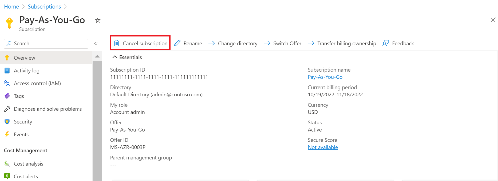

# Cancel your Azure subscription

You can cancel your Azure subscription in the Azure portal if you no longer need the subscription.

Although not required, Microsoft *recommends* that you take the following actions before you cancel your subscription:

* Back up your data. For example, if you're storing data in Azure storage or SQL, download a copy. If you have a virtual machine, save an image of it locally.
* Shut down your services. Go to the [resources page in the management portal](https://ms.portal.azure.com/?flight=1#blade/HubsExtension/Resources/resourceType/Microsoft.Resources%2Fresources), and **Stop** any running virtual machines, applications, or other services.
* Consider migrating your data. See [Move resources to new resource group or subscription](../../azure-resource-manager/management/move-resource-group-and-subscription.md).
* Delete all resources and all resource groups.
* If you have any custom roles that reference this subscription in `AssignableScopes`, you should update those custom roles to remove the subscription. If you try to update a custom role after you cancel a subscription, you might get an error. For more information, see [Troubleshoot problems with custom roles](../../role-based-access-control/troubleshooting.md#problems-with-custom-roles) and [Custom roles for Azure resources](../../role-based-access-control/custom-roles.md).

If you cancel a paid Azure Support plan, you are billed for the rest of the subscription term. For more information, see [Azure support plans](https://azure.microsoft.com/support/plans/).

## Cancel subscription in the Azure portal

1. Select your subscription from the [Subscriptions page in the Azure portal](https://portal.azure.com/#blade/Microsoft_Azure_Billing/SubscriptionsBlade).
2. Select the subscription that you want to cancel.
3. Select **Overview**, and then select **Cancel subscription**.
    
3. Follow prompts and finish cancellation.

## Who can cancel a subscription?

The table below describes the permission required to cancel a subscription.

|Subscription type     |Who can cancel  |
|---------|---------|
|Subscriptions created when you sign up for Azure through the Azure website. For example, when you sign up for an [Azure Free Account](https://azure.microsoft.com/offers/ms-azr-0044p/), [account with pay-as-you-go rates](https://azure.microsoft.com/offers/ms-azr-0003p/) or as a [Visual studio subscriber](https://azure.microsoft.com/pricing/member-offers/credit-for-visual-studio-subscribers/). |  Account administrator and owners of the subscription  |
|[Microsoft Enterprise Agreement](https://azure.microsoft.com/pricing/enterprise-agreement/) and [Enterprise Dev/Test](https://azure.microsoft.com/offers/ms-azr-0148p/)     |  Account owner and owners of the subscription       |
|[Azure plan](https://azure.microsoft.com/offers/ms-azr-0017g/) and [Azure plan for DevTest](https://azure.microsoft.com/offers/ms-azr-0148g/)     |  Owners of the subscription      |

## What happens after I cancel my subscription?

After you cancel, billing is stopped immediately. However, it can take up to 10 minutes for the cancellation to show in the portal. If you cancel in the middle of a billing period, we send the final invoice on your typical invoice date after the period ends. 

After you cancel, your services are disabled. That means your virtual machines are de-allocated, temporary IP addresses are freed, and storage is read-only.

Microsoft waits 30 - 90 days before permanently deleting your data in case you need to access it or you change your mind. We don't charge you for retaining the data. To learn more, see [Microsoft Trust Center - How we manage your data](https://go.microsoft.com/fwLink/p/?LinkID=822930&clcid=0x409).

## Reactivate subscription

If you cancel your subscription with Pay-As-You-Go rates accidentally, you can [reactivate it in the Accounts Center](subscription-disabled.md).

If your subscription is not a subscription with Pay-As-You-Go rates, contact support within 90 days of cancellation to reactivate your subscription.

## Need help? Contact us.

If you have questions or need help,  [create a support request](https://go.microsoft.com/fwlink/?linkid=2083458).

## Next steps

- If needed, you can reactivate a pay-as-you-go subscription in the [Account center](subscription-disabled.md).