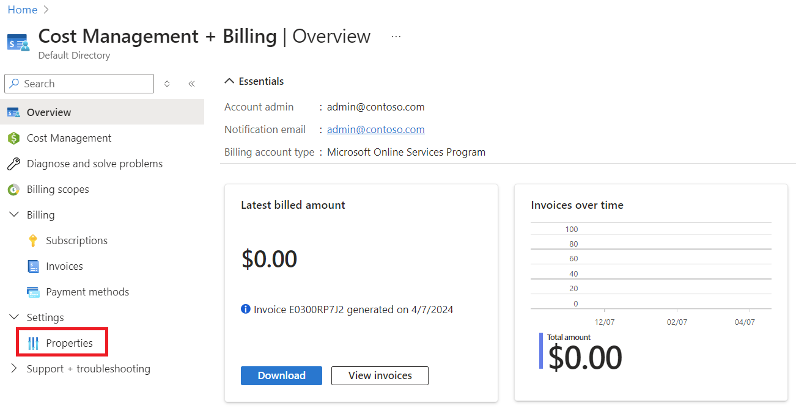
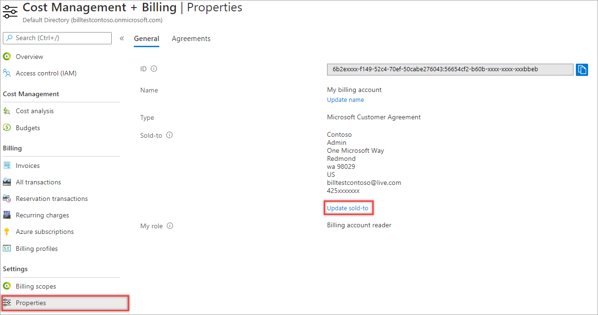
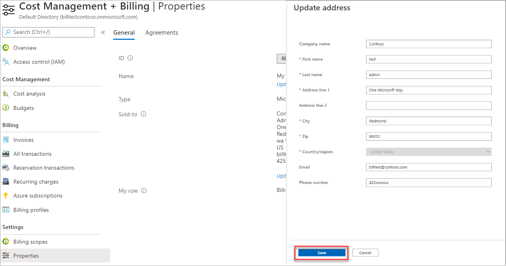
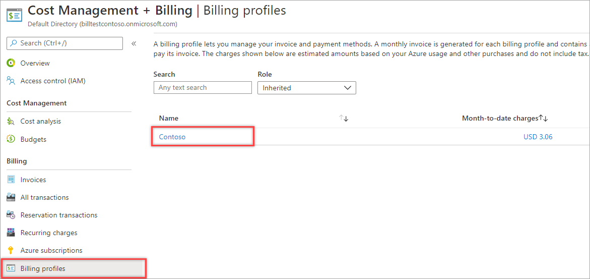
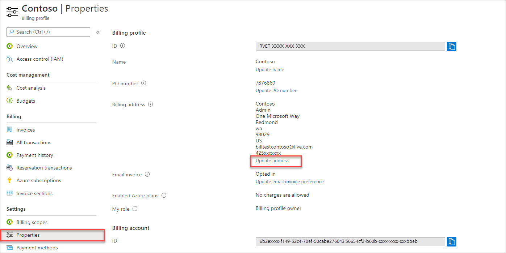
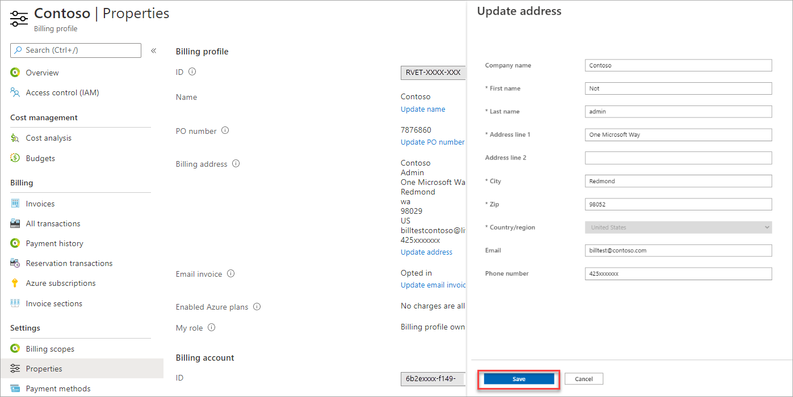
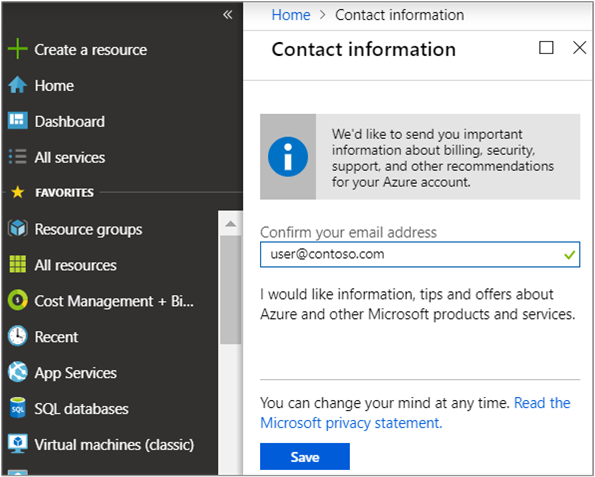
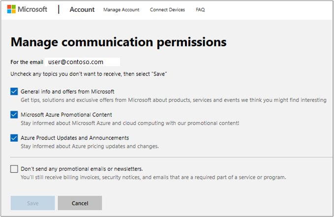
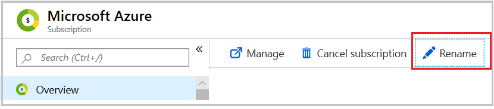

# Change contact information for an Azure billing account

This article helps you update contact information for a *billing account* in the Azure portal. The instructions to update the contact information vary by the billing account type. To learn more about billing accounts and identify your billing account type, see [View billing accounts in Azure portal](view-all-accounts.md). An Azure billing account is separate from your Azure user account and [Microsoft account](https://account.microsoft.com/).

If you want to update your Azure Active Directory user profile information, only a user administrator can make the changes. If you're not assigned the user administrator role, contact your user administrator. For more information about changing a user's profile, see [Add or update a user's profile information using Azure Active Directory](../../active-directory/fundamentals/active-directory-users-profile-azure-portal.md).

*Sold-to address* - The sold-to address is the address and the contact information of the organization or the individual, who is responsible for a billing account. It's displayed in all the invoices generated for the billing account.

*Bill-to address* - The bill-to address is the address and the contact information of the organization or the individual, who is responsible for the invoices generated for a billing account. For a billing account for a Microsoft Online Service Program (MOSP), there's one bill-to address, which is displayed on all the invoices generated for the account. For a billing account for a Microsoft Customer Agreement (MCA), there's a bill-to address for each billing profile and it's displayed in the invoice generated for the billing profile.

*Contact email address for service and marketing emails* - You can specify an email address that's different from the email address that you sign in with to receive important billing, service, and recommendation-related notifications about your Azure account. Service notification emails, such as urgent security issues, price changes, or breaking changes to services in use by your account are always sent to your sign-in address.

## Update an MOSP billing account address

1. Sign in to the Azure portal using the email address, which has the account administrator permission on the account.
1. Search for **Cost Management + Billing**.  
    
1. Select **Properties** from the left-hand side.  
    
1. Select **Update billing address** to update the sold-to and the bill-to addresses. Enter the new address and then select **Save**.  
    

## Update an MCA billing account sold-to address

1. Sign in to the Azure portal using the email address, which has an owner or a contributor role on the billing account for a Microsoft Customer Agreement.
1. Search for **Cost Management + Billing**.  
    
1. Select **Properties** from the left-hand side and then select **Update sold-to**.  
    
1. Enter the new address and select **Save**.  
    

    > [!IMPORTANT]
    > Some accounts require additional verification before their sold-to can be updated. If your account requires manual approval, you would be asked to contact Azure support.

## Update an MCA billing account address

1. Sign in to the Azure portal using the email address, which has an owner or a contributor role on a billing account or a billing profile for an MCA.
1. Search for **Cost Management + Billing**.  
1. Select **Billing profiles** from the left-hand side.
1. Select a billing profile to update the billing address.  
    
1. Select **Properties** from the left-hand side.
1. Select **Update address**.  
    
1. Enter the new address and then select **Save**.  
    

## Update a PO number

By default, an invoice for billing profile doesn't have an associated PO number. After you add a PO number for a billing profile, it appears on invoices for the billing profile.

To add or change the PO number for a billing profile, use the following steps.

1. Sign in to the [Azure portal](https://portal.azure.com).
1. Search for **Cost Management + Billing** and then select **Billing scopes**.
1. Select your billing scope.
1. In the left menu under **Billing**, select **Billing profiles**.
1. Select the appropriate billing profile.
1. In the left menu under **Settings**, select **Properties**.
1. Select **Update PO number**.
1. Enter a PO number and then select **Update**.

## Update your tax ID

Ensure you update your tax ID after moving your subscriptions. The tax ID is used for tax exemption calculations and appears on your invoice.

**To update billing account information**

1. Sign in to the [Microsoft Store for Business](https://businessstore.microsoft.com/) or [Microsoft Store for Education](https://educationstore.microsoft.com/).
1. Select **Manage**, and then select **Billing accounts**.
1. On **Overview**, select **Edit billing account information**.
1. Make your updates, and then select **Save**.

[Learn more about how to update your billing account settings](/microsoft-store/update-microsoft-store-for-business-account-settings).

## Service and marketing emails

You're prompted in the Azure portal to verify or update your email address every 90 days. Microsoft sends emails to this email address with Azure account-related information for:

- Service notifications
- Security alerts
- Billing purposes
- Support
- Marketing communications
- Best practice recommendations, based on your Azure usage

Enter the email address where you want to receive communications about your account. By entering an email address, you're opting in to receive communications from Microsoft.

### Change your contact email address

You can change your contact email address by using one of the following methods. Updating your contact email address doesn't update the email address that you sign in with.

1. If you're an account administrator for an MOSP account, follow the instructions in [Update an MOSP billing account address](#update-an-mosp-billing-account-address) and select **Update contact info** in the last step. Next, enter the new email address.
1. Go to the [Contact information](https://portal.azure.com/#blade/HubsExtension/ContactInfoBlade) area in the Azure portal and enter the new email address. 
1. In the Azure portal, select the icon with your initials or picture. Then, select the context menu (**...**). Next, select **My Contact Information** from the menu and enter the new email address.

### Opt out of marketing emails

To opt out of receiving marketing emails:

1. Go to the [request form](https://account.microsoft.com/profile/permissions-link-request) to submit a request by using your profile email address. You'll receive a link by email to update your preferences.
1. Select the link to open the **Manage communication permissions** page. This page shows you the types of marketing communications that the email address is opted in to. Clear any selections that you want to opt out of, and then select **Save**.  
    

When you opt out of marketing communications, you still receive service notifications, based on your account.

## Update the email address that you sign in with

You can't update the email address that you use to access your account. However, if you have a billing account for an MOSP, you can sign up for another account using the new email address and transfer ownership of your subscriptions to the next account. For an MCA billing account, you can give the new email address permissions on your account.

## Update your credit card

To learn how to update your credit card, see [Change the credit card used to pay for an Azure subscription](change-credit-card.md).

## Update your country or region

Changing the country or region for an existing account isn't supported. However, you can create a new account in a different country or region and then contact Azure support to transfer your subscription to the new account.

## Change the subscription name

1. Sign in to the Azure portal, select **Subscription** from the left pane, and then select the subscription that you want to rename.
1. Select **Overview**, and then select **Rename** from the command bar.  
    
1. After you change the name, select **Save**.

## Need help? Contact us.

If you have questions or need help, [create a support request](https://go.microsoft.com/fwlink/?linkid=2083458).

## Next steps

- [View your billing accounts](view-all-accounts.md)
