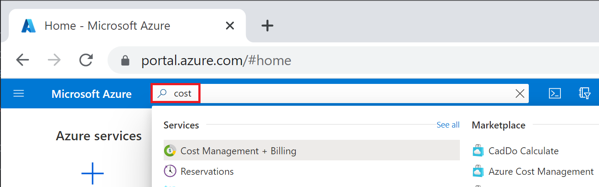
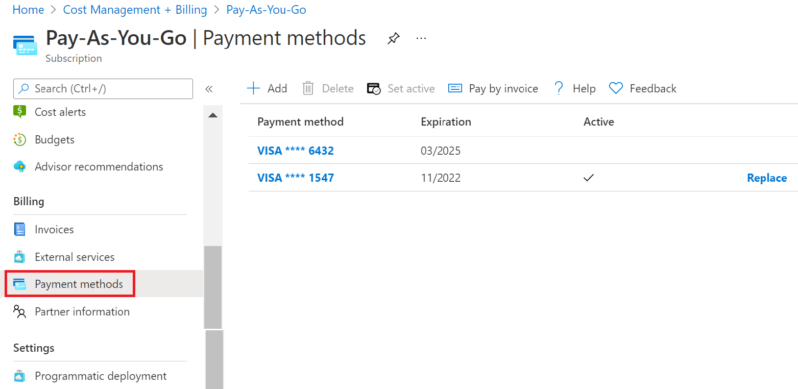
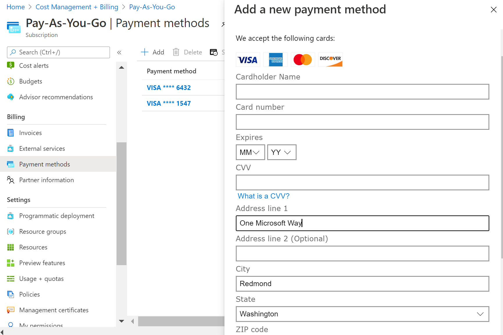
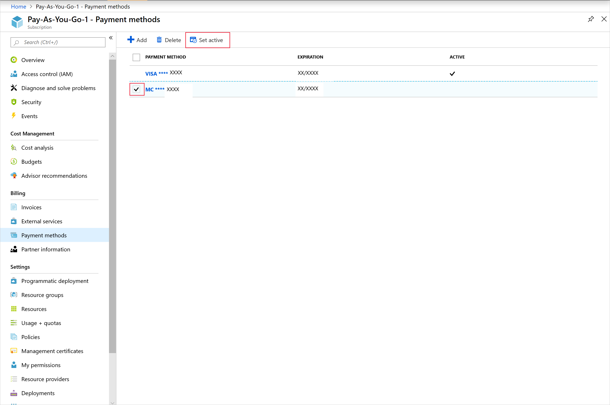
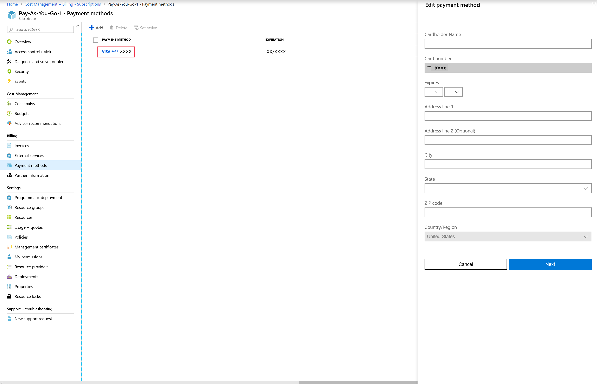
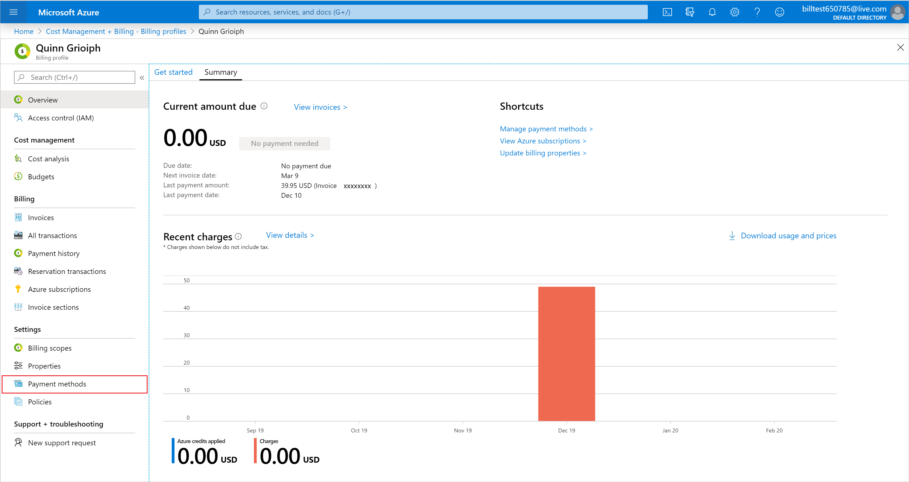
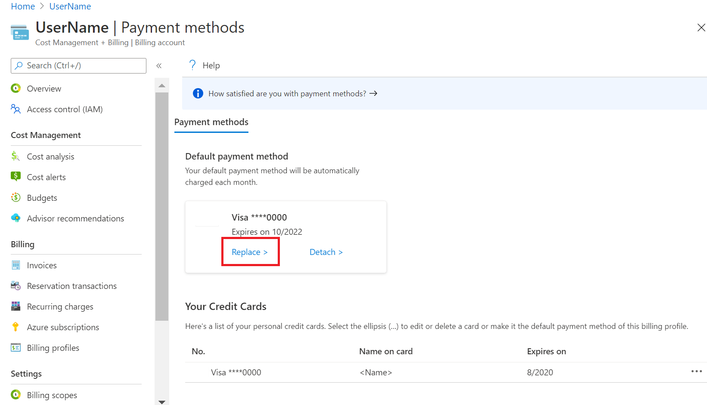
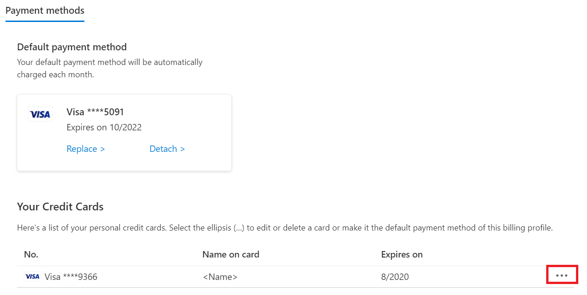

# Add, update, or remove a credit card for Azure

This document applies to customers who signed up for Azure online with a credit card.

In the Azure portal, you can change your default payment method to a new credit card, update your credit card details, and delete credit cards that you don't use. You must be an [Account Administrator](billing-subscription-transfer.md#whoisaa) to make these changes.

The supported payment methods for Microsoft Azure are credit cards and check/wire transfer. To get approved to pay by check/wire transfer, see [Pay for Azure subscriptions by invoice](pay-by-invoice.md).

If you have a Microsoft Customer Agreement, your payment methods are associated with billing profiles. Learn how to [check access to a Microsoft Customer Agreement](#check-the-type-of-your-account). If you have an MCA, skip to [manage credit cards for a Microsoft Customer Agreement](#manage-credit-cards-for-a-microsoft-customer-agreement).

## Manage credit cards for an Azure subscription

The following sections apply to customers who have a Microsoft Online Services Program billing account. Learn how to [check your billing account type](#check-the-type-of-your-account). If your billing account type is Microsoft Online Services Program, payment methods are associated with individual Azure subscriptions. If you get an error after you add the credit card, see [Credit card declined at Azure sign-up](../../billing/billing-credit-card-fails-during-azure-sign-up.md).

### Change credit card for a subscription by adding a new credit card

You can change the default credit of your Azure subscription to a new credit card or previously saved credit card in the Azure portal. You must be the Account Administrator to change the credit card. If more than one of your subscriptions have the same active payment method, then changing the active payment method on any of these subscriptions also updates the active payment method on the others.

You can change your subscription's default credit card to a new one by following these steps:

1. Sign in to the [Azure portal](https://portal.azure.com) as the Account Administrator.
1. Search for **Cost Management + Billing**.

    

1. Select the subscription you'd like to add the credit card to.
1. Select **Payment methods**.

    

1. In the top-left corner, select “+” to add a card. A credit card form will appear on the right.
1. Enter credit card details.

    

1. To make this card your active payment method, check the box next to **Make this my active payment method** above the form. This card will become the active payment instrument for all subscriptions using the same card as the selected subscription.

1. Select **Next**.

### Change credit card for a subscription to a previously saved credit card

You can also change your subscription's default credit card to a one that is already saved to your account by following these steps:

1. Sign in to the [Azure portal](https://portal.azure.com) as the Account Administrator.
1. Search for **Cost Management + Billing**.

    

1. Select the subscription you'd like to add the credit card to.
1. Select **Payment methods**.

    

1. Select the box next to the card you'd like to make the active payment method.
1. Click **Set active**.
    

### Edit credit card details

If your credit card gets renewed and the number stays the same, update the existing credit card details like the expiration date. If your credit card number changes because the card is lost, stolen, or expired, follow the steps in the [Add a credit card as a payment method](#addcard) section. You don't need to update the CVV.

1. Sign in to the [Azure portal](https://portal.azure.com) as the Account Administrator.
1. Search for **Cost Management + Billing**.

    

1. Select **Payment methods**.

    

1. Click on the credit card that you'd like to edit. A credit card form will appear on the right.

    

1. Update the credit card details.
1. Select **Save**.

### Delete a credit card from the account

1. Sign in to the [Azure portal](https://portal.azure.com) as the Account Administrator.
1. Select **Cost Management + Billing** on the left side of the page.

    

1. Under **Billing**, select **Payment methods**.

    

1. Select the box next to the card that you want to remove.
1. Click **Delete**.

If your credit card is the active payment method for any of your Microsoft subscriptions, you can't remove it from your Azure account. Change the active payment method for all subscriptions linked to this credit card and try again

## Manage credit cards for a Microsoft Customer Agreement

The following sections apply to customers who have a Microsoft Customer Agreement and signed up for Azure online with a credit card. [Learn how to check if you have a Microsoft Customer Agreement](#check-the-type-of-your-account).

### Change default credit card

If you have a Microsoft Customer Agreement, your credit card is associated with a billing profile. To change the payment method for a billing profile, you must be the person who signed up for Azure and created the billing account.

If you'd like to change your billing profile's default payment method to check/wire transfer, see [Pay for Azure subscriptions by invoice](pay-by-invoice.md).

To change your credit card, follow these steps:

1. Sign in to the [Azure portal](https://portal.azure.com).
1. Search on **Cost Management + Billing**.
1. In the menu on the left, click on **Billing profiles**.
1. Select a billing profile.
1. In the menu on the left, select **Payment methods**.

   

1. In the **Default payment method** section, click **Change**.

    

1. In the new blade on the right, either select an existing card from the drop-down or add a new one by clicking the blue "Add new payment method" link.

### Edit or delete a credit card

You can edit credit card details (such as updating the expiration date) and delete credit cards from your account in the Azure portal. You can only delete a credit card if it is not associated with any Azure subscription or billing profile. If it is associated with a disabled Azure subscription, you must wait until the subscription is deleted (30-90 days after cancellation) in order to delete the credit card.

To edit or delete a credit card, follow these steps:

1. Sign in to the [Azure portal](https://portal.azure.com).
1. Search on **Cost Management + Billing**.
1. In the menu on the left, click on **Billing profiles**.
1. Select a billing profile.
1. In the menu on the left, select **Payment methods**.

   

1. In the **Your credit cards**  section, find the credit card you want to edit or delete.
1. Select the ellipsis (`...`) at the end of the row.

    

1. To edit your credit card details, select **Edit** from the context menu.
1. To delete your credit card, select **Delete** from the context menu.

## Troubleshooting

We do not support virtual or prepaid cards. If you are getting errors when adding or updating a valid credit card, try opening your browser in private mode.

## Frequently asked questions

The following sections answer commonly asked questions about changing your credit card information.

### My subscription is disabled. Why can't I remove my credit card now?

After your subscription is disabled or canceled, we wait 90 days before permanently deleting your subscription. We keep your payment method on file during the retention period in case you want to reactivate the subscription. After that, the subscription is permanently deleted.

If you need to remove your credit card before the 90-day retention period ends, [reactivate your subscription](subscription-disabled.md). If you can't reactivate, [contact Azure support](https://portal.azure.com/?#blade/Microsoft_Azure_Support/HelpAndSupportBlade).

### Why do I keep getting "Your login session has expired. Please click here to log back in"?

If you keep getting this error message even if you've already logged out and back in, try again with a private browsing session.

### How do I use a different card for each subscription I have?

Unfortunately, if your subscriptions are already using the same card, it's not possible to separate them to use different cards. However, when you sign up for a new subscription, you can choose to use a new payment method for that subscription.

### How do I make payments?

If you set up a credit card as your payment method, we automatically charge your card after each billing period. You don't need to do anything.

If you're [paying by invoice](pay-by-invoice.md), send your payment to the location listed at the bottom of your invoice.

### How do I change the tax ID?

To add or update tax ID, update your profile in the  [Azure Account Center](https://account.azure.com/Profile), then select **Tax record**. This tax ID is used for tax exemption calculations and appears on your invoice.

## Check the type of your account

[!INCLUDE [billing-check-mca](../../../includes/billing-check-account-type.md)]

## Need help? Contact us.

If you have questions or need help,  [create a support request](https://go.microsoft.com/fwlink/?linkid=2083458).

## Next steps

- Learn about [Azure reservations](../reservations/save-compute-costs-reservations.md) to see if they can save you money.
