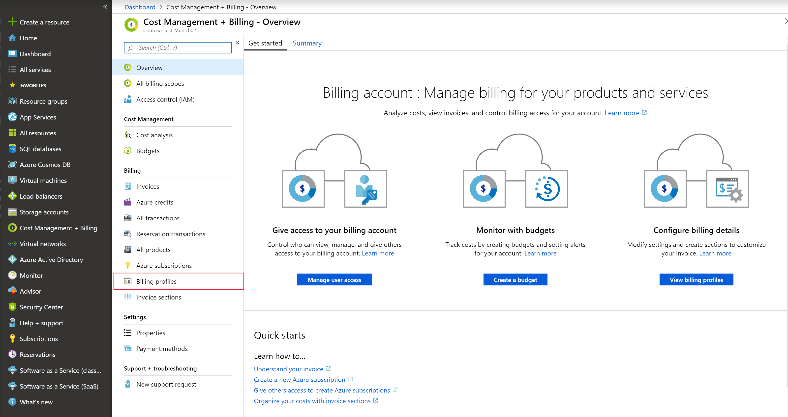
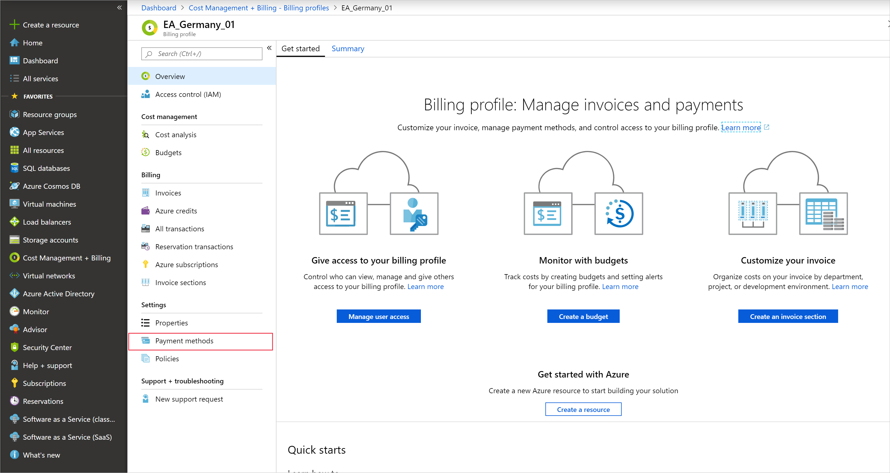
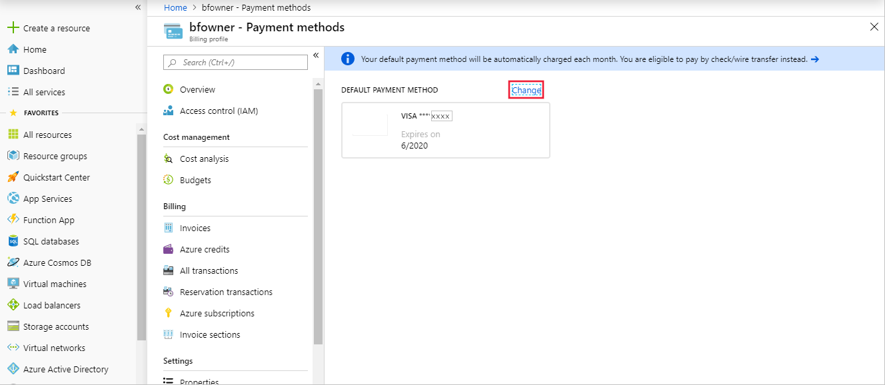

# Add, update, or remove a credit card for Azure

This document applies to customers who signed up for Azure online with a credit card.

In the Azure portal, you can add a new credit card, update an existing credit card, or delete a credit card that you don't use. You must be an [Account Administrator](billing-subscription-transfer.md#whoisaa) to make these changes.

If you have a [Microsoft Customer Agreement](#check-access-to-a-microsoft-customer-agreement), your payment methods are associated with billing profiles. Learn how to [change the default payment method for a billing profile](#change-payment-method-for-a-billing-profile). Only the user who signed up for Azure can update the payment method.

**Want to switch to pay by invoice (check/wire transfer)?** See [Pay for Azure subscriptions by invoice](pay-by-invoice.md).

## Add a new credit card to an Azure subscription

1. Sign in to the [Azure portal](https://portal.azure.com) as the Account Administrator.
1. Search for **Cost Management + Billing**.

    

1. Select the subscription you'd like to add the credit card to.
1. Select **Payment methods**.

    

1. In the top-left corner, select “+” to add a card. A credit card form will appear on the right.
1. Enter credit card details.

    

1. To make this card your active payment method, check the box next to **Make this my active payment method** above the form. This card will become the active payment instrument for all subscriptions using the same card as the selected subscription.

1. Select **Next**.

If you get an error after you add the credit card, see [Credit card declined at Azure sign-up](../../billing/billing-credit-card-fails-during-azure-sign-up.md).

## Update existing credit card

If your credit card gets renewed and the number stays the same, update the existing credit card details like the expiration date. If your credit card number changes because the card is lost, stolen, or expired, follow the steps in the [Add a credit card as a payment method](#addcard) section. You don't need to update the CVV.

1. Sign in to the [Azure portal](https://portal.azure.com) as the Account Administrator.
1. Search for **Cost Management + Billing**.

    

1. Select **Payment methods**.

    

1. Click on the credit card that you'd like to edit. A credit card form will appear on the right.

    

1. Update the credit card details.
1. Select **Save**.

## Use a different credit card

If more than one of your subscriptions have the same active payment method, then changing the active payment method on any of these subscriptions also updates the active payment method on the others.

1. Sign in to the [Azure portal](https://portal.azure.com) as the Account Administrator.
1. Search for **Cost Management + Billing**.

    

1. Select the subscription you'd like to add the credit card to.
1. Select **Payment methods**.

    

1. Select the box next to the card you'd like to make the active payment method.
1. Click **Set active**.
    

## Remove a credit card from the account

1. Sign in to the [Azure portal](https://portal.azure.com) as the Account Administrator.
1. Select **Cost Management + Billing** on the left side of the page.

    

1. Under **Billing**, select **Payment methods**.

    

1. Select the box next to the card that you want to remove.
1. Click **Delete**.

If your credit card is the active payment method for any of your Microsoft subscriptions, you can't remove it from your Azure account. Change the active payment method for all subscriptions linked to this credit card and try again

## Change payment method for a billing profile

To change the payment method for a billing profile, you must be the person who signed up for Azure.

If you'd like to switch the default payment method to check/wire transfer, learn how to [switch a billing profile to check/wire transfer](pay-by-invoice.md).

1. Sign in to the [Azure portal](https://portal.azure.com).
1. Search on **Cost Management + Billing**.
1. In the menu on the left, click on **Billing profiles**.

    

1. Select a billing profile.
1. In the menu on the left, select **Payment methods**.

   

1. Above the default payment method, click **Change**.

    

1. Select an existing card or add a new one.

## Troubleshooting
We do not support virtual or prepaid cards. If you are getting errors when adding or updating a valid credit card, try opening your browser in private mode.

## Frequently asked questions
The following sections answer commonly asked questions about changing your credit card information.

### My subscription is disabled. Why can't I remove my credit card now?

After your subscription is disabled or canceled, we wait 90 days before permanently deleting your subscription. We keep your payment method on file during the retention period in case you want to reactivate the subscription. After that, the subscription is permanently deleted.

If you need to remove your credit card before the 90-day retention period ends, [reactivate your subscription](subscription-disabled.md). If you can't reactivate, [contact Azure support](https://portal.azure.com/?#blade/Microsoft_Azure_Support/HelpAndSupportBlade).

### Why do I keep getting "Your login session has expired. Please click here to log back in"?

If you keep getting this error message even if you've already logged out and back in, try again with a private browsing session.

### How do I use a different card for each subscription I have?

Unfortunately, if your subscriptions are already using the same card, it's not possible to separate them to use different cards. However, when you sign up for a new subscription, you can choose to use a new payment method for that subscription.

### How do I make payments?

If you set up a credit card as your payment method, we automatically charge your card after each billing period. You don't need to do anything.

If you're [paying by invoice](pay-by-invoice.md), send your payment to the location listed at the bottom of your invoice.

### How do I change the tax ID?

To add or update tax ID, update your profile in the  [Azure Account Center](https://account.azure.com/Profile), then select **Tax record**. This tax ID is used for tax exemption calculations and appears on your invoice.

## Check access to a Microsoft Customer Agreement
[!INCLUDE [billing-check-mca](../../../includes/billing-check-mca.md)]

## Need help? Contact us.

If you have questions or need help,  [create a support request](https://go.microsoft.com/fwlink/?linkid=2083458).

## Next steps
- Learn about [Azure reservations](../reservations/save-compute-costs-reservations.md) to see if they can save you money.
