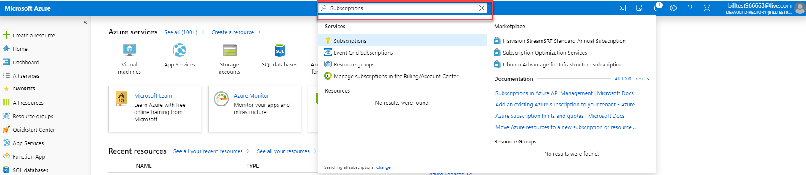

# Check usage of free services included with your Azure free account

You're not charged for services included for free with your Azure free account, unless you exceed the limits of the services. To remain in the limits, you can use the Azure portal to track the free service usage.

## Check usage in the Azure portal

1.	Sign in to the [Azure portal](https://portal.azure.com).

2.  Search for **Subscriptions**.

    

3.	Select the subscription that was created when you signed up for your Azure free account.

4.  Scroll down to find the table showing free service usage.

    

    The table has the following columns:

* **Meter:** Identifies the unit of measure for the service being consumed.
* **Usage/Limit:** Current month's usage and limit for the meter.
* **Status:** Usage status of the service. Based on your usage, you can have one of the following statutes:
  * **Not in use:** You haven't used the meter or the usage for the meter hasn't reached the billing system.
  * **Exceeded on \<Date>:** You have exceeded the limit for the meter on \<Date>.
  * **Unlikely to Exceed:** You're unlikely to exceed the limit for the meter.
  * **Exceeds on \<Date>:** You're likely to exceed the limit for the meter on \<Date>.

> [!IMPORTANT]
>
> Free services are only available for the subscription that got created when you signed up for your Azure free account. If you can't see the free services table in the subscription overview page, they are not available for the subscription.

## Need help? Contact us.

If you have questions or need help,  [create a support request](https://go.microsoft.com/fwlink/?linkid=2083458).

## Next steps
- [Upgrade your Azure free account](upgrade-azure-subscription.md)
