# Manage costs with budgets

Cost control is a critical component to maximizing the value of your investment in the cloud. There are several scenarios where cost visibility, reporting, and cost-based orchestration are critical to continued business operations. [Cost Management APIs](/rest/api/consumption/) provide a set of APIs to support each of these scenarios. The APIs provide usage details, allowing you to view granular instance level costs.

Budgets are commonly used as part of cost control. Budgets can be scoped in Azure. For instance, you could narrow your budget view based on subscription, resource groups, or a collection of resources. In addition to using the budgets API to notify you via email when a budget threshold is reached, you can use [Azure Monitor action groups](../../azure-monitor/alerts/action-groups.md) to trigger an orchestrated set of actions resulting from a budget event.

A common budgets scenario for a customer running a non-critical workload could occur when they want to manage against a budget and also get to a predictable cost when looking at the monthly invoice. This scenario requires some cost-based orchestration of resources that are part of the Azure environment. In this scenario, a monthly budget of $1000 for the subscription is set. Also, notification thresholds are set to trigger a few orchestrations. This scenario starts with an 80% cost threshold, which will stop all VMs in the resource group **Optional**. Then, at the 100% cost threshold, all VM instances will be stopped.

To configure this scenario, you'll complete the following actions by using the steps provided in each section of this tutorial.

These actions included in this tutorial allow you to:

- Create an Azure Automation Runbook to stop VMs by using webhooks.
- Create an Azure Logic App to be triggered based on the budget threshold value and call the runbook with the right parameters.
- Create an Azure Monitor Action Group that will be configured to trigger the Azure Logic App when the budget threshold is met.
- Create the budget with the wanted thresholds and wire it to the action group.

## Create an Azure Automation Runbook

[Azure Automation](../../automation/automation-intro.md) is a service that enables you to script most of your resource management tasks and run those tasks as either scheduled or on-demand. As part of this scenario, you'll create an [Azure Automation runbook](../../automation/automation-runbook-types.md) that will be used to stop VMs. You'll use the [Stop Azure V2 VMs](https://gallery.technet.microsoft.com/scriptcenter/Stop-Azure-ARM-VMs-1ba96d5b) graphical runbook from the [gallery](../../automation/automation-runbook-gallery.md) to build this scenario. By importing this runbook into your Azure account and publishing it, you can stop VMs when a budget threshold is reached.

### Create an Azure Automation account

1. Sign in to the [Azure portal](https://portal.azure.com/) with your Azure account credentials.
2. Select the **Create a resource** button found on the upper left corner of Azure.
3. Select **Management Tools** > **Automation**.
   > [!NOTE]
   > If you don't have an Azure account, you can create a [free account](https://azure.microsoft.com/free/).
4. Enter your account information. For **Create Azure Run As account**, choose **Yes** to automatically enable the settings needed to simplify authentication to Azure.
5. When complete, select **Create**, to start the Automation account deployment.

### Import the Stop Azure V2 VMs runbook

Using an [Azure Automation runbook](../../automation/automation-runbook-types.md), import the [Stop Azure V2 VMs](https://gallery.technet.microsoft.com/scriptcenter/Stop-Azure-ARM-VMs-1ba96d5b) graphical runbook from the gallery.

1. Sign in to the [Azure portal](https://portal.azure.com/) with your Azure account credentials.
1. Open your Automation account by selecting **All services** > **Automation Accounts**. Then, select your Automation Account.
1. Select **Runbooks gallery** from the **Process Automation** section.
1. Set the **Gallery Source** to **Script Center** and select **OK**.
1. Locate and select the [Stop Azure V2 VMs](https://gallery.technet.microsoft.com/scriptcenter/Stop-Azure-ARM-VMs-1ba96d5b) gallery item within the Azure portal.
1. Select **Import** to display the **Import** area and select **OK**. The runbook overview area will be displayed.
1. Once the runbook has completed the import process, select **Edit** to display the graphical runbook editor and publishing option.  
    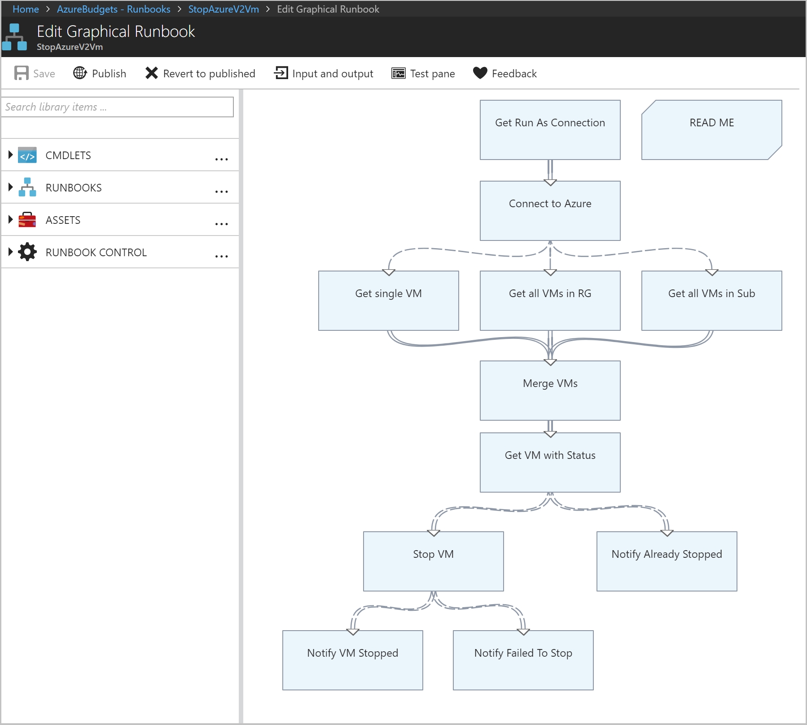
1. Select **Publish** to publish the runbook and then select **Yes** when prompted. When you publish a runbook, you override any existing published version with the draft version. In this case, you've no published version because you've created the runbook.
    For more information about publishing a runbook, see [Create a graphical runbook](../../automation/learn/powershell-runbook-managed-identity.md).

## Create webhooks for the runbook

Using the [Stop Azure V2 VMs](https://gallery.technet.microsoft.com/scriptcenter/Stop-Azure-ARM-VMs-1ba96d5b) graphical runbook, you create two Webhooks to start the runbook in Azure Automation through a single HTTP request. The first webhook invokes the runbook at an 80% budget threshold with the resource group name as a parameter, allowing the optional VMs to be stopped. Then, the second webhook invokes the runbook with no parameters (at 100%), which stops all remaining VM instances.

1. From the **Runbooks** page in the [Azure portal](https://portal.azure.com/), select the **StopAzureV2Vm** runbook that displays the runbook's overview area.
1. Select **Webhook** at the top of the page to open the **Add Webhook** area.
1. Select **Create new webhook** to open the **Create a new webhook** area.
1. Set the **Name** of the Webhook to **Optional**. The **Enabled** property must be **Yes**. You don't need to change the **Expires** value. For more information about Webhook properties, see [Webhook properties](../../automation/automation-webhooks.md#webhook-properties).
1. Next to the URL value, select the copy icon to copy the URL of the webhook.
   > [!IMPORTANT]
   > Save the URL of the webhook named **Optional** in a safe place. You'll use the URL later in this tutorial. For security reasons, once you create the webhook, you cannot view or retrieve the URL again.
1. Select **OK** to create the new webhook.
1. Select **Configure parameters and run settings** to view parameter values for the runbook.
   > [!NOTE]
   > If the runbook has mandatory parameters, then you are not able to create the webhook unless values are provided.
1. Select **OK** to accept the webhook parameter values.
1. Select **Create** to create the webhook.
1. Next, follow the steps above to create a second webhook named **Complete**.
    > [!IMPORTANT]
    > Be sure to save both webhook URLs to use later in this tutorial. For security reasons, once you create the webhook, you cannot view or retrieve the URL again.

You should now have two configured webhooks that are each available using the URLs that you saved.

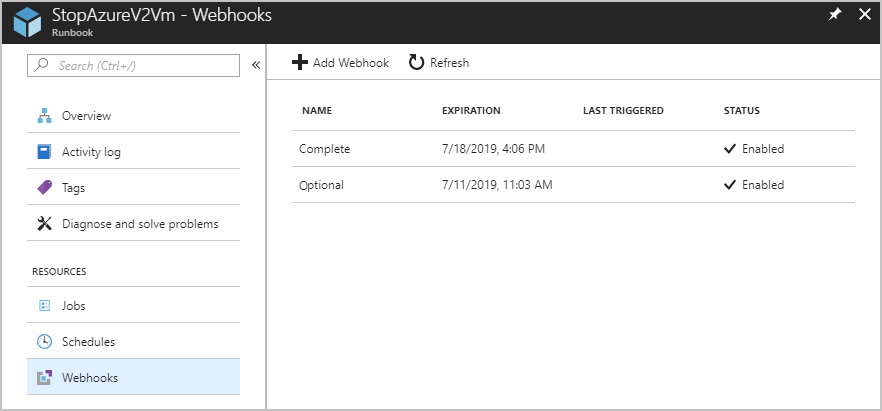

You're now done with the Azure Automation setup. You can test the webhooks with a simple Postman test to validate that the webhook works. Next, you must create the Logic App for orchestration.

## Create an Azure Logic App for orchestration

Logic Apps helps you build, schedule, and automate processes as workflows so you can integrate apps, data, systems, and services across enterprises or organizations. In this scenario, the [Logic App](../../logic-apps/index.yml) you create will do a little more than just call the automation webhook you created.

Budgets can be set up to trigger a notification when a specified threshold is met. You can provide multiple thresholds to be notified at and the Logic App will demonstrate the ability for you to perform different actions based on the threshold met. In this example, you'll set up a scenario where you get a couple of notifications, the first notification is for when 80% of the budget has been reached and the second notification is when 100% of the budget has been reached. The logic app will be used to shut down all VMs in the resource group. First, the **Optional** threshold will be reached at 80%, then the second threshold will be reached where all VMs in the subscription will be shut down.

Logic apps allow you to provide a sample schema for the HTTP trigger, but require you to set the **Content-Type** header. Because the action group doesn't have custom headers for the webhook, you must parse out the payload in a separate step. You'll use the **Parse** action and provide it with a sample payload.

### Create the logic app

The logic app will perform several actions. The following list provides a high-level set of actions that the logic app will perform:

- Recognizes when an HTTP request is received
- Parse the passed in JSON data to determine the threshold value that has been reached
- Use a conditional statement to check whether the threshold amount has reached 80% or more of the budget range, but not greater than or equal to 100%.
  - If this threshold amount has been reached, send an HTTP POST using the webhook named **Optional**. This action will shut down the VMs in the "Optional" group.
- Use a conditional statement to check whether the threshold amount has reached or exceeded 100% of the budget value.
  - If the threshold amount has been reached, send an HTTP POST using the webhook named **Complete**. This action will shut down all remaining VMs.

The following steps are needed to create the logic app that will perform the above steps:

1. In the [Azure portal](https://portal.azure.com/), select **Create a resource** > **Integration** > **Logic App**.  
    
1. In the **Create logic app** area, provide the details need to create your logic app, select **Pin to dashboard**, and select **Create**.  
    

After Azure deploys your logic app, the **Logic Apps Designer** opens and shows an area with an introduction video and commonly used triggers.

### Add a trigger

Every logic app must start with a trigger, which fires when a specific event happens or when a specific condition is met. Each time the trigger fires, the Logic Apps engine creates a logic app instance that starts and runs your workflow. Actions are all the steps that happen after the trigger.

1. Under **Templates** of the **Logic Apps Designer** area, choose **Blank Logic App**.
1. Add a [trigger](../../logic-apps/logic-apps-overview.md#logic-app-concepts) by entering "http request" in the **Logic Apps Designer** search box to find and select the trigger named **Request – When an HTTP request is received**.  
    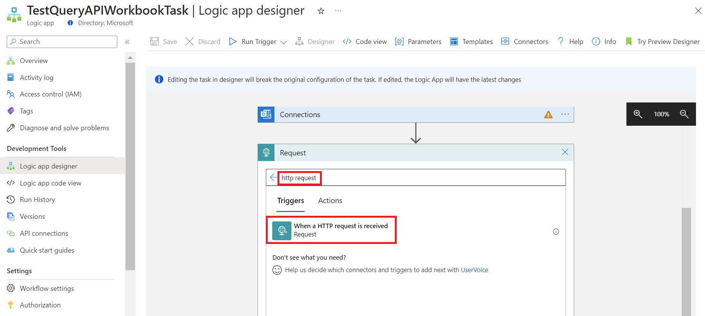
1. Select **New step** > **Add an action**.  
    
1. Search for "parse JSON" in the **Logic Apps Designer** search box to find and select the **Data Operations - Parse JSON** [action](../../logic-apps/logic-apps-overview.md#logic-app-concepts).  
    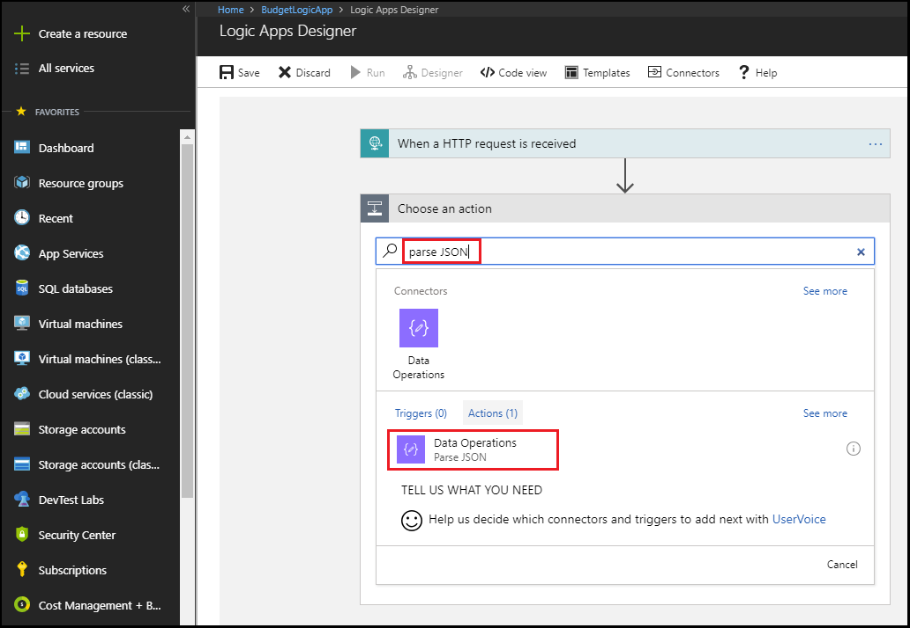
1. Enter "Payload" as the **Content** name for the Parse JSON payload or use the "Body" tag from dynamic content.
1. Select the **Use sample payload to generate schema** option in the **Parse JSON** box.  
    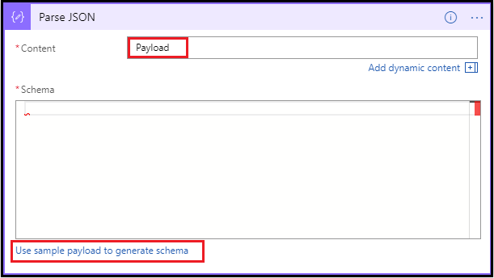
1. Paste the following JSON sample payload into the textbox:
    `{"schemaId":"AIP Budget Notification","data":{"SubscriptionName":"CCM - Microsoft Azure Enterprise - 1","SubscriptionId":"<GUID>","SpendingAmount":"100","BudgetStartDate":"6/1/2018","Budget":"50","Unit":"USD","BudgetCreator":"email@contoso.com","BudgetName":"BudgetName","BudgetType":"Cost","ResourceGroup":"","NotificationThresholdAmount":"0.8"}}`
    The textbox will appear as:  
    
1. Select **Done**.

### Add the first conditional action

Use a conditional statement to check whether the threshold amount has reached 80% or more of the budget range, but not greater than or equal to 100%. If this threshold amount has been reached, send an HTTP POST using the webhook named **Optional**. This action will shut down the VMs in the **Optional** group.

1. Select **New step** > **Add a condition**.  
    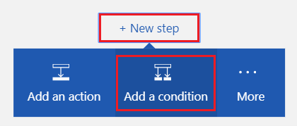
1. In the **Condition** box, select the textbox containing `Choose a value` to display a list of available values.  
    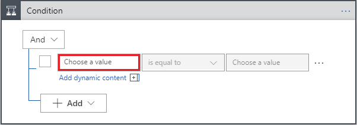
1. Select **Expression** at the top of the list and enter the following expression in the expression editor:
    `float()`  
    
1. Select **Dynamic content**, place the cursor inside the parenthesis (), and select **NotificationThresholdAmount** from the list to populate the complete expression.
    The expression will be:<br>
    `float(body('Parse_JSON')?['data']?['NotificationThresholdAmount'])`
1. Select **OK** to set the expression.
1. Select **is greater than or equal to** in the dropdown box of the **Condition**.
1. In the **Choose a value** box of the condition, enter `.8`.  
    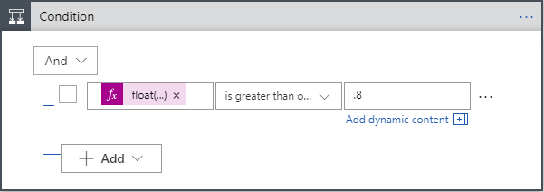
1. Select **Add** > **Add row** within the Condition box to add an additional part of the condition.
1. In the **Condition** box, select the textbox containing `Choose a value`.
1. Select **Expression** at the top of the list and enter the following expression in the expression editor:
    `float()`
1. Select **Dynamic content**, place the cursor inside the parenthesis (), and select **NotificationThresholdAmount** from the list to populate the complete expression.
1. Select **OK** to set the expression.
1. Select **is less than** in the dropdown box of the **Condition**.
1. In the **Choose a value** box of the condition, enter `1`.  
    
1. In the **If true** box, select **Add an action**. You'll add an HTTP POST action that will shut down optional VMs.  
    
1. Enter **HTTP** to search for the HTTP action and select the **HTTP – HTTP** action.  
    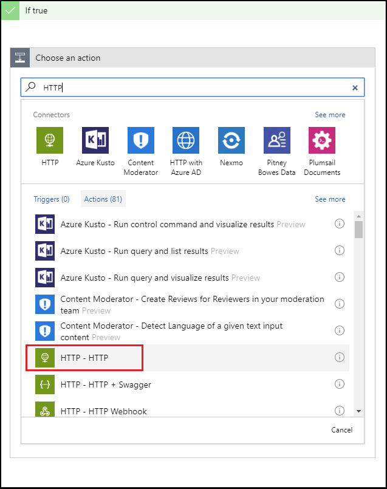
1. Select **Post** for the **Method** value.
1. Enter the URL for the webhook named **Optional** that you created earlier in this tutorial as the **Uri** value.  
    
1. Select **Add an action** in the **If true** box. You'll add an email action that will send an email notifying the recipient that the optional VMs have been shut down.
1. Search for "send email" and select a *send email* action based on the email service you use.  
    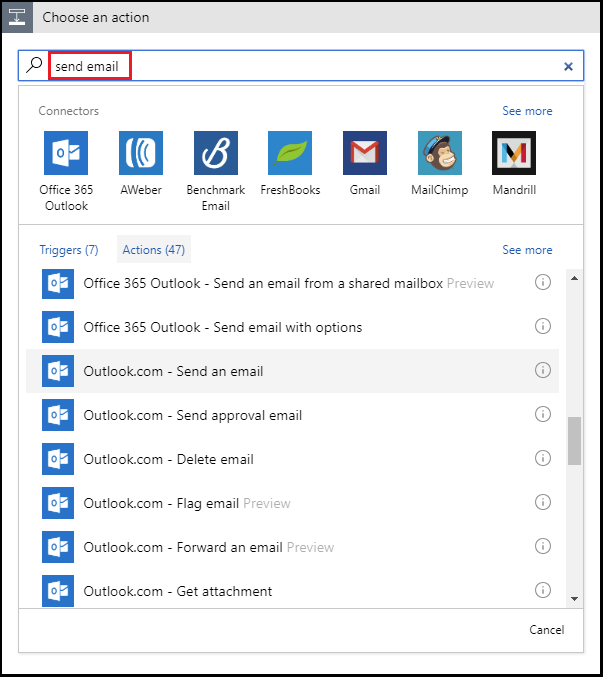

    For personal Microsoft accounts, select **Outlook.com**. For Azure work or school accounts, select **Office 365 Outlook**. If you don't already have a connection, you're asked to sign in to your email account. Logic Apps creates a connection to your email account.
    You'll need to allow the Logic App to access your email information.  
    
1. Add the **To**, **Subject**, and **Body** text for the email that notifies the recipient that the optional VMs have been shut down. Use the **BudgetName** and the **NotificationThresholdAmount** dynamic content to populate the subject and body fields. 
    

### Add the second conditional action

Use a conditional statement to check whether the threshold amount has reached or exceeded 100% of the budget value. If the threshold amount has been reached, send an HTTP POST using the webhook named **Complete**. This action will shut down all remaining VMs.

1. Select **New step** > **Add a Condition**.  
    
1. In the **Condition** box, select the textbox containing `Choose a value` to display a list of available values.
1. Select **Expression** at the top of the list and enter the following expression in the expression editor:
    `float()`
1. Select **Dynamic content**, place the cursor inside the parenthesis (), and select **NotificationThresholdAmount** from the list to populate the complete expression.
    The expression will resemble:<br>
    `float(body('Parse_JSON')?['data']?['NotificationThresholdAmount'])`
1. Select **OK** to set the expression.
1. Select **is greater than or equal to** in the dropdown box of the **Condition**.
1. In the **Choose a value box** for the condition, enter `1`.  
    
1. In the **If true** box, select **Add an action**. You'll add an HTTP POST action that will shut down all the remaining VMs.  
    
1. Enter **HTTP** to search for the HTTP action and select the **HTTP – HTTP** action.
1. Select **Post** as the **Method** value.
1. Enter the URL for the webhook named **Complete** that you created earlier in this tutorial as the **Uri** value.  
    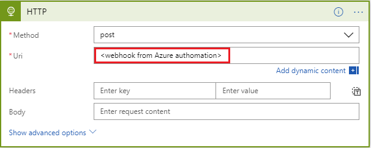
1. Select **Add an action** in the **If true** box. You'll add an email action that will send an email notifying the recipient that the remaining VMs have been shut down.
1. Search for "send email" and select a *send email* action based on the email service you use.
1. Add the **To**, **Subject**, and **Body** text for the email that notifies the recipient that the optional VMs have been shut down. Use the **BudgetName** and the **NotificationThresholdAmount** dynamic content to populate the subject and body fields.  
    
1. Select **Save** at the top of the **Logic App Designer** area.

### Logic App summary

Here's what your Logic App looks like once you're done. In the most basic of scenarios where you don't need any threshold-based orchestration, you could directly call the automation script from **Monitor** and skip the **Logic App** step.

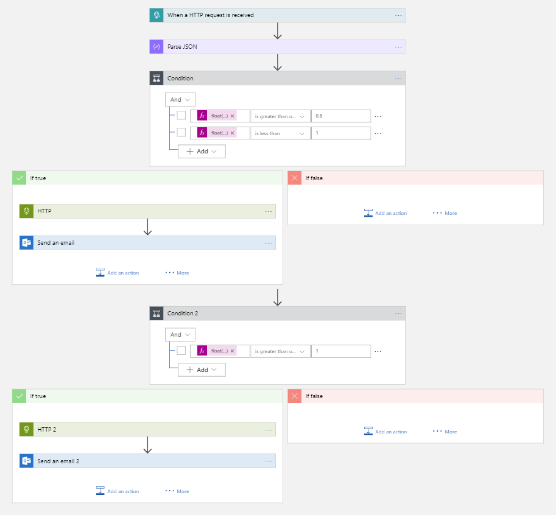

When you saved your logic app, a URL was generated that you'll be able to call. You'll use this URL in the next section of this tutorial.

## Create an Azure Monitor Action Group

An action group is a collection of notification preferences that you define. When an alert is triggered, a specific action group can receive the alert by being notified. An Azure alert proactively raises a notification based on specific conditions and provides the opportunity to take action. An alert can use data from multiple sources, including metrics and logs.

Action groups are the only endpoint that you'll integrate with your budget. You can set up notifications in a number of channels, but for this scenario you'll focus on the Logic App you created earlier in this tutorial.

### Create an action group in Azure Monitor

When you create the action group, you'll point to the Logic App that you created earlier in this tutorial.

1. If you are not already signed-in to the [Azure portal](https://portal.azure.com/), sign in and select **All services** > **Monitor**.
1. Select **Alerts** then select **Manage actions**.
1. Select **Add an action group** from the **Action groups** area.
1. Add and verify the following items:
    - Action group name
    - Short name
    - Subscription
    - Resource group  
    
1. Within the **Add action group** pane, add a LogicApp action. Name the action **Budget-BudgetLA**. In the **Logic App** pane, select the **Subscription** and the **Resource group**. Then, select the **Logic app** that you created earlier in this tutorial.
1. Select **OK** to set the Logic App. Then, select **OK** in the **Add action group** pane to create the action group.

You're done with all the supporting components needed to effectively orchestrate your budget. Now all you need to do is create the budget and configure it to use the action group you created.

## Create the budget

You can create a budget in the Azure portal using the [Budget feature](../costs/tutorial-acm-create-budgets.md) in Cost Management. Or, you can create a budget using REST APIs, PowerShell cmdlets, or use the CLI. The following procedure uses the REST API. Before calling the REST API, you'll need an authorization token. To create an authorization token, you can use the [ARMClient](https://github.com/projectkudu/ARMClient) project. The **ARMClient** allows you to authenticate yourself to the Azure Resource Manager and get a token to call the APIs.

### Create an authentication token

1. Navigate to the [ARMClient](https://github.com/projectkudu/ARMClient) project on GitHub.
1. Clone the repo to get a local copy.
1. Open the project in Visual Studio and build it.
1. Once the build is successful, the executable should be in the *\bin\debug* folder.
1. Run the ARMClient. Open a command prompt and navigate to the *\bin\debug* folder from the project root.
1. To sign in and authenticate, enter the following command at the command prompt:<br>
    `ARMClient login prod`
1. Copy the **subscription guid** from the output.
1. To copy an authorization token to your clipboard, enter the following command at the command prompt, but sure to use the copied subscription ID from the step above: <br>
    `ARMClient token <subscription GUID from previous step>`

    Once you have completed the step above, you'll see:<br>
    **Token copied to clipboard successfully.**
1. Save the token to be used for steps in the next section of this tutorial.

### Create the Budget

Next, you'll configure **Postman** to create a budget by calling the Azure Consumption REST APIs. Postman is an API Development environment. You'll import environment and collection files into Postman. The collection contains grouped definitions of HTTP requests that call Azure Consumption REST APIs. The environment file contains variables that are used by the collection.

1. Download and open the [Postman REST client](https://www.getpostman.com/) to execute the REST APIs.
1. In Postman, create a new request.  
    
1. Save the new request as a collection, so that the new request has nothing on it.  
    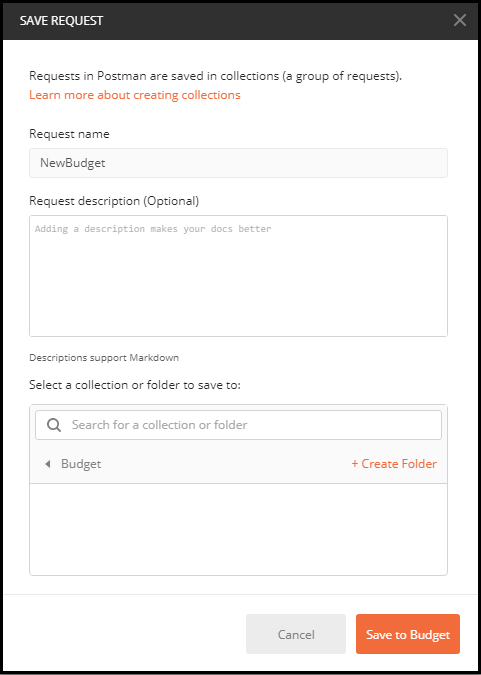
1. Change the request from a `Get` to a `Put` action.
1. Modify the following URL by replacing `{subscriptionId}` with the **Subscription ID** that you used in the previous section of this tutorial. Also, modify the URL to include "SampleBudget" as the value for `{budgetName}`:
    `https://management.azure.com/subscriptions/{subscriptionId}/providers/Microsoft.Consumption/budgets/{budgetName}?api-version=2018-03-31`
1. Select the **Headers** tab within Postman.
1. Add a new **Key** named "Authorization".
1. Set the **Value** to the token that was created using the ArmClient at the end of the last section.
1. Select **Body** tab within Postman.
1. Select the **raw** button option.
1. In the textbox, paste in the below sample budget definition, however you must replace the `subscriptionID`, `resourcegroupname`, and `actiongroupname` parameters with your subscription ID, a unique name for your resource group, and the action group name you created in both the URL and the request body:

    ```
        {
            "properties": {
                "category": "Cost",
                "amount": 100.00,
                "timeGrain": "Monthly",
                "timePeriod": {
                "startDate": "2018-06-01T00:00:00Z",
                "endDate": "2018-10-31T00:00:00Z"
                },
                "filters": {},
            "notifications": {
                "Actual_GreaterThan_80_Percent": {
                    "enabled": true,
                    "operator": "GreaterThan",
                    "threshold": 80,
                    "contactEmails": [],
                    "contactRoles": [],
                    "contactGroups": [
                        "/subscriptions/{subscriptionid}/resourceGroups/{resourcegroupname}/providers/microsoft.insights/actionGroups/{actiongroupname}"
                    ]
                },
               "Actual_EqualTo_100_Percent": {
                       "operator": "EqualTo",
                       "threshold": 100,
                       "contactGroups": [
                           "/subscriptions/{subscriptionid}/resourceGroups/{resourcegroupname}/providers/microsoft.insights/actionGroups/{actiongroupname}"
                       ]
                   }
               }
            }
        }
    ```
1. Press **Send** to send the request.

You now have all the pieces you need to call the [budgets API](/rest/api/consumption/budgets). The budgets API reference has additional details on the specific requests, including:

- **budgetName** - Multiple budgets are supported.  Budget names must be unique.
- **category** - Must be either **Cost** or **Usage**. The API supports both cost and usage budgets.
- **timeGrain** - A monthly, quarterly, or yearly budget. The amount resets at the end of the period.
- **filters** - Filters allow you to narrow the budget to a specific set of resources within the selected scope. For example, a filter could be a collection of resource groups for a subscription level budget.
- **notifications** – Determines the notification details and thresholds. You can set up multiple thresholds and provide an email address or an action group to receive a notification.

## Summary

By using this tutorial, you learned:

- How to create an Azure Automation Runbook to stop VMs.
- How to create an Azure Logic App that is triggered based on the budget threshold values and call the related runbook with the right parameters.
- How to create an Azure Monitor Action Group that was configured to trigger the Azure Logic App when the budget threshold is met.
- How to create the budget with the desired thresholds and wire it to the action group.

You now have a fully functional budget for your subscription that will shut down your VMs when you reach your configured budget thresholds.

## Next steps

- For more information about Azure billing scenarios, see [Billing and cost management automation scenarios](cost-management-automation-scenarios.md).