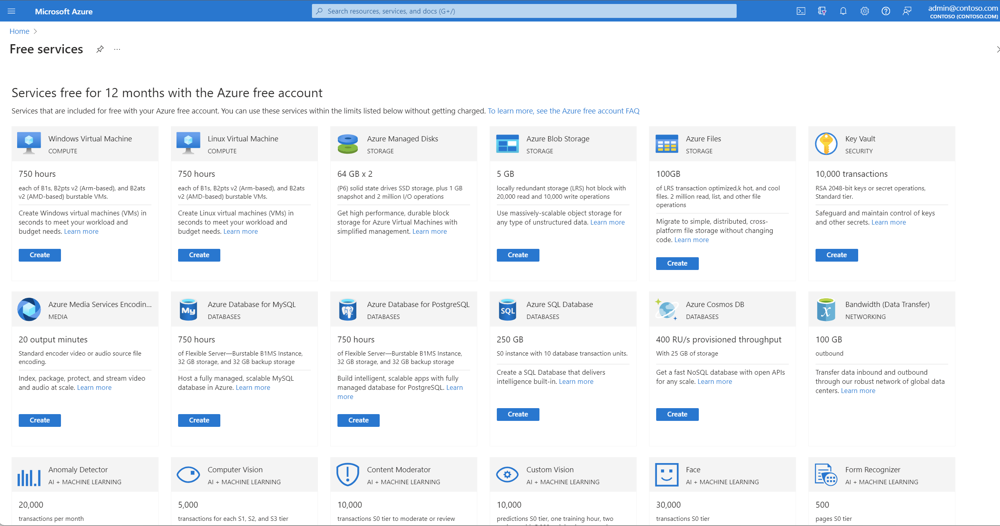

# Create services included with Azure free account

Your Azure free account includes a limited quantity of free services for 12 months. Within these limits, you have the flexibility to use the free services in various configurations to meet your needs.

## Create free services in the Azure portal
We recommend you use the link to the [Free service page](https://go.microsoft.com/fwlink/?linkid=859151) to create free services. Or you can sign in to the [Azure portal](https://portal.azure.com), and search for **free services**. When you create services from the free services page, most of the fields are pre-selected for you to easily create services for free.

## Services can be created in any region
As long as you are within the limits, you can create services for free in any region where services are available. For example, you get 750 hours of a B1S Windows virtual machine free each month with Azure free account. You can create the virtual machine in any region where B-series virtual machines are available. Azure doesn't charge you unless you exceed 750 hours. For example, a customer in the U.S. can provision a B1S Windows virtual machine in West Europe and use it for 750 hours for free.

To learn about Azure service availability by region, see [Products available by region](https://azure.microsoft.com/regions/services/).

## Create multiple service instances in allowed limits
You can create multiple instances of services for free as long as the sum of usage is within the usage limit. For example, you get 750 hours of a B1S Windows virtual machine free each month with your Azure free account. You can use 750 hours in any combination you want. For example, you can create 5 B1S Windows virtual machines and use them for 150 hours each.

## Need help? Contact us.

If you have questions or need help,  [create a support request](https://go.microsoft.com/fwlink/?linkid=2083458).

## Next steps
- Learn how to [Check usage of free services included with your Azure free account](check-free-service-usage.md).
- Learn how to [Avoid getting charged for your Azure free account](avoid-charges-free-account.md).
