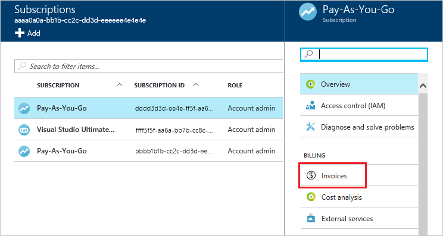
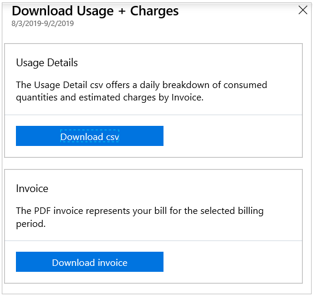
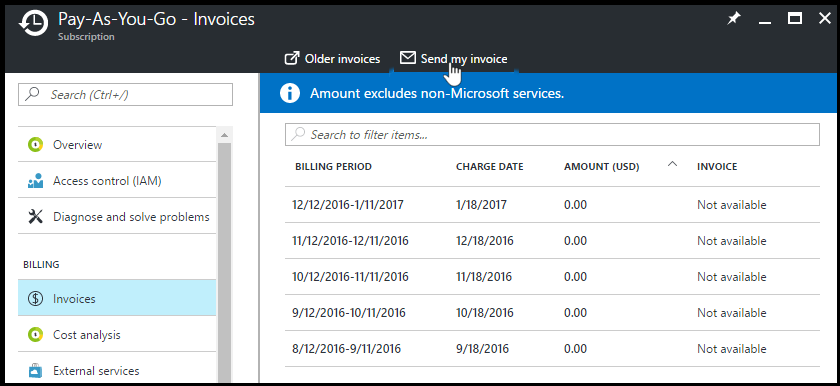

# Download or view your Azure billing invoice

For most subscriptions, you can download your invoice from the [Azure portal](https://portal.azure.com/#blade/Microsoft_Azure_Billing/SubscriptionsBlade) or have it sent in email. 

If you're an Azure customer with a direct Enterprise Agreement (EA customer), you can download your organization's invoices using the information at [Download or view your Azure billing invoice](direct-ea-azure-usage-charges-invoices.md#download-or-view-your-azure-billing-invoice). For indirect EA customers, see [Azure Enterprise enrollment invoices](ea-portal-enrollment-invoices.md).

Only certain roles have permission to get billing invoice, like the Account Administrator or Enterprise Administrator. To learn more about getting access to billing information, see [Manage access to Azure billing using roles](manage-billing-access.md).

If you have a Microsoft Customer Agreement, you must be a billing profile Owner, Contributor, Reader, or Invoice manager to view billing information. To learn more about billing roles for Microsoft Customer Agreements, see [Billing profile roles and tasks](understand-mca-roles.md#billing-profile-roles-and-tasks).

[!INCLUDE [GDPR-related guidance](../../../includes/gdpr-intro-sentence.md)]

## Download your Azure invoices (.pdf)

If you have a Microsoft Customer Agreement, see [Download invoices for a Microsoft Customer Agreement](#download-invoices-for-a-microsoft-customer-agreement).

### Download invoices for an individual subscription

1. Select your subscription from the [Subscriptions page](https://portal.azure.com/#blade/Microsoft_Azure_Billing/SubscriptionsBlade) in the Azure portal as [a user with access to invoices](manage-billing-access.md).
2. Select **Invoices**.  
    
3. Select the download symbol to download a copy of your PDF invoice and then select **Download invoice**. If it says **Not available**, see [Why don't I see an invoice for the last billing period?](#noinvoice)  
    
4. You can also download a daily breakdown of consumed quantities and estimated charges by selecting **Download csv**.
    

For more information about your invoice, see [Understand your bill for Microsoft Azure](../understand/review-individual-bill.md). For help with managing your costs, see [Analyze unexpected charges](../understand/analyze-unexpected-charges.md).

### Download invoices for a Microsoft Customer Agreement

Invoices are generated for each [billing profile](../understand/mca-overview.md#billing-profiles) in the Microsoft Customer Agreement. You must be a billing profile Owner, Contributor, Reader, or Invoice manager to download invoices from the Azure portal.

> [!NOTE]
> VAT taxes shown on your invoice might have imprecise decimal point rounding that results in tax that's under or overcharged. For more information, see [What is the Modern Limited Risk Distributor model?](../understand/mca-understand-your-invoice.md#what-is-the-modern-limited-risk-distributor-model)

1. Search for **Cost Management + Billing**.
2. Select a billing profile.
3. Select **Invoices**.
4. In the invoice grid, find the row of the invoice you want to download.
5. Select the download symbol at the end of the row.
6. In the download context menu, select **Invoice**.

If you don't see an invoice for the last billing period, see the following section.

###  Why don't I see an invoice for the last billing period?

There could be several reasons that you don't see an invoice:

- It's less than 30 days from the day you subscribed to Azure.
- The invoice isn't generated yet. Wait until the end of the billing period.
- You don't have permission to view invoices. If you have a Microsoft Customer Agreement, you must be the billing profile Owner, Contributor, Reader, or Invoice manager. For other subscriptions, you might not see old invoices if you aren't the Account Administrator. To learn more about getting access to billing information, see [Manage access to Azure billing using roles](manage-billing-access.md).
- If you have a Free Trial or a monthly credit amount with your subscription that you didn't exceed, you won't get an invoice unless you have a Microsoft Customer Agreement.

## Get your invoice in email (.pdf)

You can opt in and configure other recipients to receive your Azure invoice in an email. This feature isn't available for certain subscriptions such as support offers, Enterprise Agreements, or Azure in Open. If you have a Microsoft Customer agreement, see [Get your billing profile invoices in email](../understand/download-azure-invoice.md#get-your-billing-profiles-invoice-in-email).

### Get your subscription's invoices in email

1. Select your subscription from the [Subscriptions page](https://portal.azure.com/#blade/Microsoft_Azure_Billing/SubscriptionsBlade). Opt in for each subscription you own. Select **Invoices** then **Email my invoice**.  
    
2. Select **Opt in** and accept the terms.  
    
3. Once you've accepted the agreement, you can configure other recipients. When a recipient is removed, the email address is no longer stored. If you change your mind, you need to readd them.  
    

If you don't get an email after following the steps, make sure your email address is correct in the [communication preferences on your profile](https://account.microsoft.com/profile) in the Microsoft Account center.

### Opt out of getting your subscription's invoices in email

You can opt out of getting your invoice by email by following the preceding steps and select **Opt out of emailed invoices**. This option removes any email addresses set to receive invoices in email. You can reconfigure recipients if you opt back in.

 

### Get your Microsoft Customer Agreement invoices in email

If you have a Microsoft Customer Agreement, you can opt in to get your invoice in an email. All billing profile Owners, Contributors, Readers, and Invoice managers will get the invoice by email. Readers can't update the email invoice preference.

1. Search for **Cost Management + Billing**.
1. Select a billing profile.
1. Under **Settings**, select **Properties**.
1. Under **Email Invoice**, select **Update email invoice preference**.
1. Select **Opt in**.
1. Select **Update**.

### Opt out of getting your billing profile invoices in email

You can opt out of getting your invoice by email by following the preceding steps and select **Opt out**. All Owners, Contributors, Readers, and Invoice managers will be opted out of getting the invoice by email, too. If you're a Reader, you can't change the email invoice preference.

## Azure Government support for invoices

Azure Government users use the same agreement types as other Azure users.

Azure Government customers can’t request their invoice by email. They can only download it.

To download your invoice, follow the preceding steps at [Download invoices for an individual subscription](#download-invoices-for-an-individual-subscription).

## Next steps

To learn more about your invoice and charges, see:

- [Understand your bill for Microsoft Azure](../understand/review-individual-bill.md)
- [Understand terms on your Azure invoice](../understand/understand-invoice.md)
- [Understand terms on your Microsoft Azure detailed usage](../understand/understand-usage.md)
- [View your organization's Azure pricing](ea-pricing.md)

If you have a Microsoft Customer Agreement, see:

- [Understand the charges on the invoice for your billing profile](../understand/review-customer-agreement-bill.md)
- [Understand terms on the invoice for your billing profile](../understand/mca-understand-your-invoice.md)
- [Understand the Azure usage and charges file for your billing profile](../understand/mca-understand-your-usage.md)
- [View and download tax documents for your billing profile](../understand/mca-download-tax-document.md)
- [View your organization's Azure pricing](ea-pricing.md)
