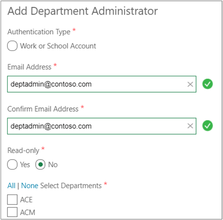
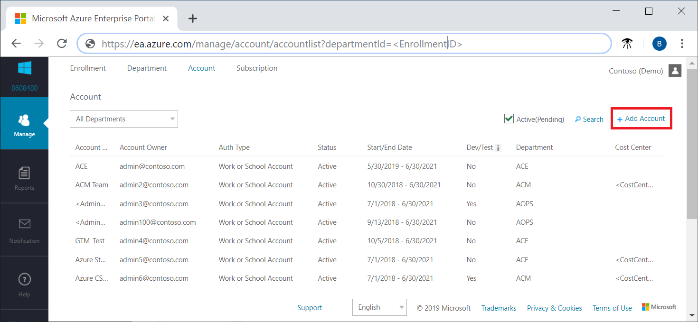
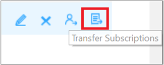

# Azure EA portal administration

This article explains the common tasks that an administrator accomplishes in the Azure EA portal (https://ea.azure.com). The Azure EA portal is an online management portal that helps customers manage the cost of their Azure EA services. For introductory information about the Azure EA portal, see the [Get started with the Azure EA portal](ea-portal-get-started.md) article.

## Activate your enrollment

To activate your service, the initial enterprise administrator opens the [Azure Enterprise portal](https://ea.azure.com) and signs in using the email address from the invitation email.

If you've been set up as the enterprise administrator, you don't need to receive the activation email. Go to [Azure Enterprise portal](https://ea.azure.com) and sign in with your work, school, or Microsoft account email address and password.

If you have more than one enrollment, choose one to activate. By default, only active enrollments are shown. To view enrollment history, clear the **Active** option in the top right of the Azure Enterprise portal.

Under **Enrollment**, the status shows **Active**.

Only existing Azure enterprise administrators can create other enterprise administrators.

### Create another enterprise administrator

Use one of the following options, based on your situation.

#### If you're already an enterprise administrator

1. Sign in to the [Azure Enterprise portal](https://ea.azure.com).
1. Go to **Manage** > **Enrollment Detail**.
1. Select **+ Add Administrator** at the top right.

Make sure that you have the user's email address and preferred authentication method, such as a work, school, or Microsoft account.

#### If you're not an enterprise administrator

If you're not an enterprise administrator, contact an enterprise administrator to request that they add you to an enrollment. The enterprise administrator uses the preceding steps to add you as an enterprise administrator. After you're added to an enrollment, you receive an activation email.

#### If your enterprise administrator can't help you

If your enterprise administrator can't assist you, create an [Azure Enterprise portal support request](https://support.microsoft.com/supportrequestform/cf791efa-485b-95a3-6fad-3daf9cd4027c). Provide the following information:

- Enrollment number
- Email address to add, and authentication type (work, school, or Microsoft account)
- Email approval from an existing enterprise administrator
  - If the existing enterprise administrator isn't available, contact your partner or software advisor to request that they change the contact details through the Volume Licensing Service Center (VLSC) tool.

## Create an Azure Enterprise department

Enterprise administrators and department administrators use departments to organize and report on enterprise Azure services and usage by department and cost center. The enterprise administrator can:

- Add or remove departments.
- Associate an account to a department.
- Create department administrators.
- Allow department administrators to view price and costs.

A department administrator can add new accounts to their departments. They can remove accounts from their departments, but not from the enrollment.

To add a department:

1. Sign in to the Azure Enterprise portal.
1. In the left pane, select **Manage**.
1. Select the **Department** tab, then select **+ Add Department**.
1. Enter the information.
   The department name is the only required field. It must be at least three characters.
1. When complete, select **Add**.

## Add a department administrator

After a department is created, the enterprise administrator can add department administrators and associate each one to a department. Department administrators can perform the following actions for their departments:

- Create other department administrators
- View and edit department properties such as name or cost center
- Add accounts
- Remove accounts
- Download usage details
- View the monthly usage and charges 1

> 1 An enterprise administrator must grant these permissions. If you were given permission to view department monthly usage and charges, but can't see them, contact your partner.

### To add a department administrator

As an enterprise administrator:

1. Sign in to the Azure Enterprise portal.
1. In the left pane, select **Manage**.
1. Select the **Department** tab and then select the department.
1. Select **+ Add Administrator** and add the required information.
1. For read-only access, set the **Read-Only** option to **Yes** and then select **Add**.

### To set read-only access

You can grant read-only access to department administrators.

- When you create a new department administrator, set the read-only option to **Yes**.

- To edit an existing department administrator:
   1. Select a department, and then select the pencil symbol next to the **Department Administrator** that you want to edit.
   1. Set the read-only open to **Yes**, and then select **Save**.

Enterprise administrators automatically get department administrator permissions.

## Add an account

The structure of accounts and subscriptions impact how they're administered and how they appear on your invoices and reports. Examples of typical organizational structures include business divisions, functional teams, and geographic locations.

To add an account:

1. In the Azure Enterprise portal, select **Manage** in the left navigation area.
1. Select the **Account** tab. On the **Account** page, select **+Add Account**.
1. Select a department, or leave it as unassigned, and then select the desired authentication type.
1. Enter a friendly name to identify the account in reporting.
1. Enter the **Account Owner Email** address to associate with the new account.
1. Confirm the email address and then select **Add**.

To add another account, select **Add Another Account**, or select **Add** at the bottom-right corner of the left toolbar.

To confirm account ownership:

1. Sign in to the Azure Enterprise portal.
1. View the status.

   The status should change from **Pending** to **Start/End date**. The Start/End date is the date the user first signed in and the agreement end date.
1. When the **Warning** message pops up, the account owner needs to select **Continue** to activate the account the first time they sign in to the Azure Enterprise portal.

## Change Azure subscription or account ownership

Enterprise administrators can use the Azure Enterprise portal to transfer account ownership of selected or all subscriptions in an enrollment.

When you complete a subscription or account ownership transfer, Microsoft updates the account owner.

Before performing the ownership transfer, understand these Azure role-based access control (Azure RBAC) policies:

- When performing subscription or account ownership transfers between two organizational IDs within the same tenant, Azure RBAC policies, existing service administrator, and co-administrator roles are preserved.
- Cross-tenant subscription or account ownership transfers result in losing your Azure RBAC policies and role assignments.
- Policies and administrator roles don't transfer across different directories. Service administrators are updated to the owner of destination account.
- To avoid loss of Azure RBAC policies and role assignments when transferring subscription between tenants, ensure that the **Move the subscriptions to the recipient’s Azure AD tenant** checkbox remains **unchecked**. This will retain the services, Azure roles, and policies on the current Azure AD tenant and only transfer the billing ownership for the account.  
    :::image type="content" source="./media/ea-portal-administration/unselected-checkbox-move-subscriptions-to-recipients-tenant.png" alt-text="Image showing unselected checkbox for moving subscriptions to Azure AD tenant" lightbox="./media/ea-portal-administration/unselected-checkbox-move-subscriptions-to-recipients-tenant.png" :::

Before changing an account owner:

1. In the Azure Enterprise portal, view the **Account** tab and identify the source account. The source account must be active.
1. Identify the destination account and make sure it's active.

To transfer account ownership for all subscriptions:

1. Sign in to the Azure Enterprise portal.
1. In the left navigation area, select **Manage**.
1. Select the **Account** tab and hover over an account.
1. Select the change account owner icon on the right. The icon resembles a person.  
    
1. Choose the destination account to transfer to and then select **Next**.
1. If you want to transfer the account ownership across Azure AD tenants, select the **Move the subscriptions to the recipient's Azure AD tenant** checkbox.  
    :::image type="content" source="./media/ea-portal-administration/selected-checkbox-move-subscriptions-to-recipients-tenant.png" alt-text="Image showing selected checkbox for moving subscriptions to Azure AD tenant" lightbox="./media/ea-portal-administration/selected-checkbox-move-subscriptions-to-recipients-tenant.png" :::
1. Confirm the transfer and select **Submit**.

To transfer account ownership for a single subscription:

1. Sign in to the Azure Enterprise portal.
1. In the left navigation area, select **Manage**.
1. Select the **Account** tab and hover over an account.
1. Select the transfer subscriptions icon on the right. The icon resembles a page.  
    
1. Choose the destination account to transfer the subscription and then select **Next**.
1. If you want to transfer the subscription ownership across Azure AD tenants, select the **Move the subscriptions to the recipient's Azure AD tenant** checkbox.  
    :::image type="content" source="./media/ea-portal-administration/selected-checkbox-move-subscriptions-to-recipients-tenant.png" alt-text="Image showing selected checkbox for moving subscriptions to Azure AD tenant" lightbox="./media/ea-portal-administration/selected-checkbox-move-subscriptions-to-recipients-tenant.png" :::
1. Confirm the transfer and then select **Submit**.

## Associate an account to a department

Enterprise Administrators can associate existing accounts to Departments under the enrollment.

### To associate an account to a department

1. Sign in to the Azure EA Portal as an enterprise administrator.
1. Select **Manage** on the left navigation.
1. Select **Department**.
1. Hover over the row with the account and select the pencil icon on the right.
1. Select the department from the drop-down menu.
1. Select **Save**.

## Associate an existing account with your Pay-As-You-Go subscription

If you already have an existing Microsoft Azure account on the Azure portal, enter the associated school, work, or Microsoft account in order to associate it with your Enterprise Agreement enrollment.

### Associate an existing account

1. In the Azure Enterprise portal, select **Manage**.
1. Select the **Account** tab.
1. Select **+Add an account**.
1. Enter the work, school, or Microsoft account associated with the existing Azure account.
1. Confirm the account associated with the existing Azure account.
1. Provide a name you would like to use to identify this account in reporting.
1. Select **Add**.
1. To add an additional account, you can select the **+Add an Account** option again or return to the homepage by selecting the **Admin** button.
1. If you view the **Account** page, the newly added account will appear in a **Pending** status.

### Confirm account ownership

1. Sign into the email account associated with the work, school, or Microsoft account you provided.
1. Open the email notification titled _"Invitation to Activate your Account on the Microsoft Azure Service from Microsoft Volume Licensing"_.
1. Select the **Log into the Microsoft Azure Enterprise Portal** link in the invitation.
1. Select **Sign in**.
1. Enter your work, school, or Microsoft account and password to sign in and confirm account ownership.

### Azure Marketplace

Although most subscriptions can convert from the Pay-as-You-Go environment to Azure Enterprise Agreement, Azure Marketplace services do not. In order to have a single view of all subscriptions and charges, we recommend you add the Azure Marketplace services to the Azure Enterprise portal.

1. Sign in to the Azure Enterprise portal.
1. Select **Manage** on the left navigation.
1. Select the **EnrollmentTab**.
1. View the **Enrollment Detail** section.
1. To the right of the Azure Marketplace field, select the pencil icon to enable it. Select **Save**.

The account owner can now purchase any Azure Marketplace services that were previously owned in the Pay-As-You-Go subscription.

After the new Azure Marketplace subscriptions are activated under your Azure EA enrollment, cancel the Azure Marketplace services that were created in the Pay-As-You-Go environment. This step is critical so that your Azure Marketplace subscriptions do not fall into a bad state when your Pay-As-You-Go payment instrument expires.

### MSDN

MSDN subscriptions are automatically converted to MSDN Dev/Test and the Azure EA offer will lose any existing monetary credit.

### Azure in Open

If you associate an Azure in Open subscription with an Enterprise Agreement, you forfeit any unconsumed Azure in Open credits. Thus, we recommended that you consume all credit on an Azure in Open subscription before you add the account to your Enterprise Agreement.  

### Accounts with support subscriptions

If your Enterprise Agreement doesn't have a support subscription and you add an existing account with a support subscription to the Azure Enterprise portal, your MOSA support subscription won't automatically transfer. You'll need to repurchase a support subscription in Azure EA during the grace period - by the end of the subsequent month.

## Department spending quotas

EA customers can set or change spending quotas for each department under an enrollment. The spending quota amount is set for the current Prepayment term. At the end of the current Prepayment term, the system will extend the existing spending quota to the next Prepayment term unless the values are updated.

The department administrator can view the spending quota but only the enterprise administrator can update the quota amount. The enterprise administrator and the department administrator and will receive notifications once quota has reached 50%, 75%, 90%, and 100%.

### Enterprise administrator to set the quota:

 1. Open the Azure EA Portal.
 1. Select **Manage** on the left navigation.
 1. Select the **Department** Tab.
 1. Select the Department.
 1. Select the pencil symbol on the Department Details section, or select the **+ Add Department** symbol to add a spending quota along with a new department.
 1. Under Department Details, enter a spending quota amount in the enrollment's currency in the Spending Quota $ box (must be greater than 0).
    - The Department Name and Cost Center can also be edited at this time.
 1. Select **Save**.

The department spending quota will now be visible in the Department List view under the Department tab. At the end of the current Prepayment, the Azure EA Portal will maintain the spending quotas for the next Prepayment term.

The department quota amount is independent of the current Azure Prepayment, and the quota amount and alerts apply only to first party usage. The department spending quota is for informational purposes only and doesn't enforce spending limits.

### Department administrator to view the quota:

1. Open the Azure EA Portal.
1. Select **Manage** on the left navigation.
1. Select the **Department** tab and view the Department List view with spending quotas.

If you're an indirect customer, cost features must be enabled by your channel partner.

## Enterprise user roles

The Azure EA portal helps you to administer your Azure EA costs and usage. There are three main roles in the Azure EA portal:

- EA admin
- Department administrator
- Account owner

Each role has a different level of access and authority.

For more information about user roles, see [Enterprise user roles](./understand-ea-roles.md#enterprise-user-roles).

## Add an Azure EA account

The Azure EA account is an organizational unit in the Azure EA portal. It's used to administer subscriptions and it's also used for reporting. To access and use Azure services, you need to create an account or have one created for you.

For more information about Azure accounts, see [Add an account](#add-an-account).

## Enterprise Dev/Test Offer

As an Azure enterprise administrator, you can enable account owners in your organization to create subscriptions based on the EA Dev/Test offer. To do so, select the Dev/Test box for the account owner in the Azure EA Portal.

Once you've checked the Dev/Test box, let the account owner know so that they can set up the EA Dev/Test subscriptions needed for their teams of Dev/Test subscribers.

The offer enables active Visual Studio subscribers to run development and testing workloads on Azure at special Dev/Test rates. It provides access to the full gallery of Dev/Test images including Windows 8.1 and Windows 10.

### To set up the Enterprise Dev/Test offer:

1. Sign in as the enterprise administrator.
1. Select **Manage** on the left navigation.
1. Select the **Account** tab.
1. Select the row for the account where you would like to enable Dev/Test access.
1. Select the pencil symbol to the right of the row.
1. Select the Dev/Test checkbox.
1. Select **Save**.

When a user is added as an account owner through the Azure EA Portal, any Azure subscriptions associated with the account owner that are based on either the PAYG Dev/Test offer or the monthly credit offers for Visual Studio subscribers will be converted to the EA Dev/Test offer. Subscriptions based on other offer types, such as PAYG, associated with the Account Owner will be converted to Microsoft Azure Enterprise offers.

The Dev/Test Offer isn't applicable to Azure Gov customers at this time.

## Create a subscription

Account owners can view and manage subscriptions. You can use subscriptions to give teams in your organization access to development environments and projects. For example: test, production, development, and staging.

When you create different subscriptions for each application environment, you help secure each environment.

- You can also assign a different service administrator account for each subscription.
- You can associate subscriptions with any number of services.
- The account owner creates subscriptions and assigns a service administrator account to each subscription in their account.

### Add a subscription

Use the following information to add a subscription.

The first time you add a subscription to your account, you're asked to accept the Microsoft Online Subscription Agreement (MOSA) and a rate plan. Although they aren't applicable to Enterprise Agreement customers, the MOSA and the rate plan are required to create your subscription. Your Microsoft Azure Enterprise Agreement Enrollment Amendment supersedes the above items and your contractual relationship doesn't change. When prompted, select the box that indicates you accept the terms.

_Microsoft Azure Enterprise_ is the default name when a subscription is created. You can change the name to differentiate it from the other subscriptions in your enrollment, and to ensure that it's recognizable in reports at the enterprise level.

To add a subscription:

1. In the Azure Enterprise portal, sign in to the account.
1. Select the **Admin** tab and then select **Subscription** at the top of the page.
1. Verify that you're signed in as the account owner of the account.
1. Select **+Add Subscription** and then select **Purchase**.

   The first time you add a subscription to an account, you must provide your contact information. When you add additional subscriptions, your contact information is added for you.

1. Select **Subscriptions** and then select the subscription you created.
1. Select **Edit Subscription Details**.
1. Edit the **Subscription Name** and the **Service Administrator** and then select the check mark.

   The subscription name appears on reports. It's the name of the project associated with the subscription in the development portal.

New subscriptions can take up to 24 hours to appear in the subscriptions list. After you've created a subscription, you can:

- [Edit subscription details](https://portal.azure.com)
- [Manage subscription services](https://portal.azure.com/#home)

## Delete subscription

To delete a subscription where you're the account owner:

1. Sign in to the Azure portal with the credentials associated to your account.
1. On the Hub menu, select **Subscriptions**.
1. In the subscriptions tab in the upper left corner of the page, select the subscription you want to cancel and select **Cancel Sub** to launch the cancel tab.
1. Enter the subscription name and choose a cancellation reason and select the **Cancel Sub** button.

Only account administrators can cancel subscriptions.

For more information, see [What happens after I cancel my subscription?](cancel-azure-subscription.md#what-happens-after-subscription-cancellation).

## Delete an account

Account removal can only be completed for active accounts with no active subscriptions.

1. In the Enterprise portal, select **Manage** on the left navigation.
1. Select the **Account** tab.
1. From the Accounts table, select the Account you would like to delete.
1. Select the X symbol at the right of the Account row.
1. Once there are no active subscriptions under the account, select **Yes** under the Account row to confirm the Account removal.

## Update notification settings

Enterprise Administrators are automatically enrolled to receive usage notifications associated to their enrollment. Each Enterprise Administrator can change the interval of the individual notifications or can turn them off completely.

Notification contacts are shown in the Azure EA portal in the **Notification Contact** section. Managing your notification contacts makes sure that the right people in your organization get Azure EA notifications.

To View current notifications settings:

1. In the Azure EA portal, navigate to **Manage** > **Notification Contact**.
2. Email Address – The email address associated with the Enterprise Administrator's Microsoft Account, Work, or School Account that receives the notifications.
3. Unbilled Balance Notification Frequency – The frequency that notifications are set to send to each individual Enterprise Administrator.

To add a contact:

1. Select **+Add Contact**.
2. Enter the email address and then confirm it.
3. Select **Save**.

The new notification contact is displayed in the **Notification Contact** section. To change the notification frequency, select the notification contact and select the pencil symbol to the right of the selected row. Set the frequency to **daily**, **weekly**, **monthly**, or **none**.

You can suppress _approaching coverage period end date_ and _disable and de-provision date approaching_ lifecycle notifications. Disabling lifecycle notifications suppresses notifications about the coverage period and agreement end date.

## Azure sponsorship offer

The Azure sponsorship offer is a limited sponsored Microsoft Azure account. It's available by e-mail invitation only to limited customers selected by Microsoft. If you're entitled to the Microsoft Azure sponsorship offer, you'll receive an e-mail invitation to your account ID.

For more information, create a [support request for sponsorship activation](https://aka.ms/azrsponsorship).

## Conversion to work or school account authentication

Azure Enterprise users can convert from a Microsoft Account (MSA or Live ID) to a Work or School Account (which uses Azure Active Directory) authentication type.

To begin:

1. Add the work or school account to the Azure EA Portal in the role(s) needed.
1. If you get errors, the account may not be valid in the active directory.  Azure uses User Principal Name (UPN), which isn't always identical to the email address.
1. Authenticate to the Azure EA portal using the work or school account.

### To convert subscriptions from Microsoft accounts to work or school accounts:

1. Sign in to the management portal using the Microsoft account that owns the subscriptions.
1. Use account ownership transfer to move to the new account.
1. Now the Microsoft account should be free from any active subscriptions and can be deleted.
1. Any deleted account will remain in view in the portal in an inactive status for historic billing reasons.  You can filter it out of the view by selecting a check box to show only active accounts.

## Azure EA term glossary

- **Account**: An organizational unit on the Azure Enterprise portal. It is used to administer subscriptions and for reporting.
- **Account owner**: The person who manages subscriptions and service administrators on Azure. They can view usage data on this account and its associated subscriptions.
- **Amendment subscription**: A one-year, or coterminous subscription under the enrollment amendment.
- **Prepayment**: Prepayment of an annual monetary amount for Azure services at a discounted Prepayment rate for usage against this prepayment.
- **Department administrator**: The person who manages departments, creates new accounts and account owners, views usage details for the departments they manage, and can view costs when granted permissions.
- **Enrollment number**: A unique identifier supplied by Microsoft to identify the specific enrollment associated with an Enterprise Agreement.
- **Enterprise administrator**: The person who manages departments, department owners, accounts, and account owners on Azure. They have the ability to manage enterprise administrators as well as view usage data, billed quantities, and unbilled charges across all accounts and subscriptions associated with the enterprise enrollment.
- **Enterprise agreement**: A Microsoft licensing agreement for customers with centralized purchasing who want to standardize their entire organization on Microsoft technology and maintain an information technology infrastructure on a standard of Microsoft software.
- **Enterprise agreement enrollment**: An enrollment in the Enterprise Agreement program providing Microsoft products in volume at discounted rates.
- **Microsoft account**: A web-based service that enables participating sites to authenticate a user with a single set of credentials.
- **Microsoft Azure Enterprise Enrollment Amendment (enrollment amendment)**: An amendment signed by an enterprise, which provides them access to Azure as part of their enterprise enrollment.
- **Azure Enterprise portal**: The portal used by our enterprise customers to manage their Azure accounts and their related subscriptions.
- **Resource quantity consumed**: The quantity of an individual Azure service that was used in a month.
- **Service administrator**: The person who accesses and manages subscriptions and development projects on the Azure Enterprise portal.
- **Subscription**: Represents an Azure Enterprise portal subscription and is a container of Azure services managed by the same service administrator.
- **Work or school account**: For organizations that have set up Azure Active Directory with federation to the cloud and all accounts are on a single tenant.

### Enrollment statuses

- **New**: This status is assigned to an enrollment that was created within 24 hours and will be updated to a Pending status within 24 hours.
- **Pending**: The enrollment administrator needs to sign in to the Azure Enterprise portal. Once signed in, the enrollment will switch to an Active status.
- **Active**: The enrollment is Active and accounts and subscriptions can be created in the Azure Enterprise portal. The enrollment will remain active until the Enterprise Agreement end date.
- **Indefinite extended term**: An indefinite extended term takes place after the Enterprise Agreement end date has passed. It enables Azure EA customers who are opted in to the extended term to continue to use Azure services indefinitely at the end of their Enterprise Agreement.

   Before the Azure EA enrollment reaches the Enterprise Agreement end date, the enrollment administrator should decide which of the following options to take:

  - Renew the enrollment by adding additional Azure Prepayment.
  - Transfer to a new enrollment.
  - Migrate to the Microsoft Online Subscription Program (MOSP).
  - Confirm disablement of all services associated with the enrollment.
- **Expired**: The Azure EA customer is opted out of the extended term, and the Azure EA enrollment has reached the Enterprise Agreement end date. The enrollment will expire, and all associated services will be disabled.
- **Transferred**: Enrollments where all associated accounts and services have been transferred to a new enrollment appear with a transferred status.
  >[!NOTE]
  > Enrollments don't automatically transfer if a new enrollment number is generated at renewal. You must include your prior enrollment number in your renewal paperwork to facilitate an automatic transfer.

## Next steps

- Read about how [virtual machine reservations](ea-portal-vm-reservations.md) can help save you money.
- If you need help with troubleshooting Azure EA portal issues, see [Troubleshoot Azure EA portal access](ea-portal-troubleshoot.md).
- Read the [Cost Management + Billing FAQ](../cost-management-billing-faq.yml) for questions about EA subscription ownership.