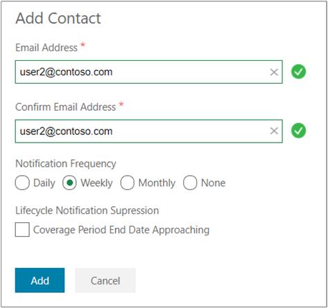

# Azure EA portal administration

This article explains the common tasks that an administrator accomplishes in the Azure EA portal (https://ea.azure.com). The Azure EA portal is an online management portal that helps customers manage the cost of their Azure EA services. For introductory information about the Azure EA portal, see the [Get started with the Azure EA portal](ea-portal-get-started.md) article.

## Add a new enterprise administrator

Enterprise administrators have the most privileges when managing an Azure EA enrollment. The initial Azure EA admin was created when the EA agreement was set up. However, you can add or remove new admins at any time. New admins are only added by existing admins. For more information about adding  additional enterprise admins, see [Create another enterprise admin](ea-portal-get-started.md#create-another-enterprise-admin). For more information about billing profile roles and tasks, see [Billing profile roles and tasks](understand-mca-roles.md#billing-profile-roles-and-tasks).

## Update user state from pending to active

When new Account Owners (AO) are added to an Azure EA enrollment for the first time, their status appears as _pending_. When a new account owner receives the activation welcome email, they can sign in to activate their account. Once they activate their account, the account status is updated from _pending_ to _active_. The account owner needs to read the 'Warning' message and click **Continue**. New users might get prompted enter their first and last name to create a Commerce Account. If so, they must add the required information to proceed and then the account is activated.

## Add a department Admin

After an Azure EA admin creates a department, the Azure Enterprise administrator can add department administrators and associate each one to a department. A department administrator can create new accounts. New accounts are needed for Azure EA subscriptions to get created.

For more information about adding a department admin, see [Create an Azure EA department admin](ea-portal-get-started.md#add-a-department-admin).

## Associate an account to a department

Enterprise Administrators can associate existing accounts to Departments under the enrollment.

### To associate an account to a department

1. Sign in to the Azure EA Portal as an enterprise administrator.
1. Click **Manage** on the left navigation.
1. Click **Department**.
1. Hover over the row with the desired Account and click the pencil icon on the right.
1. Select the desired Department from the drop-down menu.
1. Click **Save**.

## Department spending quotas

EA customers are able to set or change spending quotas for each department under an enrollment. The spending quota amount is set for the current commitment term. At the end of the current commitment term, the system will extend the existing spending quota to the next commitment term unless the values are updated.

The department administrator can view the spending quota but only the enterprise administrator can update the quota amount. The enterprise administrator and the department administrator and will receive notifications once quota has reached 50%, 75%, 90%, and 100%.

### Enterprise administrator to set the quota:

 1. Open the Azure EA Portal.
 1. Click **Manage** on the left navigation.
 1. Click the **Department** Tab.
 1. Click the desired Department.
 1. Click the pencil icon on the Department Details section, or click the **+ Add Department** button to add a spending quota along with a new department.
 1. Under Department Details, enter a spending quota amount in the enrollment’s currency in the Spending Quota $ box (must be greater than 0).
    - The Department Name and Cost Center can also be edited at this time.
 1. Hit **Save**.

The department spending quota will now be visible in the Department List view under the Department tab. At the end of the current commitment, the Azure EA Portal will maintain the spending quotas for the next commitment term.

The department quota amount is independent of the current monetary commitment, and the quota amount and alerts apply only to first party usage. The department spending quota is for informational purposes only and does not enforce spending limits.

### Department administrator to view the quota:

1. Open the Azure EA Portal.
1. Click **Manage** on the left navigation.
1. Click the **Department** tab and view the Department List view with spending quotas.

If you're an indirect customer, cost features must be enabled by your channel partner.

## Enterprise user roles

The Azure EA portal helps you to administer your Azure EA costs and usage. There are three main roles in the Azure EA portal:

- EA admin
- Department administrator
- Account owner

Each role has a different level of access and authority.

For more information about user roles, see [Enterprise user roles](https://docs.microsoft.com/azure/billing/billing-ea-portal-get-started#enterprise-user-roles).

## Add an Azure EA account

The Azure EA account is an organizational unit in the Azure EA portal that's used to administer subscriptions and it's also used for reporting. To access and use Azure services, you need to create an account or have one created for you.

For more information about Azure accounts, see Add an account.

## Enterprise Dev/Test Offer

As an Azure enterprise administrator, you can now enable account owners at your organization to create subscriptions based on the EA Dev/Test offer. You can do this by checking the Dev/Test box for that account owner from within the Azure EA Portal.

Once you’ve checked the Dev/Test box, let the account owner know so that they can set up the EA Dev/Test subscriptions needed for their teams of Dev/Test subscribers.

This offer enables active Visual Studio subscribers to run development and testing workloads on Azure at special Dev/Test rates, with access to the full gallery of Dev/Test images including Windows 8.1 and Windows 10.

### To set up the Enterprise Dev/Test offer:

1. Sign in as the enterprise administrator.
1. Click **Manage** on the left navigation.
1. Click the **Account** tab.
1. Click the row for the account where you would like to enable Dev/Test access.
1. Click the Pencil icon to the right of the row.
1. Select the Dev/Test checkbox.
1. Hit **Save**.

When a user is added as an account owner through the Azure EA Portal, any Azure subscriptions associated with the account owner that are based on either the PAYG Dev/Test offer or the monthly credit offers for Visual Studio subscribers will be converted to the EA Dev/Test offer. Subscriptions based on other offer types, such as PAYG, associated with the Account Owner will be converted to Microsoft Azure Enterprise offers.

The Dev/Test Offer is not applicable to Azure Gov customers at this time.

## Transfer an enterprise account to a new enrollment

An account transfer moves an account owner from one enrollment to another. All related subscriptions under the account owner will move to the target enrollment. This is performed when you have multiple active enrollments and only wish to move selected account owners.

Keep the following points in mind when you transfer an enterprise account to a new enrollment:

- Only the accounts specified in the request are transferred. If all accounts are chosen, then they are all transferred.
- The source enrollment retains its status as active or extended. You can continue using the enrollment until it expires.

### Effective transfer date

You can backdate an account transfer as far back as the start date of the target enrollment, or the account start date, whichever has a later start date. After the account transfer, all usage information in the account before the effective transfer date stays in the enrollment you're transferring from. The usage information after the transfer date will be moved to the target enrollment.

### Prerequisites

When you request an account transfer, provide the following information:

- The number of the target enrollment, account name, and account owner email of account to transfer
- For the source enrollment, the enrollment number and account to transfer
- For the account transfer effective date, it can be backdated as far back as the start date of the target enrollment, or the account start date, whichever has a later start date

Other points to keep in mind before an account transfer:

- Approval from an EA Administrator is required for the target and source enrollment
- If an account transfer doesn't meet your requirements, consider an enrollment transfer.
- The account transfer transfers all services and subscriptions related to the specific accounts.
- After the transfer is complete, the transferred account appears inactive under the source enrollment and appears active under the target enrollment.
- The account shows the end date corresponding to the effective transfer date on the source enrollment and as a start date on the target enrollment.
- Any usage occurred for the account prior to the effective transfer date remains under the source enrollment.

## Transfer enterprise enrollment to a new one

An enrollment transfer is considered when:

- A current enrollment’s commitment term has come to an end.
- An enrollment is in expired/extended status and a new agreement is negotiated.
- If you have multiple enrollments and wish to consolidate all the accounts and billing under a single enrollment.

When you request to transfer an entire enterprise enrollment to an enrollment, the following actions occur:

- All Azure services, subscriptions, accounts, departments, and the entire enrollment structure, including all EA department administrators, are transferred to a new target enrollment.
- The enrollment status is set to _Transferred_. The transferred enrollment is available for historic usage reporting purposes only.
- You can't add roles or subscriptions to a transferred enrollment. Transferred status prevents additional usage against the enrollment.
- Any remaining monetary commitment balance in the agreement is lost, including future terms.
-	If the enrollment you’re transferring from has RI purchases, the RI purchasing fee will remain in the source enrollment however all RI benefits will be transferred across for utilization in the new enrollment.
-	The marketplace one-time purchase fee and any monthly fixed fees already incurred on the old enrollment will not be transferred to the new enrollment. Consumption-based marketplace charges will be transferred.
-	After a backdated enrollment transfer, any one-time fees from purchases will remain in the source enrollment.

### Effective transfer date

The effective transfer day can be on or after the start date of the target enrollment.

The source enrollment usage is charged against monetary commitment or as overage. Usage that occurs after the effective transfer date is transferred to the new enrollment and charged accordingly.

A backdated transfer is supported as far back as the start date of the target enrollment. Providing the chosen transfer date does not affect the usage for an overage invoice that has already been issued.

### Prerequisites

When you request an enrollment transfer, provide the following information:

- For the source enrollment, the enrollment number.
- For the target enrollment, the enrollment number to transfer to.
- For the enrollment transfer effective date, it can be a date on or after the start date of the target enrollment. The chosen date can't impact usage for any overage invoice already issued.

Other points to keep in mind before an enrollment transfer:

- Approval from both target and source enrollment EA Administrators is required.
- If an enrollment transfer doesn't meet your requirements, consider an account transfer.
- The source enrollment status will be updated to transferred and will only be available for historic usage reporting purposes.

### Monetary commitment

Monetary commitment isn't transferrable between enrollments. Monetary commitment balances are tied contractually to the enrollment where it was ordered. Monetary commitment isn't transferred as part of the account or enrollment transfer process.

### No services affected for account and enrollment transfers

There's no downtime during an account or enrollment transfer. It can be completed on the same day of your request if all requisite information is provided.

## Change account owner

The Azure EA portal can transfer subscriptions from one account owner to another. For more information, see [Change account owner](ea-portal-get-started.md#change-account-owner).

## Subscription transfer effects

When an Azure subscription is transferred to an account in the same Azure Active Directory tenant, then all users, groups, and service principals that had [role-based access control (RBAC)](../../role-based-access-control/overview.md) to manage resources retain their access.

To view users with RBAC access to the subscription:

1. In the Azure portal, open **Subscriptions**.
2. Select the subscription you want to view, and then select **Access control (IAM)**.
3. Select **Role assignments**. The role assignments page lists all users who have RBAC access to the subscription.

If the subscription is transferred to an account in a different Azure AD tenant, then all users, groups, and service principals that had [RBAC](../../role-based-access-control/overview.md) to manage resources _lose_ their access. Although RBAC access is not present, access to the subscription might be available through security mechanisms, including:

- Management certificates that grant the user admin rights to subscription resources. For more information, see [Create and Upload a Management Certificate for Azure](../../cloud-services/cloud-services-certs-create.md).
- Access keys for services like Storage. For more information, see [Azure storage account overview](../../storage/common/storage-account-overview.md).
- Remote Access credentials for services like Azure Virtual Machines.

If the recipient needs to restrict access to their Azure resources, they should consider updating any secrets associated with the service. Most resources can be updated by using the following steps:

1. Sign in to the [Azure portal](https://portal.azure.com/).
2. On the Hub menu, select **All resources**.
3. Select the resource.
4. On the resource page, click **Settings** to view and update existing secrets.

## Delete subscription

To delete a subscription where you are the account owner:

1. Sign in to the Azure portal with the credentials associated to your account.
1. On the Hub menu, select **Subscriptions**.
1. In the subscriptions tab in the upper left corner of the page, select the subscription you want to cancel and click **Cancel Sub** to launch the cancel tab.
1. Enter the subscription name and choose a cancellation reason and click the **Cancel Sub** button.

Please note that only account administrators can cancel subscriptions.

## Delete an account

Account removal can only be completed for active accounts with no active subscriptions.

1. From the Enterprise Portal, select **Manage** on the left navigation.
1. Click the **Account** tab.
1. From the Accounts table, select the Account you would like to delete.
1. Click the X icon at the right of the Account row.
1. Once there are no active subscriptions under the account, click the **Yes** button under the Account row to confirm the Account removal.

## Update notification settings

Enterprise Administrators are automatically enrolled to receive usage notifications associated to their enrollment. Each Enterprise Administrator can change the interval of the individual notifications or can turn them off completely.

Notification contacts are shown in the Azure EA portal in the **Notification Contact** section. Managing your notification contacts makes sure that the right people in your organization get Azure EA notifications.

To View current notifications settings:

1. In the Azure EA portal, navigate to **Manage** > **Notification Contact**.
2. Email Address – The email address associated with the Enterprise Administrator's Microsoft Account, Work, or School Account that receives the notifications.
3. Unbilled Balance Notification Frequency – The frequency that notifications are set to send to each individual Enterprise Administrator.

To add a contact:

1. Click **+Add Contact**.
2. Enter the email address and then confirm it.
3. Click **Save**.

The new notification contact is displayed in the **Notification Contact** section. To change the notification frequency, select the notification contact and click the pencil symbol to the right of the selected row. Set the frequency to **daily**, **weekly**, **monthly**, or **none**.

You can suppress _approaching coverage period end date_ and _disable and de-provision date approaching_ lifecycle notifications. Disabling lifecycle notifications suppresses notifications about the coverage period and agreement end date.

## Manage partner administrators

Each partner administrator within the Azure EA Portal has the ability to add or remove other partner administrators. Partner administrators are associated to the partner organizations of indirect enrollments and are not associated directly to the enrollments.

### Add a partner administrator

To view a list of all enrollments that are associated to the same partner organization as the current user, click on the **Enrollment** tab and select a desired enrollment box.

1. Sign in as a partner administrator.
1. Click **Manage** on the left navigation.
1. Click the **Partner** tab.
1. Click on **+ Add Administrator** and fill in the email address, notification contact, and notification details.
1. Hit **Add**.

### Remove a partner administrator

To view a list of all enrollments that are associated to the same partner organization as the current user, click on the **Enrollment** tab and select a desired enrollment box.

1. Sign in as a partner administrator.
1. Click **Manage** on the left navigation.
1. Click the **Partner** tab.
1. Under the Administrator section, select the appropriate row for the administrator you wish to remove.
1. Hit the X icon on the right.
1. Confirm that you want to delete.

## Manage partner notifications

Partner Administrators can manage the frequency that they receive usage notifications for their enrollments. They automatically receive weekly notifications of their unbilled balance. They can change the frequency of individual notifications to monthly, weekly, daily, or turn them off completely.

If a notification isn't received by a user, verify that the user's notification settings are correct with the following steps.

1. Sign in to the Azure EA portal as a Partner Administrator.
2. Click **Manage** and then click the **Partner** tab.
3. View the list of administrators under the Administrator section.
4. To edit notification preferences, hover over the appropriate administrator and click the pencil symbol.
5. Up the notification frequency and lifecycle notifications as needed.
6. Add a contact, if needed and click **Add**.
7. Click **Save**.

## View enrollments for partner administrators

Partner administrators can see a list view of all their direct and indirect enrollments in the Azure EA Portal. Boxes containing an overview of every enrollment will be displayed with the enrollment number, enrollment name, balance, and overage amounts.

### View a List of Enrollments

1. Sign in as a partner administrator.
1. Click **Manage** on the navigation on the left side of the page.
1. Click the **Enrollment** tab.
1. Select the box for the desired enrollment.

A view of all enrollments remains at the top of the page, with boxes for each enrollment. Additionally, you can navigate between enrollments by clicking on the current enrollment number on the navigation on the left side of the page. A pop out will appear allowing you to search enrollments or select a different enrollment by clicking on the appropriate box.

## Azure sponsorship offer

The Azure sponsorship offer is a limited sponsored Microsoft Azure account. It is available by e-mail invitation only to limited customers selected by Microsoft. If you're entitled to the Microsoft Azure sponsorship offer, you'll receive an e-mail invitation to your account ID.

For more information, create a [support request for sponsorship activation](https://aka.ms/azrsponsorship).

## Conversion to work or school account authentication

Azure Enterprise users can convert from a Microsoft Account (MSA or Live ID) to a Work or School Account (which uses Active Directory in Azure) authentication type.

To begin:

1. Add the work or school account to the Azure EA Portal in the role(s) needed.
1. If you get errors, the account may not be valid in the active directory.  Azure uses User Principal Name (UPN), which is not always identical to the email address.
1. Authenticate to the Azure EA portal using the work or school account.

### To convert subscriptions from Microsoft accounts to work or school accounts:

1. Sign in to the management portal using the Microsoft account that owns the subscriptions.
1. Use account ownership transfer to move to the new account.
1. Now the Microsoft account should be free from any active subscriptions and can be deleted.
1. Any deleted account will remain in view in the portal in an inactive status for historic billing reasons.  You can filter it out of the view by selecting a check box to show only active accounts.

## Account subscription ownership FAQ

This document answers commonly asked questions relating to account subscription ownership.

### How many Azure account owners can you have per subscription?

Only one account owner is permitted per subscription.  Additional roles can be added using Role-Based Access or (Access Control (IAM)) in the subscription tab in the upper left corner of the page on [portal.azure.com]](https://portal.azure.com).

### Can an Azure account owner be listed under more than one department?

An account owner can only be associated to a single department.  This is to ensure accurate monitoring and apportioning of costs/spend associated to the department it is aligned with under the EA enrollment in the Azure EA Portal

### Can an Azure account owner be listed as a security group?

No, a subscription owner must be a unique Microsoft account (MSA) or Azure active directory (AAD) authentication. To account for succession within your organization, you may consider creating generic accounts and using AAD to manage subscription access.

### Can an individual user own multiple subscriptions?

An Azure account owner can create and manage an unlimited number of subscriptions.

### How can I access/view all my organization’s subscriptions?

Today this must be done by policy; meaning you would need to require that for every subscription created, your account is added to a subscription role using role-based access.

### Where do I go to create a subscription?

Before you can create an enterprise Azure (EA) offer subscription, your account must be added to the role of account owner by your EA enrollment’s administrator in the Azure EA Portal. You’ll then need to sign in to the Azure EA Portal to obtain your entitlement to create EA offer type subscriptions. We recommend that your first EA subscription is created from the ‘+ Add Subscription’ link in the subscription tab on the EA Portal.  However, once your account is entitled it may be easier to create subscriptions in portal.azure.com in the subscription tab in the upper left corner of the page, where you can both create and rename your subscription in a single step.

### Who can create a subscription?

To create an enterprise Azure offer type subscription, you must be entitled in the role of account owner on the [EA portal](https://ea.azure.com).

## Next steps

- Read about how [virtual machine reservations](ea-portal-vm-reservations.md) can help save you money.
- If you need help with troubleshooting Azure EA portal issues, see [Troubleshoot Azure EA portal access](ea-portal-troubleshoot.md).
