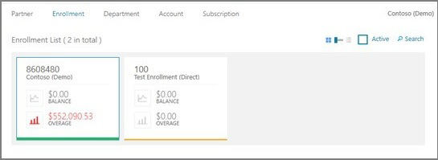

# Azure Enterprise enrollment invoices

This article explains how to manage and act on your Azure Enterprise Agreement (Azure EA) invoice. Your invoice is a representation of your bill. Review it for accuracy. You should also get familiar with other tasks that might be needed to manage your invoice.

> [!NOTE]
> We recommend that both direct and indirect EA Azure customers use Cost Management + Billing in the Azure portal to manage their enrollment and billing instead of using the EA portal. For more information about enrollment management in the Azure portal, see [Get started with EA billing in the Azure portal](ea-direct-portal-get-started.md).
>
> As of February 20, 2023 indirect EA customers won’t be able to manage their billing account in the EA portal. Instead, they must use the Azure portal. 
> 
> This change doesn’t affect Azure Government EA enrollments. They continue using the EA portal to manage their enrollment.

## View usage summary and download reports

Enterprise administrators can view a summary of their usage data, Azure Prepayment consumed, and charges associated with additional usage in the Azure Enterprise portal. Charges are presented at the summary level across all accounts and subscriptions.

To view detailed usage for specific accounts, download the usage detail report:

1. Sign in to the Azure Enterprise portal.
1. Select **Reports**.
1. Select the **Download Usage** tab.
1. In the list of reports, select **Download** for the monthly report that want to get.

   > [!NOTE]
   > The usage detail report doesn't include any applicable taxes.
   >
   > There may be a latency of up to eight hours from the time usage was incurred to when it's reflected on the report.

To view the usage summary reports and graphs:

1. Sign in to the Azure Enterprise portal.
1. Select a Prepayment term.
   To change the date range for **Usage Summary**, you can toggle from **M** (Monthly) to **C** (Custom) on the top right of the page and then enter custom start and end dates.  
   
1. To view additional details, you can select a period or month on the graph.
   - The graph shows month-over-month usage with a breakdown of utilized usage, service overage, charges billed separately, and Azure Marketplace charges.
   - For the selected month, you can use the fields below the graph to filter by departments, accounts, and subscriptions.
   - You can toggle between **Charge by Services** and **Charge by Hierarchy**.
   - View details from **Azure Service**, **Charges Billed Separately**, and **Azure Marketplace** by expanding the relevant sections.

View this video to see how to view usage:

> [!VIDEO https://www.youtube.com/embed/Cv2IZ9QCn9E]

### Download CSV reports

Enterprise administrators use the Monthly Report Download page to download the following reports as CSV files:

- Balance and charge
- Usage detail
- Azure Marketplace charges
- Price sheet

To download reports:

1. In the Azure Enterprise portal, select **Reports**.
2. Select **Download Usage** at the top of the page.
3. Select **Download** next to the month's report.

   > [!NOTE]
   > There may be a latency of up to 72 hours between the incurred usage date and when usage is shown in the reports.
   >
   > Users downloading CSV files with Safari to Excel may experience formatting errors. To avoid errors, open the file using a text editor.

View this video to see how to download usage information:

> [!VIDEO https://www.youtube.com/embed/eY797htT1qg]

### Advanced report download

You can use the advance report download to get reports that cover specific date ranges or accounts. The output file is in the CSV format to accommodate large record sets.

1. In the Azure Enterprise portal, select **Advanced Report Download**.
1. Select an appropriate date range and the appropriate accounts.
1. Select **Request Usage Data**.
1. Select the **Refresh** button until the report status updates to **Download**.
1. Download the report.

### Download usage reports and billing information for a prior enrollment

You can download usage reports and billing information for a prior enrollment after an enrollment transfer has taken place. Historical reporting is available in both the Azure Enterprise portal and cost management.

The Azure Enterprise portal filters inactive enrollments out of view. You'll need to uncheck the **Active** box to view inactive transferred enrollments.  

## PO number management

PO number management functionality in the EA portal is getting deprecated. It is currently read-only in the EA portal. Instead, an EA administrator can use the Azure portal to manage PO numbers. For more information, see [Update a PO number](direct-ea-azure-usage-charges-invoices.md#update-a-po-number-for-an-upcoming-overage-invoice).

## Azure enterprise billing frequency

Microsoft bills annually at the enrollment effective date for any Prepayment purchases of the Microsoft Azure services. For any usage exceeding the Prepayment amounts, Microsoft bills in arrears.

- Prepayment fees are quoted based on a monthly rate and billed annually in advance.
- Overage fees are calculated each month and billed in arrears at the end of your billing period.

### Billing intervals

You billing interval depends on how you choose to make your Prepayment purchases. Your annual Prepayment is coterminous with either:

- Your enrollment anniversary date
- The effective date of your one-year Amendment Subscription.

The date you receive your overage invoice depends on your enrollment start date and set-up:

- **Direct enrollments with a start date before May 1, 2018**:
  - If you're on a direct Enterprise Agreement (EA), you're on an annual billing cycle for Azure services, excluding Azure Marketplace services. Your billing cycle is based on the anniversary date: the date when your agreement became effective.
  - If you surpass 150% of your Azure EA Prepayment threshold, you'll automatically be converted to a quarterly billing cycle that is based on your anniversary date. You'll also receive an Azure service overage invoice.
  - If you don't surpass 150% of your Azure Prepayment threshold, your enrollment will remain on an annual billing cycle. The overage invoice will be received at the end of the Prepayment year.

- **Direct enrollments with a start date after May 1, 2018**:
  - Your Azure consumption and charges billed separately invoices are on a monthly billing cycle.
  - Any charges not covered by your Azure Prepayment are due as an overage payment.  

- **Indirect enrollments with an enrollment that started before May 1, 2018**:

  If you're an indirect Enterprise Agreement (EA) customer with a start date before May 1, 2018, you're set up on a quarterly billing cycle. The channel partner (CP) invoices you directly.  

- **Indirect enrollments with a start date after May 1, 2018**:

  You're on a monthly billing cycle.  

### Increase your Azure Prepayment

You can increase your Prepayment at any time. You'll be billed for the number of months remaining in that year's Prepayment period. For example, if you sign up for a one-year Amendment Subscription and then increase your Prepayment during month six, you'll be invoiced for the remaining six months of that term. Your Prepayment quantities will then be updated for the last six months of your Prepayment term. These new quantities will be used for determining any overage charges.

### Overage

For overage, you're billed for the usage or reservations that exceed your Prepayment during the billing period. To view a breakdown of how the overage quantities for individual items were calculated, refer to the usage summary report or contact your channel partner.

For each item on the invoice, you'll see:

- **Extended Amount**: the total charges
- **Prepayment Usage**: the amount of your Prepayment used to cover the charges
- **Net Amount**: the charges that exceed your Prepayment

Applicable taxes are computed only on the net amount that exceeds your Prepayment.

Overage invoicing is automated. The timing of notifications and invoices depends on your billing period end date.

- Overage notification is normally sent seven days following your billing end date.
- Overage invoices are sent seven to nine days after notification.
- You can review charges and update system-generated PO numbers during the seven days between the overage notification and invoicing.

### Azure Marketplace

Effective from the April 2019 billing cycle, customers started to receive a single Azure invoice that combines all Azure and Azure Marketplace charges into a single invoice instead of two separate invoices. This change doesn't affect customers in Australia, Japan, or Singapore.

During the transition to a combined invoice, you'll receive a partial Azure Marketplace invoice. This final separate invoice will show Azure Marketplace charges incurred before the date of your billing update. Azure Marketplace charges incurred after that date will appear on your Azure invoice. After the transition period, you'll see all Azure and Azure Marketplace charges on the combined invoice.  

### Adjust billing frequency

A customer's billing frequency is annual, quarterly, or monthly. The billing cycle is determined when a customer signs their agreement. Monthly billing is smallest billing interval.

- **Approval** from an enterprise administrator is required to change a billing cycle from annual to quarterly for direct enrollments. Approval from a partner administrator is required for indirect enrollments. The change becomes effective at the end of the current billing quarter.
- **An amendment** to the agreement is required to change a billing cycle from annual or quarterly to monthly.  Any change to the existing enrollment billing cycle requires approval of an enterprise administrator or from your "Bill to Contact".
- **Submit** your approval to [Azure Enterprise portal support](https://support.microsoft.com/supportrequestform/cf791efa-485b-95a3-6fad-3daf9cd4027c). Select the issue category: **Billing and Invoicing**.

The change becomes effective at the end of the current billing quarter.

### Request an invoice copy

If you're an indirect enterprise agreement customer, contact your partner to request a copy of your invoice.

## Credits and adjustments

You can view all credits or adjustments applied to your enrollment in the **Reports** section of [the Azure Enterprise portal](https://ea.azure.com).

To view credits:

1. In [the Azure Enterprise portal](https://ea.azure.com), select the **Reports** section.
1. Select **Usage Summary**.
1. In the top-right corner, change the **M** to **C** view.
1. Extend the adjustment field in the Azure service Prepayment table.
1. You'll see credits applied to your enrollment and a short explanation. For example: Service Level Agreement Credit.

## Pay your overage with your Azure Prepayment

To apply your Azure Prepayment to overages, you must meet the following criteria:

- You've incurred overage charges that haven't been paid and are within 3 months of the invoice bill date.
- Your available Azure Prepayment amount covers the full number of incurred charges, including all past unpaid Azure invoices.
- The billing term that you want to complete must be fully closed. Billing fully closes after the fifth day of each month.
- The billing period that you want to offset must be fully closed.
- Your Azure Prepayment Discount (APD) is based on the actual new Prepayment minus any funds planned for the previous consumption. This requirement applies only to overage charges incurred. It's only valid for services that consume Azure Prepayment, so doesn't apply to Azure Marketplace charges. Azure Marketplace charges are billed separately.

To complete an overage offset, you or the account team can open a support request. An emailed approval from your enterprise administrator or Bill to Contact is required.

## Move charges to another enrollment

Usage data is only moved when a transfer is backdated. There are two options to move usage data from one enrollment to another:

- Account transfers from one enrollment to another enrollment
- Enrollment transfers from one enrollment to another enrollment

For either option, you must submit a [support request](https://support.microsoft.com/supportrequestform/cf791efa-485b-95a3-6fad-3daf9cd4027c) to the EA Support Team for assistance. ​

## Enterprise Agreement usage calculations

Refer to [Azure services](https://azure.microsoft.com/services/) and [Azure pricing](https://azure.microsoft.com/pricing/) for basic public pricing information, units of measure, FAQs, and usage reporting guidelines for each individual service. You can find more information about EA calculations in the following sections.

### Enterprise Agreement units of measure

The units of measure for Enterprise Agreements are often different than seen in our other programs such as the Microsoft Online Services Agreement program (MOSA). This disparity means that, for a number of services, the unit of measure is aggregated to provide the normalized pricing. The unit of measure shown in the Azure Enterprise portal's Usage Summary view is always the Enterprise measure. A full list of current units of measure and conversions for each service is provided by submitting a [support request](https://portal.azure.com/?#blade/Microsoft_Azure_Support/HelpAndSupportBlade).

### Conversion between usage detail report and the usage summary page

In the download usage data report, you can see raw resource usage up to six decimal places. However, usage data shown in the Azure Enterprise portal is rounded to four decimal places for Prepayment units and truncated to zero decimals for overage units. Raw usage data is first rounded to four digits before conversion to units used in the Azure Enterprise portal. Then, the converted Enterprise units are rounded again to four digits. You can only see the actual consumed hours before conversion in the download usage report and not within the Azure Enterprise portal.

For example: If 694.533404 actual SQL Server hours are reported in the usage detail report. These units are converted to 6.94533404 of 100 compute hours, and then rounded to 6.9453 and displayed in the Azure Enterprise portal.

- To determine the extended billing amount, the displayed units are multiplied by the Prepayment Unit Price, and the result is truncated to two decimals. For Japanese Yen (JPY) and Korean Won (KRW), the extended amount is rounded to zero decimals.
- For overage, the billing units are truncated to six digits and then multiplied by the Overage Unit Price to determine the extended billing amount.
- For Managed Service Provider (MSP) billing, all usage associated to a department marked as MSP is truncated to zero decimals after conversion to the EA unit of measure. As a result, the sum of this usage could be lower than the sum total of all usage reported in the Azure Enterprise portal. It depends on if the MSP is within their Azure Prepayment balance or is in overage.

### Graduated pricing

Enterprise Agreement pricing doesn't currently include graduated pricing where the charges per unit decreases as usage increases. When you move from a MOSA program with graduated pricing to an Enterprise Agreement, your prices are set commensurate with the service's base tier minus any applicable adjustments for Enterprise Agreement discounts.

### Partial hour billing

All billed usage is based on minutes converted to partial hours and not on whole hour increments. The listed hourly Enterprise rates are applied to total hours plus partial hours.

### Average daily consumption

Some services are priced on a monthly basis, but usage is reported on daily basis. In these cases, the usage is evaluated once per day, divided by 31, and summed across the number of days in that billing month. So, rates are never higher than expected for any month and are slightly lower for those months with less than 31 days.

### Compute hours conversion

Before January 28, 2016, usage for A0, A2, A3, and A4 Standard and Basic Virtual Machines and Cloud Services was emitted as A1 Virtual Machine meter minutes. A0 VMs counted as fractions of A1 VM minutes while A2s, A3s, and A4s were converted to multiples. Because this policy caused some confusion for our customers, we implemented a change to assign per-minute usage to dedicated A0, A2, A3, and A4 meters.

The new metering took effect between January 27 and January 28, 2016. On the CSV download that shows usage during this transition period, you can see both:

- Usage emitted on the A1 meter
- Usage emitted on the new dedicated meter corresponding with your deployment's size.

| **Deployment size** | **Usage emitted as multiple of A1 through January 26, 2016** | **Usage emitted on dedicated meter starting January 27, 2016** |
| --- | --- | --- |
| A0 | 0.25 of A1 hour | 1 of A0 hour |
| A2 | 2 of A1 hour | 1 of A2 hour |
| A3 | 4 of A1 hour | 1 of A3 hour |
| A4 | 8 of A1 hour | 1 of A4 hour |

### Regions

For those services where zone and region affect pricing, see the following table for a map of  geographies and regions:

| Geo | Data Transfer Regions | CDN Regions |
| --- | --- | --- |
| Zone 1 | Europe North   Europe West   US West   US East   US North Central   US South Central   US East 2   US Central | North America   Europe |
| Zone 2 | Asia Pacific East   Asia Pacific Southeast   Japan East   Japan West   Australia East   Australia Southeast | Asia Pacific   Japan   Latin America   Middle East / Africa   Australia East   Australia Southeast |
| Zone 3 | Brazil South |   |

There are no charges for data egress between services housed within the same data center. For example, Microsoft 365 and Azure.

### Azure Prepayment and unbilled usage

Azure Prepayment is an amount paid up front for Azure services. The Azure Prepayment is consumed as services are used. First-party Azure services are billed against the Azure Prepayment. However, some charges are billed separately, and Azure Marketplace services don't consume Azure Prepayment.

### Charges billed separately

Some products and services provided from third-party sources don't consume Azure Prepayment. Instead, these items are billed separately as part of the standard billing cycle's overage invoice.

We've combined all Azure and Azure Marketplace charges into a single invoice that aligns with the enrollment's billing cycle. The combined invoice doesn't apply to customers in Australia, Japan, or Singapore.

The combined invoice shows Azure usage first, followed by any Azure Marketplace charges. Customers in Australia, Japan, or Singapore see their Azure Marketplace charges on a separate invoice.

If there's no overage usage at the end of the standard billing cycle, charges billed separately are invoiced separately. This process applies to customers in Australia, Japan, and Singapore.

The following services are examples of charges billed separately. You can get a full list of the services where charges are billed separately by submitting a [support request](https://portal.azure.com/#blade/Microsoft_Azure_Support/HelpAndSupportBlade/overview).

- Canonical
- Citrix XenApp Essentials
- Citrix XenDesktop Registered User
- Openlogic
- Remote Access Rights XenApp Essentials Registered User
- Ubuntu Advantage
- Visual Studio Enterprise (Monthly)
- Visual Studio Enterprise (Annual)
- Visual Studio Professional (Monthly)
- Visual Studio Professional (Annual)

## What to expect after change of channel partner

If the change of channel partner (COCP) happens in the middle of the month, a customer will receive an invoice for usage under the previous associated partner and another invoice for the usage under new partner.

The invoices will be released following the month after the billing period ends. If the billing cadence is monthly, then September's invoice will be released in October for both partners. If the billing cycle is quarterly or annually, the customer can expect an invoice for the previous associated partner for the usage under their period and rest will be to the new partner based on the billing cadence.

## Next steps

- For information about understanding your invoice and charges, see [Understand your Azure Enterprise Agreement bill](../understand/review-enterprise-agreement-bill.md).
- To start using the Azure Enterprise portal, see [Get started with the Azure EA portal](ea-portal-get-started.md).
