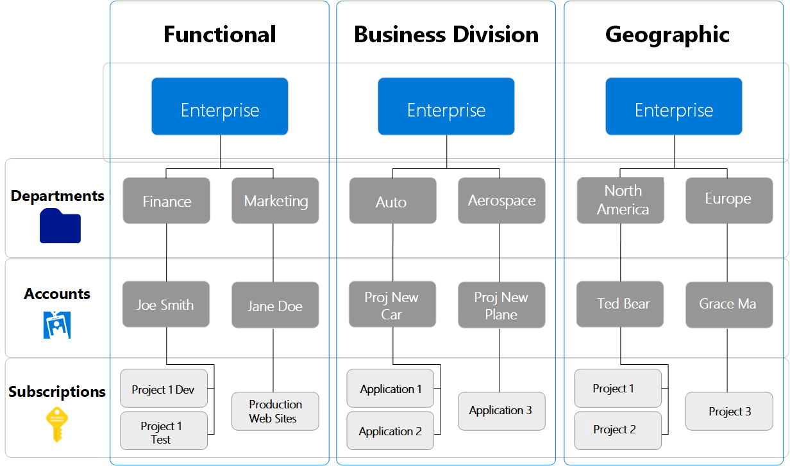
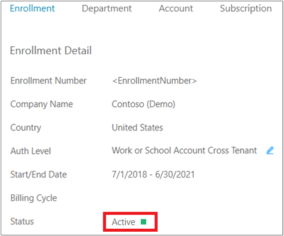
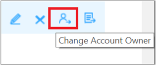
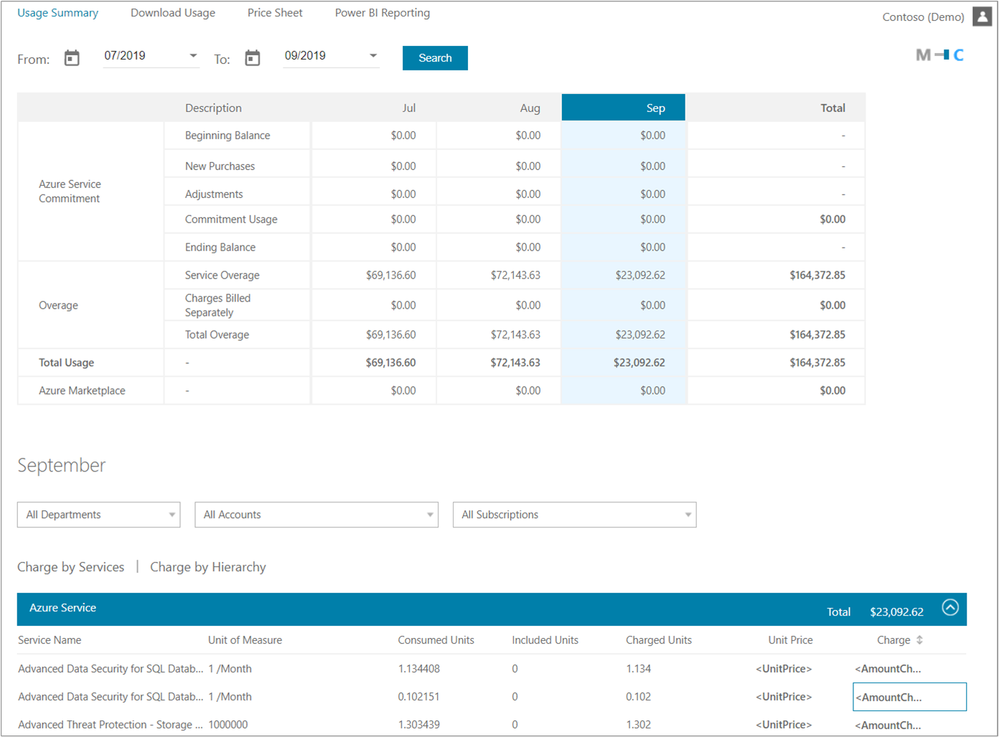
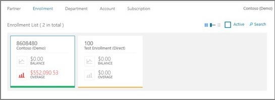

# Get started with the Azure Enterprise portal

This article helps direct and indirect Azure Enterprise Agreement (Azure EA) customers start to use the [Azure Enterprise portal](https://ea.azure.com). Get basic information about:

- The structure of the Azure Enterprise portal.
- Roles used in the Azure Enterprise portal.
- Subscription creation.
- Cost analysis in the Azure Enterprise portal and the Azure portal.

View this video to watch a full Azure Enterprise portal onboarding session:

> [!VIDEO https://www.youtube.com/embed/OiZ1GdBpo-I]

## Azure Enterprise portal hierarchy

The Azure Enterprise portal hierarchy consists of:

- **Azure Enterprise portal** - an online management portal that helps you manage costs for your Azure EA services. You can:

  - Create an Azure EA hierarchy with departments, accounts, and subscriptions.
  - Reconcile the costs of your consumed services, download usage reports, and view price lists.
  - Create API keys for your enrollment.

- **Departments** help you segment costs into logical groupings. Departments enable you to set a budget or quota at the department level.

- **Accounts** are organizational units in the Azure Enterprise portal. You can use accounts to manage subscriptions and access reports.

- **Subscriptions** are the smallest unit in the Azure Enterprise portal. They're containers for Azure services managed by the service administrator.

The following diagram illustrates simple Azure EA hierarchies.

## Enterprise user roles

The following administrative user roles are part of your enterprise enrollment:

- Enterprise administrator
- Department administrator
- Account owner
- Service administrator
- Notification contact

Roles work in two different portals to complete tasks. You use the [Azure Enterprise portal](https://ea.azure.com) to manage billing and costs, and the [Azure portal](https://portal.azure.com) to manage Azure services.

User roles are associated with a user account. To validate user authenticity, each user must have a valid work, school, or Microsoft account. Ensure that each account is associated with an email address that's actively monitored. Account notifications are sent to the email address.

When setting up users, you can assign multiple accounts to the enterprise administrator role. However, only one account can hold the account owner role. Also, you can assign both the enterprise administrator and account owner roles to a single account.

### Enterprise administrator

Users with this role have the highest level of access. They can:

- Manage accounts and account owners.
- Manage other enterprise administrators.
- Manage department administrators.
- Manage notification contacts.
- View usage across all accounts.
- View unbilled charges across all accounts.

You can have multiple enterprise administrators in an enterprise enrollment. You can grant read-only access to enterprise administrators. They all inherit the department administrator role.

### Department administrator

Users with this role can:

- Create and manage departments.
- Create new account owners.
- View usage details for the departments that they manage.
- View costs, if they have the necessary permissions.

You can have multiple department administrators for each enterprise enrollment.

You can grant department administrators read-only access when you edit or create a new department administrator. Set the read-only option to **Yes**.

### Account owner

Users with this role can:

- Create and manage subscriptions.
- Manage service administrators.
- View usage for subscriptions.

Each account requires a unique work, school, or Microsoft account. For more information about Azure Enterprise portal administrative roles, see [Understand Azure Enterprise Agreement administrative roles in Azure](understand-ea-roles.md).

### Service administrator

The service administrator role has permissions to manage services in the Azure portal and assign users to the coadministrator role.

### Notification contact

The notification contact receives usage notifications related to the enrollment.

## Activate your enrollment

To activate your service, the initial enterprise administrator opens the [Azure Enterprise portal](https://ea.azure.com) and signs in using the email address from the invitation email.

If you've been set up as the enterprise administrator, you don't need to receive the activation email. Go to [Azure Enterprise portal](https://ea.azure.com) and sign in with your work, school, or Microsoft account email address and password.

If you have more than one enrollment, choose one to activate. By default, only active enrollments are shown. To view enrollment history, clear the **Active** option in the top right of the Azure Enterprise portal.

Under **Enrollment**, the status shows **Active**.

Only existing Azure enterprise administrators can create other enterprise administrators.

### Create another enterprise administrator

To add another enterprise administrator:

1. Sign in to the [Azure Enterprise portal](https://ea.azure.com).
1. Go to **Manage** > **Enrollment Detail**.
1. Select **+ Add Administrator** at the top right.

Make sure that you have the user's email address and preferred authentication method, such as a work, school, or Microsoft account.

If you're not the enterprise administrator, contact an enterprise administrator to request that they add you to an enrollment. After you're added to an enrollment, you receive an activation email.

If your enterprise administrator can't assist you, create an [Azure Enterprise portal support request](https://support.microsoft.com/supportrequestform/cf791efa-485b-95a3-6fad-3daf9cd4027c). Provide the following information:

- Enrollment number
- Email address to add, and authentication type (work, school, or Microsoft account)
- Email approval from an existing enterprise administrator
  - If the existing enterprise administrator isn't available, contact your partner or software advisor to request that they change the contact details through the Volume Licensing Service Center (VLSC) tool.

For more information about enterprise administrative roles, see [Understand Azure Enterprise Agreement administrative roles in Azure](understand-ea-roles.md).

## Create an Azure Enterprise department

Enterprise administrators and department administrators use departments to organize and report on enterprise Azure services and usage by department and cost center. The enterprise administrator can:

- Add or remove departments.
- Associate an account to a department.
- Create department administrators.
- Allow department administrators to view price and costs.

A department administrator can add new accounts to their departments. They can remove accounts from their departments, but not from the enrollment.

To add a department:

1. Sign in to the Azure Enterprise portal.
1. In the left pane, select **Manage**.
1. Select the **Department** tab, then select **+ Add Department**.
1. Enter the information.
   The department name is the only required field. It must be at least three characters.
1. When complete, select **Add**.

## Add a department administrator

After a department is created, the enterprise administrator can add department administrators and associate each one to a department. Department administrators can perform the following actions for their departments:

- Create other department administrators
- View and edit department properties such as name or cost center
- Add accounts
- Remove accounts
- Download usage details
- View the monthly usage and charges 1

> 1 An enterprise administrator must grant these permissions. If you were given permission to view department monthly usage and charges, but can't see them, contact your partner.

### To add a department administrator

As an enterprise administrator:

1. Sign in to the Azure Enterprise portal.
1. In the left pane, select **Manage**.
1. Select the **Department** tab and then select the department.
1. Select **+ Add Administrator** and add the required information.
1. For read-only access, set the **Read-Only** option to **Yes** and then select **Add**.

### To set read-only access

You can grant read-only access to department administrators.

- When you create a new department administrator, set the read-only option to **Yes**.

- To edit an existing department administrator:
   1. Select a department, and then select the pencil symbol next to the **Department Administrator** that you want to edit.
   1. Set the read-only open to **Yes**, and then select **Save**.

Enterprise administrators automatically get department administrator permissions.

## Add an account

The structure of accounts and subscriptions impact how they're administered and how they appear on your invoices and reports. Examples of typical organizational structures include business divisions, functional teams, and geographic locations.

To add an account:

1. In the Azure Enterprise portal, select **Manage** in the left navigation area.
1. Select the **Account** tab. On the **Account** page, select **+Add Account**.
1. Select a department, or leave it as unassigned, and then select the desired authentication type.
1. Enter a friendly name to identify the account in reporting.
1. Enter the **Account Owner Email** address to associate with the new account.
1. Confirm the email address and then select **Add**.

To add another account, select **Add Another Account**, or select **Add** at the bottom-right corner of the left toolbar.

To confirm account ownership:

1. Sign in to the Azure Enterprise portal.
1. View the status.

   The status should change from **Pending** to **Start/End date**. The Start/End date is the date the user first signed in and the agreement end date.
1. When the **Warning** message pops up, the account owner needs to select **Continue** to activate the account the first time they sign in to the Azure Enterprise portal.

## Change account owner

Enterprise administrators can use the Azure Enterprise portal to transfer subscription account ownership in an enrollment. The action moves all subscriptions from a source user account to a destination user account.

Be aware of this important information when transferring accounts:

- You can make these transfers:
  - From a work or school account to another work or school account.
  - From a Microsoft account to a work or school account.
  - From a Microsoft account to another Microsoft account.

    The target account must be a valid Azure Commerce account to be a valid target for transfers. For new accounts, you are asked to create an Azure Commerce account when signing in to the Azure Enterprise portal. For existing accounts, you must first create a new Azure subscription before the account is eligible.

- You can't make a transfer from a work or school account to a Microsoft account.

- When you complete a subscription transfer, Microsoft updates the account owner.

Understand these role-based access control (RBAC) policies:

- When you perform subscription transfers between two organizational IDs in the same tenant, RBAC policies and existing service administrator and coadministrator roles are preserved.
- Other subscription transfers result in losing your RBAC policies and role assignments.
- Policies and administrator roles don't transfer across different directories. Service administrators are updated to the owner of destination account.

Before changing an account owner:

1. In the Azure Enterprise portal, view the **Account** tab and identify the source account. The source account must be active.
1. Identify the destination account and make sure it's active.

To transfer account ownership for all subscriptions:

1. Sign in to the Azure Enterprise portal.
1. In the left navigation area, select **Manage**.
1. Select the **Account** tab and hover over an account.
1. Select the change account owner icon on the right. The icon resembles a person.
1. Choose an eligible account and then select **Next**.
1. Confirm the transfer and select **Submit**.

To transfer account ownership for a single subscription:

1. Sign in to the Azure Enterprise portal.
1. In the left navigation area, select **Manage**.
1. Select the **Account** tab and hover over an account.
1. Select the transfer subscriptions icon on the right. The icon resembles a page.
1. Choose an eligible subscription and then select **Next**.
1. Confirm the transfer and then select **Submit**.

View this video to see Azure Enterprise portal user management:

> [!VIDEO https://www.youtube.com/embed/621jVkvmwm8]

## Create a subscription

Account owners can view and manage subscriptions. You can use subscriptions to give teams in your organization access to development environments and projects. For example: test, production, development, and staging.

When you create different subscriptions for each application environment, you help secure each environment.

- You can also assign a different service administrator account for each subscription.
- You can associate subscriptions with any number of services.
- The account owner creates subscriptions and assigns a service administrator account to each subscription in their account.

### Add a subscription

Use the following information to add a subscription.

The first time you add a subscription to your account, you're asked to accept the Microsoft Online Subscription Agreement (MOSA) and a rate plan. Although they aren't applicable to Enterprise Agreement customers, the MOSA and the rate plan are required to create your subscription. Your Microsoft Azure Enterprise Agreement Enrollment Amendment supersedes the above items and your contractual relationship doesn't change. When prompted, select the box that indicates you accept the terms.

_Microsoft Azure Enterprise_ is the default name when a subscription is created. You can change the name to differentiate it from the other subscriptions in your enrollment, and to ensure that it's recognizable in reports at the enterprise level.

To add a subscription:

1. In the Azure Enterprise portal, sign in to the account.
1. Select the **Admin** tab and then select **Subscription** at the top of the page.
1. Verify that you're signed in as the account owner of the account.
1. Select **+Add Subscription** and then select **Purchase**.

   The first time you add a subscription to an account, you must provide your contact information. When you add additional subscriptions, your contact information is added for you.

1. Select **Subscriptions** and then select the subscription you created.
1. Select **Edit Subscription Details**.
1. Edit the **Subscription Name** and the **Service Administrator** and then select the check mark.

   The subscription name appears on reports. It's the name of the project associated with the subscription in the development portal.

New subscriptions can take up to 24 hours to appear in the subscriptions list. After you've created a subscription, you can:

- [Edit subscription details](https://account.azure.com/Subscriptions)
- [Manage subscription services](https://portal.azure.com/#home)

## Transfer an Enterprise subscription to a Pay-As-You-Go subscription

To transfer an Enterprise subscription to an individual subscription with Pay-As-You-Go rates, you must create a new support request in the Azure Enterprise portal. To create a support request, select **+ New support request** in the **Help and Support** area.

## Associate an existing account with your Pay-As-You-Go subscription

If you already have an existing Microsoft Azure account on the Azure portal, enter the associated school, work, or Microsoft account in order to associate it with your Enterprise Agreement enrollment.

### Associate an existing account

1. In the Azure Enterprise portal, select **Manage**.
1. Select the **Account** tab.
1. Select **+Add an account**.
1. Enter the work, school, or Microsoft account associated with the existing Azure account.
1. Confirm the account associated with the existing Azure account.
1. Provide a name you would like to use to identify this account in reporting.
1. Select **Add**.
1. To add an additional account, you can select the **+Add an Account** option again or return to the homepage by selecting the **Admin** button.
1. If you view the **Account** page, the newly added account will appear in a **Pending** status.

### Confirm account ownership

1. Sign into the email account associated with the work, school, or Microsoft account you provided.
1. Open the email notification titled _"Invitation to Activate your Account on the Microsoft Azure Service from Microsoft Volume Licensing"_.
1. Select the **Log into the Microsoft Azure Enterprise Portal** link in the invitation.
1. Select **Sign in**.
1. Enter your work, school, or Microsoft account and password to sign in and confirm account ownership.

### Azure Marketplace

Although most subscriptions can convert from the Pay-as-You-Go environment to Azure Enterprise Agreement, Azure Marketplace services do not. In order to have a single view of all subscriptions and charges, we recommend you add the Azure Marketplace services to the Azure Enterprise portal.

1. Sign in to the Azure Enterprise portal.
1. Select **Manage** on the left navigation.
1. Select the **EnrollmentTab**.
1. View the **Enrollment Detail** section.
1. To the right of the Azure Marketplace field, select the pencil icon to enable it. Select **Save**.

The account owner can now purchase any Azure Marketplace services that were previously owned in the Pay-As-You-Go subscription.

After the new Azure Marketplace subscriptions are activated under your Azure EA enrollment, cancel the Azure Marketplace services that were created in the Pay-As-You-Go environment. This step is critical so that your Azure Marketplace subscriptions do not fall into a bad state when your Pay-As-You-Go payment instrument expires.

### MSDN

MSDN subscriptions are automatically converted to MSDN Dev/Test and the Azure EA offer will lose any existing monetary credit.

### Azure in Open

If you associate an Azure in Open subscription with an Enterprise Agreement, you forfeit any unconsumed Azure in Open credits. Thus, we recommended that you consume all credit on an Azure in Open subscription before you add the account to your Enterprise Agreement.  

### Accounts with support subscriptions

If your Enterprise Agreement doesn't have a support subscription and you add an existing account with a support subscription to the Azure Enterprise portal, your MOSA support subscription won't automatically transfer. You'll need to repurchase a support subscription in Azure EA during the grace period - by the end of the subsequent month.

## View usage summary and download reports

Enterprise administrators can view a summary of their usage data, monetary commitment consumed, and charges associated with additional usage in the Azure Enterprise portal. Charges are presented at the summary level across all accounts and subscriptions.

To view detailed usage for specific accounts, download the usage detail report:

1. Sign in to the Azure Enterprise portal.
1. Select **Reports**.
1. Select the **Download Usage** tab.
1. In the list of reports, select **Download** for the monthly report that want to get.

   > [!NOTE]
   > The usage detail report doesn't include any applicable taxes.
   >
   > There may be a latency of up to eight hours from the time usage was incurred to when it's reflected on the report.

To view the usage summary reports and graphs:

1. Sign in to the Azure Enterprise portal.

1. Select a commitment term.

   To change the date range for **Usage Summary**, you can toggle from **M** (Monthly) to **C** (Custom) on the top right of the page and then enter custom start and end dates.

   
1. To view additional details, you can select a period or month on the graph.

   - The graph shows month-over-month usage with a breakdown of utilized usage, service overcharge, charges billed separately, and Azure Marketplace charges.
   - For the selected month, you can use the fields below the graph to filter by departments, accounts, and subscriptions.
   - You can toggle between **Charge by Services** and **Charge by Hierarchy**.
   - View details from **Azure Service**, **Charges Billed Separately**, and **Azure Marketplace** by expanding the relevant sections.

View this video to see how to view usage:

> [!VIDEO https://www.youtube.com/embed/Cv2IZ9QCn9E]

### Download CSV reports

Enterprise administrators use the Monthly Report Download page to download the following reports as CSV files:

- Balance and charge
- Usage detail
- Azure Marketplace charges
- Price sheet

To download reports:

1. In the Azure Enterprise portal, select **Reports**.
2. Select **Download Usage** at the top of the page.
3. Select **Download** next to the month's report.

   > [!NOTE]
   > There may be a latency of up to five days between the incurred usage date and when usage is shown in the reports.
   >
   > Users downloading CSV files with Safari to Excel may experience formatting errors. To avoid errors, open the file using a text editor.

View this video to see how to download usage information:

> [!VIDEO https://www.youtube.com/embed/eY797htT1qg]

### Advanced report download

You can use the advance report download to get reports that cover specific date ranges or accounts. The output file is in the CSV format to accommodate large record sets.

1. In the Azure Enterprise portal, select **Advanced Report Download**.
1. Select an appropriate date range and the appropriate accounts.
1. Select **Request Usage Data**.
1. Select the **Refresh** button until the report status updates to **Download**.
1. Download the report.

### Download usage reports and billing information for a prior enrollment

You can download usage reports and billing information for a prior enrollment after an enrollment transfer has taken place. Historical reporting is available in both the Azure Enterprise portal and cost management.

The Azure Enterprise portal filters inactive enrollments out of view. You'll need to uncheck the **Active** box to view inactive transferred enrollments.  

## Azure EA term glossary

- **Account**: An organizational unit on the Azure Enterprise portal. It is used to administer subscriptions and for reporting.
- **Account owner**: The person who manages subscriptions and service administrators on Azure. They can view usage data on this account and its associated subscriptions.
- **Amendment subscription**: A one-year, or coterminous subscription under the enrollment amendment.
- **Commitment**: Commitment of an annual monetary amount for Azure services at a discounted commitment rate for usage against this prepayment.
- **Department administrator**: The person who manages departments, creates new accounts and account owners, views usage details for the departments they manage, and can view costs when granted permissions.
- **Enrollment number**: A unique identifier supplied by Microsoft to identify the specific enrollment associated with an Enterprise Agreement.
- **Enterprise administrator**: The person who manages departments, department owners, accounts, and account owners on Azure. They have the ability to manage enterprise administrators as well as view usage data, billed quantities, and unbilled charges across all accounts and subscriptions associated with the enterprise enrollment.
- **Enterprise agreement**: A Microsoft licensing agreement for customers with centralized purchasing who want to standardize their entire organization on Microsoft technology and maintain an information technology infrastructure on a standard of Microsoft software.
- **Enterprise agreement enrollment**: An enrollment in the Enterprise Agreement program providing Microsoft products in volume at discounted rates.
- **Microsoft account**: A web-based service that enables participating sites to authenticate a user with a single set of credentials.
- **Microsoft Azure Enterprise Enrollment Amendment (enrollment amendment)**: An amendment signed by an enterprise, which provides them access to Azure as part of their enterprise enrollment.
- **Azure Enterprise portal**: The portal used by our enterprise customers to manage their Azure accounts and their related subscriptions.
- **Resource quantity consumed**: The quantity of an individual Azure service that was used in a month.
- **Service administrator**: The person who accesses and manages subscriptions and development projects on the Azure Enterprise portal.
- **Subscription**: Represents an Azure Enterprise portal subscription and is a container of Azure services managed by the same service administrator.
- **Work or school account**: For organizations that have set up active directory with federation to the cloud and all accounts are on a single tenant.

### Enrollment statuses

- **New**: This status is assigned to an enrollment that was created within 24 hours and will be updated to a Pending status within 24 hours.
- **Pending**: The enrollment administrator needs to sign in to the Azure Enterprise portal. Once signed in, the enrollment will switch to an Active status.
- **Active**: The enrollment is Active and accounts and subscriptions can be created in the Azure Enterprise portal. The enrollment will remain active until the Enterprise Agreement end date.
- **Indefinite extended term**: An indefinite extended term takes place after the Enterprise Agreement end date has passed. It enables Azure EA customers who are opted in to the extended term to continue to use Azure services indefinitely at the end of their Enterprise Agreement.

   Before the Azure EA enrollment reaches the Enterprise Agreement end date, the enrollment administrator should decide which of the following options to take:

  - Renew the enrollment by adding additional monetary commitment.
  - Transfer to a new enrollment.
  - Migrate to the Microsoft Online Subscription Program (MOSP).
  - Confirm disablement of all services associated with the enrollment.
- **Expired**: The Azure EA customer is opted out of the extended term, and the Azure EA enrollment has reached the Enterprise Agreement end date. The enrollment will expire, and all associated services will be disabled.
- **Transferred**: Enrollments where all associated accounts and services have been transferred to a new enrollment appear with a transferred status.
  >[!NOTE]
  > Enrollments don't automatically transfer if a new enrollment number is generated at renewal. You must include your prior enrollment number in your renewal paperwork to facilitate an automatic transfer.

## Get started on Azure EA - FAQ

This section provides details on typical questions asked by customers during the onboarding process.  

### Can I associate my existing Azure account to Azure EA enrollment?

Yes. All Azure subscriptions for which you're the account owner will be converted to your Enterprise Agreement. Included are subscriptions that use monthly credit such as Visual Studio, AzurePass, MPN, BizSpark, and more. You will lose monthly credit when converting such subscriptions.

### I accidentally associated my existing Azure account with Azure EA enrollment. As a result, I lost my monthly credit. Can I get my monthly credit back?

If you've signed in as an Azure EA account owner with the same credentials as your Visual Studio subscription, you can recover your individual Visual Studio subscription Azure benefit by performing one of the following actions:

- Delete your account owner from the Azure Enterprise portal, after removing or moving any associated Azure subscriptions. Then, sign up for individual Visual Studio Azure benefits anew.
- Delete the Visual Studio subscriber from the administration site in VLSC, and reassign the subscription to an account with different credentials this time. Then, sign up for individual Visual Studio Azure benefits anew.

### What type of subscription should I create?

The Azure Enterprise portal offers two types of subscriptions for enterprise customers:

- Microsoft Azure Enterprise, which is ideal for:
  - All production usage
  - Best prices based on infrastructure spend

  For more information, [contact Azure sales](https://azure.microsoft.com/pricing/enterprise-agreement/).

- Enterprise Dev/Test, which is ideal for:
  - All team dev/test workloads
  - Medium-to-heavy individual dev/test workloads
  - Access to special MSDN images and preferential service rates

  For more information, see [Enterprise Dev/Test offer](https://azure.microsoft.com/offers/ms-azr-0148p/).

### Is it possible to transfer subscription ownership to another account?

Yes, you can transfer subscription ownership to different account. For example, if an Account A has three subscriptions, the enterprise administrator is able to transfer one subscription to Account B, one to Account C, and one to Account D. Or they can transfer all subscriptions to Account E.

To transfer subscriptions:

1. In the Azure Enterprise portal, select **Manage** > **Account**.
1. Hover over **Account** on the far right to see the **Transfer Ownership** (person icon) and **Transfer Subscription** (list icon) options. These options are only visible for active accounts.

### My subscription name is the same as the offer name. Should I change the subscription name to something meaningful to my organization?

When you create a subscription, the name defaults to the offer type you choose. We recommend that you change the subscription name to something that makes it easy for you to track the subscription.

To change the name:

1. Sign in to [https://account.windowsazure.com](https://account.windowsazure.com).
1. Select the subscription list.
1. Select the subscription you want to edit.
1. Select the **Manage Subscription** icon.
1. Edit subscription details.

### How can I track costs incurred by a cost center?

To track cost by cost center, you need to define the cost center at one of the following levels:

- Department
- Account
- Subscription

Based on your needs, you can use the same cost center to track usage and costs associated with a particular cost center.

For example, to track costs for a special project where multiple departments are involved, you might want to define the cost center at a subscription level to track the usage and costs.

You can't define a cost center at the service level. If you want to track usage at the service level, you can use the _Tag_ feature available at the service level.

### How do I track usage and spend by different departments in my organization?

You can create as many departments as you need under your Azure EA enrollment. In order to track the usage correctly, ensure that you're not sharing subscriptions across departments.

After you have created departments and subscriptions, you can see data in the usage report. This information can help you track usage and manage cost and spend at the department level.

You can also access usage data via the reporting API. For detailed information and sample code, see [Azure Enterprise REST APIs](https://docs.microsoft.com/azure/cost-management-billing/manage/ea-portal-rest-apis).

### Can I set a spending quota and get alerts as I approach my limit?

You can set a spending quota at department level and the system will automatically notify you as your spending limits meet 50%, 75%, 90%, and 100% of the quota you define.

To define your spending quota, select a department and then select the edit icon. After you edit the spending limit details, select **Save**.

### I used resource groups to implement RBAC and track usage. How can I view the associated usage details?

If you use _resource groups_ and _tags_, this information is tracked at service level, and you can access it in the detailed usage download (CSV) file. See the [download usage report](https://ea.azure.com/report/downloadusage) in the Azure Enterprise portal.

You can also access usage via API. For detailed information and sample code, see [Azure Enterprise REST APIs](https://docs.microsoft.com/azure/cost-management-billing/manage/ea-portal-rest-apis).

> [!NOTE]
> You can only apply tags to resources that support Azure Resource Manager operations. If you created a virtual machine, virtual network, or storage through the classic deployment model (such as through the classic portal), you cannot apply a tag to that resource. You must re-deploy these resources through the Resource Manager to support tagging. All other resources support tagging.

### Can I perform analyses using Power BI?

Yes. With the Microsoft Azure Enterprise content pack for Power BI, you can:

- Quickly import and analyze Azure consumption for your enterprise enrollment.
- Find out which department, account, or subscription consumed the most usage.
- Learn which service your organization used most.
- Track spending and usage trends.

To use Power BI:

1. Go to the Power BI website.
1. Sign in with a valid work or school account.

   The work or school account can be the same or different than what is used to access the enrollment through the Azure Enterprise portal.
1. On the dashboard of services, choose the Microsoft Azure Enterprise tile, and select **Connect**.
1. On the **Connect to Azure Enterprise** screen, enter:
    - Azure Environment URL: [https://ea.azure.com](https://ea.azure.com)
    - Number of Months: between 1 and 36
    - Enrollment Number: your enrollment number
1. Select **Next**.
1. Enter the API Key in the **Account Key** box.

   You can find the API key in the Azure Enterprise portal. Look under the **Download Usage** tab, and then select **API Access Key**. Copy it, and then paste the key into **Account Key** box in Power BI.

Depending on the size of the data set, it can take between five and 30 minutes for the data to load in Power BI.

Power BI reporting is available for Azure EA direct, partner, and indirect customers who are able to view billing information.

## Next steps

- Azure Enterprise portal administrators should read [Azure Enterprise portal administration](ea-portal-administration.md) to learn about common administrative tasks.
- If you need help with troubleshooting Azure Enterprise portal issues, see [Troubleshoot Azure Enterprise portal access](ea-portal-troubleshoot.md).
- For an Azure EA onboarding guide, see [Azure EA Onboarding Guide (PDF)](https://ea.azure.com/api/v3Help/v2AzureEAOnboardingGuide).
