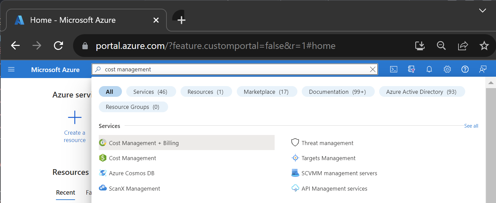
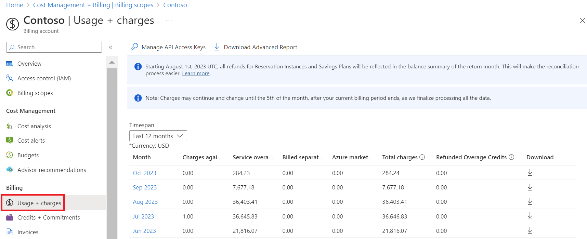
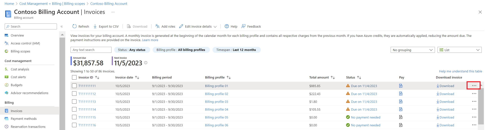
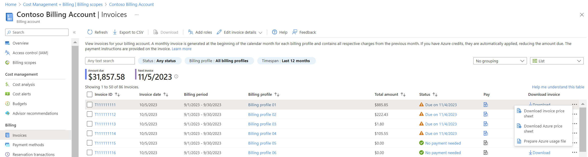
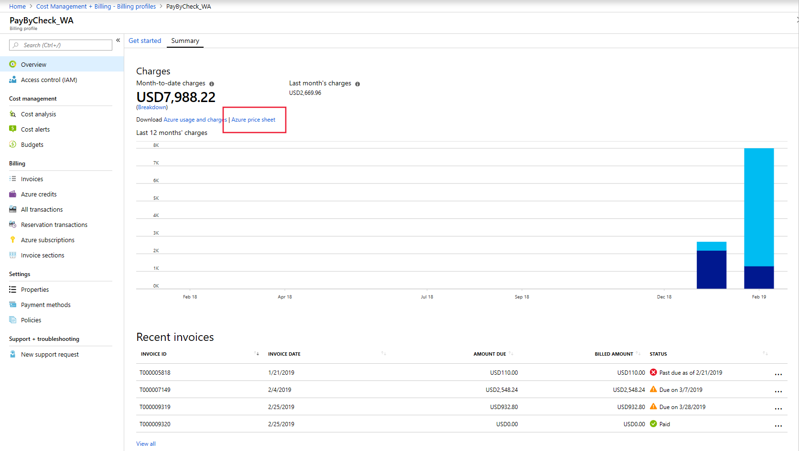

# View and download your organization's Azure pricing

Azure customers with an Azure Enterprise Agreement (EA), Microsoft Customer Agreement (MCA), or Microsoft Partner Agreement (MPA) may view and download their pricing in the Azure portal. [Learn how to check your billing account type](#check-your-billing-account-type).

## Download pricing for an Enterprise Agreement

Depending on the policies set for your organization by the Enterprise Admin, only certain administrative roles provide access to your organization's EA pricing information. For more information, see [Understand Azure Enterprise Agreement administrative roles in Azure](understand-ea-roles.md).

1. As an Enterprise Admin, sign-in to the [Azure portal](https://portal.azure.com/).
1. Search for *Cost Management + Billing*.

   

1. Under the billing account, select **Usage + charges**.

   

1. Select  **Download** for the month.

1. Under **Price Sheet**, select **Download csv**.

   

## Download pricing for an MCA or MPA account

If you have an MCA, you must be the billing profile owner, contributor, reader, or invoice manager to view and download pricing. If you have an MPA, you must have the Global Admin and Admin Agent role in the partner organization to view and download pricing.

### Download price sheets for billed charges

1. Sign-in to the [Azure portal](https://portal.azure.com).
1. Search for *Cost Management + Billing*.
1. Select a billing profile. Depending on your access, you might need to select a billing account first.
1. Select **Invoices**.
1. In the invoice grid, find the row of the invoice corresponding to the price sheet you want to download.
1. Click the ellipsis (`...`) at the end of the row.

1. If you want to see prices for the services in the selected invoice, select **Invoice price sheet**.
1. If you want to see prices for all Azure services for the given billing period, select **Azure price sheet**.

### Download price sheets for the current billing period

If you have an MCA, you can download pricing for the current billing period.

1. Sign-in to the [Azure portal](https://portal.azure.com).
1. Search for *Cost Management + Billing*.
1. Select a billing profile. Depending on your access, you might need to select a billing account first.
1. In the **Overview** area, find the download links beneath the month-to-date charges.
1. Select **Azure price sheet**.

## Estimate costs with the Azure pricing calculator

You may also use your organization’s pricing to estimate costs with the Azure pricing calculator.

1. Go to the [Azure pricing calculator](https://azure.microsoft.com/pricing/calculator).
1. On the top right, select **Sign in**.
1. Under **Programs and Offer** > **Licensing Program**, select **Enterprise Agreement (EA)**.
1. Under **Programs and Offer** > **Selected agreement**, select **None selected**.

    

1. Choose the organization.
1. Select **Apply**.
1. Search for and then add products to your estimate.
1. Estimated prices shown are based on pricing for the organization you selected.

## Check your billing account type
[!INCLUDE [billing-check-account-type](../../../includes/billing-check-account-type.md)]

## Next steps

If you're an EA customer, see:

- [Manage access to your EA billing information for Azure](manage-billing-access.md)
- [View and download your Microsoft Azure invoice](../understand/download-azure-invoice.md)
- [View and download your Microsoft Azure usage and charges](../understand/download-azure-daily-usage.md)
- [Understand your bill for Enterprise Agreement customers](../understand/review-enterprise-agreement-bill.md)

If you have a Microsoft Customer Agreement, see:

- [Understand the terms in your price sheet for a Microsoft Customer Agreement](mca-understand-pricesheet.md)
- [View and download your Microsoft Azure invoice](../understand/download-azure-invoice.md)
- [View and download your Microsoft Azure usage and charges](../understand/download-azure-daily-usage.md)
- [View and download tax documents for your billing profile](../understand/mca-download-tax-document.md)
- [Understand the charges on your billing profile's invoice](../understand/review-customer-agreement-bill.md)
