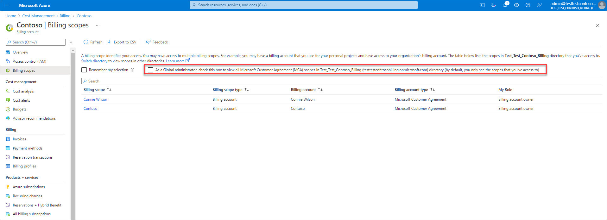
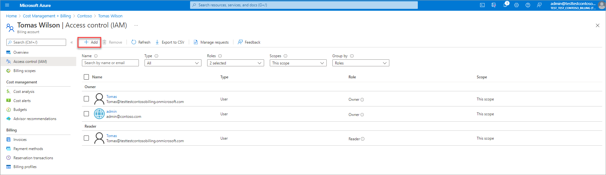
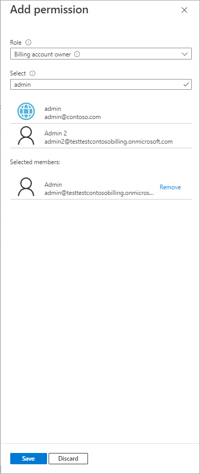

# Elevate access to manage billing accounts

As a Global Administrator in Azure Active Directory (Azure AD), you might not have access to all billing accounts in your directory. This article describes the ways that you can elevate your access to all billing accounts.

Elevating your access to manage all billing accounts, gives you the ability to view and manage cost and billing for these accounts. You can view invoices, charges, products that are purchased and users who have access to the billing accounts. If you want to elevate your access to manage subscriptions, management group, and resources, see [Elevate access to manage all Azure subscriptions and management groups](../../role-based-access-control/elevate-access-global-admin.md#elevate-access-to-manage-all-azure-subscriptions-and-management-groups).

 > [!NOTE]
    > The elevated access only works for billing accounts of types Microsoft Customer Agreement (MCA) and Microsoft Partner Agreement (MPA). As a Global Administrator you can't elevate your access to manage billing accounts of type Enterprise Agreement (EA) and Microsoft Online Service Programs (MOSP). To learn more about billing accounts, view [Billing accounts and scopes in the Azure portal](view-all-accounts.md).

## Why would you need to elevate your access?

If you’re a Global Administrators, there might be times when you want to do the following actions:

- See all users who have created individual billing accounts in your organization.
- View invoices and charges for all individual billing accounts created in your organization.
- Regain access to a billing account when a user has lost access.
- Perform billing administration for an account when other administrators aren't available.

## How does elevated access work?

All Global Administrators in Azure Active Directory (Azure AD) get read-only access to all Microsoft Customer Agreement (MCA) and Microsoft Partner Agreement (MPA) billing accounts in their Azure Active Directory. They can view all billing accounts and the corresponding cost and billing information. Along with read-only view, they get permission to manage role-assignments on these billing accounts. They can add themselves as owners on these billing accounts to elevate themselves.

## Elevate access to manage billing accounts

### [Azure portal](#tab/portal)

1. Sign in to the [Azure portal](https://portal.azure.com).

2. Search for **Cost Management + Billing**.

    

3. Select **Billing scopes** from the left-hand side.

4. In the billing scopes page, check the box to view all billing accounts.

    

 > [!NOTE]
    > The billing scopes page shows only 200 scopes. However, you can use the search box in the page to search for accounts that are not part of the list.

5. Select a billing account of type Microsoft Customer Agreement or Microsoft Partner Agreement from the list. As a Global administrator you have read access to the billing account. To elevate yourself to perform write operations, follow steps 6 to 8.

6. Select Access Control (IAM) from the left-hand side.

7. Select **Add** from the top of the page.    

    
 
8. Select billing account owner from the role dropdown, enter and select your email address, and then select **Save**.   

    

### [REST API](#tab/rest)

You can use the [Azure Billing](/rest/api/billing/) APIs to programmatically elevate yourself to manage all billing accounts in your directory.

## Find all billing accounts in your directory

```json
GET https://management.azure.com/providers/Microsoft.Billing/billingAccounts?includeAllOrgs=true&api-version=2020-05-01
```
The API response returns a list of billing accounts in your directory.

```json
{
  "value": [
    {
            "id": "/providers/Microsoft.Billing/billingAccounts/6e98e158-xxxx-xxxx-xxxx-xxxxxxxxxxxx:xxxxxxxx-xxxx-xxxx-xxxx-xxxxxxxxxxx_xxxx-xx-xx",
            "name": "6e98e158-xxxx-xxxx-xxxx-xxxxxxxxxxxx:xxxxxxxx-xxxx-xxxx-xxxx-xxxxxxxxxxx_xxxx-xx-xx",
            "properties": {
                "accountStatus": "Active",
                "accountType": "Individual",
                "agreementType": "MicrosoftCustomerAgreement",
                "billingProfiles": {
                    "hasMoreResults": false
                },
                "displayName": "Connie Wilson",
                "hasReadAccess": true
            },
            "type": "Microsoft.Billing/billingAccounts"
        },
        {
            "id": "/providers/Microsoft.Billing/billingAccounts/5e98e158-xxxx-xxxx-xxxx-xxxxxxxxxxxx:xxxxxxxx-xxxx-xxxx-xxxx-xxxxxxxxxxx_xxxx-xx-xx",
            "name": "5e98e158-xxxx-xxxx-xxxx-xxxxxxxxxxxx:xxxxxxxx-xxxx-xxxx-xxxx-xxxxxxxxxxx_xxxx-xx-xx",
            "properties": {
                "accountStatus": "Active",
                "accountType": "Enterprise",
                "agreementType": "MicrosoftCustomerAgreement",
                "billingProfiles": {
                    "hasMoreResults": false
                },
                "displayName": "Contoso",
                "hasReadAccess": true
            },
            "type": "Microsoft.Billing/billingAccounts"
        },
        {
            "id": "/providers/Microsoft.Billing/billingAccounts/4e98e158-xxxx-xxxx-xxxx-xxxxxxxxxxxx:xxxxxxxx-xxxx-xxxx-xxxx-xxxxxxxxxxx_xxxx-xx-xx",
            "name": "4e98e158-xxxx-xxxx-xxxx-xxxxxxxxxxxx:xxxxxxxx-xxxx-xxxx-xxxx-xxxxxxxxxxx_xxxx-xx-xx",
            "properties": {
                "accountStatus": "Active",
                "accountType": "Individual",
                "agreementType": "MicrosoftCustomerAgreement",
                "billingProfiles": {
                    "hasMoreResults": false
                },
                "displayName": "Tomas Wilson",
                "hasReadAccess": true
            },
            "type": "Microsoft.Billing/billingAccounts"
        }
  ]
}
```

Use the `displayName` property of the billing account to identify the billing account for which you want to elevate your access. Copy the `name` of the billing account. For example, if you want to elevate yourself as owner on **Connie Wilson** billing account, you'd copy ```6e98e158-xxxx-xxxx-xxxx-xxxxxxxxxxxx:xxxxxxxx-xxxx-xxxx-xxxx-xxxxxxxxxxx_xxxx-xx-xx```. Paste this value somewhere so that you can use it in the next step.

## Get definitions of roles available for your billing account

Make the following request, replacing `<billingAccountName>` with the `name` copied in the first step (```6e98e158-xxxx-xxxx-xxxx-xxxxxxxxxxxx:xxxxxxxx-xxxx-xxxx-xxxx-xxxxxxxxxxx_xxxx-xx-xx```).

```json
GET https://management.azure.com/providers/Microsoft.Billing/billingAccounts/<billingAccountName>/billingRoleDefinitions?api-version=2020-05-01
```
The API response returns list of roles available to your billing account

```json
{
    "value": [
        {
            "id": "/providers/Microsoft.Billing/billingAccounts/6e98e158-xxxx-xxxx-xxxx-xxxxxxxxxxxx:xxxxxxxx-xxxx-xxxx-xxxx-xxxxxxxxxxx_xxxx-xx-xx/billingRoleDefinitions/50000000-aaaa-bbbb-cccc-100000000000",
            "name": "50000000-aaaa-bbbb-cccc-100000000000",
            "properties": {
                "description": "The Owner role gives the user all permissions including access management on a billing account.",
                "permissions": [
                    {
                        "actions": [
                            "50000000-aaaa-bbbb-cccc-200000000000",
                            "50000000-aaaa-bbbb-cccc-200000000001",
                            "50000000-aaaa-bbbb-cccc-200000000002",
                            "50000000-aaaa-bbbb-cccc-200000000003"
                        ]
                    }
                ],
                "roleName": "Billing account owner"
            },
            "type": "Microsoft.Billing/billingAccounts/billingRoleDefinitions"
        },
        {
            "id": "/providers/Microsoft.Billing/billingAccounts/6e98e158-xxxx-xxxx-xxxx-xxxxxxxxxxxx:xxxxxxxx-xxxx-xxxx-xxxx-xxxxxxxxxxx_xxxx-xx-xx/billingRoleDefinitions/50000000-aaaa-bbbb-cccc-100000000001",
            "name": "50000000-aaaa-bbbb-cccc-100000000001",
            "properties": {
                "description": "The Contributor role gives the user all permissions except access management on a billing account.",
                "permissions": [
                    {
                        "actions": [
                            "50000000-aaaa-bbbb-cccc-200000000001",
                            "50000000-aaaa-bbbb-cccc-200000000002",
                            "50000000-aaaa-bbbb-cccc-200000000003",
                        ]
                    }
                ],
                "roleName": "Billing account contributor"
            },
            "type": "Microsoft.Billing/billingAccounts/billingRoleDefinitions"
        },
        {
            "id": "/providers/Microsoft.Billing/billingAccounts/6e98e158-xxxx-xxxx-xxxx-xxxxxxxxxxxx:xxxxxxxx-xxxx-xxxx-xxxx-xxxxxxxxxxx_xxxx-xx-xx/billingRoleDefinitions/50000000-aaaa-bbbb-cccc-100000000002",
            "name": "50000000-aaaa-bbbb-cccc-100000000002",
            "properties": {
                "description": "The Reader role gives the user read permissions to a billing account.",
                "permissions": [
                    {
                        "actions": [
                            "50000000-aaaa-bbbb-cccc-200000000001",
                            "50000000-aaaa-bbbb-cccc-200000000006",
                            "50000000-aaaa-bbbb-cccc-200000000007",
                        ]
                    }
                ],
                "roleName": "Billing account reader"
            },
            "type": "Microsoft.Billing/billingAccounts/billingRoleDefinitions"
        }
    ]
}
```
Use the `roleName` property to identify the owner role definition. Copy the `name` of the role definition. For example, from the above API response, you'd copy ```50000000-aaaa-bbbb-cccc-100000000000```. Paste this value somewhere so that you can use it in the next step.

## Add yourself as an owner 

Make the following request, replacing `<billingAccountName>` with the `name` copied in the first step (```6e98e158-xxxx-xxxx-xxxx-xxxxxxxxxxxx:xxxxxxxx-xxxx-xxxx-xxxx-xxxxxxxxxxx_xxxx-xx-xx```).

```json
PUT  https://management.azure.com/providers/Microsoft.Billing/billingAccounts/<billingAccountName>/createBillingRoleAssignment?api-version=2020-05-01
```

### Request body

To add yourself, as an owner you need to get your object ID. You can find the object ID either in the Users page of the Azure Active Directory section in the Azure portal or your can use the [Microsoft Graph API](https://docs.microsoft.com/graph/api/resources/users?view=graph-rest-1.0) to get the object ID.

Make the following request, replacing `<billingAccountName>` with the `name` copied in the first step (```6e98e158-xxxx-xxxx-xxxx-xxxxxxxxxxxx:xxxxxxxx-xxxx-xxxx-xxxx-xxxxxxxxxxx_xxxx-xx-xx```).

```json
POST  https://management.azure.com/providers/Microsoft.Billing/billingAccounts/<billingAccountName>/createBillingRoleAssignment?api-version=2020-05-01
```

In the request body, replace `<roleDefinitionName>` with the `name` copied from Step 2. Replace `<principalId>` with the object ID that you got either from the Azure portal or through the Microsoft Graph API.

```json
{
	    "principalId": "<principalId>",
	    "roleDefinitionId": "<roleDefinitionName>"
}
```

## Need help? Contact support

If you need help, [contact support](https://portal.azure.com/?#blade/Microsoft_Azure_Support/HelpAndSupportBlade) to get your issue resolved quickly.

## Next steps

- [Manage billing roles in the Azure portal](understand-mca-roles.md#manage-billing-roles-in-the-azure-portal)
- [Get billing ownership of Azure subscriptions from users in other billing accounts](mca-request-billing-ownership.md)