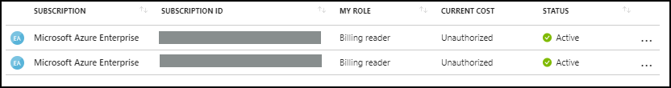
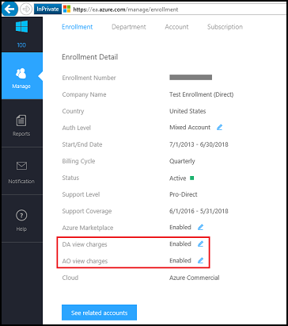
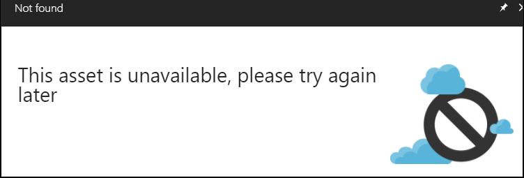

# Troubleshoot enterprise cost views

Within enterprise enrollments, there are several settings that could cause users within the enrollment to not see costs.  These settings are managed by the enrollment administrator. Or, if the enrollment isn't bought directly through Microsoft, the settings are managed by the partner.  This article helps you understand what the settings are and how they impact the enrollment. These settings are independent of the Azure roles.

> [!NOTE]
> We recommend that both direct and indirect EA Azure customers use Cost Management + Billing in the Azure portal to manage their enrollment and billing instead of using the EA portal. For more information about enrollment management in the Azure portal, see [Get started with EA billing in the Azure portal](ea-direct-portal-get-started.md).
>
> As of February 20, 2023 indirect EA customers won’t be able to manage their billing account in the EA portal. Instead, they must use the Azure portal. 
> 
> This change doesn’t affect Azure Government EA enrollments. They continue using the EA portal to manage their enrollment.

## Enable access to costs

Are you seeing a message Unauthorized, or *"Cost views are disabled in your enrollment."* when looking for cost information?

It might be for one of the following reasons:

1. You’ve bought Azure through an enterprise partner, and the partner didn't release pricing yet. Contact your partner to update the pricing setting within the [Enterprise portal](https://ea.azure.com).
2. If you’re an EA Direct customer, there are a couple of possibilities:
    * You're an Account Owner and your Enrollment Administrator disabled the **AO view charges** setting.  
    * You're a Department Administrator and your Enrollment Administrator disabled the **DA view charges** setting.
    * Contact your Enrollment Administrator to get access. The Enrollment Admin can now update the settings in [Azure portal](https://portal.azure.com/). Navigate to **Policies** menu to change settings. 
    * The Enrollment Admin can update the settings in the [Enterprise portal](https://ea.azure.com/manage/enrollment).

      
    
 

## Asset is unavailable

If you get an error message stating **This asset is unavailable** when trying to access a subscription or management group, then you don't have the correct role to view this item.  

Ask your Azure subscription or management group administrator for access. For more information, see [Assign Azure roles using the Azure portal](../../role-based-access-control/role-assignments-portal.md).

## Next steps
- If you have questions or need help, [create a support request](https://go.microsoft.com/fwlink/?linkid=2083458).
