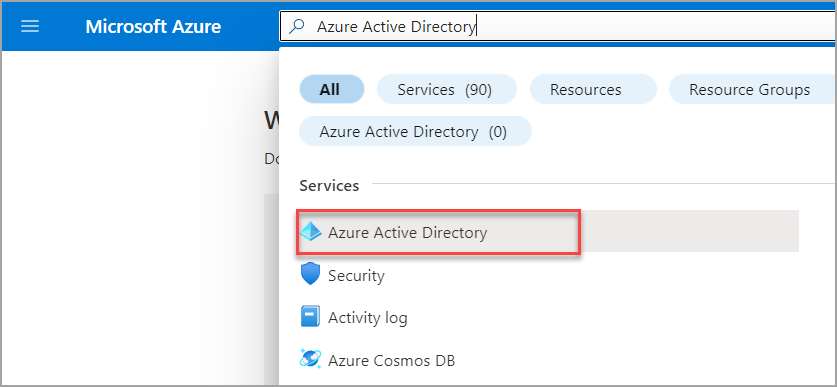

# Locate tenant ID and primary domain

This article describes how to use the Azure portal to locate the following information for a user:

- The Microsoft Azure Active Directory (Azure AD) tenant ID of the user's organization
- The primary domain name of the organization associated with the Azure AD tenant

## Find the Microsoft Azure AD tenant ID and primary domain name

1. Sign in to the [Azure portal](https://portal.azure.com).
1. Search for **Azure Active Directory**.  

    
1. In the Azure Active Directory Overview page, you can find the Azure AD tenant ID and primary domain name in the Basic information section.

    

1. You can also find the tenant ID in the properties page. 

    a. Search for **Azure Active Directory**.  

    a. Select **Properties** from the left hand side.

    a. The tenant ID is displayed in the properties page.

    

## Need help? contact support

If you need help, [contact support](https://portal.azure.com/?#blade/Microsoft_Azure_Support/HelpAndSupportBlade) to get your issue resolved quickly.

## Next steps

- [Managing billing across tenants](manage-billing-across-tenants.md)
- [Billing administrative roles](understand-mca-roles.md)