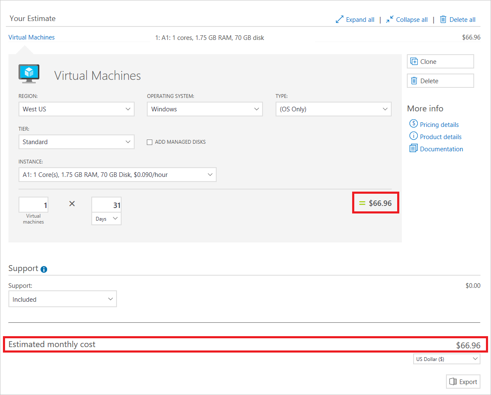
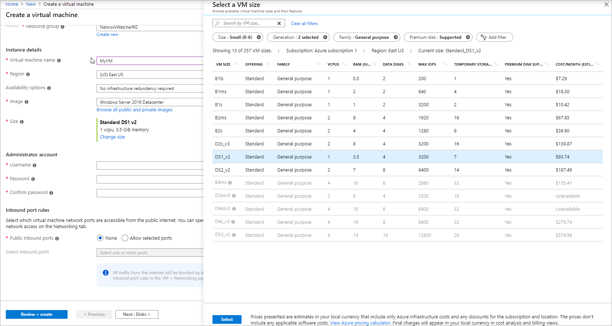
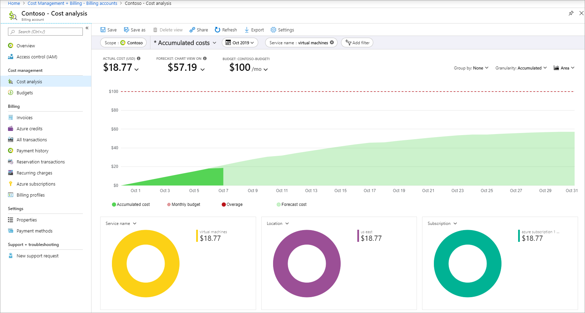
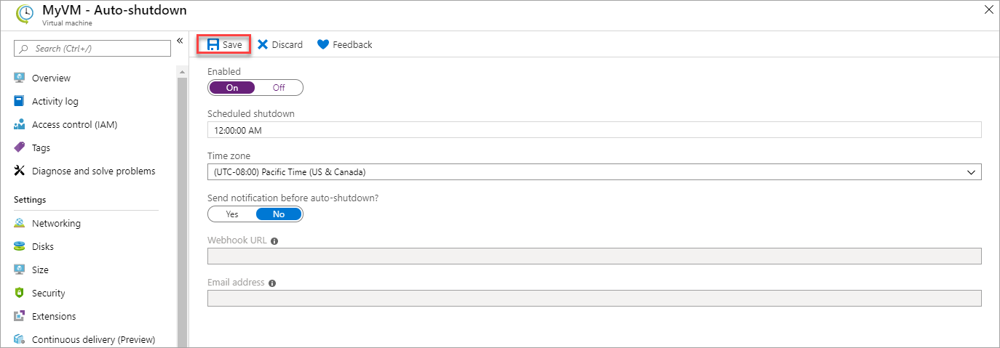

# Prevent unexpected charges with Azure billing and cost management

When you sign up for Azure, there are several things you can do to get a better idea of your spending:

- Get estimated costs before adding services using [pricing calculator](https://azure.microsoft.com/pricing/calculator/), Azure price sheet or while adding services in the Azure portal.
- Monitor costs with [budgets](../costs/tutorial-acm-create-budgets.md), [alerts](../costs/cost-mgt-alerts-monitor-usage-spending.md), and [cost analysis](../costs/quick-acm-cost-analysis.md).
- Review the charges on your invoice by comparing them with [detailed usage files](download-azure-invoice-daily-usage-date.md).
- Integrate billing and cost data with your own reporting system using [billing](https://docs.microsoft.com/rest/api/billing/) and [consumption](https://docs.microsoft.com/rest/api/consumption/) APIs.
- Use additional resources and tools for Enterprise Agreement (EA), Cloud Solution Provider (CSP), and Azure Sponsorship customers.
- Make use of [some of the most popular Azure services for free for 12 months](create-free-services.md) available with the [Azure free account](https://azure.microsoft.com/free/). Along with the recommendations listed below, see [Avoid getting charged for free account](avoid-charges-free-account.md).

If you need to cancel your Azure subscription, see [Cancel your Azure subscription](cancel-azure-subscription.md).

## Get estimated costs before adding Azure services

Use one of the following tools to estimate the cost of using an Azure service:
- Azure pricing calculator
- Azure price sheet
- Azure portal

The images in the following sections show example pricing in US Dollars.

### Estimate cost online using the pricing calculator

Check out the [pricing calculator](https://azure.microsoft.com/pricing/calculator/) to get an estimated monthly cost of the service that you want to add. You can change the currency to get the estimate in your local currency.

You can view estimated cost for any first party Azure service. For example, in the screenshot below, an A1 Windows Virtual Machine (VM) is estimated to cost $66.96 per month in compute hours if you leave it running the whole time:

For more information about pricing, see the [Pricing FAQ](https://azure.microsoft.com/pricing/faq/). If you want to talk to an Azure salesperson, call the phone number shown at the top of the FAQ page.

### View and download Azure price sheet

If you have access to Azure through an Enterprise Agreement (EA) or a Microsoft Customer Agreement (MCA), you can view and download the price sheet for your Azure account. The price sheet is an excel file that contains prices for all Azure services. For more information, see [View and download your Azure pricing](ea-pricing.md).

### Review estimated costs in the Azure portal

You can view the estimated cost per month while adding a service in the Azure portal. For example, when you choose the size of your Windows VM, you see the estimated monthly cost for the compute hours:

## Monitor costs when using Azure services
You can monitor costs with the following tools:

- Budget and cost alerts
- Cost analysis

### Track costs with budgets and cost alerts

Create [budgets](../costs/tutorial-acm-create-budgets.md) to manage costs and create [alerts](../costs/cost-mgt-alerts-monitor-usage-spending.md) that automatically notify you are your stakeholders of spending anomalies and overspending.

###  Explore and analyze costs with cost analysis

After you have your Azure services running, regularly check costs to track your Azure spending. You can use cost analysis to understand where costs originated for your Azure usage.

1. Visit the [Cost Management + Billing page in the Azure portal](https://portal.azure.com/#blade/Microsoft_Azure_Billing/ModernBillingMenuBlade).

2. Click **Cost analysis** from the left side of the screen to see the current cost broken down by various pivots such as service, location, and subscription. After you add a service or make a purchase, wait 24 hours for the data to display. By default, cost analysis shows the cost for the scope that you are in. For example, in the screenshot below, cost for Contoso billing account is displayed. Use the Scope pill to switch to a different scope in cost analysis. For more information about scopes, see [Understand and work with scopes](../costs/understand-work-scopes.md#scopes)

    

4. You can filter by various properties such as tags, resource type, and time span. Click **Add filter** to add the filter for a property and select the values to filter. Select **Export** to export the view to a comma-separated values (.csv) file.

5. Additionally, you can click the labels of the chart to see the daily spend history for that label. For ex: In the screenshot below, clicking on virtual machines displays the daily cost of running your VMs.

    

## Optimize and reduce costs
If you're unfamiliar with the principles of cost management, read [How to optimize your cloud investment with Azure Cost Management](../costs/cost-mgt-best-practices.md).

In the Azure portal, you can also optimize and reduce Azure costs with auto shutdown for VMs and Advisor recommendations.

### Consider cost-cutting features like auto shutdown for VMs

Depending on your scenario, you can configure auto shutdown for your VMs in the Azure portal. For more information, see [Auto shutdown for VMs using Azure Resource Manager](https://azure.microsoft.com/blog/announcing-auto-shutdown-for-vms-using-azure-resource-manager/).

Auto shutdown isn't the same as when you shut down within the VM with power options. Auto shutdown stops and deallocates your VMs to stop additional usage charges. For more information, see pricing FAQ for [Linux VMs](https://azure.microsoft.com/pricing/details/virtual-machines/linux/) and [Windows VMs](https://azure.microsoft.com/pricing/details/virtual-machines/windows/) about VM states.

For more cost-cutting features for your development and test environments, check out [Azure DevTest Labs](https://azure.microsoft.com/services/devtest-lab/).

### Turn on and review Azure Advisor recommendations

[Azure Advisor](../../advisor/advisor-overview.md) helps you reduce costs by identifying resources with low usage. Search for **Advisor** in the Azure portal:

Select **Cost** from the left-hand side. You'll see actionable recommendations in the **Cost** tab:

Review the [Optimize costs from recommendations](../costs/tutorial-acm-opt-recommendations.md) tutorial for a guided tutorial about cost-saving Advisor recommendations.

## Integrate with billing and consumption APIs

Use the Azure [billing](https://docs.microsoft.com/rest/api/billing/) and [consumption](https://docs.microsoft.com/rest/api/consumption/) APIs to programmatically get billing and cost data. Use the RateCard API and the Usage API together to get your billed usage. For more information, see [Gain insights into your Microsoft Azure resource consumption](usage-rate-card-overview.md).

##  Additional resources and special cases

### EA, CSP, and Sponsorship customers
Talk to your account manager or Azure partner to get started.

| Offer | Resources |
|-------------------------------|-----------------------------------------------------------------------------------|
| Enterprise Agreement (EA) | [EA portal](https://ea.azure.com/), [help docs](https://ea.azure.com/helpdocs), and [Power BI report](https://powerbi.microsoft.com/documentation/powerbi-content-pack-azure-enterprise/) |
| Cloud Solution Provider (CSP) | Talk to your provider |
| Azure Sponsorship | [Sponsorship portal](https://www.microsoftazuresponsorships.com/) |

If you're managing IT for a large organization, we recommend reading [Azure enterprise scaffold](/azure/architecture/cloud-adoption-guide/subscription-governance) and the [enterprise IT white paper](https://download.microsoft.com/download/F/F/F/FFF60E6C-DBA1-4214-BEFD-3130C340B138/Azure_Onboarding_Guide_for_IT_Organizations_EN_US.pdf) (.pdf download, English only).

###  Enterprise Agreement cost views in the Azure portal

Enterprise cost views are currently in Public Preview. Items to note:

- Subscription costs are based on usage and don't include prepaid amounts, overages, included quantities, adjustments, and taxes. Actual charges are computed at the Enrollment level.
- Amounts shown in the Azure portal might be different than what's in the Enterprise portal. Updates in the Enterprise portal may take a few minutes before the changes are shown in the Azure portal.
- If you aren't seeing costs, it might be for one of the following reasons:
    - You don't have permissions at the subscription level. To see enterprise cost views, you must be a Billing Reader, Reader, Contributor, or Owner at the subscription level.
    - You're an Account Owner and your Enrollment Administrator has disabled the "AO view charges" setting.  Contact your Enrollment Administrator to get access to costs.
    - You're a Department Administrator and your Enrollment Administrator has disabled the **DA view charges** setting.  Contact your Enrollment Administrator to get access.
    - You bought Azure through a channel partner, and the partner didn't release pricing information.  
- If you update settings related to cost,  access in the Enterprise portal, there's a delay of a few minutes before the changes are shown in the Azure portal.
- Spending limit, and invoice guidance don't apply to EA Subscriptions.

### Check your subscription and access

To view costs, you need account or subscription level access to cost or billing information. The access varies by type of billing account. To learn more about billing accounts and check the type of your billing account, see [View billing accounts in Azure portal](view-all-accounts.md).

If you have access to Azure through a Microsoft Online Service Program (MOSP) billing account, see [Manage access to billing information for Azure](manage-billing-access.md).

If you have access to Azure through an Enterprise Agreement (EA) billing account, see [Understand Azure Enterprise Agreement administrative roles in Azure](understand-ea-roles.md).

If you have access to Azure through a Microsoft Customer Agreement (MCA) billing account, see [Understand Microsoft Customer Agreement administrative roles in Azure](understand-mca-roles.md).

### Request a Service Level Agreement credit for a service incident

The Service Level Agreement (SLA) describes Microsoft's commitments for uptime and connectivity. A service incident is reported when Azure services experience an issue that impacts uptime or connectivity, often referred to as an *outage*. If we do not achieve and maintain the Service Levels for each service as described in the SLA, then you might be eligible for a credit towards a portion of your monthly service fees.

To request a credit:

1. Sign in to the [Azure portal](https://portal.azure.com/). If you have multiple accounts, make sure that you use the one that was affected by Azure downtime.
2. Create a new support request.
3. Under **Issue type**, select **Billing**.
4. Under **Problem type**, select **Refund Request**.
5. Add details to specify that you're asking for an SLA credit, mention the date/time/time-zone as well as the impacted services (VMs, Web Sites, etc.)
6. Verify your contact details and select **Create** to submit your request.

SLA thresholds vary by service. For example, the SQL Web Tier has an SLA of 99.9%, VMs have an SLA of 99.95%, and SQL Standard Tier has an SLA of 99.99%.

For some services, there are prerequisites for the SLA to apply. For example, virtual machines must have two or more instances deployed in the same Availability Set.

For more information, see [Service Level Agreements](https://azure.microsoft.com/support/legal/sla/) and the [SLA summary for Azure services](https://azure.microsoft.com/support/legal/sla/summary/) documentation.

## Analyze unexpected charges

The cloud resource infrastructure that you've built for your organization is likely complex. Many Azure resource types can have different types of charges. Azure resources might be owned by different teams in your organization and they might have different billing model types that apply to various resources. To gain a better understanding of the charges, begin your analysis using one or more of the strategies in the following sections.

### Review your invoice and identify the resource that is responsible for the charge

How you purchase your Azure services helps you determine the methodology and tools that are available to you as you identify the resource associated with a charge. To determine which methodology applies to you, first [determine your Azure offer type](../costs/understand-cost-mgt-data.md#determine-your-offer-type). Then, identify your customer category in the list of [supported Azure offers](../costs/understand-cost-mgt-data.md#supported-microsoft-azure-offers).

The following articles provide detailed steps that explain how to review your bill based on your customer type. In each article there are instructions about how to download a CSV file containing usage and cost details for a given billing period.

- [Pay-As-You-Go bill review process](../understand/review-individual-bill.md#compare-invoiced-charges-with-usage-file)
- [Enterprise Agreement bill review process](../understand/review-enterprise-agreement-bill.md)
- [Microsoft Customer Agreement review process](../understand/review-customer-agreement-bill.md#analyze-your-azure-usage-charges)
- [Microsoft Partner Agreement review process](../understand/review-partner-agreement-bill.md#analyze-your-azure-usage-charges)

Your Azure bill aggregates charges for the month on a per-_meter_ basis. Meters are used to track a resource's usage over time and are used to calculate your bill. When you create a single Azure resource, like a virtual machine, one or more-meter instances are created for the resource.

Filter the usage CSV file based on the _MeterName_ as shown on the bill that you want to analyze to see all line items that apply to the meter. The _InstanceID_ for the line item corresponds to the actual Azure resource that generated the charge.

When you've identified the resource in question, you can use Cost analysis in Azure Cost Management to further analyze the costs related to the resource. To learn more about using cost analysis, see [Start analyzing costs](../costs/quick-acm-cost-analysis.md).

### Review invoiced charges in Cost analysis

To view your invoice details in the Azure portal, navigate to Cost analysis for the scope associated with the invoice that you're analyzing. Select the **Invoice details** view. Invoice details show you the charges as seen on the invoice.

Viewing invoice details, you can identify the service that has unexpected costs and determine which resources are directly associated with the resource in Cost analysis. For example, if you want to analyze charges for the Virtual Machines service, navigate to the **Accumulated cost** view. Then, set the granularity to **Daily** and filter charges **Service name: Virtual machines** and group charges by **Resource**.

### Identify spikes in cost over time

Sometimes you might not know what recent costs resulted in changes to your billed charges. To understand what changed, you can use Cost analysis to [see a daily or monthly breakdown of costs over time](../costs/cost-analysis-common-uses.md#view-costs-per-day-or-by-month). After you create the view, group your charges by either **Service** or **Resource** to identify the changes. You can also change your view to a **Line** chart to better visualize the data.

### Determine resource pricing and understand its billing model

A single resource can accrue charges across multiple Azure products and services. View the [Azure pricing by product](https://azure.microsoft.com/pricing/#product-pricing) page to learn more about the pricing for each Azure service. For example, a single virtual machine (VM) created in Azure can have the following meters created to track its usage. Each might have different pricing.

- Compute Hours
- IP Address Hours
- Data Transfer In
- Data Transfer Out
- Standard Managed Disk
- Standard Managed Disk Operations
- Standard IO-Disk
- Standard IO-Block Blob Read
- Standard IO-Block Blob Write
- Standard IO-Block Blob Delete

When the VM is created, each meter begins emitting usage records. The usage and the meter's price are tracked in the Azure metering system. You can see the meters that were used to calculate your bill in the usage CSV file.

### Find the people responsible for the resource and engage them

Oftentimes, the team responsible for a given resource will know about changes that were made for a resource. Engaging them is useful as you identify why charges might appear. For example, the owning team may have recently created the resource, updated its SKU (thereby changing the resource rate) or increased the load on the resource due to code changes. Continue reading the following sections for more techniques to determine who owns a resource.

#### Analyze the audit logs for the resource

If you have permissions to view a resource, you should be able to access its audit logs. Review the logs to find the user who was responsible for the most recent changes to a resource. To learn more, see [View and retrieve Azure Activity log events](../../azure-monitor/platform/activity-log-view.md).

#### Analyze user permissions to the resource's parent scope

People that have write access to a subscription or resource group typically have information about the resources were created. They should be able to explain the purpose of a resource or point you to the person who knows. To identify the people with permissions for a Subscription scope, see [View role assignments](../../role-based-access-control/check-access.md#view-role-assignments). You can use a similar process for resource groups.

### Get help to identify charges

If you've used the preceding strategies and you still don't understand why you received a charge or if you need other help with billing issues, please [create a support request](https://go.microsoft.com/fwlink/?linkid=2083458).

## Next steps
- Learn about using [spending limits](spending-limit.md) to prevent overspending.
- Start [analyzing your Azure costs](../costs/quick-acm-cost-analysis.md).
