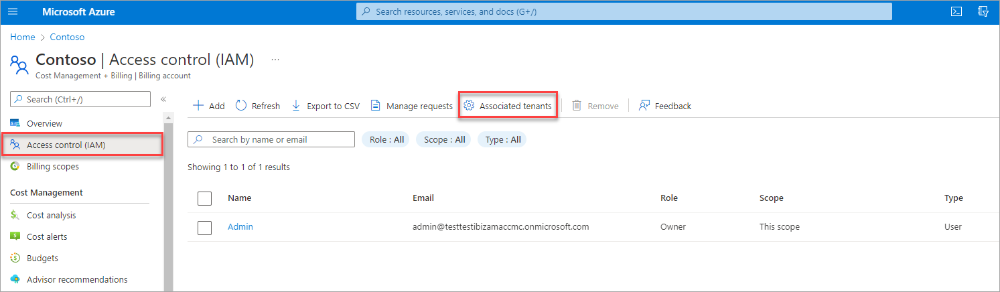
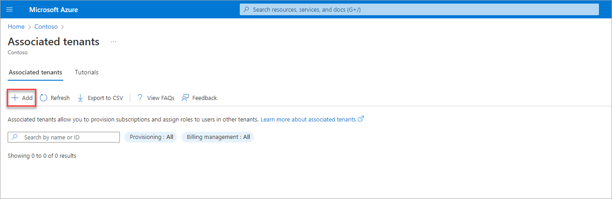
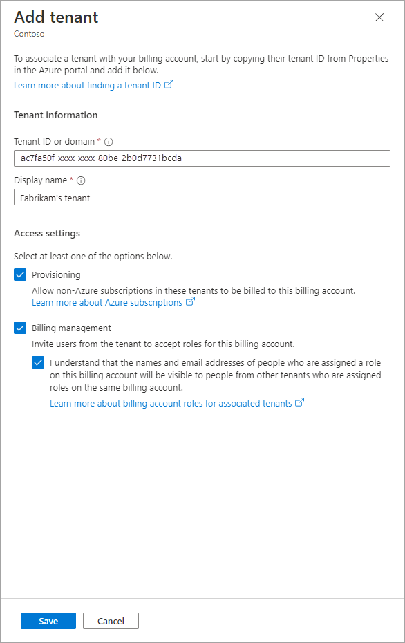
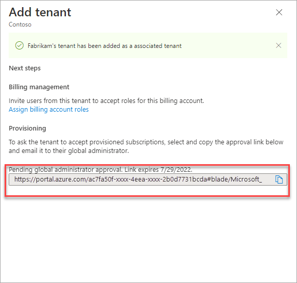
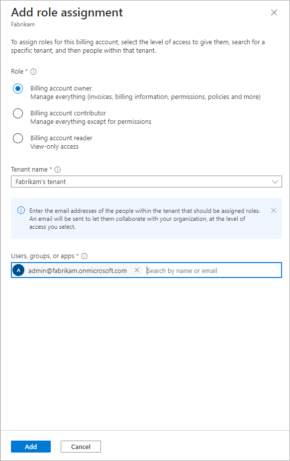
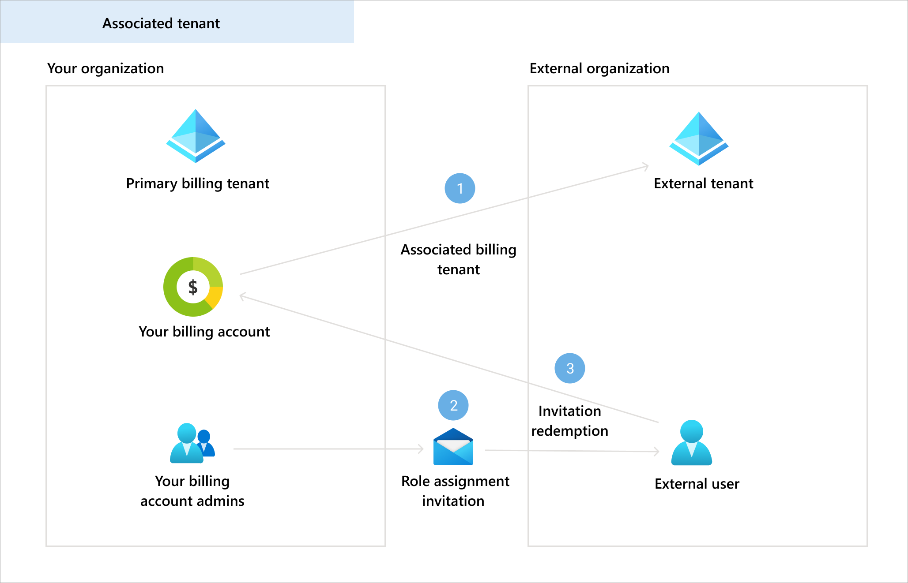
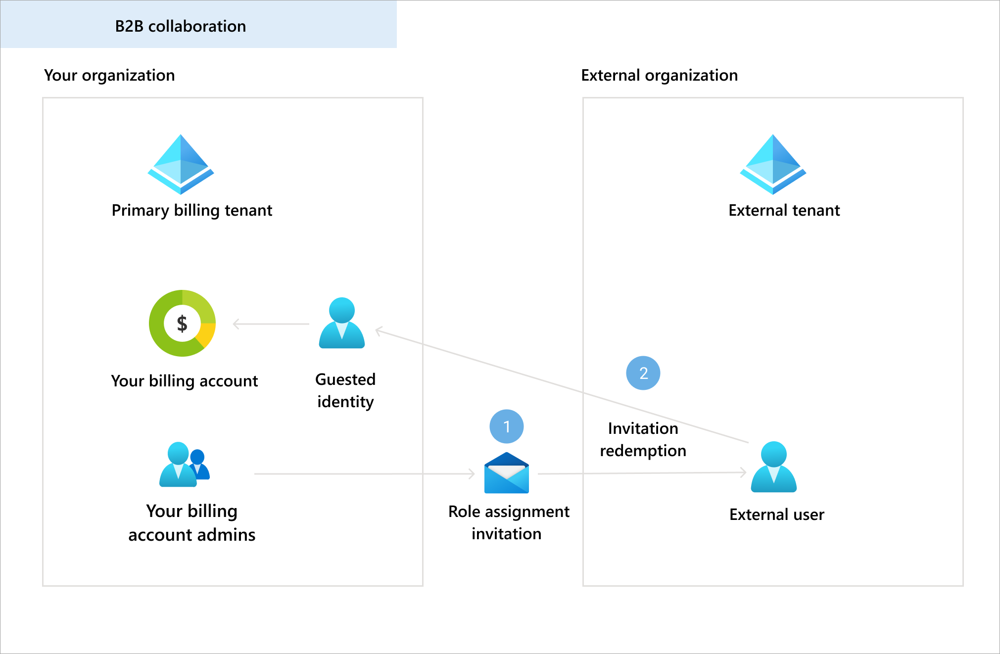

# Associated tenants overview

Associated tenants is a feature that enables commerce and billing collaboration among tenants. You can securely share your organization's billing account with other tenants, while maintaining control over your billing data. You can provision subscription in different tenants and provide users from these tenants access to your organization's billing account to let them perform billing activities like viewing and downloading invoices or managing licenses.

## Understand type of tenants

Primary billing tenant: Your tenant, which was used to set up the billing account, serves as the primary billing tenant. By default, all subscriptions that are purchased using the billing account are provisioned into this tenant and only users in this tenant can manage bills and payments.

Associated tenants: As an owner of a billing account, you can share your billing account with other tenants. These tenants are called associated tenants and users from these tenants can buy subscriptions using your billing account, or accept subscriptions from you. They can also manage bills and payments.

> [!NOTE]
> Adding an associated tenants, and provisioning subscriptions and assigning roles to users in associated tenants are only available for billing accounts of type Microsoft Customer Agreement that are created by working with a Microsoft sales representative. To learn more about billing accounts, see [Billing accounts and scopes in the Azure portal](view-all-accounts.md).

## Access settings for associated tenants

You can enable the following access settings for each associated tenant:

- **Billing management**: Billing management allows billing account administrators to assign roles to users from an associated tenant, giving them permission to access information and make decisions.
- **Provisioning**: Provisioning is the permission granted to allow provisioning of Microsoft 365 subscriptions into an associated tenant.

## Add an associated tenant

1. Sign in to the [Azure portal](https://portal.azure.com).
1.  Search for **Cost Management + Billing**.  

    
1. Select **Access control (IAM)** on the left side of the page.
1. In the Access control (IAM), select **Associated tenants** from the top of the page.

    
1. Select **Add** from the top of the page.

     
1. Enter tenant ID or domain name, provide a friendly name and then select Access settings. To learn more about finding a tenant ID or domain name, see [Find your tenant ID and domain name](https://). To learn about access setting, see [Access settings for associated tenant](#access-settings-for-associated-tenants)

    
1. Select **Save**.
1. If you enabled provisioning setting, copy the invitation URL, and share it with the Global administrator of the associated tenant to approve provisioning of subscriptions into their tenants.

    

## Assign roles to users from associated tenants

You must [add a tenant as an associated tenant](#add-an-associated-tenant) and [enable billing management setting](#access-settings-for-associated-tenants) before completing the steps below.

1. Sign in to the [Azure portal](https://portal.azure.com).
1.  Search for **Cost Management + Billing**.  

    
1. Select **Access control (IAM)** on the left side of the page.
1. In the Access control (IAM), select **Add** from the top of the page.

    
1. Select a role. To learn more about billing roles, see [Understand Microsoft Customer Agreement administrative roles in Azure](understand-mca-roles.md)
1. Select the associated tenant from the tenant dropdown  
1. Enter the email address of the user to assign role.
1. Select **Save**.

    
1. The user would receive an email with instructions to approve your role assignment. Once they approve, they'll get the permissions to view or manage your billing account, depending on the role that was assigned.
1. If the user can't receive emails, you can copy the approval link and share with them.
1. Select manage requests from the top of the **Access control (IAM)** page.
1. Select the approval request sent to the user that you added.
<!-- Todo: add a screenshot for request list page -->
1. Copy the request URL.
<!-- Todo: add a screenshot for request details page -->

### Role assignments through associated tenants vs Azure B2B 

You can add users from other tenants through Azure B2B as well. To learn more about Azure B2B, see [B2B collaboration overview](https://docs.microsoft.com/azure/active-directory/external-identities/what-is-b2b). 

Use the following table to decide which role assignment method is right for your organization:

|  |Associated tenants  |Azure B2B  |
|---------|---------|---------|
|Security     |  The users that you invite to share your billing account will follow their tenant's security policies      |  The users that you invite to share your billing account will follow your tenant's security policies       |
|Access    | The users get access to your billing account in their own tenant and can manage billing and make purchases without switching tenants        |  External guest identities are created for users in your tenant and these identities get access to your billing account. Users would have to switch tenant to manage billing and make purchases     |

## Provisioning Microsoft 365 subscriptions in the associated tenants

You must [add a tenant as an associated tenant](#add-an-associated-tenant) and [enable provisioning setting](#access-settings-for-associated-tenants) for the tenant before provisioning subscriptions in the associated tenants.

To provision Microsoft 365 subscriptions in the associated tenants, see [provision subscriptions in associated tenants](https://) 

## Need help? contact support

If you need help, [contact support](https://portal.azure.com/?#blade/Microsoft_Azure_Support/HelpAndSupportBlade) to get your issue resolved quickly.

## Next steps

- [Billing administrative roles](understand-mca-roles.md)
- [Associate or add an Azure subscription to your Azure Active Directory tenant](https://docs.microsoft.com/azure/active-directory/fundamentals/active-directory-how-subscriptions-associated-directory)