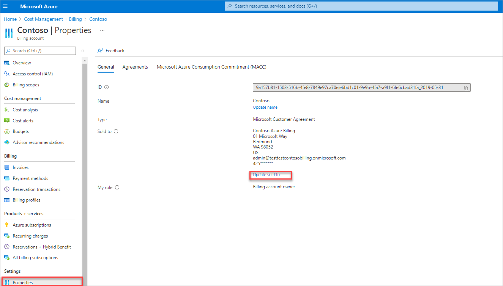
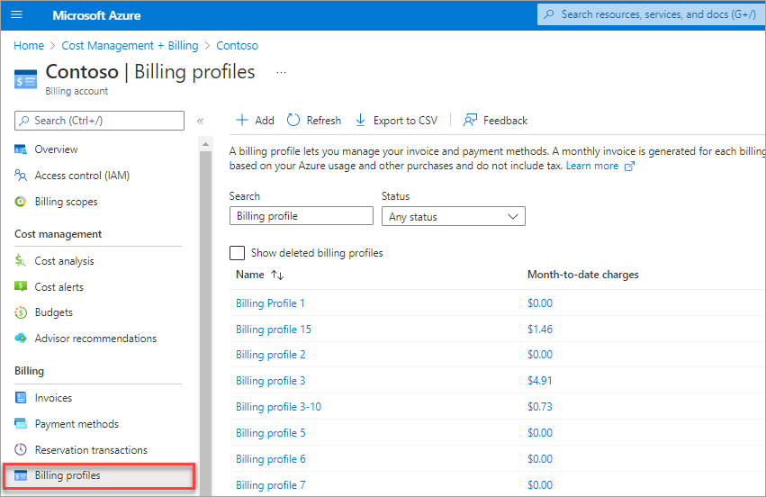
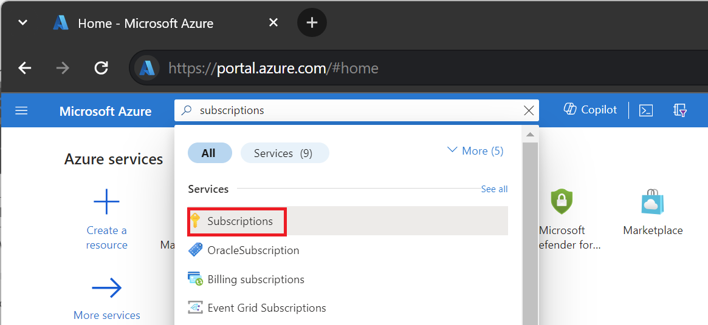

# Tax information

When you buy Azure products and services, the taxes that you pay are determined by one of two things: your sold to address, or your ship-to/service usage address, if it's different. 

This article helps you review and update  sold to,  ship to/service usage address and tax IDs for your Azure billing account. The instructions to update vary by the billing account type. To learn more about billing accounts and identify your billing account type, see [View billing accounts in Azure portal](view-all-accounts.md). An Azure billing account is separate from your Azure user account and [Microsoft account](https://account.microsoft.com/).

 > [!IMPORTANT]
    > When you update sold to, ship to and Tax IDs in the Azure portal, the updated values are only used for invoices that are generated in the future. To make changes to an existing invoice, [create a support request](https://go.microsoft.com/fwlink/?linkid=2083458).

## Update sold to address

1. Sign in to the Azure portal using the email address, which has an owner or a contributor role on the billing account for a Microsoft Customer Agreement (MCA) or an account administrator role for a MOSP billing account.
1. Search for **Cost Management + Billing**.  
    
1. Select **Properties** from the left-hand side and then select **Update sold-to**.  
    
1. Enter the new address and select **Save**.  

 > [!IMPORTANT]
    > Some accounts require additional verification before their sold-to can be updated. If your account requires manual approval, you would be asked to contact Azure support.

## Update ship to/service usage address for an MCA billing account

Customers in Canada, Puerto Rico and United States can set ship to address for their Microsoft Customer Agreement (MCA) billing accounts. Each billing profile in their account can have its own ship to address. To use multiple ship to addresses, create multiple billing profiles, one for each ship to address.

1. Sign in to the Azure portal using the email address, which has an owner or a contributor role on a billing account or a billing profile for an MCA.
1. Search for **Cost Management + Billing**.  
    
1. Select **Billing profiles** from the left-hand side.
1. Select a billing profile to update the ship to address.  
    
1. Select **Properties** from the left-hand side.
1. Select **Update ship to/service usage address**.  
    
1. Enter the new address and then select **Save**.  

## Update ship to/service usage address for a MOSP billing account

Customers with a Microsoft Online Service Program (MOSP) account can set ship to address for their billing account. Each subscription in their account can have its own ship to address. To use multiple ship to addresses, create multiple subscriptions, one for each ship to address.

1. Sign in to the Azure portal using the email address, which has the account administrator permission on the account.
1. Search for **Subscriptions**.  
   
1. Select a subscription from the list.
1. Select **Properties** from the left-hand side.  
1. Select **Update Address**.
    
1. Enter the new address and then select **Save**.  
    
## Add your tax IDs

In the Azure portal, Tax IDs can only be updated for Microsoft Online Service Program (MOSP) or Microsoft Customer Agreement billing accounts that are created during sign up through the Azure website.

Customers in the following countries can add their Tax IDs:

||||
|---------||---------|
|  Armenia   | Australia        |
|  Armenia   | Australia        |
|  Austria   |     Bahamas        |
|  Bahrain  |   Bangladesh       |
|  Belarus   |  Belgium       |
|  Brazil   | Bulgaria        |
|Cambodia     |  	Cameroon       |
|Chile     |  Colombia       |
|Croatia     |  Cyprus       |
|Czech Republic     |  Denmark       |
| Estonia    |   Fiji      |
| Finland    |   France      |
|Georgia     | Germany        |
|Ghana     | Greece        |
|Guatemala     |   Hungary      |
|Iceland     |  Italy       |
|  India*   | Indonesia        |
|Ireland     |  Isle of Man        |
|Kenya     |   Korea      |
|  Latvia   |  Liechtenstein      |
|Lithuania   |   Luxembourg    |
|Malaysia  |   Malta  |
|	Mexico    |  Moldova     |
| Monaco   |  Netherlands     |
|  New Zealand    |  Nigeria    |
| Oman   |  Philippines   |
| Poland   |   Portugal    |
|  Romania   |  Saudi Arabia   |
| Serbia   |    Slovakia   |
|   Slovenia  |   South Africa    |
|Spain    |   Sweden   |
|Switzerland    |   Taiwan  |
|Tajikistan   |   Thailand  |
|Turkey    |   Ukraine   |
|United Arab Emirates    |   United Kingdom     |
|Uzbekistan    |  Vietnam    |
|Zimbabwe    |   |

1. Sign in to the Azure portal using the email address, which has an owner or a contributor role on the billing account for a Microsoft Customer Agreement (MCA) or an account administrator role for a MOSP billing account.
1. Search for **Cost Management + Billing**.  
    
1. Select **Properties** from the left-hand side.  
1. Select **Manage Tax IDs**.
    
1. Enter new tax IDs and then select **Save**.  

 > [!IMPORTANT]
    > If you don't see the Tax IDs section, Tax IDs are not yet collected for your region or updating Tax IDs in the Azure portal is not supported for your account.

*Follow the instructions in the next section to add your GSTIN

## Add your GSTIN for billing accounts in India 

1. Sign in to the Azure portal using the email address, which has the account administrator permission on the account.
1. Search for **Subscriptions**.  
   
1. Select a subscription from the list.
1. Select **Properties** from the left-hand side.  
1. Select **Update Address**.
    
1. Enter the new GSTIN and then select **Save**.  
    
    
## Need help? Contact us.

If you have questions or need help, [create a support request](https://go.microsoft.com/fwlink/?linkid=2083458).

## Next steps

- [View your billing accounts](view-all-accounts.md)
