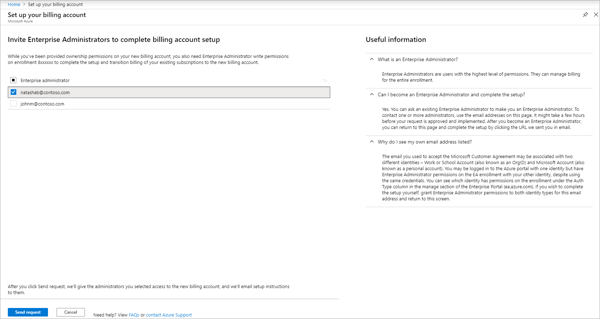
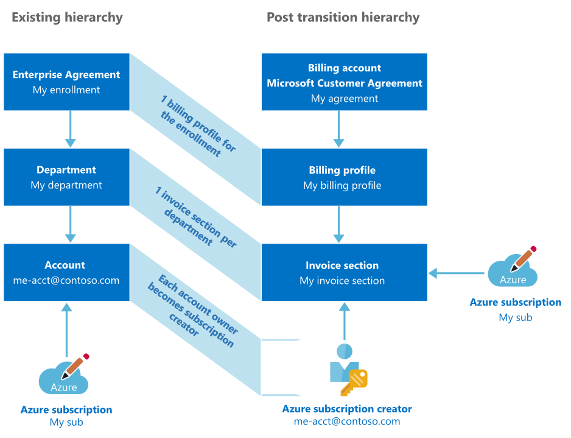
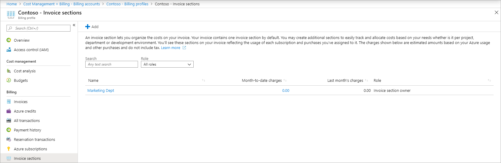
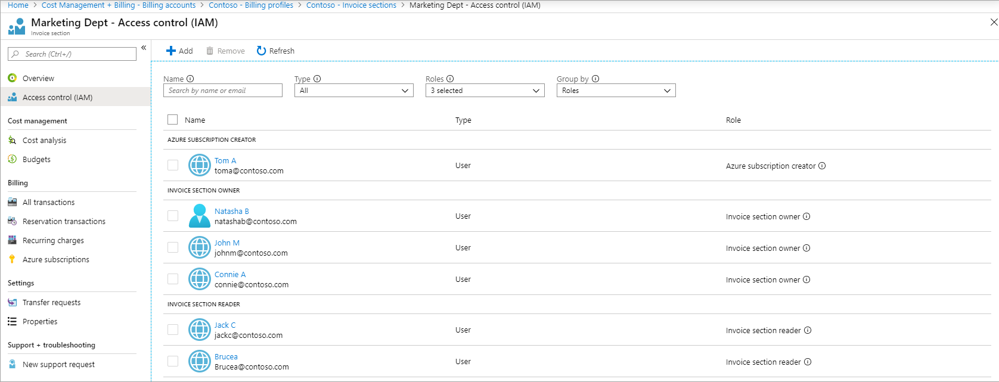

# Set up your billing account for a Microsoft Customer Agreement

If your Enterprise Agreement enrollment has expired or about to be expired, you can sign a Microsoft Customer Agreement to renew your enrollment. This article describes the changes to your existing billing after the setup and walks you through the setup of your new billing account. The renewal includes the following steps:

1. Accept the new Microsoft Customer Agreement. Work with your Microsoft field representative to understand the details and accept the new agreement.
2. Set up the new billing account that’s created for the new Microsoft Customer Agreement.

To set up the billing account, you must transition the billing of Azure subscriptions from your Enterprise Agreement enrollment to the new account. The setup doesn’t impact Azure services that are running in your subscriptions. However, it changes the way you'll manage the billing for your subscriptions.

- Instead of the [EA portal](https://ea.azure.com), you’ll manage your Azure services and billing, in the [Azure portal](https://portal.azure.com).
- You’ll get a monthly, digital invoice for your charges. You can view and analyze the invoice in the Azure Cost Management + Billing page.
- Instead of departments and account in your Enterprise Agreement enrollment, you'll use the billing structure and scopes from the new account to manage and organize your billing.

Before you start the setup, we recommend you do the following:

- **Understand your new billing account**
  - Your new account simplifies billing for your organization. [Get a quick overview of your new billing account](../understand/mca-overview.md)
- **Verify your access to complete the setup**
  - Only users with certain administrative permissions can complete the setup. Check if you have the [access required to complete the setup](#access-required-to-complete-the-setup).
- **Understand changes to your billing hierarchy**
  - You new billing account is organized differently than your Enterprise Agreement enrollment. [Understand changes to your billing hierarchy in the new account](#understand-changes-to-your-billing-hierarchy).
- **Understand changes to your billing administrators' access**
  - Administrators from your Enterprise Agreement enrollment get access to the billing scopes in the new account.[Understand changes to their access](#changes-to-billing-administrator-access).
- **View Enterprise Agreement features that are replaced by the new account**
  - View features of the Enterprise Agreement enrollment that are replaced by features in the new account.
- **View answers to most common questions**
  - View [additional information](#additional-information) to learn more about the setup.

## Access required to complete the setup

To complete the setup, you need the following access:

- Owner of the billing profile that was created when the Microsoft Customer Agreement was signed. To learn more about billing profiles, see [understand billing profiles](../understand/mca-overview.md#billing-profiles).

- Enterprise administrator on the enrollment that is renewed.

### If you're not an enterprise administrator on the enrollment

You can request the enterprise administrators of the enrollment to complete the setup of your billing account.

1. Sign in to the Azure portal using the link in the email that was sent to you when you signed the Microsoft Customer Agreement.

2. If you don't have the email, sign in using the following link. Replace `<enrollmentNumber>` with the enrollment number of your enterprise agreement that was renewed.

   `https://portal.azure.com/#blade/Microsoft_Azure_EA/EATransitionToMCA/enrollmentId/<enrollmentNumber>`

3. Select the enterprise administrators that you want to send the request.

   

4. Select **Send request**.

   The administrators will receive an email with instructions to complete the setup.

### If you're not an owner of the billing profile

The user in your organization, who signed the Microsoft Customer Agreement is added as the owner on the billing profile. Request the user to add you as an owner so that you can complete the setup.

## Understand changes to your billing hierarchy

Your new billing account simplifies billing for your organization while providing you enhanced billing and cost management capabilities. The following diagram explains how billing is organized in the new billing account.

1. You use the billing account to manage billing for your Microsoft customer agreement. Enterprise administrators become owners of the billing account. To learn more about billing account, see [understand billing account](../understand/mca-overview.md#your-billing-account).
2. You use the billing profile to manage billing for your organization, similar to your Enterprise Agreement enrollment. Enterprise administrators become owners of the billing profile. To learn more about billing profiles, see [understand billing profiles](../understand/mca-overview.md#billing-profiles).
3. You use an invoice section to organize your costs based on your needs, similar to departments in your Enterprise Agreement enrollment. Department becomes invoice sections and department administrators become owners of the respective invoice sections. To learn more about invoice sections, see [understand invoice sections](../understand/mca-overview.md#invoice-sections).
4. The accounts that were created in your Enterprise Agreement aren’t supported in the new billing account. The account's subscriptions belong to the respective invoice section for their department. Account owners can create and manage subscriptions for their invoice sections.

## Changes to billing administrator access

Depending on their access, billing administrators on your Enterprise Agreement enrollment get access to the billing scopes on the new account. The following table explains the change in access during the setup:

| Existing role | Post transition role |
| --- | --- |
| **Enterprise administrator (Read only = No)** | **- Billing account owner**   Manage everything on the billing account   **- Billing profile owner**   Manage everything on the billing profile   **- Invoice section owner on all invoice sections**   Manage everything on the invoice sections |
| **Enterprise administrator (Read only = Yes)** | **- Billing account reader**   Read-only view of everything on billing account  **- Billing profile reader**   Read-only view of everything on billing profile **- Invoice section reader on all invoice section**  Read-only view of everything on the invoice sections|
| **Department administrator(Read only = No)** |**- Invoice section owner on the invoice section created for their respective department**  Manage everything on the invoice section|
| **Department administrator (Read only = Yes)**|**- Invoice section reader on the invoice section created for their respective department**  Read-only view of everything on the invoice section|
| **Account owner** | **- Azure subscription creator on the invoice section created for their respective department**    Create Azure subscriptions for their invoice section|

An Azure Active Directory (AD) tenant is selected for the new billing account while accepting your Microsoft Customer Agreement. If a tenant doesn't exist for your organization, a new tenant is created. The tenant represents your organization within Azure Active Directory. Global tenant administrators in your organization use the tenant to manage access of applications and data in your organization.

Your new account only supports users from the tenant that was selected while signing the Microsoft Customer Agreement. If users with administrative permission on your Enterprise Agreement are part of the tenant, they’ll get access to the new billing account during the setup. If they’re not part of the tenant, they won’t be able to access the new billing account unless you invite them.

When you invite the users, they are added to the tenant as guest users and get access to the billing account. To invite the users, guest access must be turned on for the tenant. For more information, see [control guest access in Azure Active Directory](https://docs.microsoft.com/microsoftteams/teams-dependencies#control-guest-access-in-azure-active-directory). If the guest access is turned off, contact the global administrators of your tenant to turn it on. <!-- Todo - How can they find their global administrator -->

## View replaced features

The following Enterprise Agreement's features are replaced with new features in the billing account for a Microsoft Customer Agreement.

### Enterprise Agreement accounts

The accounts that were created in your Enterprise Agreement enrollment aren't supported in the new billing account. The account's subscriptions belong to the invoice section created for their respective department. Account owners become Azure subscription creators and can create and manage subscriptions for their invoice sections.

### Notification contacts

Notification contacts are sent email communications about the Azure Enterprise Agreement. They are not supported in the new billing account. Emails about Azure credits and invoices are sent to users who have access to billing profiles in your billing account.

### Spending quotas

Spending quotas that were set for departments in your Enterprise Agreement enrollment are replaced with budgets in the new billing account. A budget is created for each spending quota set on departments in your enrollment. For more information on budgets, see [create and manage Azure budgets](../cloudyn/manage-budgets.md).

### Cost centers

Cost center that were set on the Azure subscriptions in your Enterprise Agreement enrollment are carried over in the new billing account. However, cost centers for departments and Enterprise Agreement accounts aren't supported.

## Additional information

The following sections provide additional information about setting up your billing account.

### No service downtime

Azure services in your subscription keep running without any interruption. We only transition the billing relationship for your Azure subscriptions. There won't be an impact to existing resources, resource groups, or management groups.

### User access to Azure resources

Access to Azure resources that was set using Azure RBAC (role-based access control) is not affected during the transition.

### Azure Reservations

Any Azure Reservations in your Enterprise Agreement enrollment is moved to your new billing account. During the transition, there won't be any changes to the reservation discounts that are being applied to your subscriptions.

### Azure Marketplace products

Any Azure Marketplace products in your Enterprise agreement enrollment are moved along with the subscriptions. There won't be any changes to the service access of the Marketplace products during the transition.

### Support plan

Support benefits don't transfer as part of the transition. Purchase a new support plan to get benefits for Azure subscriptions in your new billing account.

### Past charges and balance

Charges and credits balance prior to transition can be viewed in your Enterprise Agreement enrollment through the Azure portal. <!--Todo - Add a link for this-->

### When should the setup be completed?

Complete the setup of your billing account before your Enterprise Agreement enrollment expires. If your enrollment expires, services in your Azure subscriptions will still keep on running without disruption. However, you'll be charged pay-as-you-go rates for the services.

### Changes to the Enterprise Agreement enrollment after the setup

Azure subscriptions that are created for the Enterprise Agreement enrollment after the transition can be manually moved to the new billing account. For more information, see [get billing ownership of Azure subscriptions from other users](mca-request-billing-ownership.md). To move Azure Reservations that are purchased after the transition, [contact Azure Support](https://portal.azure.com/?#blade/Microsoft_Azure_Support/HelpAndSupportBlade). You can also provide users access to the billing account after the transition. For more information, see [manage billing roles in the Azure portal](understand-mca-roles.md#manage-billing-roles-in-the-azure-portal)

### Revert the transition

The transition can't be reverted. Once the billing of your Azure subscriptions is transitioned to the new billing account, you can't revert it back to your Enterprise Agreement enrollment.

### Closing your browser during setup

Before you click on **Start transition**, you can close the browser. You can come back to the setup using the link you got in the email and start the transition. If you close the browser, after the transition is started, your transition will keep on running. Come back to the transition status page to monitor the latest status of your transition. You'll get an email when the transition is completed.

## Complete the setup in the Azure portal

To complete the setup, you need access to both the new billing account and the Enterprise Agreement enrollment. For more information, see [access required to complete the set up of your billing account](#access-required-to-complete-the-setup).

1. Sign in to the Azure portal using the link in the email that was sent to you when you signed the Microsoft Customer Agreement.

2. If you don't have the email, sign in using the following link. Replace `<enrollmentNumber>` with the enrollment number of your enterprise agreement that was renewed.

   `https://portal.azure.com/#blade/Microsoft_Azure_EA/EATransitionToMCA/enrollmentId/<enrollmentNumber>`

3. Select **Start transition** in the last step of the setup. Once you select start transition:

    

    - A billing hierarchy corresponding to your Enterprise Agreement hierarchy is created in the new billing account. For more information, see [understand changes to your billing hierarchy](#understand-changes-to-your-billing-hierarchy).
    - Administrators from your Enterprise Agreement enrollment are given access to the new billing account so that they continue to manage billing for your organization.
    - The billing of your Azure subscriptions is transitioned to the new account. **There won’t be any impact on your Azure services during this transition. They’ll keep running without any disruption**.
    - If you have Azure Reservations, they are moved to your new billing account with no change to benefits or term.

4. You can monitor the status of the transition on the **Transition status** page.

   

## Validate billing account setup

 Validate the following to ensure your new billing account is set up properly:

### Azure subscriptions

1. Sign in to the [Azure portal](https://portal.azure.com).

2. Search for **Cost Management + Billing**.

   

3. Select the billing account. The billing account will be of type **Microsoft Customer Agreement**.

4. Select **Azure subscriptions** from the left side.

   

Azure subscriptions that are transitioned from your Enterprise Agreement enrollment to the new billing account are displayed on the Azure subscriptions page. If you believe any subscription is missing, transition the billing of the subscription manually in the Azure portal. For more information, see [get billing ownership of Azure subscriptions from other users](mca-request-billing-ownership.md)

### Azure reservations

Azure reservations in your Enterprise Agreement enrollment will be moved to your new billing account with no change to benefits or term. Transactions completed prior to transition won't appear in your new billing account. However, you can verify that the benefits of your reservations are applied to your subscriptions by visiting the [Azure reservations page](https://portal.azure.com/#blade/Microsoft_Azure_Reservations/ReservationsBrowseBlade).

### Access of enterprise administrators on the billing account

1. Sign in to the [Azure portal](https://portal.azure.com).

2. Search for **Cost Management + Billing**.

   

3. Select the billing account for your **Microsoft Customer Agreement**.

4. Select **Access control (IAM)** from the left side.

   

Enterprise administrators are listed as billing account owners while the enterprise administrators with read-only permissions are listed as billing account readers. If you believe the access for any enterprise administrators is missing, you can give them access in the Azure portal. For more information, see [manage billing roles in the Azure portal](understand-mca-roles.md#manage-billing-roles-in-the-azure-portal).

### Access of enterprise administrators on the billing profile

1. Sign in to the [Azure portal](https://portal.azure.com).

2. Search for **Cost Management + Billing**.

   

3. Select the billing profile created for your enrollment. Depending on your access, you may need to select a billing account. From the billing account, select Billing profiles and then the billing profile.

4. Select **Access control (IAM)** from the left side.

   

Enterprise administrators are listed as billing profile owners while the enterprise administrators with read-only permissions are listed as billing profile readers. If you believe the access for any enterprise administrators is missing, you can give them access in the Azure portal. For more information, see [manage billing roles in the Azure portal](understand-mca-roles.md#manage-billing-roles-in-the-azure-portal).

### Access of enterprise administrators, department administrators, and account owners on invoice sections

1. Sign in to the [Azure portal](https://portal.azure.com).

2. Search for **Cost Management + Billing**.

   .

3. Select an invoice section. Invoice sections have the same name as their respective departments in Enterprise Agreement enrollments. Depending on your access, you may need to select a billing account. From the billing account, select **Billing profiles** and then select **Invoice sections**. From the invoice sections list, select an invoice section.

   

4. Select **Access control (IAM)** from the left side.

    

Enterprise administrators and department administrators are listed as invoice section owners or invoice section readers while account owners in the department are listed as Azure subscription creators. Repeat the step for all invoice sections to check access for all departments in your Enterprise Agreement enrollment. Account owners that weren't part of any department will get permission on an invoice section named **Default invoice section**. If you believe the access for any administrators is missing, you can give them access in the Azure portal. For more information, see [manage billing roles in the Azure portal](understand-mca-roles.md#manage-billing-roles-in-the-azure-portal).

## Need help? Contact support

If you need help, [contact support](https://portal.azure.com/?#blade/Microsoft_Azure_Support/HelpAndSupportBlade) to get your issue resolved quickly.

## Next steps

- [Get started with your new billing account](../understand/mca-overview.md)

- [Complete Enterprise Agreement tasks in your billing account for a Microsoft Customer Agreement](mca-enterprise-operations.md)

- [Manage access to your billing account](understand-mca-roles.md)
