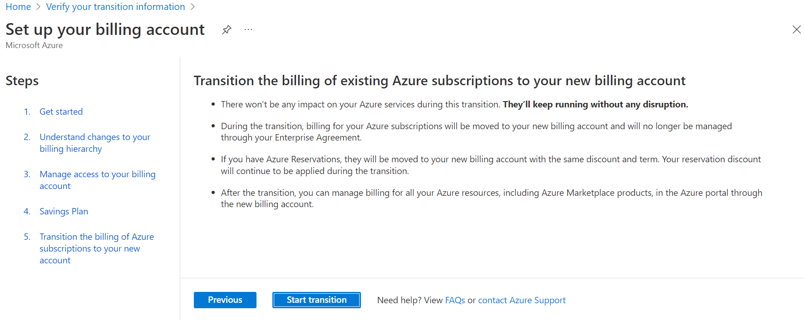
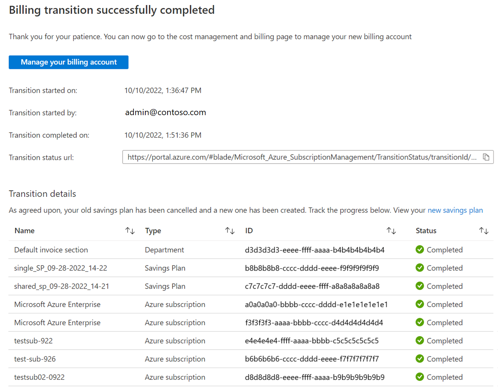
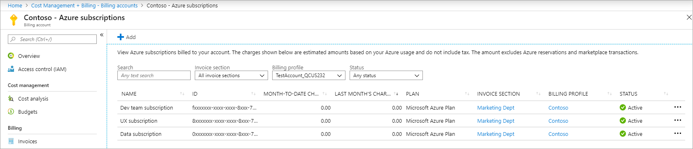
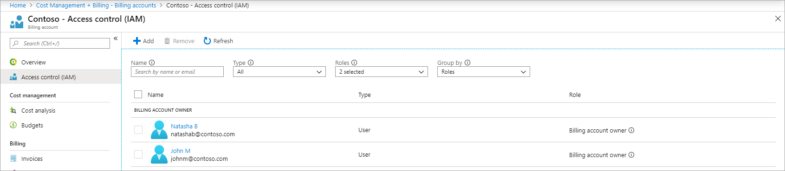

# Set up your billing account for a Microsoft Customer Agreement

If your direct Enterprise Agreement enrollment has expired or about to expire, you can sign a Microsoft Customer Agreement to renew your enrollment. This article describes the changes to your existing billing after the setup and walks you through the setup of your new billing account. Currently, expiring indirect Enterprise Agreements can't get renewed with a Microsoft Customer Agreement.

The renewal includes the following steps:

1. Accept the new Microsoft Customer Agreement. Work with your Microsoft field representative to understand the details and accept the new agreement.
2. Set up the new billing account that's created for the new Microsoft Customer Agreement.

To set up the billing account, you must transition the billing of Azure subscriptions from your Enterprise Agreement enrollment to the new account. The setup doesn't affect Azure services that are running in your subscriptions. However, it changes the way you manage the billing for your subscriptions.

- Instead of the [EA portal](https://ea.azure.com), you manage your Azure services and billing, in the [Azure portal](https://portal.azure.com).
- You get a monthly, digital invoice for your charges. You can view and analyze the invoice in the Cost Management + Billing page.
- Instead of departments and account in your Enterprise Agreement enrollment, you use the billing structure and scopes from the new account to manage and organize your billing.

Before you start the setup, we recommend you do the following actions:

- Before you transition to the Microsoft Customer Agreement, **delete users using the EA portal that don't need access to the new billing account**.
  - Deleting users simplifies the transition and improves the security of your new billing account.
- **Understand your new billing account**
  - Your new account simplifies billing for your organization. [Get a quick overview of your new billing account](../understand/mca-overview.md)
- **Verify your access to complete the setup**
  - Only users with certain administrative permissions can complete the setup. Check if you have the [access required to complete the setup](#access-required-to-complete-the-setup).
- **Understand changes to your billing hierarchy**
  - Your new billing account is organized differently than your Enterprise Agreement enrollment. [Understand changes to your billing hierarchy in the new account](#understand-changes-to-your-billing-hierarchy).
- **Understand changes to your billing administrators' access**
  - Administrators from your Enterprise Agreement enrollment get access to the billing scopes in the new account.[Understand changes to their access](#changes-to-billing-administrator-access).
- **View Enterprise Agreement features replaced by the new account**
  - View features of the Enterprise Agreement enrollment replaced by features in the new account.
- **View answers to most common questions**
  - View [additional information](#additional-information) to learn more about the setup.

## Access required to complete the setup

To complete the setup, you need both of these roles:

- Owner of the billing account that was created when the Microsoft Customer Agreement was signed. To learn more about billing accounts, see [Your billing account](../understand/mca-overview.md#your-billing-account).
- Enterprise administrator on the enrollment that is renewed.

### Start migration and get permission needed to complete setup

You can use the following options to start the migration experience for your EA enrollment to your Microsoft Customer Agreement.

- Sign in to the Azure portal using the link in the email that was sent to you when you signed the Microsoft Customer Agreement.

- If you don't have the email, sign in using the following link.

  `https://portal.azure.com/#blade/Microsoft_Azure_SubscriptionManagement/TransitionEnrollment`

If you have both the enterprise administrator and billing account owner roles, you see the following page in the Azure portal. You can continue setting up your EA enrollments and Microsoft Customer Agreement billing account for transition.

Here's an example screenshot showing the Get started experience. We cover each of the steps in more detail later in this article.

:::image type="content" source="./media/microsoft-customer-agreement-setup-account/setup-billing-account-page.png" alt-text="Screenshot showing the Get started page." lightbox="./media/microsoft-customer-agreement-setup-account/setup-billing-account-page.png" :::

If you don't have the enterprise administrator role for the enterprise agreement or the billing account owner role for the Microsoft Customer Agreement, then use the following information to get the access that you need to complete setup.

#### If you're not an enterprise administrator on the enrollment

You see the following page in the Azure portal if you have a billing account owner role but you're not an enterprise administrator.

:::image type="content" source="./media/microsoft-customer-agreement-setup-account/setup-billing-account-page-not-ea-administrator.png" alt-text="Screenshot showing the Prepare your Enterprise Agreement enrollments for transition." lightbox="./media/microsoft-customer-agreement-setup-account/setup-billing-account-page-not-ea-administrator.png" :::

You have two options:

- Ask the enterprise administrator of the enrollment to give you the enterprise administrator role. For more information, see [Create another enterprise administrator](ea-portal-administration.md#create-another-enterprise-administrator).
-  You can give an enterprise administrator the billing account owner role. For more information, see [Manage billing roles in the Azure portal](understand-mca-roles.md#manage-billing-roles-in-the-azure-portal).

If you're given the enterprise administrator role, copy the migration link. Open it in your web browser to continue setting up your Microsoft Customer Agreement. Otherwise, send it to the enterprise administrator.

#### If you're not an owner of the billing account

If you're an enterprise administrator but you don't have a billing account, you see the following error in the Azure portal. It prevents the transition.

If you have billing account owner access to the correct Microsoft Customer Agreement and you see the following message, make sure that you are in the correct tenant for your organization. You might need to change directories.

:::image type="content" source="./media/microsoft-customer-agreement-setup-account/setup-billing-account-page-not-billing-account-profile-owner.png" alt-text="Screenshot showing the Microsoft Customer Agreement billing account." lightbox="./media/microsoft-customer-agreement-setup-account/setup-billing-account-page-not-billing-account-profile-owner.png" :::

You have two options:

- Ask an existing billing account owner to give you the billing account owner role. For more information, see [Manage billing roles in the Azure portal](understand-mca-roles.md#manage-billing-roles-in-the-azure-portal)
- Give the enterprise administrator role to an existing billing account owner. For more information, see [Create another enterprise administrator](ea-portal-administration.md#create-another-enterprise-administrator).

If you're given the billing account owner role, copy the migration link. Open it in your web browser to continue setting up your Microsoft Customer Agreement. Otherwise, send the link to the billing account owner.

#### Prepare enrollment for transition

After you have owner access to both your EA enrollment and billing account, you prepare them for transition.

Open the migration that you were presented previously, or open the link that you were sent in email. The link is `https://portal.azure.com/#blade/Microsoft_Azure_SubscriptionManagement/TransitionEnrollment`.

The following image shows and example of the Prepare your enterprise agreement enrollments for transition window.

:::image type="content" source="./media/microsoft-customer-agreement-setup-account/setup-billing-account-prepare-enrollment-transition.png" alt-text="Screenshot showing the Prepare your Enterprise Agreement enrollments for transition ready for selections." lightbox="./media/microsoft-customer-agreement-setup-account/setup-billing-account-prepare-enrollment-transition.png" :::

Next, select the source enrollment to transition. Then select the billing account. If validation passes without any problems similar to the following screen, select **Continue** to proceed.

:::image type="content" source="./media/microsoft-customer-agreement-setup-account/setup-billing-account-prepare-enrollment-transition-continue.png" alt-text="Screenshot showing the Prepare your Enterprise Agreement enrollments for transition with validated choices." lightbox="./media/microsoft-customer-agreement-setup-account/setup-billing-account-prepare-enrollment-transition-continue.png" :::

**Error conditions**

If you have the Enterprise Administrator (read-only) role, you see the following error that prevents the transition. You must have the Enterprise Administrator role before you can transition your enrollment.

`Select another enrollment. You do not have Enterprise Administrator write permission to the enrollment.`

If your enrollment has more than 60 days until its end date, you see the following error that prevents the transition. The current date must be within 60 of the enrollment end date before you can transition your enrollment.

`Select another enrollment. This enrollment has more than 60 days before its end date.`

If your enrollment still has credits, you see the following error that prevents the transition. You must use all of your credits before you can transition your enrollment.

`Select another enrollment. This enrollment still has credits and can't be transitioned to a billing account.`

If your new billing profile doesn't have the new plan enabled, you see the following error. You must enable the plan before you can transition your enrollment.

`Select another Billing Profile. The current selection does not have Azure Plan and Azure dev test plan enabled on it.`

## Understand changes to your billing hierarchy

Your new billing account simplifies billing for your organization and provides enhanced billing and cost management capabilities. The following diagram explains how billing is organized in the new billing account.

1. You use the billing account to manage billing for your Microsoft customer agreement. Enterprise administrators become owners of the billing account. To learn more about billing account, see [understand billing account](../understand/mca-overview.md#your-billing-account).
2. You use the billing profile to manage billing for your organization, similar to your Enterprise Agreement enrollment. Enterprise administrators become owners of the billing profile. To learn more about billing profiles, see [understand billing profiles](../understand/mca-overview.md#billing-profiles).
3. You use an invoice section to organize your costs based on your needs, similar to departments in your Enterprise Agreement enrollment. Department becomes invoice sections and department administrators become owners of the respective invoice sections. To learn more about invoice sections, see [understand invoice sections](../understand/mca-overview.md#invoice-sections).
4. The accounts that were created in your Enterprise Agreement aren't supported in the new billing account. The account's subscriptions belong to the respective invoice section for their department. Account owners can create and manage subscriptions for their invoice sections.

## Changes to billing administrator access

Depending on their access, billing administrators on your Enterprise Agreement enrollment get access to the billing scopes on the new account. The following lists explain the changes to access that result from setup:

**Enterprise administrator**

Gets the following roles after transition:
- Billing account owner
  - Can manage everything on the billing account
- Billing profile owner
  - Can manage everything on the billing profile
  - Invoice section owner on all invoice sections
  - Can manage everything on the invoice sections

**Enterprise administrator (Read only)**

Gets the following roles after transition:
- Billing account reader
  - Gets a read-only view of everything on billing account
- Billing profile reader
  - Gets a read-only view of everything on billing profile
- Invoice section reader on all invoice section
  - Gets a read-only view of everything on the invoice sections

**Department administrator**

Gets the following roles after transition:
- Invoice section owner on the invoice section created for their respective department
  - Can manage everything on the invoice section

**Department administrator (Read only)**

Gets the following role after transition:
- Invoice section reader on the invoice section created for their respective department
  - Gets a read-only view of everything on the invoice section

**Account owner**

Gets the following role after transition:
- Azure subscription creator on the invoice section created for their respective department
  - Can create Azure subscriptions for their invoice section

An Azure Active Directory (AD) tenant is selected for the new billing account while accepting your Microsoft Customer Agreement. If a tenant doesn't exist for your organization, a new tenant is created. The tenant represents your organization within Azure Active Directory. Global tenant administrators in your organization use the tenant to manage access of applications and data in your organization.

Your new account only supports users from the tenant that was selected while signing the Microsoft Customer Agreement. If users with administrative permission on your Enterprise Agreement are part of the tenant, they get access to the new billing account during the setup. If they're not part of the tenant, they can't access the new billing account unless you invite them.

When you invite the users, they're added to the tenant as guest users and get access to the billing account. To invite the users, guest access must be turned on for the tenant. For more information, about enabling guest access see [control guest access in Azure Active Directory](/microsoftteams/teams-dependencies#control-guest-access-in-azure-active-directory). If the guest access is turned off, contact the global administrators of your tenant to turn it on.

As mentioned previously, to send invitations, you must first enable guest access on the tenant using Azure Active Directory.

:::image type="content" source="./media/microsoft-customer-agreement-setup-account/external-collaboration-settings.png" alt-text="Screenshot showing the External collaboration settings in Azure Active Directory." lightbox="./media/microsoft-customer-agreement-setup-account/external-collaboration-settings.png" :::

Otherwise, you see an error message saying:

`Invitations couldn't be sent. Guest access must be enabled on the tenant to invite users. Contact the global administrators of your tenant to enable guest access. When guest access is enabled, you can come back to this page by click the URL we sent you in email.`

## View replaced features

The following Enterprise Agreement's features are replaced with new features in the billing account for a Microsoft Customer Agreement.

### Enterprise Agreement accounts

The accounts that were created in your Enterprise Agreement enrollment aren't supported in the new billing account. The account's subscriptions belong to the invoice section created for their respective department. Account owners become Azure subscription creators and can create and manage subscriptions for their invoice sections.

### Notification contacts

Notification contacts are sent email communications about the Azure Enterprise Agreement. They aren't supported in the new billing account. Emails about Azure credits and invoices are sent to users who have access to billing profiles in your billing account.

### Spending quotas

Spending quotas that were set for departments in your Enterprise Agreement enrollment are replaced with budgets in the new billing account. A budget is created for each spending quota set on departments in your enrollment. For more information on budgets, see [Tutorial: Create and manage budgets](../costs/tutorial-acm-create-budgets.md).

### Cost centers

Cost center that were set on the Azure subscriptions in your Enterprise Agreement enrollment are carried over in the new billing account. However, cost centers for departments and Enterprise Agreement accounts aren't supported.

## Additional information

The following sections provide additional information about setting up your billing account.

### No service downtime

Azure services in your subscription keep running without any interruption. We only transition the billing relationship for your Azure subscriptions. There are no changes to existing resources, resource groups, or management groups.

### User access to Azure resources

Access to Azure resources that was set using Azure role-based access control (Azure RBAC) isn't affected during the transition.

### Azure reservations and savings plans

Any Azure reservations and savings plan in your Enterprise Agreement enrollment are moved to your new billing account. During the transition, there are no changes to the reservation discounts that are being applied to your subscriptions. If you have a savings plan that's getting transferred and it was purchased in USD, there are no changes to the saving plan discounts.

### Savings plan transfers with a non-USD billing currency

You see the following image when your Enterprise Agreement enrollment savings plan wasn't purchased in USD.

:::image type="content" source="./media/microsoft-customer-agreement-setup-account/savings-plan-repurchase.png" alt-text="Screenshot showing the Savings Plan page." lightbox="./media/microsoft-customer-agreement-setup-account/savings-plan-repurchase.png" :::

>[!NOTE]
> You must cancel any savings plan under the Enterprise Agreement that wasn't purchased in USD. Then you can repurchase it under the terms of the new Microsoft Customer Agreement in USD.

To move forward, select **View charges** to open the Exchange savings plans page and view the savings plans that must be repurchased.

The Exchange savings plans page shows you the savings plans that get canceled and credit that is returned in the original currency to the source enrollment. It also shows the new savings plans that get charged in USD for a one-year term for the target billing account. The new offer is a one-year term and matches the previous savings plan commitment per hour.

Here’s an example showing the exchange. Monetary values are examples.

:::image type="content" source="./media/microsoft-customer-agreement-setup-account/exchange-savings-plans.png" alt-text="Screenshot showing the Exchange savings plan page." lightbox="./media/microsoft-customer-agreement-setup-account/exchange-savings-plans.png" :::

Close the Exchange savings plan page and then select the **I have viewed and agree to the charges for my new savings plans and understand they my current savings plans will be canceled and refunded to my original payment method** prompt to agree and continue.

### Azure Marketplace products

Any Azure Marketplace products in your Enterprise agreement enrollment are moved along with the subscriptions. There are no changes to the service access of the Marketplace products during the transition.

### Support plan

Support benefits don't transfer as part of the transition. Purchase a new support plan to get benefits for Azure subscriptions in your new billing account.

### Past charges and balance

Charges and credits balance prior to transition can be viewed in your Enterprise Agreement enrollment through the Azure portal. 

### When should the setup be completed?

Complete the setup of your billing account before your Enterprise Agreement enrollment expires. If your enrollment expires, services in your Azure subscriptions continue to run without disruption. However, you are charged pay-as-you-go rates for the services.

### Changes to the Enterprise Agreement enrollment after the setup

Azure subscriptions that are created for the Enterprise Agreement enrollment after the transition can be manually moved to the new billing account. For more information, see [get billing ownership of Azure subscriptions from other users](mca-request-billing-ownership.md). To move Azure reservations or savings plans that are purchased after the transition, [contact Azure Support](https://portal.azure.com/?#blade/Microsoft_Azure_Support/HelpAndSupportBlade). You can also provide users access to the billing account after the transition. For more information, see [manage billing roles in the Azure portal](understand-mca-roles.md#manage-billing-roles-in-the-azure-portal)

### Revert the transition

The transition can't be reverted. Once the billing of your Azure subscriptions is transitioned to the new billing account, you can't revert it back to your Enterprise Agreement enrollment.

### Closing your browser during setup

Before you select **Start transition**, you can close the browser. You can come back to the setup using the link you got in the email and start the transition. If you close the browser, after the transition is started, your transition will keep on running. Come back to the transition status page to monitor the latest status of your transition. You get an email when the transition is completed.

## Complete the setup in the Azure portal

To complete the setup, you need access to both the new billing account and the Enterprise Agreement enrollment. For more information, see [access required to complete the set up of your billing account](#access-required-to-complete-the-setup).

1. Sign in to the Azure portal using the link in the email that was sent to you when you signed the Microsoft Customer Agreement.

2. If you don't have the email, sign in using the following link.

   `https://portal.azure.com/#blade/Microsoft_Azure_SubscriptionManagement/TransitionEnrollment`

3. Select **Start transition** in the last step of the setup. Once you select start transition:

    

    - A billing hierarchy corresponding to your Enterprise Agreement hierarchy is created in the new billing account. For more information, see [understand changes to your billing hierarchy](#understand-changes-to-your-billing-hierarchy).
    - Administrators from your Enterprise Agreement enrollment are given access to the new billing account so that they continue to manage billing for your organization.
    - The billing of your Azure subscriptions is transitioned to the new account. **There won't be any impact on your Azure services during this transition. They'll keep running without any disruption**.
    - If you have Azure reservations or savings plans, they're moved to your new billing account with no change to benefits or term. If you have savings plans under the Enterprise Agreement purchased in non-USD currency, then the savings plans are canceled. They're repurchased under the terms of the new Microsoft Customer Agreement in USD.

4. You can monitor the status of the transition on the **Transition status** page. Canceled savings plans are shown in the Transition details.  
    - If you had a savings plan that was repurchased, select the **new savings plan** link to view its details and to verify that it was created successfully.

   

## Validate billing account setup

 Validate the following to ensure your new billing account is set up properly:

### Azure subscriptions

1. Sign in to the [Azure portal](https://portal.azure.com).

2. Search for **Cost Management + Billing**.

   

3. Select the billing account. The billing account type is **Microsoft Customer Agreement**.

4. Select **Azure subscriptions** from the left side.

   

Azure subscriptions that are transitioned from your Enterprise Agreement enrollment to the new billing account are displayed on the Azure subscriptions page. If you believe any subscription is missing, transition the billing of the subscription manually in the Azure portal. For more information, see [get billing ownership of Azure subscriptions from other users](mca-request-billing-ownership.md)

### Access of enterprise administrators on the billing account

1. Sign in to the [Azure portal](https://portal.azure.com).

2. Search for **Cost Management + Billing**.

   

3. Select the billing account for your **Microsoft Customer Agreement**.

4. Select **Access control (IAM)** from the left side.

   

Enterprise administrators are listed as billing account owners while the enterprise administrators with read-only permissions are listed as billing account readers. If you believe the access for any enterprise administrators is missing, you can give them access in the Azure portal. For more information, see [manage billing roles in the Azure portal](understand-mca-roles.md#manage-billing-roles-in-the-azure-portal).

### Access of enterprise administrators on the billing profile

1. Sign in to the [Azure portal](https://portal.azure.com).

2. Search for **Cost Management + Billing**.

   

3. Select the billing profile created for your enrollment. Depending on your access, you may need to select a billing account. From the billing account, select Billing profiles and then the billing profile.

4. Select **Access control (IAM)** from the left side.

   

Enterprise administrators are listed as billing profile owners while the enterprise administrators with read-only permissions are listed as billing profile readers. If you believe the access for any enterprise administrators is missing, you can give them access in the Azure portal. For more information, see [manage billing roles in the Azure portal](understand-mca-roles.md#manage-billing-roles-in-the-azure-portal).

### Access of enterprise administrators, department administrators, and account owners on invoice sections

1. Sign in to the [Azure portal](https://portal.azure.com).

2. Search for **Cost Management + Billing**.

   

3. Select an invoice section. Invoice sections have the same name as their respective departments in Enterprise Agreement enrollments. Depending on your access, you may need to select a billing account. From the billing account, select **Billing profiles** and then select **Invoice sections**. From the invoice sections list, select an invoice section.

   

4. Select **Access control (IAM)** from the left side.

    

Enterprise administrators and department administrators are listed as invoice section owners or invoice section readers while account owners in the department are listed as Azure subscription creators. Repeat the step for all invoice sections to check access for all departments in your Enterprise Agreement enrollment. Account owners that weren't part of any department get permission on an invoice section named **Default invoice section**. If you believe the access for any administrators is missing, you can give them access in the Azure portal. For more information, see [manage billing roles in the Azure portal](understand-mca-roles.md#manage-billing-roles-in-the-azure-portal).

## Need help? Contact support

If you need help, [contact support](https://portal.azure.com/?#blade/Microsoft_Azure_Support/HelpAndSupportBlade) to get your issue resolved quickly.

## Next steps

- [Get started with your new billing account](../understand/mca-overview.md)
- [Complete Enterprise Agreement tasks in your billing account for a Microsoft Customer Agreement](mca-enterprise-operations.md)
- [Manage access to your billing account](understand-mca-roles.md)
