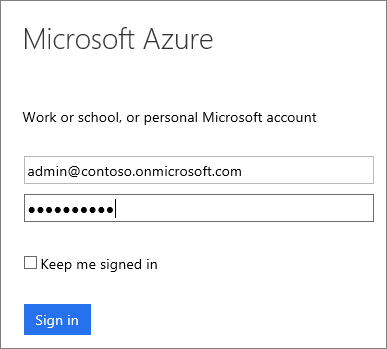

# Sign up for an Azure subscription with your Microsoft 365 account

If you have a Microsoft 365 subscription, you can use your Microsoft 365 account to create an Azure subscription. Sign in to the [Azure portal](https://portal.azure.com/) using your Microsoft 365 user name and password. If you want to set up virtual machines or use other Azure services, you must sign up for an Azure subscription. You can share your Azure subscription with others and [use Azure role-based access control (Azure RBAC) to manage access to your Azure subscription and resources](https://docs.microsoft.com/azure/role-based-access-control/role-assignments-portal).

If you already have both a Microsoft 365 account and an Azure subscription, see [Associate a Microsoft 365 tenant to an Azure subscription](../../active-directory/fundamentals/active-directory-how-subscriptions-associated-directory.md).

## Get an Azure subscription using your Microsoft 365 account

Save time and avoid account proliferation by signing up for Azure using your Microsoft 365 user name and password.

1. Sign up at [Azure.com](https://account.azure.com/signup?offer=MS-AZR-0044p&appId=docs).
2. Sign in by using your Microsoft 365 user name and password. The account you use doesn't need to have administrator permissions. If you have more than one Microsoft 365 account, make sure you use the credentials for the Microsoft 365 account that you want to associate with your Azure subscription.

   

3. Enter the required information and complete the sign-up process. Some information may not be required if you already have a Microsoft 365 account.

    

- If you need to add other people in your organization to the Azure subscription, see [Get started with access management in the Azure portal](../../role-based-access-control/overview.md).

## <a id="more-about-subs">More about Azure and Microsoft 365 subscriptions</a>

Microsoft 365 and Azure use the Azure AD service to manage users and subscriptions. The Azure directory is like a container in which you can group users and subscriptions. To use the same user accounts for your Azure and Microsoft 365 subscriptions, you need to make sure that the Azure subscriptions are created in the same directory as the Microsoft 365 subscriptions. Keep in mind the following points:

* A subscription gets created under a directory
* Users belong to directories
* A subscription lands in the directory of the user who creates the subscription. So your Microsoft 365 subscription is tied to the same account as your Azure subscription.
* Azure subscriptions are owned by individual users in the directory
* Microsoft 365 subscriptions are owned by the directory itself. Users with the right permissions within the directory can manage these subscriptions.

For more information, see [How Azure subscriptions are associated with Azure Active Directory](../../active-directory/fundamentals/active-directory-how-subscriptions-associated-directory.md).

## Need help? Contact us.

If you have questions or need help,  [create a support request](https://go.microsoft.com/fwlink/?linkid=2083458).

## Next steps

- Share your Azure subscription with others and [use Azure role-based access control (Azure RBAC) to manage access to your Azure subscription and resources](https://docs.microsoft.com/azure/role-based-access-control/role-assignments-portal).